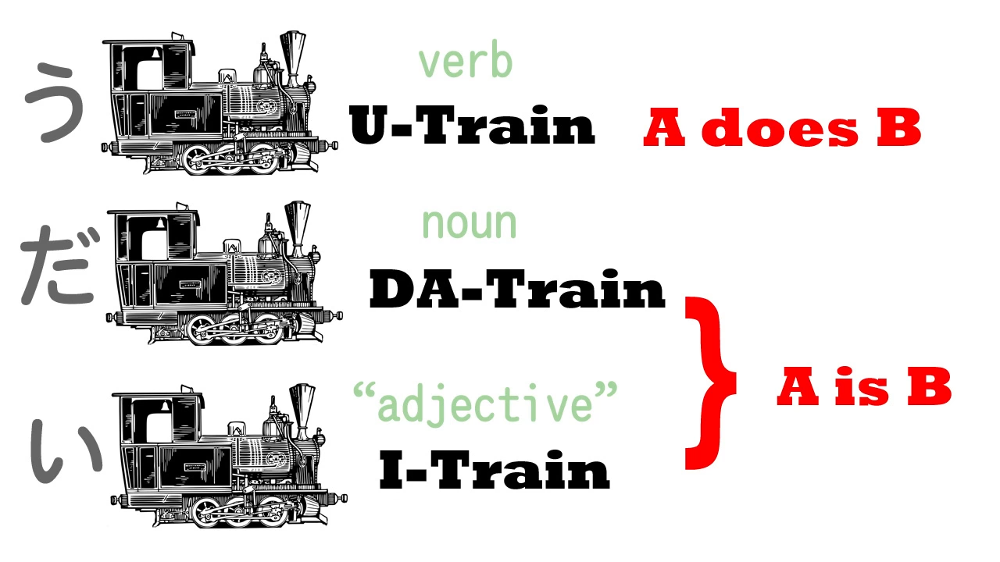

# **1. The Basic Types of Sentences**

[**Lesson 1: Japanese made easy! What schools never teach. The core Japanese sentence -organic Japanese**](https://www.youtube.com/watch?v=pSvH9vH60Ig&list=PLg9uYxuZf8x_A-vcqqyOFZu06WlhnypWj&ab_channel=OrganicJapanesewithCureDolly)

The most basic thing about Japanese is the Japanese core sentence. Every Japanese sentence fundamentally has the same core. What does it look like? It looks like this.

We're going to picture it as a train. Every Japanese sentence has these two elements: **the main carriage, A** and **the engine, B**. **The engine is what makes the sentence move, what makes it work.** **The carriage has to be there because without the carriage there's nothing for the engine to move**. Those two things are the core of every Japanese sentence.

We can say more about A; we can say more about B; we can combine logical sentences together to make complex sentences. **But every Japanese sentence conforms to this basic type.**

So, what are A and B? Let's begin by reminding ourselves that in any language there are only two kinds of sentences: <code>A is B</code> sentences and <code>A does B</code> sentences. An example of an <code>A does B</code> sentence is <code>Sakura walks</code>. An example of an <code>A is B</code> sentence is <code>Sakura is Japanese</code>.

And we can put these into the past tense; we can put them in the negative; we can turn them into questions; we can say more about A; we can say more about B. But, **ultimately, every sentence boils down to one of these: an <code>A is B</code> or an <code>A does B</code> sentence.**

So let's look at how we do this in Japanese.

## Verb sentences

In Japanese, if we want to say <code>Sakura walks</code> (A does B: Sakura walks), then A is Sakura, the main carriage, and B is walks, the thing she does, the engine of the sentence.

Walk in Japanese is <code>あるく</code>. We need one more thing to make the core Japanese sentence, and **that is the linchpin of every sentence, が** (ga). 

**が is the center of Japanese grammar. Every Japanese sentence revolves around が. In some sentences we're not going to be able to see the が, but it's always there, and it's always doing the same job. It links together A and B and turns them into a sentence.** So, our core <code>A does B</code> sentence is <code>**さくらが**あるく</code> = <code>**Sakura** walks</code>.

## Copula sentences

Now let's take an A is B sentence: <code>Sakura is Japanese</code>, or, as we say, <code>Sakura is a Japanese person</code>. So, A again is Sakura, B is にほんじん/日本人, which means Japanese person, and **once again we need が to link them together. So we're going to picture the A car, the main carriage, with a が on it, because the main carriage, the subject of the sentence, always carries a が, to link it to the engine.**

So, さくらが日本人 – and we need one more thing. There's one other thing that I want you to make friends with, and that's だ (da). <code>さくらが日本人だ</code> = <code>Sakura is a Japanese person</code>.

Now, you may have met this だ in its fancy form, です, but there are very good reasons for learning the plain, simple form first. So we're going to learn だ. Now if you look at だ, it's like an equals sign boxed off to the left. And this is a perfect mnemonic for what it does, because **だ tells us that A is B.**

Why is it boxed off to the left? Because it only works one way. Think about this logically: さくらが日本人だ means <code>Sakura = Japanese person.</code> But it doesn't work the other way: Japanese people are Sakura – they're not all Sakura. Sakura is a Japanese person, but a Japanese person is not necessarily Sakura.

## Adjective sentences

So now we have an <code>A is B</code> sentence and an <code>A does B</code> sentence. There is one more form of the Japanese core sentence, for it has three forms. The third form is when we have a describing word, an adjective.

**In Japanese, describing words end with い** (i), just as they often do in English: happy, sunny, cloudy, silly. In Japanese it's just the same: happy – うれしい/嬉しい; sad – かなしい/悲しい; blue – あおい/青い.

Now, we don't have to learn all these, but we do need to know about Japanese adjectives ending in い because they make the third kind of sentence. So let's take an easy one: ペン (that's a nice easy word because it means pen) – <code>ペンが赤い/あかい</code> = <code>pen is red</code>.

Now, you notice that we don't have a だ on this sentence. Why is that? **Because the い-adjective あかい/赤い (red) – it doesn't mean red, it means is-red. The だ function, the equals function, is built into those い-adjectives.**

So those are the three forms of Japanese sentence. **They all start with the subject of the sentence, they're all connected with が**, and they can end in three ways: with a verb, which will end in う, with the copula だ, or with an い because the last word is an adjective. And now you know the basics of Japanese.

