# **10. Helper verbs & the potential helper verb**

[**Lesson 10: <code>Japanese conjugation</code> myth busted! Also, potential verb form secret unlocked**](https://www.youtube.com/watch?v=qcOhHmU0znI&list=PLg9uYxuZf8x_A-vcqqyOFZu06WlhnypWj&index=12)

こんにちは。

Today we're going to talk about the main helper-verbs and about the potential form. **When I say <code>the main helper-verbs</code>, I'm referring to what the standard Western Japanese grammar descriptions call <code>conjugation</code>.** And I only mention this word because I don't want you to get confused if you see <code>conjugation</code> referred to somewhere else. 

When they talk about <code>conjugation</code>, this is what they mean. **But in fact there is no such thing as conjugation in Japanese.** **All we ever do is add helper-words to the four verb stems.** And there are a lot of helper-words and most of them are just a question of extra vocabulary so long as you don't think of them as conjugation. 

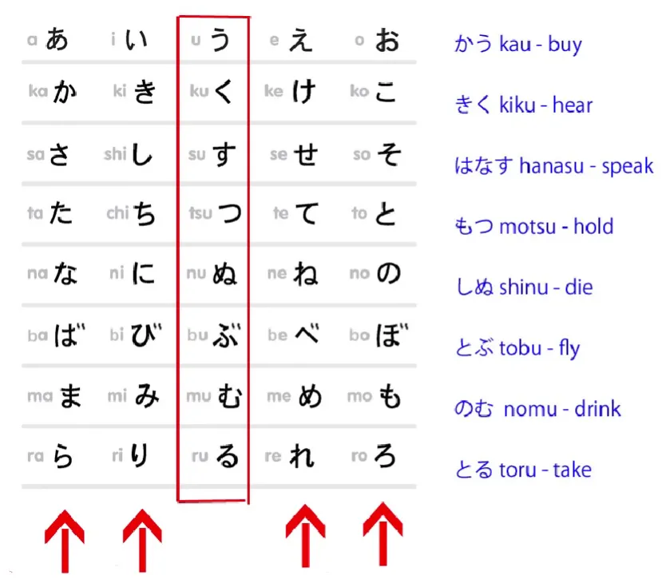

In some cases they get called <code>conjugation</code>, in other cases they don't, and they're exactly the same process every time. The only difference is that some of them happen to accidentally, and only very vaguely, resemble European conjugation and others don't. All kinds of confusions arise from confusing Japanese helper-verbs and helper-adjectives with conjugations, but because we're not going to use them, we don't need to worry about that here. All right.

## The potential helper verb

So, the first main helper-verb we're going to look at is the potential verb. Now, we've already looked, haven't we, at helper-words. We've looked at the helper-adjectives <code>ない</code>, which forms the negative, and <code>たい</code>, which is used for the desirability of an action.

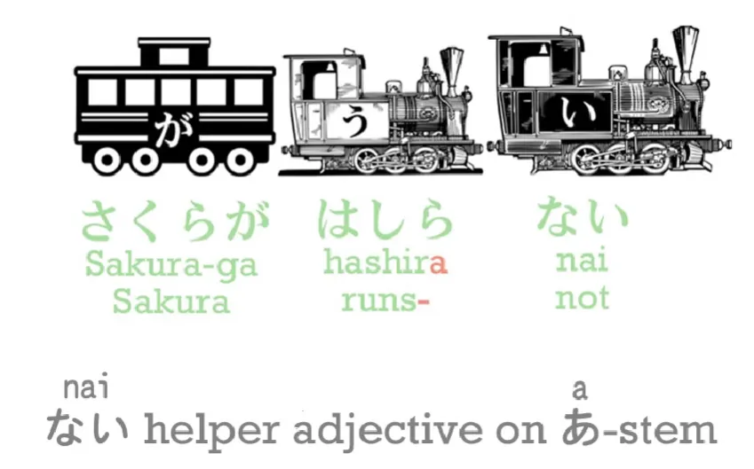

We've also looked at the helper-verb <code>がる</code>, which is attached to an adjective. **Now we're going to look at the potential helper-verb, and this attaches to the え-stem.** 

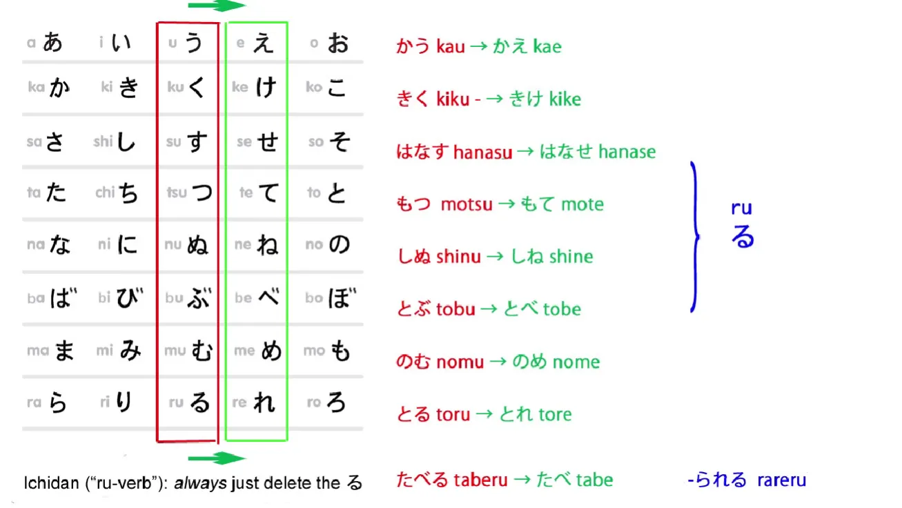

**There aren't as many things we do with the え-stem** as we do with the あ and い-stems, but there are some. And only one of them is a verb, so there's no room for confusion here. **The potential helper-verb has two forms, and they are <code>-る</code> and <code>-られる</code>.**

People can be a little disconcerted by **the godan form of the helper-verb** because it's **just one character, る(ru).** But that shouldn't worry you at all, and because it only ever goes onto the え-stem, can't be used on its own, it's very very easy to recognize. 

**<code>-られる</code> is the form of the potential helper-verb that goes onto ichidan verbs** – and we discussed godan and ichidan verbs before, didn't we? So, <code>かう</code> (buy) becomes <code>かえる</code> (buy-able); <code>きく</code> (hear) becomes <code>きける</code> (hear-able); <code>はなす</code> (speak) becomes <code>はなせる</code> (speak-able); <code>もつ</code> (hold) becomes <code>もてる</code> (hold-able) and so forth.

::: info
change to え-stem and then the godan potential form る. Also note this…  

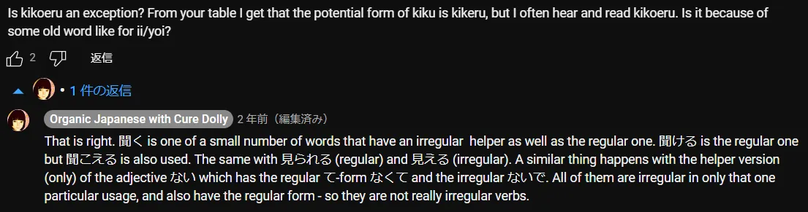

**There is some difference in their implication, Dolly clears them up further in LESSON 54.  
Dolly SEEMS to make an error here by calling 聞こえる other-move, but it should be self-move as she implies in the beginning of the comment (+in comparison to other sources like Imabi).**
:::

**And with <code>たべる</code>, which is an ichidan verb**, we do what we always do, **simply take off the -る and put on whatever we're going to put on.** So <code>たべる</code> (eat) becomes <code>たべられる</code> (eat-able). So this is very simple, isn't it?

**There are only two exceptions to this formation of the potential form and they are the two Japanese irregular verbs, <code>くる</code> and <code>する</code>.** <code>くる</code> become <code>**こ**られる</code>, but <code>する</code> surprisingly becomes <code>**できる**</code>. **できる is the potential form of <code>する</code>.**

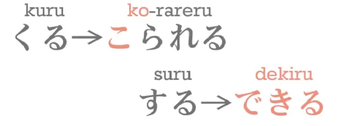

And **this is an interesting word because it also means <code>come out</code>** – literally it's made up of the kanji <code>out</code> and <code>come</code> – <code>出来る/できる</code>, 出る (exit) 来る (come)

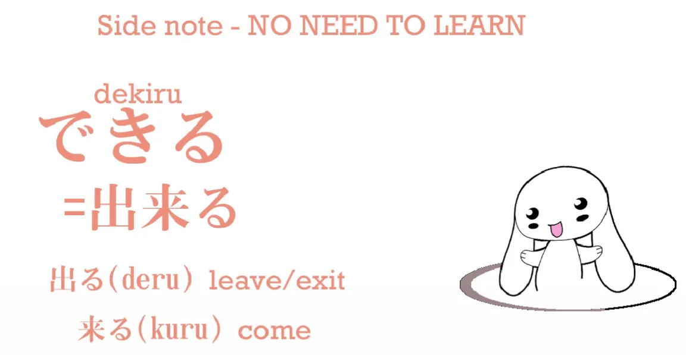

And if we say <code>にほんごが**できる**</code>, we're not saying <code>I can do Japanese</code>, we're saying <code>Japanese **is possible**</code> / ***<code>does</code> possible***

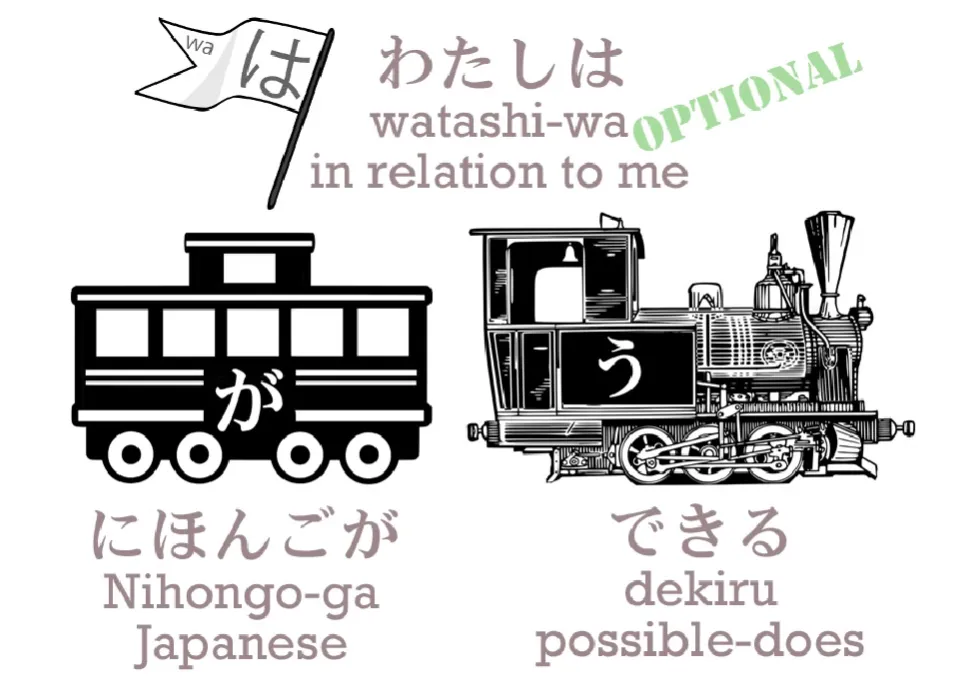

And if we say or imply <code>わたしはにほんごが**できる**</code>, we're saying, <code>To me, Japanese **is possible**</code>. 

:::info
*(Dolly gives <code>does possible</code> to imply it’s A does B; not A is B)* 
:::

And it's interesting if you see a small child perhaps trying to make something out of paper, she may say, <code>I'm trying very hard, but it won't come out right</code> – and this is just the way できる is used in Japanese, isn't it? And there are some interesting ways in which できる is used which show how the idea of something being possible and something coming out are closely linked in the Japanese language. But we won't talk about that now – that's a little bit more advanced.

There's only one danger area with the potential form, and it's very very close to something we dealt with last week (Lesson 9). So if you've seen that lesson, this one should be very easy to you. Let's look at a typical sentence: <code>ほんがよめる.</code>

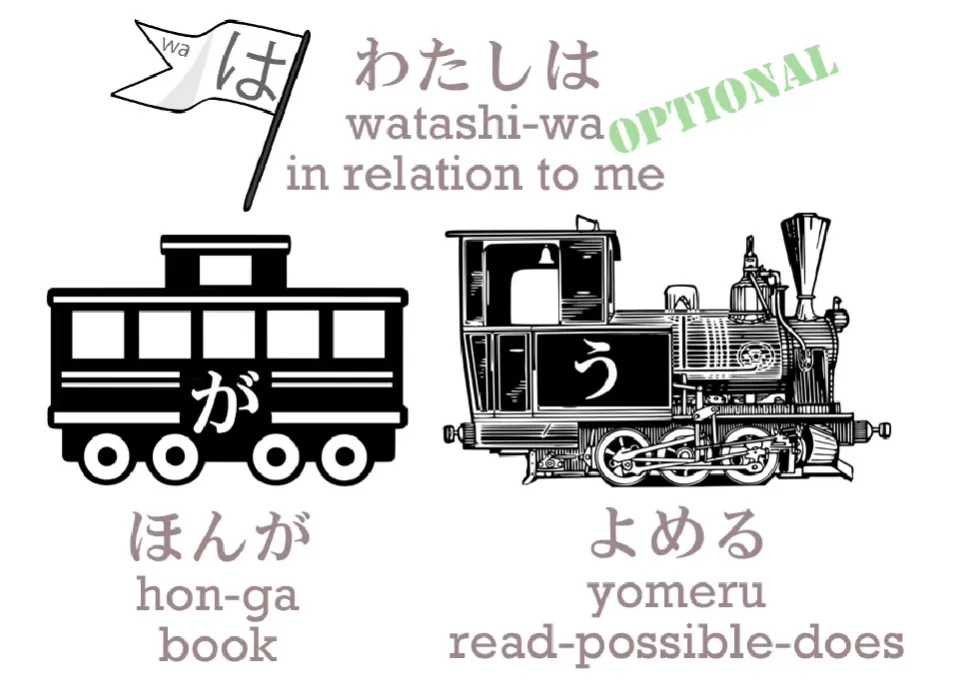

Now, the standard texts usually translate this as <code>I can read the book</code>. **But that isn't what it means**, as you can clearly understand if you followed our previous lesson. Look where the が is. The が is marking what? **It's marking the book!** So who is the actor of this sentence? **It's the book.**

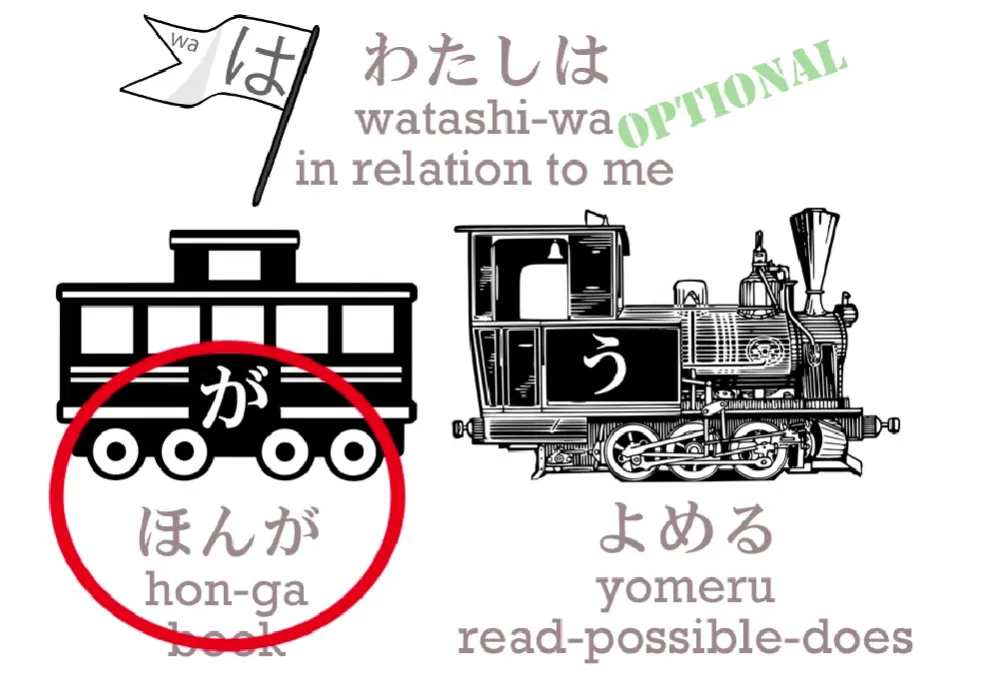

We are saying something about the book. **So the book is the main car and <code>よめる</code> is the engine.** We are saying **the book is readable, it's possible to read the book.**

---

If we add <code>わたしは</code>, we are saying the book is readable <code>to me</code>. What we are literally saying is, <code>In relation to me, the book is readable</code>. **But this does not and cannot mean, <code>I can read the book</code>.** If we wanted to say <code>I can read the book</code>, the book would have to be marked by を, wouldn't it? And I would have to be marked by が. And it is in fact possible to do this, **but it's not what is usually done.**

But also remember that if we want to put stress on the ego, the way English wants to, then we have to change the particles. If we literally want to say, <code>**I** can read the book</code> – <code>**わたしが**ほんをよめる</code>. 

---

A lot of people think this is bad Japanese.

::: info
I guess it isn’t how the Japanese tend to speak. It could be called <code>Englishised</code> Japanese as it puts emphasis on the ego first, as the subject, which isn’t how they tend to think in Japan.
:::

Not our place to work out whether it is or isn't bad Japanese. The point is that most of the time you will see <code>**ほんがよめる**</code>, and **<code>(わたしは)ほんがよめる</code> can't literally mean <code>I can read the book</code>.** **It means <code>The book is readable</code>.**

::: info
Can say わたしは to imply book does readable TO ME - a topic, but it’s usually not mentioned
:::

So that's simple enough, and provided we remember that, we don't send all those particles into crazy illogicality.

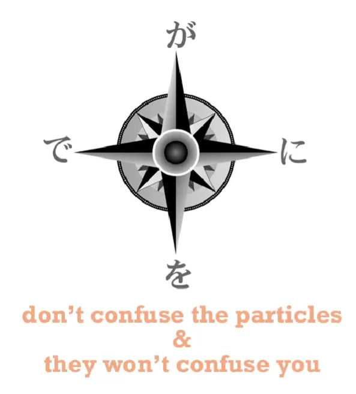

So really this is very much similar to the questions we discussed last week about -たい and adjectives of desire. **If we just keep that が straight in our minds, everything else will fall into place.** And just as with the たい-form if we say, <code>(わたしは)ケーキがたべたい</code>, 

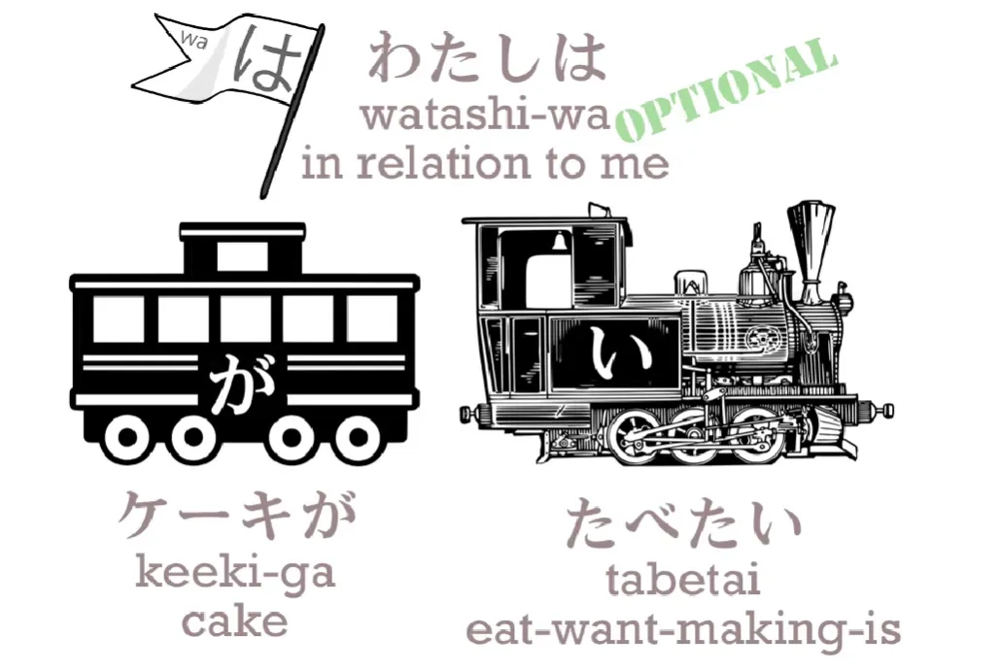

**it's the cake that’s being want-inducing** *(to me personally - topic)*, but if we just say <code>(わたしは)(zeroが)たべたい</code> we do mean <code>(In relation to me) (I) want to eat</code> / *eat-wanting-am*,

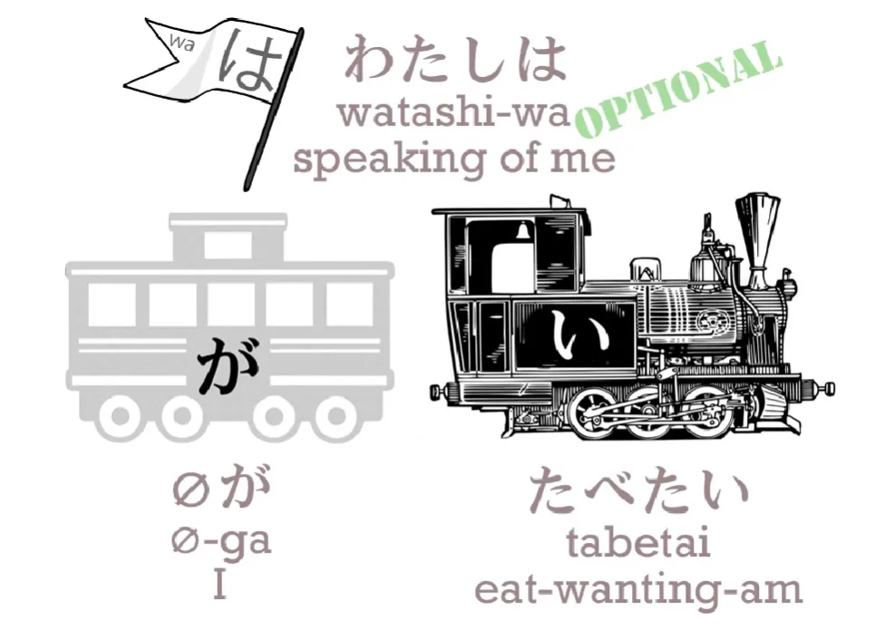

**because when there's no particular food there to do the being wanted, then I do the wanting.** 

::: info

I’m the subject that just wants to eat something because I’m hungry; here I’m also the topic

However, do note that no food is present there, so it defaults to <code>me</code>. Zeroが (and also zeroは) is dependent on the context of the situation/sentence, Dolly says...

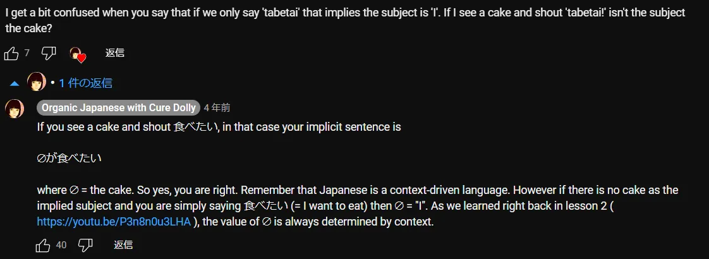
:::

It's the same with the potential form. So we say, <code>(わたしは)ほんがよめる</code> – <code>(to me) the book is read-able</code>,

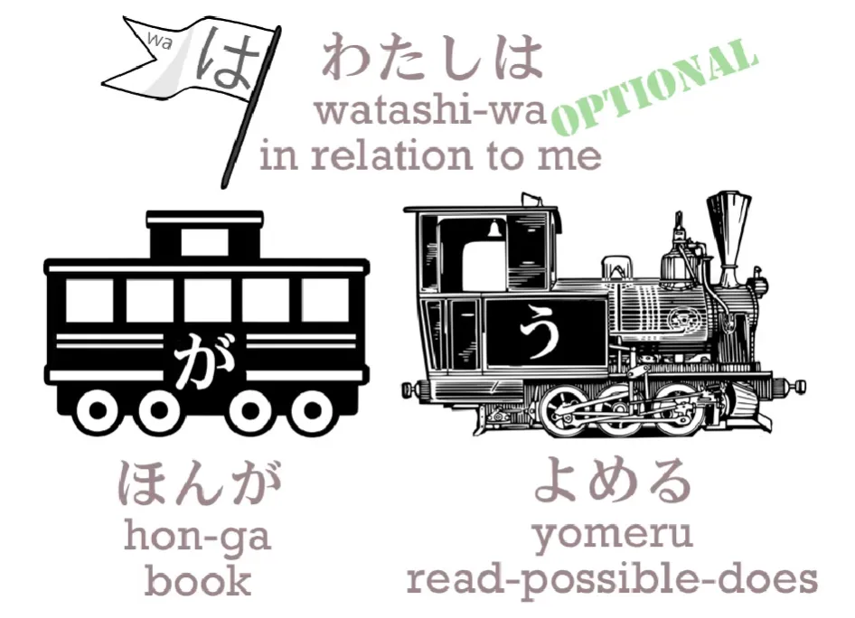

but if we just want to say <code>I can read</code> – not "I can read the book or I can read the newspaper or I can read Sakura's secret diary", but <code>I can read</code> – then we say <code>わたしがよめる</code> or just <code>よめる</code>, which means <code>(zeroが)よめる</code>.

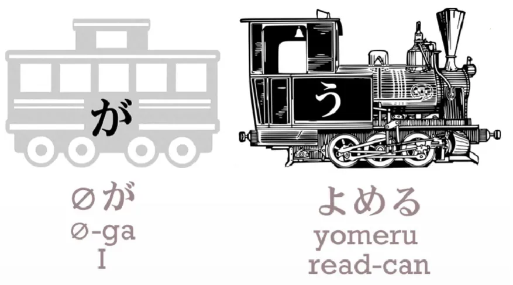

**And we really have become the subject of the sentence.** And I am sure there are people who find this confusing, but if you followed the past lesson this should be completely clear. 

And let's remember that Japanese always fits together just like Lego,

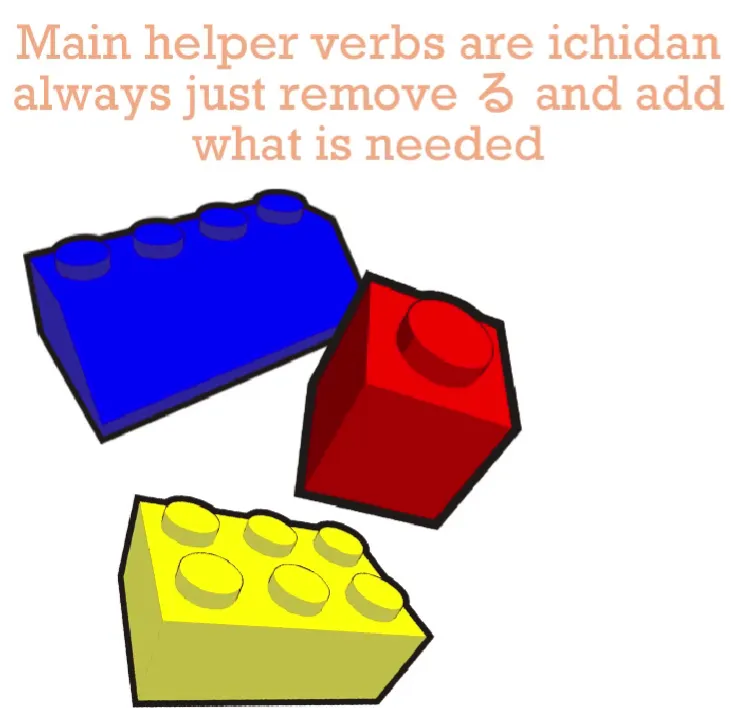

so the potential helper-verb, even when it's just that single kana る(ru), is simply a regular ichidan verb like most helper-verbs, and we can do exactly the same things with it that we can do with other helper-verbs.

::: info
I guess Dolly means the potential helper works like ichidan, so if adding anything to the potential, remove the る as with any ichidan and attach to the え-stem. Dolly’s replies under one [**comment**](https://www.youtube.com/watch?v=qcOhHmU0znI&lc=UgxYARujuNXKheHlgNJ4AaABAg)

The <code>potential form</code> of godan verbs is ichidan because the る helper is ichidan… Godan is a red herring here. As soon as we attach any ichidan helper to a godan verb we are dealing with an ichidan entity and anything we do after that follows the ichidan pattern…So there is no question of a godan verb becoming ichidan. What is happening is that a godan verb is attaching an ichidan helper.
:::

**We'll always recognize it, because it's the only one that goes onto the え-stem, and we can do everything with it that we do with any other ichidan verb.**

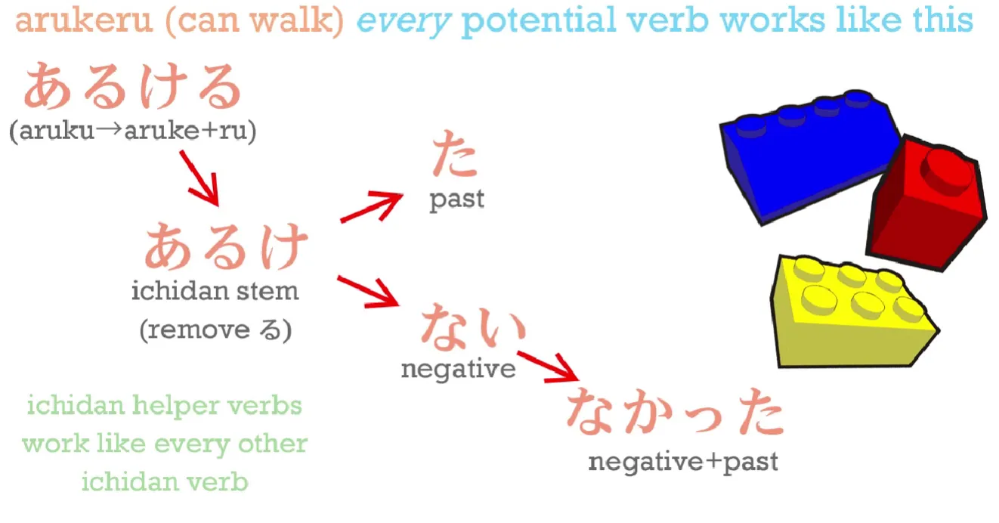

So: <code>あるける</code> – can walk; <code>あるけない</code> – can't walk; <code>あるけた</code> – could walk; <code>あるけなかった</code> – couldn't walk. **And this regularity is the same even with the irregulars.** So: できる – possible; <code>できない</code> – not possible; <code>できた</code> – was possible; <code>できなかった</code> – wasn't possible.

And it's really as easy as that.

::: info
I got quite confused, since I looked up 出来る/できる in Jisho and they actually show that it has a potential form of <code>できられる</code> which is interesting since できる should already imply the potential form. I looked up some [**Japanese forums**](https://ja.hinative.com/questions/6326424) (and others) and it seems that even the Japanese?? found できられる weird. Or it could be an honorific form?… Correct me if wrong…  
E.g. 分かる also has no potential form, as it implies it. [**Dolly explains**](https://japanese.stackexchange.com/questions/5988/why-doesnt-%e5%88%86%e3%81%8b%e3%82%8b-have-a-potential-form/48809#48809) <code>分かれる</code> is another word
:::

---

::: info
I will also add some regular ichidan verb example.

<code>たべられる</code> - can eat; <code>たべられない</code> - can’t eat;  
<code>たべられた</code> - could eat; <code>たべられなかった</code> - couldn’t eat.
:::
