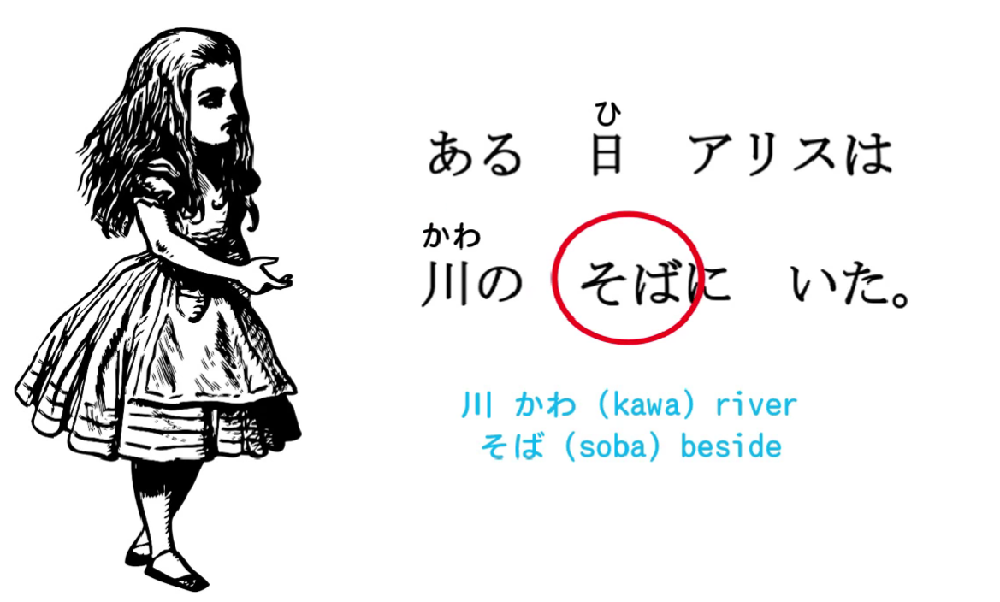
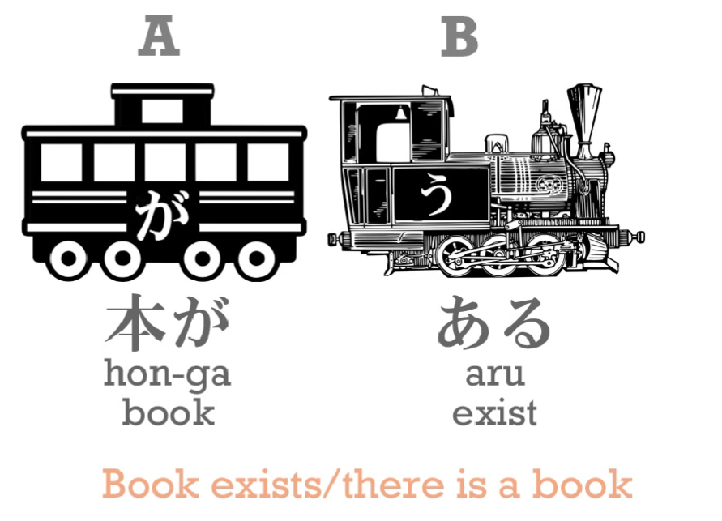
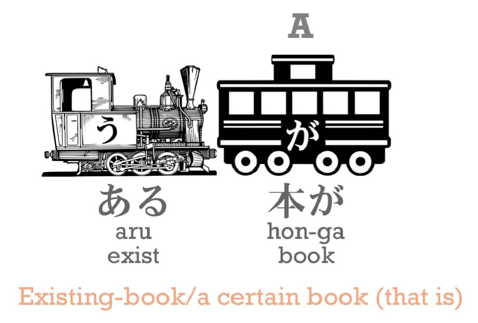
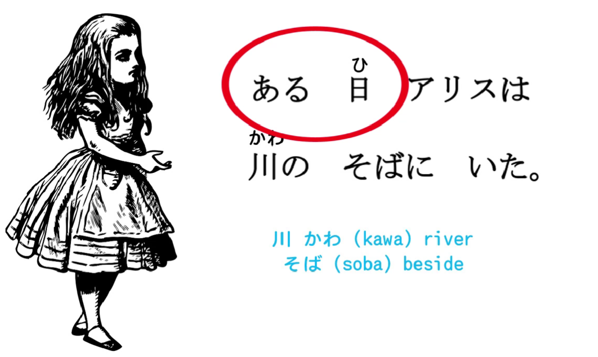
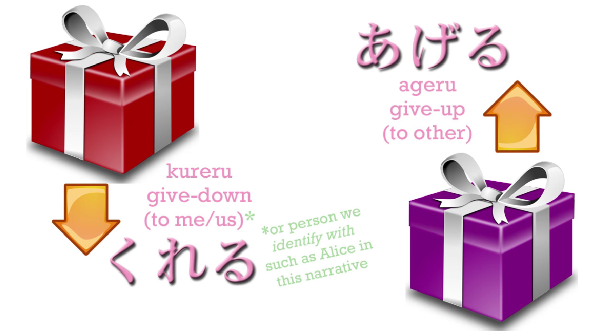
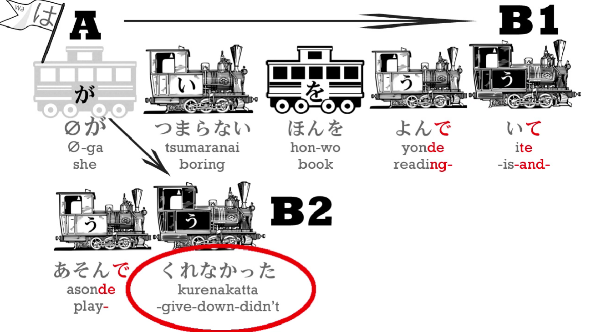
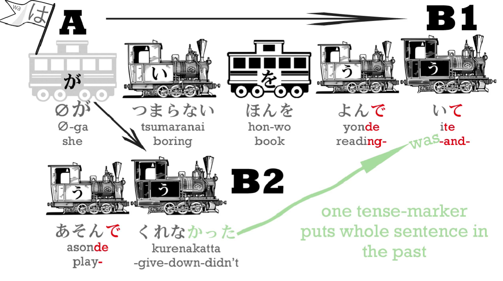

# **11. Compound sentences, くれる, あげる and more uses of the て-form**

[**Lesson 11: Compound sentences, kureru, ageru, more te-form uses**](https://www.youtube.com/watch?v=3X2ZCWazrDw&list=PLg9uYxuZf8x_A-vcqqyOFZu06WlhnypWj&index=13)

We've now completed ten lessons and it's time for a change of pace.

We've learned enough now that we can start looking at some real narrative.

It'll be a little simplified at first, but we can use this to

bring together the things we've learned so far.

We'll also be learning new structural elements because even in the simplest story we're going to encounter things that we need to learn.

But this may be a more interesting way of doing it.

So please let me know what you think in the comments below. All right.

Now let's go into a story that I believe we all know.

<code>ある日アリスは川のそばにいた.</code>

Now, this is a simple sentence.

The word <code>川/かわ</code> means <code>river</code>, and **<code>そば</code> means <code>beside</code> and it's a noun.**

So <code>川のそば</code> is <code>the beside of the river</code>.

Just as we put something on the <code>on</code> of the table or the <code>under</code> of the table and

**we also always mark it with に**, so the <code>beside of the river</code> is where Alice was.

<code>ある</code> means <code>a certain</code>, so <code>ある日</code> is like <code>one day</code> or <code>a certain day</code>, and let's notice

that what's happening here is what we've seen before.

**<code>ある</code> is the verb that means <code>exist</code> or <code>be</code>**, and what we've done here is what we've seen in the video lesson on so-called adjectives. *(Lesson 6)*

**We can make any engine into an adjective.**

So, **<code>ある</code> is an <code>A does B</code> engine, an う-engine**,  
so if we say <code>本がある</code> we are saying, <code>There is a book / a book exists</code>.

**And if we move that <code>ある</code> engine to the other side of the book, we turn it white**

**and it becomes a descriptor, an adjectival.**

So we're saying <code>ある本</code> – <code>an existing book / a certain book / a book that there is</code>.

And it's the same: <code>ある日</code> – <code>a certain day</code>.

<code>ある日アリスは川のそばにいた</code>

Now, the next sentence is going to be a little bit more complex, but don't worry, it's always easy when there's a fully-functioning android to help you.

(Actually, I'm not quite fully-functioning, but for the purposes of showing you Japanese I am.)

<code>おねえちゃんはつまらない本をよんでいてあそんでくれなかった</code>

So we've got quite a complex sentence here, and let's break it down.

<code>おねえちゃん</code> means <code>big sister</code>: <code>ねえ</code> is <code>sister</code>;

<code>-ちゃん</code>, I'm sure you know, is a cute, friendly honorific; <code>お-</code> is also an honorific.

So, <code>おねえちゃん</code> – <code>big sister</code>.

<code>つまらない</code> means <code>dull</code> or <code>boring</code>.

<code>本</code>, as we know, is <code>book</code>.

<code>よむ</code> means <code>read</code>; <code>よんでいる</code> – we **put the <code>よむ</code> into the て-form and add <code>いる</code>**

and it means <code>is reading</code>; and then we put the <code>いる</code> itself into the て-form.

So why are we doing all that?

Let's take a look.

<code>おねえちゃんはつまらない本をよんでいて</code> – <code>Big sister is reading a boring book</code>

– but then that -て....

**て-form has a lot of different uses.**

**In this case it will complete a clause.**

<code>Big sister is reading a boring book</code> – that's a complete clause, isn't it?

**And if we turn that final う-engine into the て-form, what we're saying is that something**

**else is going to follow this clause.**

**We are indicating that we're making a complex sentence made up of more than one clause.**

So it's like saying,

<code>Big sister was reading a boring book **and...**</code>

And that something else comes: <code>あそんでくれなかった</code>.

<code>あそぶ</code> means to <code>play</code>, and that also is in the て-form, isn't it?

<code>あそぶ</code> --&gt; あそんで".

If you're in any doubt of how we make these て-forms, please go back to the video lesson

on the て-form and refresh your memory. *(Lesson 5)*

<code>あそんでくれなかった</code>

Now this is another use of the て-form.

**て-form is terribly important and it does various different things.**

What's it doing here?

Well, <code>あそぶ</code>, as we know, means <code>play</code>.

<code>くれる</code> means to <code>give</code>, **and it specifically means <code>give downwards</code>.**

And the reason we say <code>give downwards</code> in Japanese  
is because we are always polite to people.

**So we always represent ourselves as being below other people**

**and other people as being above ourselves.**

So **if I say <code>くれる</code> (give), I always mean that someone**

**is giving something to me or to someone close to me.**

But what is Alice's big sister giving – or not giving – to Alice?

Well, it's not the book. In fact, it's not any actual object.

**She is giving the action to which <code>くれる</code> is connected by the て-form.**

She is giving – or in this case, not giving – the act of playing to Alice.

What do we mean by that?

**Well, we say <code>くれる</code> not only for giving a thing – a book, a present, a candy – we**

**also say it for giving an action, for doing something for our benefit.**

**This is very very often used in Japanese, so it's important to understand it.**

If someone does something for our benefit,  
we turn that action to て-form and we add <code>くれる</code>.

**If we do something for someone else's benefit, we turn that action into te-form and add <code>あげる</code>, which means to <code>give upward</code>, in other words, to give to you, to give to another person.**

<code>くれる</code> and <code>あげる</code> – give down to me or my group / \[<code>**あげる**</code>\] **give up to you or someone else or your group or their group.**

So what is this second part of the sentence?

It's <code>あそんでくれなかった</code> – "she didn't play / she didn't give Alice playing-with /

she didn't play for Alice's benefit".

It's rather different from anything we find in English, but it's also very expressive,

something we could actually do with having in English.

So now let's look at the whole sentence again.

<code>おねえちゃんはつまらない本をよんでいてあそんでくれなかった</code> –

<code>Big sister was reading a boring book and did not play \[with Alice\]</code>.

Notice that **we have two complete clauses here**:  
*Clause 1:* <code>おねえちゃんはつまらない本をよんだ</code> – that's a complete clause in itself, isn't it?

*Clause 2:* <code>おねえちゃんはあそんでくれなかった</code> – <code>Oneechan did not play for Alice's benefit</code>

**And we've connected the two together with the て-form.**

---

**A thing we should notice here is that <code>おねえちゃんはつまらない本をよんで</code>  
doesn't tell us the tense.**

**We don't know whether she's reading a boring book right now or in the future or in the past. We don't know that until we get to the end of the sentence.**

In English we put the tense marker on both halves of a complex sentence.

We would say, <code>Big sister WAS reading a boring book...</code>

so we already know that it's in the past.

**But in Japanese we put that tense marker, -た or -かった, at the end**

**and we only need one tense marker per sentence.**

<code>よんでいて</code> could mean <code>is reading</code> or could mean <code>was reading</code>,

**but because the <code>あそんでくれなかった</code> is in the past and it's part of the same sentence**

**we have put everything into the past.**

Well, we didn't get very far into Alice's adventure today, did we?

But we can proceed faster as we get used to real text and learn the basic narrative structures.
