# **12. Quotation particle と, compound verbs & nouns** 

[**Lesson 12: と quotation particle secret - plus compound verbs, compound nouns - and More Alice!**](https://www.youtube.com/watch?v=7dYT6Xf1BkA&list=PLg9uYxuZf8x_A-vcqqyOFZu06WlhnypWj&index=14)

こんにちは。

Today we're going to continue with the narrative lessons that we started last week. And this time we're going to be able to proceed a little faster. So let's refresh our minds on the story we've read so far.

>ある日アリスは川のそばにいた。

(One day Alice was by the river.)

>お姉ちゃんはつまらない本をよんでいてあそんでくれなかった。

(Big sister was reading a boring book and did not play with Alice.)

>「おもしろいことがない」とアリスは言った。

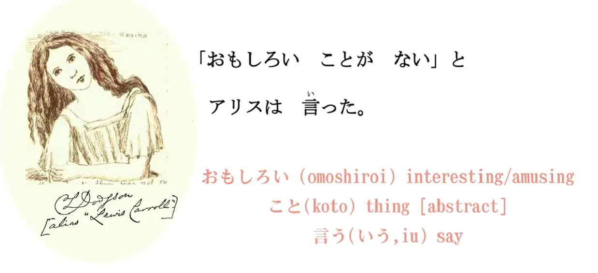

「おもしろい」 means `interesting or amusing`; 「こと」 means `a thing`. And in Japanese we have two common words for `thing` , and they are もの and こと.

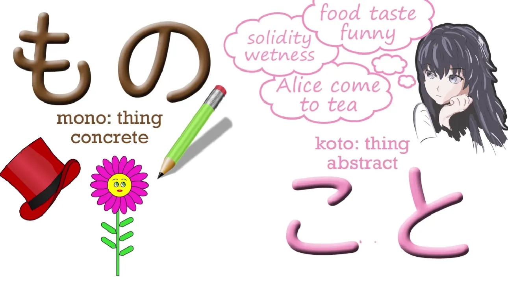

Now, a **もの is a thing in the most usual sense: a physical thing – a hat, a book, a pair of glasses, Mount Fuji.** **こと is a more abstract kind of `thing`: an affair, a matter, a circumstance.** So, when we say, `Is there anything in that box?` we mean もの. And when we say, `The thing is...` we usually mean こと. 

So, 「おもしろいことがない」means `There's nothing interesting going on here, no interesting circumstance.`

言った － 言う means `say` and you can see it's like a mouth with soundwaves coming out of it. 

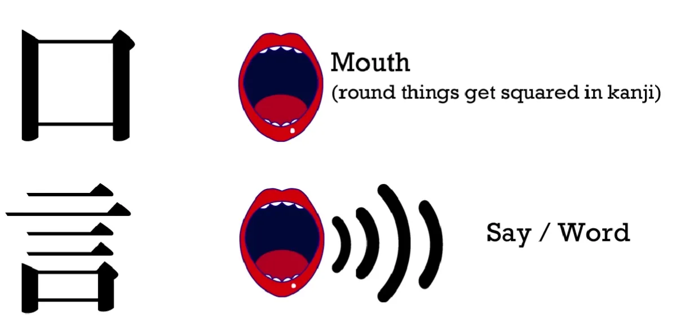

**But the important thing to notice here is that little particle と.**

**There are actually two と particles:** one means `and` and it's very simple; **the other one is what we call the `quotation particle`**, and that's what we're dealing with here. **When we quote someone as saying something or even as thinking something, we use this particle と. It's kind of like a quotation mark that you can hear.** 

As you see, we use the square quotation marks in Japanese, which are the equivalent to English quotation marks, **but we also use the と.** So we don't just say, ` 'Nothing interesting is happening,' Alice said`. We say, ` 'Nothing interesting is happening,' **と** Alice said`. Now, と is a very interesting particle structurally and we're going to look into that a little more deeply in a few minutes.

>そのとき、白いウサギがとおりすぎた。

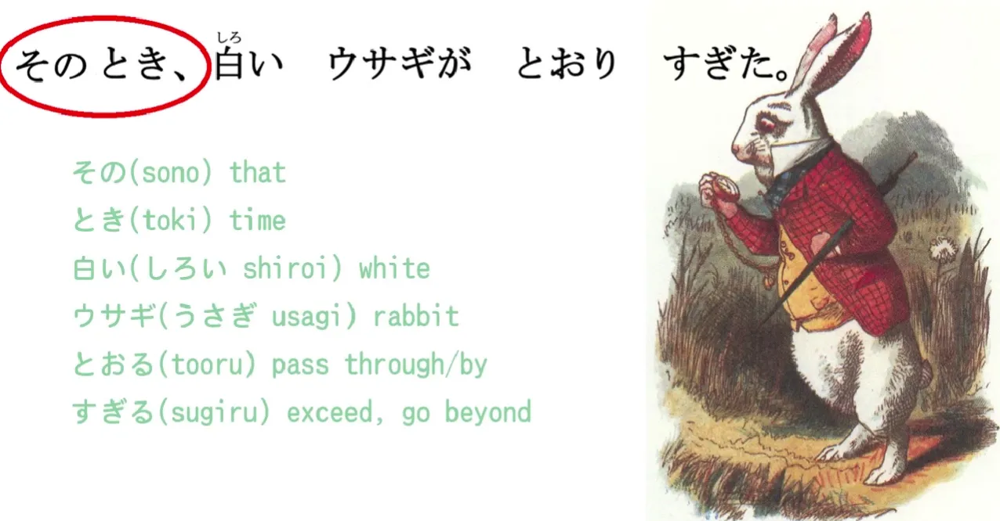

「そのとき」: その means `that` and とき means `time`, so we're literally saying thattime, ` but this is a bit more like saying ` just then / at that moment / at that time. **So we use just the way we use other relative time expressions: we don't need to put に or anything else with it, we just state the time and then continue with what was happening at that time.**

In this particular sentence, the point of 「そのとき」 is that just at that moment when Alice had been saying that there was nothing interesting happening, just at that time, this happened.

そのとき、白いウサギがとおりすぎた。

白い means `white`; it's an い-adjective. ウサギ means `rabbit`. And 「とおりすぎた」is made up of two words, and it's doing something that we're going to see over and over and over again in Japanese. **It's using the い-stem of one verb to attach another verb to give it extra meaning.** So とおる means to `pass through` and すぎる means to `exceed or go beyond`. So とおりすぎる connects those two words together: とおる (pass through); すぎる (go beyond) and it means `passing by`. A white rabbit passed by. 

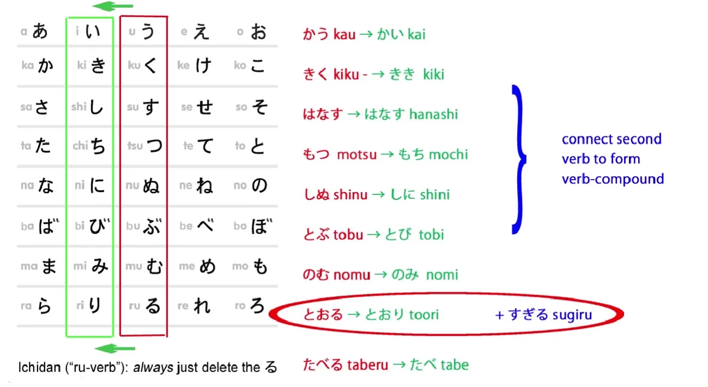

そのとき、白いウサギ (white rabbit) とおりすぎた (passed by)。

---

>ふつうのウサギではなくて、チョッキをきているウサギだった。

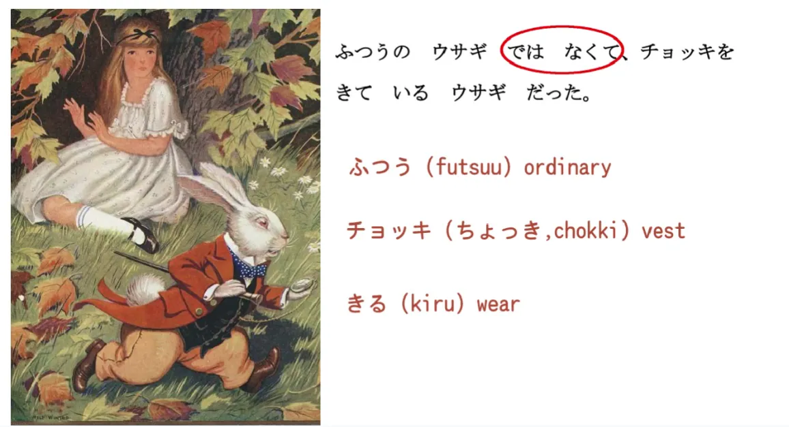

> ふつうのウサギではなくて…

Now, ふつう means `ordinary`, and the rest of this you already know. **ではない means `it isn't / it wasn't` and we're putting into the て-form because this is part of a complex sentence** – and we looked at complex sentences last week, didn't we? 

*(Lesson 11, Dolly gives 7, but it might be an error since て-form isn’t there… but check also 5)*

So, 「ふつうのウサギではなくて」= `It was not an ordinary rabbit.`

> …チョッキをきているウサギだった。

チョッキ means a vest; きる means `wear`, so 「きている」 means to `be wearing / be in the act of wearing`. **And `だった`, of course, is the past tense of the copula.** 

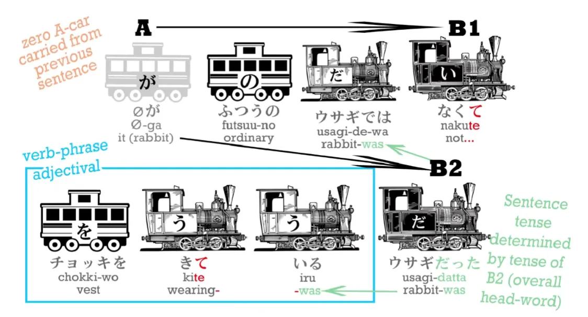

So this is: `It was not an ordinary rabbit, it was a wearing-a-vest rabbit / it was a rabbit that was wearing a vest.`

>ウサギはかいちゅうどけいを見て「おそい！おそい！」と言って、はしり出した。

> ウサギはかいちゅうどけいを見て…

かいちゅうどけい is not a word we're going to encounter all that often because there aren't many of them around these days, but it is an example of something we're going to see an awful lot, which is that in Japanese, as you know, **we can modify one noun with another by marking the first one with の** (or な, which is a form of だ) **but we can also, when we're not just modifying one noun with another but forming a new noun, we can simply ram them together.** 

**We don't have to modify them in any way, the way we do with verbs** (we turn them into the い-stem), **but you can't do that with nouns, nouns don't have any stems, they don't modify in any way – so, when you're putting two nouns together to make a new noun, you simply push them into each other. This is the same as what we do in English, with words like seaweed or bookshelf. We just push two nouns together to make a new noun.**

---

So the parts of this noun, 「かいちゅうどけい」: かいちゅう/懐中 is a slightly unusual noun – it means `in one's pocket or the inside of one's pocket` and とけい/時計 is a very common word – it means `clock or watch` (we have the same word for a clock in Japanese whether it's a small one or a big one), so かいちゅうどけい/懐中時計 is a pocket watch.

And the reason we say 「**ど**けい」instead of 「とけい」 is what Alice in "Alice in Kanji Land calls "ten-ten hooking", **and this is that when you push two nouns together, in the way that we are doing here, and the second one begins with a sharp sound like `t` or `k`, we turn it into its equivalent dull sound like `d` or `b`.** *(=Rendaku - sequential voicing)*

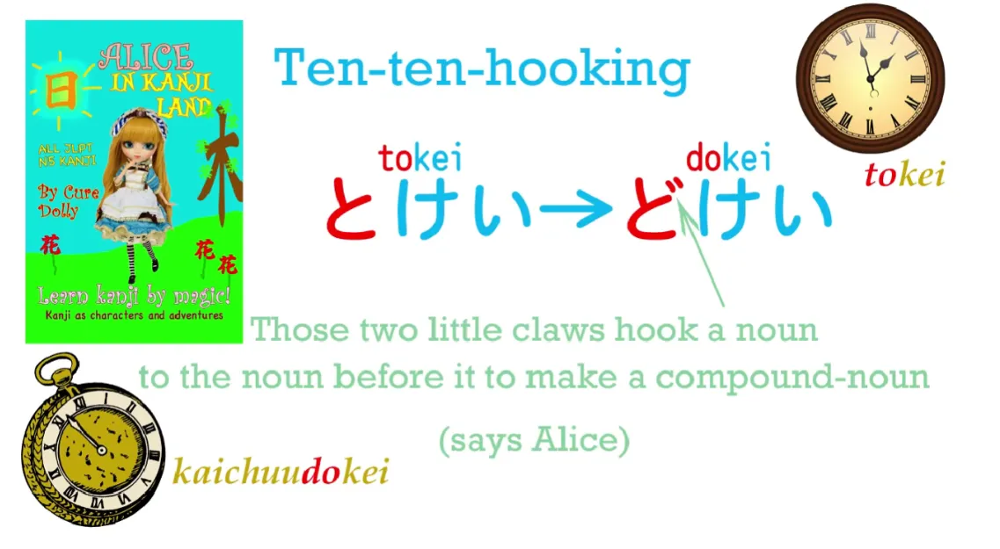

::: info
It USUALLY seems to happen when the 2nd noun in the compound has a sharp Kun’yomi sound that has an equivalent dull sound - h -> b, t -> d, k -> g, tsu/s -> z, sh -> j etc. On’yomi compounds USUALLY don’t have this change, SOMETIMES, if `n` is before, it can trigger it too.
:::

And of course in Japanese you do this by adding those two small marks ゛*(だくてん)* to the kana, so と becomes ど, た becomes だ, く becomes ぐ, さ becomes ざ etc. 

So, for example, あお is blue, as you know, そら is `sky` and when you put them together you get not あおそら but あお**ぞ**ら. We put the ten-ten onto that sharp word, and Alice calls that `ten-ten hooking`. *(ten-ten, lit. `dot-dot`, seems to be a colloquial name for dakuten* ゛*)*

It's as if those two little points, those two little claws, hook into the word before it to turn them into a single word. **It's a thing you're going to see very often.** 

And just as in English you can't do this with any two nouns, but there are a lot of nouns that are made up of two nouns and so long as one of the nouns isn't a slightly unusual one like かいちゅう, they're very easy to understand, just as they are in English.

And then we have: 

『…「おそい！おそい！」と言って…』

## The と quotation particle

Now, we're going to look at what this と actually does, and as we get into more complex sentences, three-level compound sentences like this one, we start to see how useful it becomes.

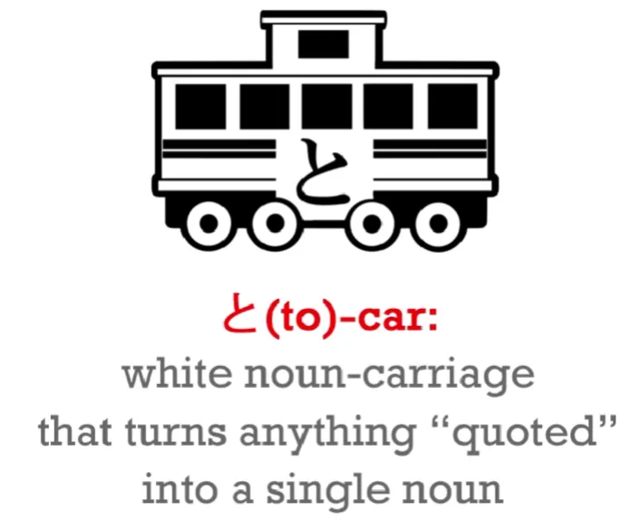

**What と actually does structurally is that it takes whatever it marks** – and that could be two words like this or it could be a whole paragraph with all kinds of other grammar going on in it – **it takes whatever it marks as a quotation and turns it effectively into a single noun.**

---

So a と carriage is a white noun-carriage marked with と. And we're going to find as we go on that **this is used not only to mark things people say and things people think, but all kinds of other things.** And we'll have an example of that a little later in this lesson. **But this と structure is essentially making a quasi-noun out of whatever is marked with と, and the と then makes it function as a modifier to the verb that follows.**

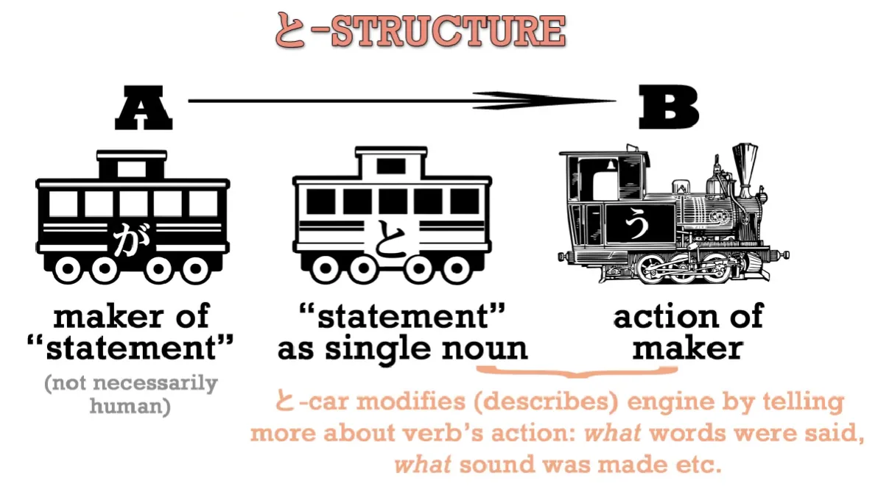

When it's a simple quotation like that, the verb is going to be 言う (to say), but it could also be 考える (to think) or 思う (to think or feel), but it can be many other things too, as you're going to see in a moment. **So this is the structure of a と marked statement of any kind.**

『「おそい！おそい！」と言って、はしり出した。』

おそい means `late`. **And in order to make it a sentence, obviously we have to have a zero-pronoun here.** So the rabbit is either saying `It's late!` or `I'm late!`

***ウサギは(zeroが)かいちゅうどけいを見て「おそい！おそい！」と言って、はしり出した。***

***Rabbit as for (it/he) pocket watch looked-and `late! late!` said-and run-broke out.***

In the Disney version, of course, it was `I'm late!`

「おそい！おそい!」( `I'm late! I'm late!`)

**We don't need to say と with ウサギは言って this time because we've got ウサギは at the beginning of the sentence and this is a compound sentence.** So the second part of the compound sentence has the same main carriage, the same subject as the first half.

『「おそい！おそい！」と言って…』

( `The rabbit said, **I**m late! I'm late!'`)

And that 言って is another compound 言って, so this time we have a three deep compound sentence.

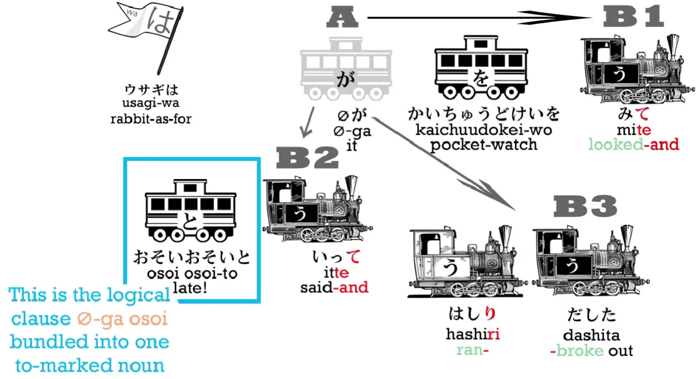

::: info
Blue box - the quoted rabbit’s words also seem to have a zeroが since meaning (I) late.
:::

The rabbit looked at his watch, he said 「おそい！おそい！」, and then... he did something else:

> はしり出した。

はしる means `run` and 出す literally means to `take out`, but this is a combination we're going to see very often in Japanese. Once again, we're using that い-stem , which is the main connecting stem, to connect はしる to 出す. And what does it mean here?

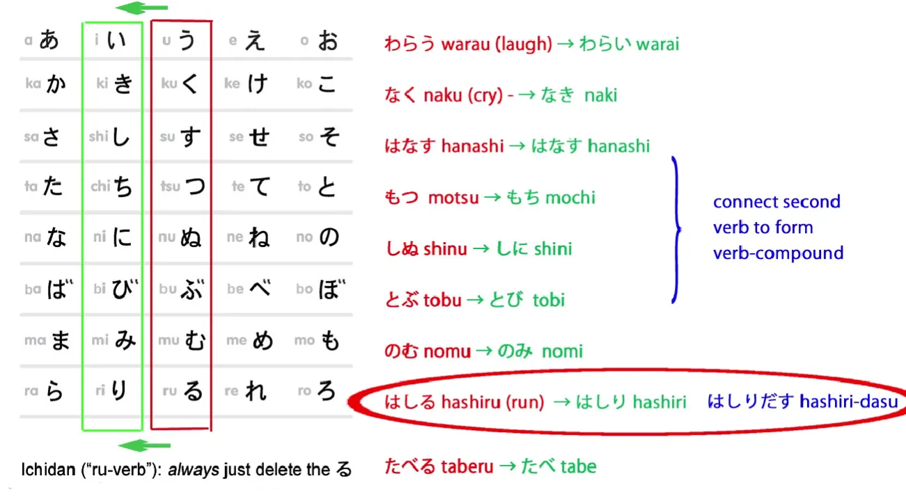

Well, **that 出す when it's connected to a verb means that the action of the verb `erupted`.** So we can say that someone 泣き出した: 泣く/なく is `cry`, and we connect the い stem of 泣くto 出す, and 泣き出す means `burst out crying`. We can say 笑い出す: 笑う is `laugh` and if we connect the い-stem of 笑う to 出す, we're saying `burst out laughing`. And in this case what happened? The rabbit suddenly burst out running – it broke into a run.

ウサギはかいちゅうどけいを見て「おそい！おそい！」と言って、はしり出した。

(The rabbit looked at its pocket watch, it cried **I**m late! I'm late!' and it broke into running.)

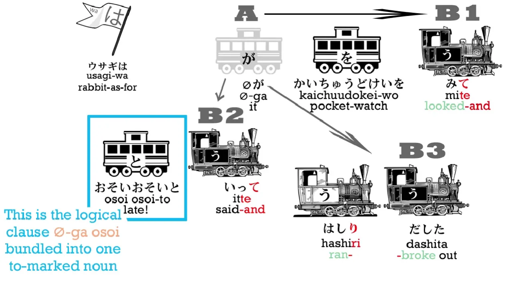

>「ちょっとまってください」とアリスはよんだ。

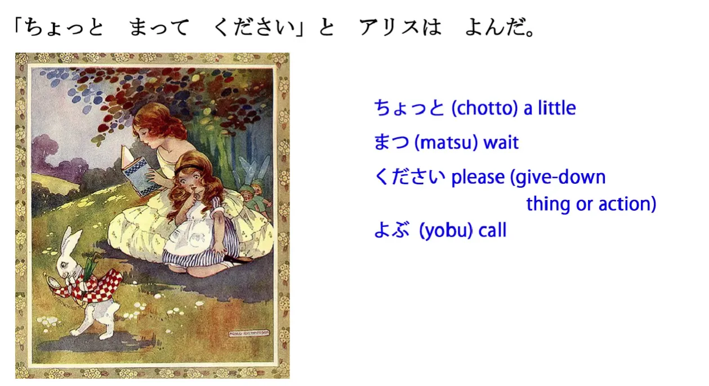

「ちょっとまってください」is a phrase you're going to hear a lot in Japanese. Sometimes the ください will get left off. What does it mean? 

ちょっと means `a little`; まって is the て-form of `待つ/まつ`, which means to `wait`; and ください means `please`. It's actually connected with くれる, which we talked about last time *(lesson 11)*; which also refers to giving down – it's `please give down to me / please lower down to my level`, so that's a polite way of saying `please give`. But it's not just giving a thing, just as with くれる and あげる, it's not just giving a thing, **it can also be, if you connect it to the て-form of a verb, giving the action of that verb.** So you can see it's very related to that くれる and あげる that we learned last week.

> ちょっとまってください

Now, because this is so common, very often when we put a verb into て-form and address it to someone, it's kind of short for てください. 「ちょっとまってください」means `Please wait a little`. So she's asking the rabbit to stop; she wants to meet with the rabbit.

「ちょっとまってください」とアリスはよんだ。

So we've got that と particle again, the quotation particle, which we need when we quote anything, and then よんだ. 「よんだ」: what does that mean? Well, we've come across よんだ before I think, haven't we? And it means `read`, `read` in the past. That is the た form —the だ-form in this case—of 読む. **But in this case it's different. It's the だ form of 呼ぶ.**

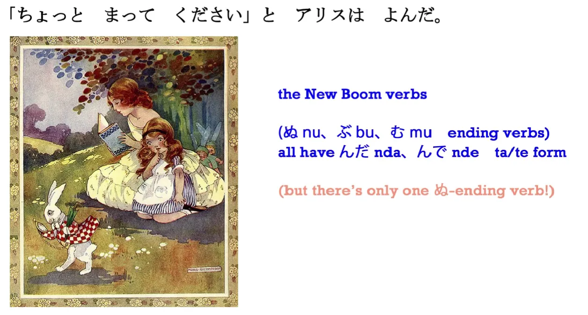

If you remember from our て and た form lesson *(Lesson 5)*, the New Boom group of verbs, ぬ, ぶ, and む ending verbs, all form their て form with んで and their た form with んだ. **So both 読む and 呼ぶ have the past form よんだ.** Fortunately, we're not very often likely to get reading and calling mixed up, are we? This 呼ぶ means to `call`, to `shout out`. It can mean `call` in any of the senses that `call` is used in English. You can call someone a name, you can call an apple a lemon (but you'd be wrong) or you can call out.

「ちょっとまってください」とアリスはよんだ。

(‘Please wait a minute!' called Alice.)

でもウサギはピョンピョンとはしりつづけた。

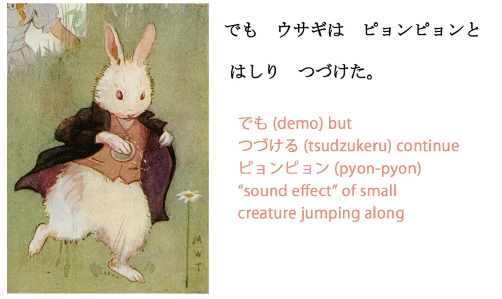

::: tip
If you want to type 続ける/つづける, you must type tsuDUkeru. Dzu gives `ｄず`.
:::

でも means `but`. はしる means `run`. And we're going to leave out ピョンピョン for just a moment here. つづける means to `continue`. So again we've got this form of taking the い-stem of a verb, はしる becomes はしり and then we add onto it the verb つづける (to continue). So 「ウサギははしりつづけた」means `The rabbit continued running`. 

---

**ピョンピョン is something we're going to find very often in Japanese and that is, a doubled word that is a sound effect.** There are lots and lots of these in Japanese, \[e.g.\] 「シクシク」, which is the sound effect for crying. And some of them will be literal sounds and some of them describe states of various kinds. So we're going to be meeting a lot of these later. 

ピョンピョン is almost a literal sound effect. It's the sound of a small thing jumping along, and you'll hear this an awful lot. I do at any rate, but then, a lot of my friends are small things that jump along. So ピョンピョン is the sound, or not quite a sound, it's... if it were an anime you'd probably hear the sound, wouldn't you, ピョンピョンピョンピョン… – but in this case it's not necessarily a sound you hear, but it's the feeling, the sound-like feeling of a small thing, a small animal, jumping, jumping, little jumps. 

So, because it's a rabbit, it didn't run the way you run, it runs in a little jumping, bouncing fashion the way rabbits do. And the thing to note here is that we say ピョンピョンと. **So once again we're using that quotation particle. In this case we're using it to show how the rabbit ran, and because this is kind of technically a sound effect, we're `quoting` the sound the rabbit made in order to tell the manner in which the rabbit ran. It ran in a little-jumps kind of manner.**

All right. So next week we'll find out what happened. What do you think Alice might have done?

::: info
This one was pretty long and a bit annoying to edit, heh, but I have managed, yee (•̀o•́)ง
:::