# **13. Passive Conjugation / Receptive Helper Verb** 

[**Lesson 13: <code>Passive Conjugation</code> debunked: NOT passive. NOT a conjugation. IS easy.**](https://www.youtube.com/watch?v=cvV6d-RETs8&list=PLg9uYxuZf8x_A-vcqqyOFZu06WlhnypWj&index=15)

こんにちは。

Today we're going to talk about the receptive helper verb. In other places you will hear this referred to as the <code>passive conjugation</code>. Now, as we've already learned, there are no conjugations in Japanese, so it can't be a conjugation. 

::: info
Again, Dolly says this to make it easier to understand, but if one would go into depths of linguistics it could be argued. I say this to show that there are a LOT of nuances as one goes deeper into a language and things are rarely simple and straightforward as you get past the basics, so one should keep this in mind. If you truly love reading, under this video, there’s a VERY long, [**interesting discussion**](https://www.youtube.com/watch?v=cvV6d-RETs8&lc=UgzXdC7vyB-XKN543tt4AaABAg) about this.
:::

*But overall, there is no purely <code>right</code> or <code>wrong</code> really, just <code>more helpful</code> or <code>less helpful</code> for an individual.*

**Also, it isn't passive.** So that's zero out of two for the textbooks. And this matters because if we think of the receptive helper verb as a passive conjugation, it completely disrupts our grasp of the structure and, once again, it throws those poor particles all over the room. And as we know the particles are the linchpins, the hinges on which Japanese turns. So if we mess up the particles we are in deep trouble. And this is why so many people find Japanese hard to understand.

::: details Just one of my rambling notes about the technicalities of terminology

There is nothing wrong with calling it passive, you just need to keep in mind that it is different from the English passive, Dolly uses the term <code>receptive</code>, so this is her terminology she uses to avoid confusion in her model. In Japanese, it is referred to as 受身形 - passive form, though Dolly goes off the first Kanji which can mean receive, so I see why and it is a good term too if anything.

In basic terms, it could be said that the passive form in itself includes the receptive function as it is mostly used to put the Subject function onto the Patient (the receiver) of the action of the base verb (through れる) instead of the Agent (the doer of the action of the base verb), while Agent is usually marked by the に in Passive, though there are more details which will be discussed, so Dolly’s approach is fully valid too, but the term Passive works too in my opinion, though requires more linguistic base.

Note that I am talking about the Syntax (Subject) vs Semantics (Patient/Agent) distinction.

In grammar, things are rarely <code>black n’ white</code>, so if it works for you, it’s okay, just remember not to regard Japanese as if it were English! It is just using different words to express the same basic idea, so it is not important if Dolly’s approach works well enough for a very basic understanding of grammar that can be fully grasped / corrected through lots of input.

:::

## The Receptive / Passive

So, now I've mentioned <code>passive conjugation</code> just so you know what we're talking about if you find it in other contexts, let's drop those words completely and call it what it is: **the receptive helper verb.** 

So, what is the receptive helper verb? **It's a verb that fits onto the あ-stem of another verb, and the あ-stem, that's the same stem that we use for attaching the -ない negative helper adjective**, isn't it? **The receptive helper verb is 「れる・られる」: that's れる for godan verbs, られる for ichidan verbs.**

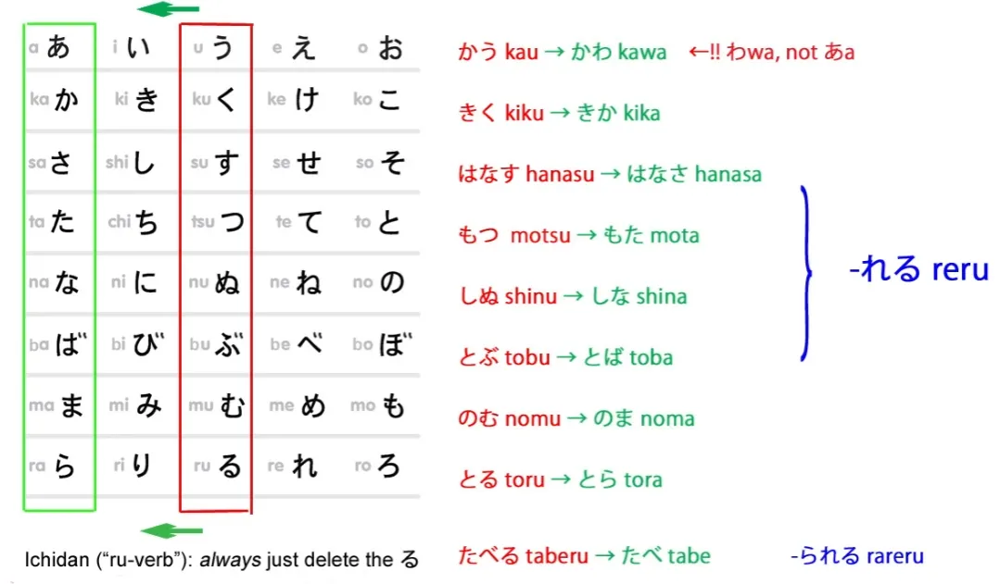

Now, **a lot of people panic when they see that the られる of the ichidan receptive helper verb is the same as the られる of the ichidan potential helper verb. But there's no need to panic.** It's perfectly all right. In English we have things like this as well. For example, we have the words `to`, `two` and `too`. And they're all pronounced the same and they're all very common words that are used hundreds of times every day. And how often do they get confused? Not very often at all. 

And **it's the same with the potential and receptive helper verbs. They're used in quite different situations and there's very little chance of confusing them in real use.** **And real use is what matters.** 

---

So, **what does the receptive helper verb mean? It means `receive` or `get`.** **Receive what? Receive the action of the verb to which it is attached.**

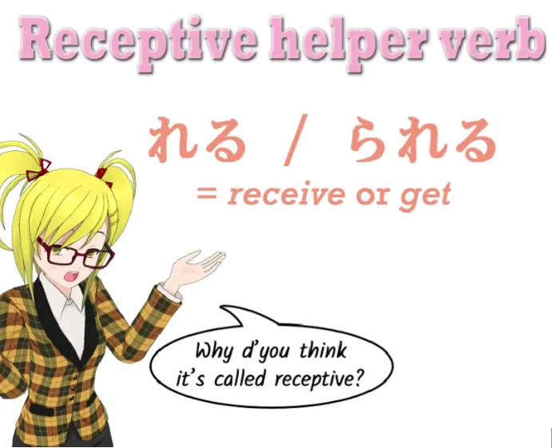

Now, **most of the time I'm going to use the word `get` because this expresses very clearly what the helper verb does.**

::: info
To be more clear, as Dolly says [**in the comments**](https://www.youtube.com/watch?v=cvV6d-RETs8&lc=Ugz9HsXgTvy6JpFnPfR4AaABAg.8s4VanZoq638s4aJUNzU_p): 

*So the <code>got</code> translation only works when English <code>got</code> means <code>receive (an action)</code>, not when it means <code>become (a state)</code>. Or to simplify the matter - you can use <code>got</code> to translate れる/られる but you can't always use れる/られる to translate <code>got</code>.*
:::

Your old English teacher might say it's not the best way of expressing things, but it's a perfectly good way of expressing things in English and in Japanese it is exactly how we express them. All right?

So, let's take a simple example: 「さくらがしかられた。」 

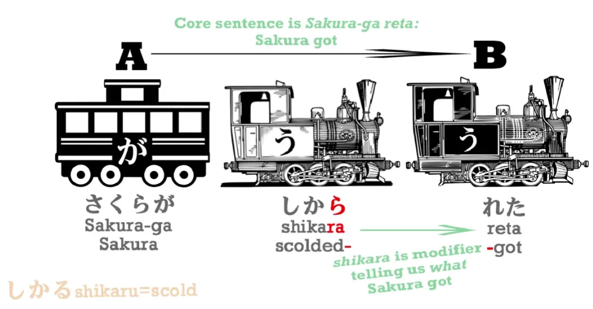

**叱る/しかる means `scold` or `tell off`, and the あ-stem is 叱ら, so when we add to that れる and put it into the past tense we get しかれた/叱られた.** **叱る is `scold`, 叱られる is `get scolded`, 叱られた is `got scolded`, so, `Sakura got scolded`.**

---

**Now, there's an important thing to bear in mind here, and that is that we can sometimes, with a helper verb attached to a verb, we can, as a sort of railroad shorthand, condense those two parts into one verb.** 

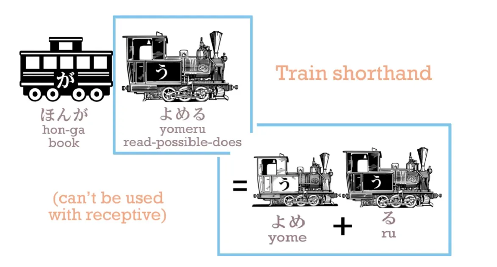

So we can say 「ほんがよめる」 and although よめる, which is the potential form of よむ, is strictly speaking よめ plus る, we can combine them together and treat よめる as one engine. **But we can't, and never should, do that with the receptive helper verb. Why not? Because when the receptive helper verb is attached to another verb, the action of the first verb is always done by someone different from the action of the second verb れる・られる.**

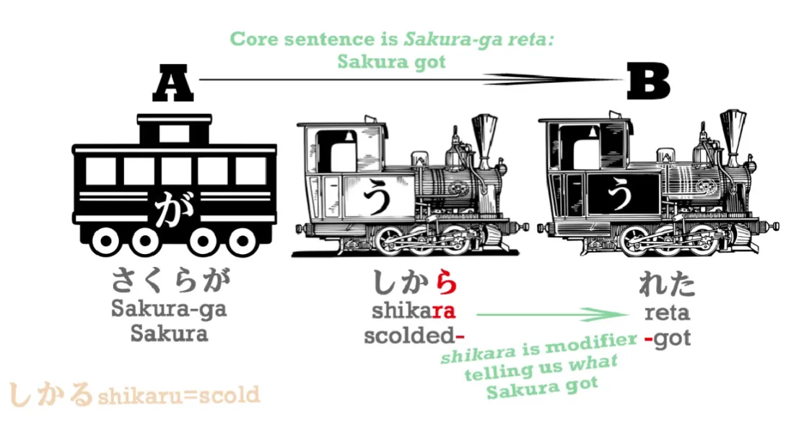

**So we always have in a receptive sentence the action that is done by someone else, whom we may or may not know, plus the real action of the sentence which is れる・られる, the receiving—the getting—of that action.** And this is the fundamental point to bear in mind. It's because the textbooks don't keep this in mind and don't keep those two engines separate that all the confusion and difficulty over the so-called <code>passive conjugation</code> arises. **The head verb of a れる・られる receptive sentence is always れる or られる, not the verb to which it is attached.**

---

Now, **let's also notice that the A-car, the actor of the sentence, is not necessarily a person.** So, if we say, 「**水**がのまれた」 (のむ/飲む＝drink; のま＝ あ stem of drink; れた＝ got), we're saying `**The water** got drunk`. **And the actor of that sentence is the water.** 

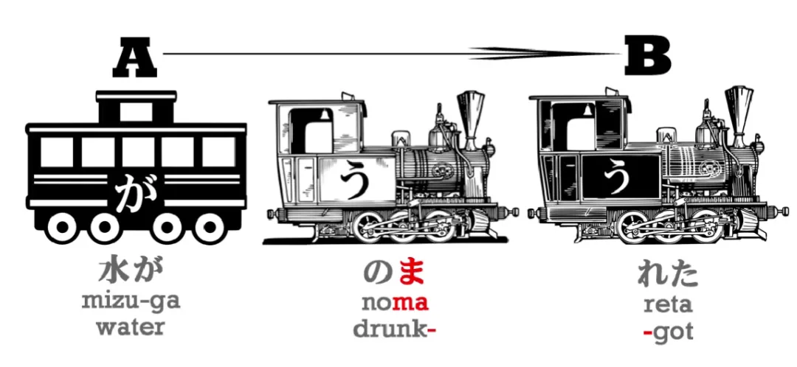

Now, even if we add a doer of the action: 「水がいぬにのまれた」, 

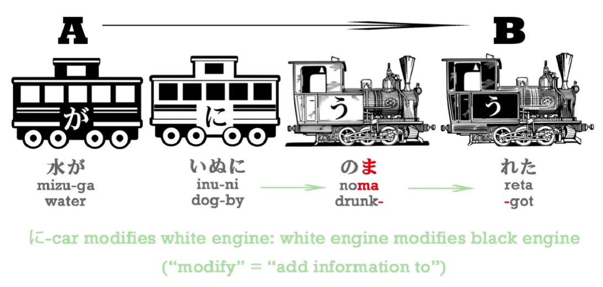

**the actor of the sentence is still the water, not the dog, because it's the water that got drunk, it's the water that did the getting. The dog did the drinking, but the water did the getting.** **And the dog drinking the water is all a white section which modifies that final head verb, `get`.** `The water got drunk by the dog.`

Now, why do I mark the dog with に? I'm going to come to that in just a moment. 

Let's get a fuller sentence so we can see all the particles working together in a receptive sentence: 

> さくらはだれかにかばんがぬすまれた。

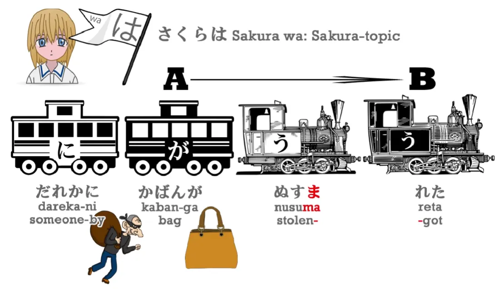

(盗む/ぬすむ＝ steal; 盗ま＝ あ stem of steal; 盗まれる＝ get stolen; 盗まれた＝ got stolen). **誰か/だれか means `someone`** (誰＝ who, か＝ question). Who was it? We don't know, no one in particular, but someone. **誰か＝Someone**.

---

So, what's going on here? Who is the receiver of the action? It's not Sakura, who's marked by は. It's not someone, who's marked by に. **It's the `person` who's marked by が, and that's the bag. The bag is what received that stealing, so the bag is the subject of the sentence. The bag is the one who did れる, who did `got`.**

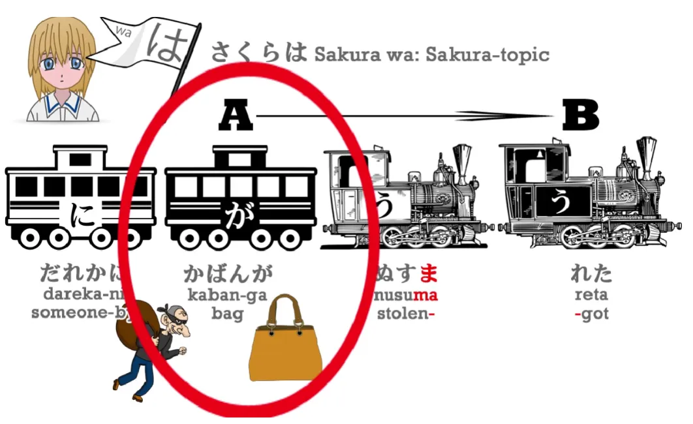

And に... what's it doing here? Well, let's remember that に marks the ultimate target of an action (だれか). So, 「(zeroが)**さくらに**ボールをなげた。」 the が marked actor is I, the object of the action is ボール, **and the target of that action is Sakura**. *(The non-receptive use of the に)*

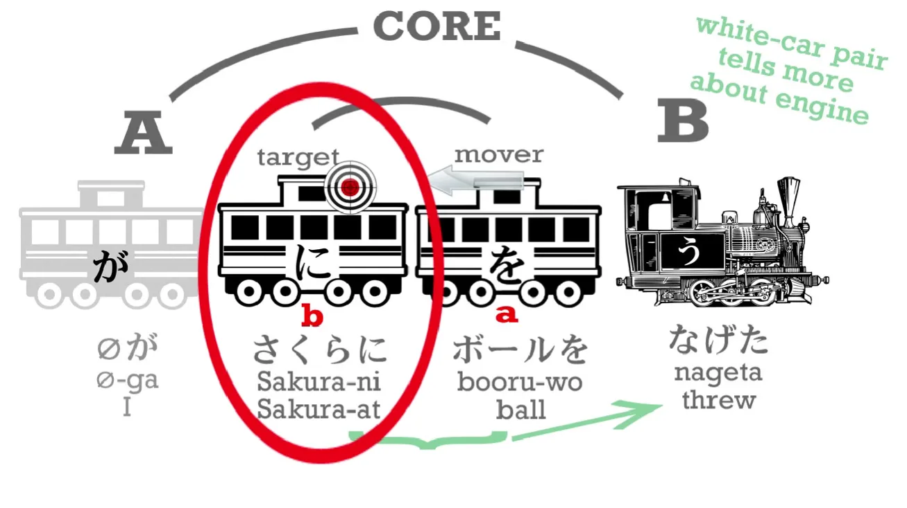

**Now, this kind of に can only be used when we are projecting something, whether it's throwing a ball, sending a letter, giving a present, lending a book. We have to be projecting something toward the target.**

---

Now, **れる is not a projecting verb. It's a receiving verb. It's not a push-verb, it's a pull-verb.** 

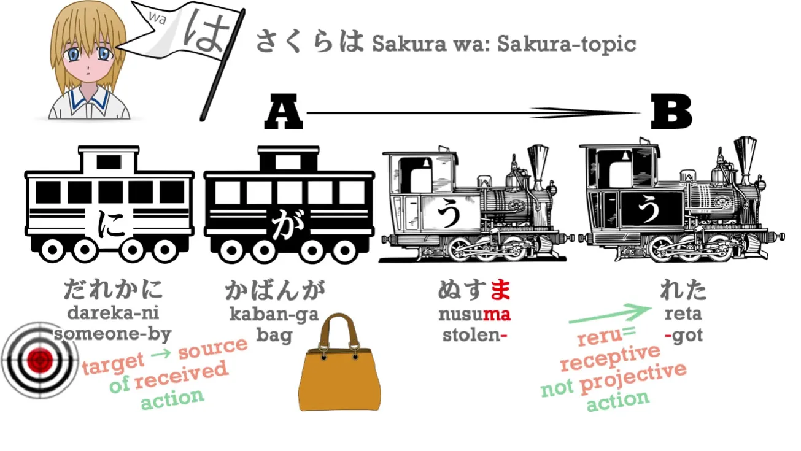

**Therefore, the target of that verb is not something toward which you are projecting; it is the thing from which you are receiving.** **So に performs the same function in relation to a pull-verb that it performs in relation to a push-verb, that is, the ultimate target of the push, the ultimate source of the pull.** 

::: info
This may be helpful. From the comments like [**this**](https://www.youtube.com/watch?v=cvV6d-RETs8&lc=UgycETdw-fOaAqbnzlp4AaABAg) under the video.  
My understanding of this would be too long again, so I will not include it here, it is not needed here since I think Dolly explained it clearly enough and I do not want to put more headings here...*

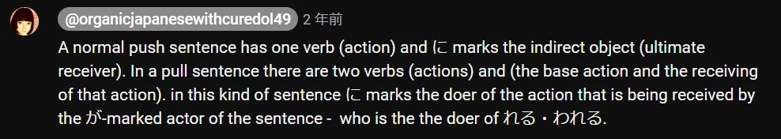

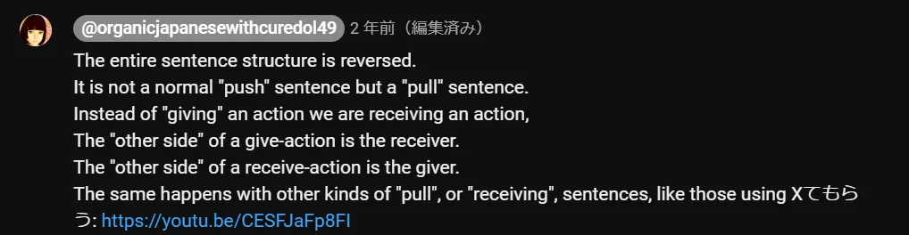
:::

So you see, all the particles are doing exactly what they always do. Nothing is changing here.

::: info
Well, as shown above, in the Passive/Receptive it sort of changes in that they reverse their polarity. Hence why に is not <code>to</code> - receiver/<code>target</code> like in Active, but is now <code>by</code> - the doer, and が instead is the receiver of the base action (ぬすむ) via れる. It can especially be explained via Semantic/Thematic Roles.*
:::

If you think of it as <code>passive conjugation</code>, all the particles do a strange dance and seem to be doing different things from what they usually do, but if you understand it as it is - the receptive helper verb - there isn't any problem. And it all makes sense, just the way Japanese always does if you know what it's really doing.

## <code>Nuisance Receptive/Passive</code>/迷惑受け身

Now, there's one other area in which the receptive sometimes confuses people, and that is in the so-called <code>suffering passive</code> or <code>adversity passive</code>, which is actually called in Japanese the 迷惑受け身/*めいわくうけみ*, which means the `nuisance receptive`. And that's what it is. It's the nuisance receptive.

---

「さくらはだれかに**かばんが**ぬすまれた。」means `Sakura's **bag** got stolen by someone` or, literally, `In relation to Sakura, **bag** got stolen by someone`. 
::: info
Normal receptive.
:::

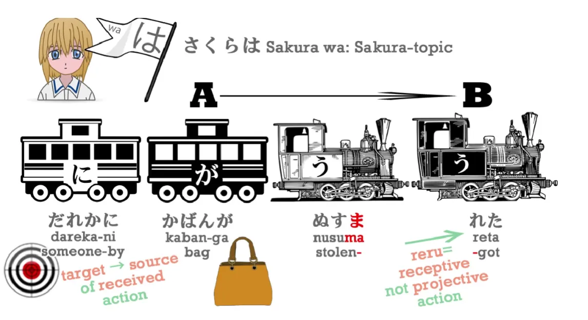

::: warning
Notice the が before a receptive-marked verb instead of a direct object を. I recommend reading [**THIS CHAIN**](https://www.youtube.com/watch?v=cvV6d-RETs8&lc=UgwSvcxzsfJfg2FlFaB4AaABAg) about why there is が instead of を if you are not sure. Actor should mean Subject for Dolly but even that is just my guess based on when she uses it since she does not seem to explain what she really means by it, [**in one comment chain under this video**](https://www.youtube.com/watch?v=cvV6d-RETs8&lc=UgyjLIrKQJJ0zfRCXId4AaABAg.8wnXb0KQGCY8wtxK5KucCT&ab_channel=OrganicJapanesewithCureDolly) she even calls Receptive に as <code>secondary actor</code> (which is more akin to the actual linguistic Actor…or Macrorole of Agent there) which does not help.
:::

::: details VERY optional <code>Explanation</code> Note & example of my chronic rambling (or whatever lol)
  
***This is just one of my usual linguistic ramblings that do not really matter in the grand scheme of things & are here for especially my own linguistic interest (or those who want to go more in-depth)  
I am just testing/practicing how I understand stuff with this in the general sense of linguistics.***

***MY KNOWLEDGE IS VERY LIMITED, SO IT IS JUST ME EXPERIMENTING WITH A HYPOTHESIS.  
I AM VERY AWARE WHAT I SAY MIGHT BE OUTRIGHT WRONG!***

***Dolly obviously does not use the terms as rigidly as I will here, because it is just basic grammar so it obviously has no need to be here anyway, but for the sake of it, I will have some linguistic fun:)***

***Grammar is complex, so I still have things to learn and whatnot so I will also use this to research.***

*If still unclear, to my understanding, it can be explained through Semantic roles/Thematic relations.*

Mind that Syntax / Syntactic and Semantics / Semantic are two different fields and one Syntactic function (Subject etc.) can have multiple Semantic roles, especially in terms of Active vs Passive/Receptive.  
It is because this is Passive/Receptive, かばん has the SYNTACTIC function of the SUBJECT (hence が marked) BUT it has the same SEMANTIC function of the PATIENT - it received the act of the (verbs) stealing/being stolen by someone. In Active voice かばん has the SYNTACTIC function of the DIRECT OBJECT but still would have the SEMANTIC function of the PATIENT.

Thus, if we were to have かばん marked by を (Direct Object - Syntactic function), it would have to be in the Active voice (since in Passive, we tend to put the Direct Object as the Subject instead) OR, as will be shown below, it would have to be in the form of a <code>Nuisance Receptive</code> as a secondary Object connected to a secondary Verb that adds <code>description</code> info about the main part.  
**The term Actor** that Dolly uses SHOULD mean the same as Agent as said [****here****](https://linguistics.stackexchange.com/questions/20451/what-is-the-difference-between-actor-and-subject-in-systemic-functional-gram) and [****here****](https://english.stackexchange.com/a/569830) from what I found, but Dolly seems to use it here for Subject, in a way Actor should imply the one that does the action of the main verb, so I am confused what Actor means for her here, but it might be that… in which case, I get what Dolly means, tho she might be here merging the Syntactic and Semantic functions, else I misunderstood what she is implying by Actor here, since she seems to point it to the Subject which is a SYNTACTIC property, while Actor (or rather Agent) is a SEMANTIC property and in this sentence, in the comment she calls かばん <code>actor</code>, かばん should be the Patient, not <code>actor</code> as it receives the action, not doing the action of the main verb. That is to say if Actor is indeed like Agent.

*To be real, the term Actor I have seen used only rarely and it should imply Semantic function, BUT it can be used to refer to the <code>Semantic Macrorole</code> for Subject in the Active voice and by-phrase in the Passive (while Patient is the Direct Object in the Active and the Subject in the Passive, whose Macrorole is called <code>Undergoer</code>), as given [**here**](https://rrg.caset.buffalo.edu/rrg/vanvalin_papers/SemMRsRRG.pdf) in the paper by a linguist Robert Van Valin…*[1] (page 1 & 3) and it points to the relationship between Semantics and Syntax. Usually Agent (or its sub-names) are used, so it greatly confused me, but from other lessons, **Dolly seems to refer to Subject as the Actor sometimes and uses them interchangeably even in the Passive/Receptive, so just keep that in mind that by Actor she means Subject** even if it should refer to different things in the Passive from what I PERSONALLY researched…  
Furthermore this seems to be the case in Japanese too, as it is what [**IMABI**](https://imabi.org/the-passive/) seems to say in the Passive lesson, granted only using the term Agent, in Passive being marked by に / によって.  
In ACTIVE voice these two SEMANTIC functions are generally SYNTACTICALLY expressed through Subject (Agent) and Direct Object (Patient), but they refer to different fields.  
In the Passive/Receptive, Patient is instead mostly put into the SYNTACTIC role of the Subject.  
Their SEMANTIC roles do not change - Patient & Agent are still the same words, but their SYNTACTIC functions are changed, where Patient now becomes the Subject and Agent is put into the by-phrase, in this case に-marked phrase. In Passive/Receptive there are 2 verbs - ぬすむ and れる, ぬすむ describes れる here, れる works as a Predicate? (not too sure here, but れる is marked as a black car like が and ぬすむ as just white) to かばん which is a Subject now.  
It seems to surprisingly fit between English and Japanese in the basic Transitive / Other-move verbs even if we should not compare them, BUT they are not identical, Japanese is much more free, widespread and logical / clear with it than English is so Japanese can use Passive / Receptive for stuff that English cannot.

*Sorry if it is a bit complex, but if you check what the terms refer to and reread it should clear up.  
But there is a special case of Passive/Receptive in Japanese that can mark かばん as を while still having a Passive/Receptive sentence, can see it right below here - the Nuisance Receptive*

***If you notice ANY wrong info here, please let me know! Still, take it with a grain of salt.***

:::

### The Suffering Passive / Nuisance Receptive example

**But we can also say** 「**さくらが**だれかにかばんをぬすまれた。」 **This is the nuisance receptive**.

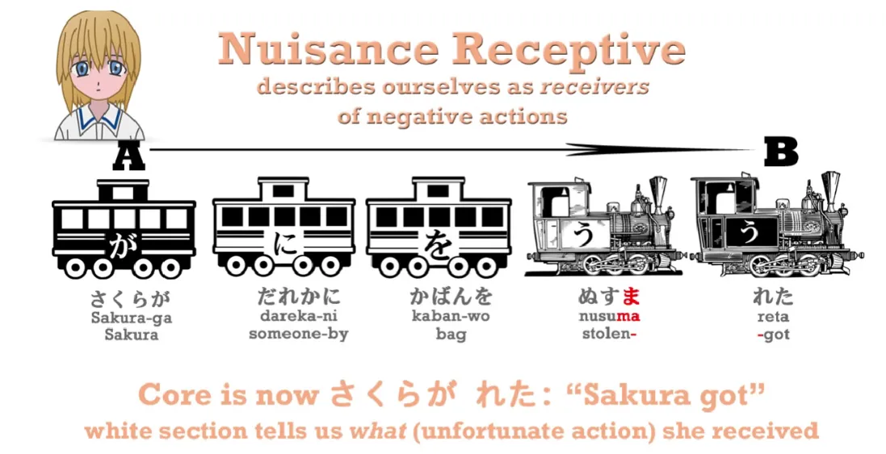

So what's happening here? **The が marked actor is now Sakura, isn't it? She is the one who does the receiving.**

::: info
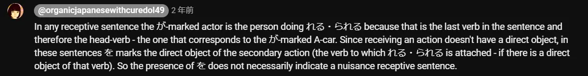
:::

So what does this sentence mean in English? Very simple: `**Sakura** got her bag stolen`. That's what we say in English; our old English teacher might not like it, but we say it in English, it makes sense in English, and it's exactly what we say in Japanese. `Sakura got her bag stolen by someone.`

So, you can see that there is in fact no problem, no difficulty, no confusion about the receptive helper verb, just so long as you know that it is a receptive helper verb and not something else.

::: info
Again, this will likely be VERY hard to fully grasp, so I recommend also reading through the comments under [**the video**](https://www.youtube.com/watch?v=cvV6d-RETs8&list=PLg9uYxuZf8x_A-vcqqyOFZu06WlhnypWj&index=15). There are quite a few (other) very interesting answers by Dolly.  
Do not worry if it is too tough to fully grasp now, you will grasp the Passive/Receptive fully when you input and immerse in Japanese a lot, it will all clear up eventually on its own the more you consume. This is just to give the basic idea about it through Dolly’s basic explanation.*
:::