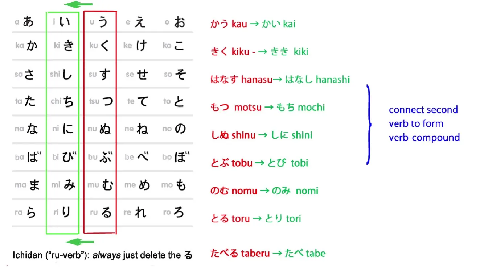
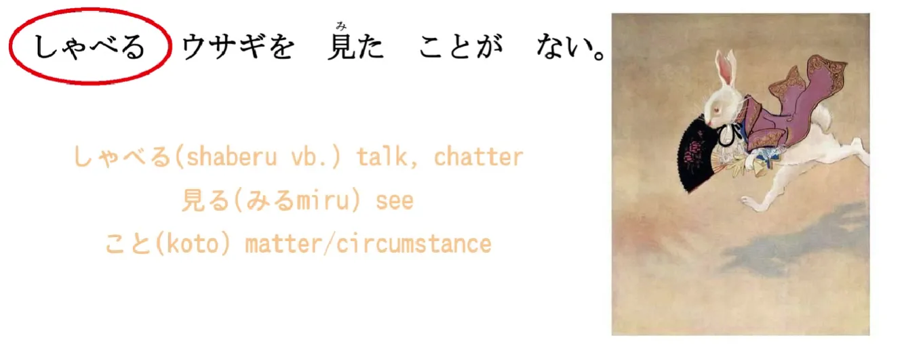
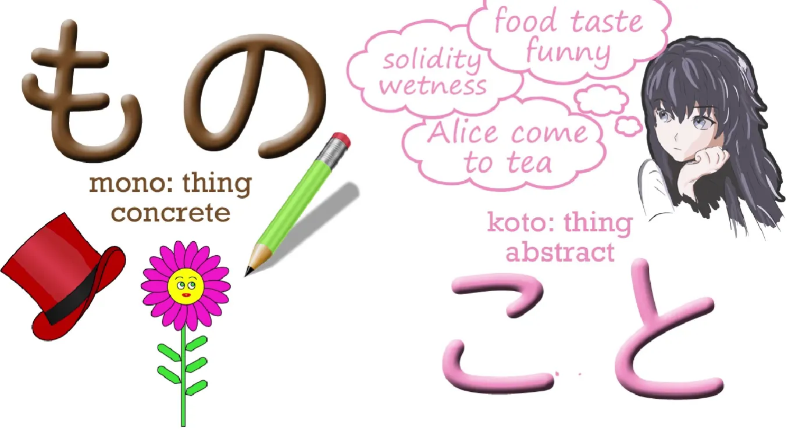
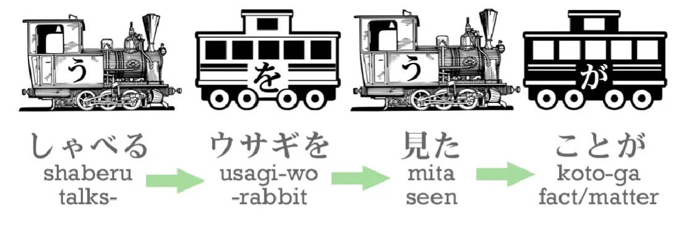
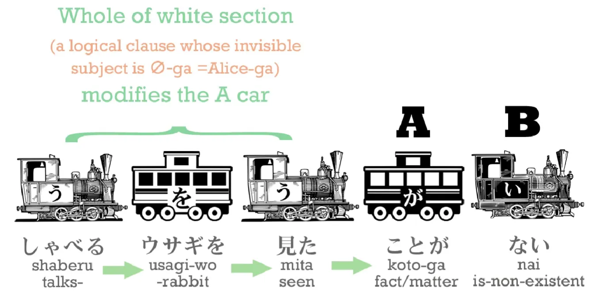
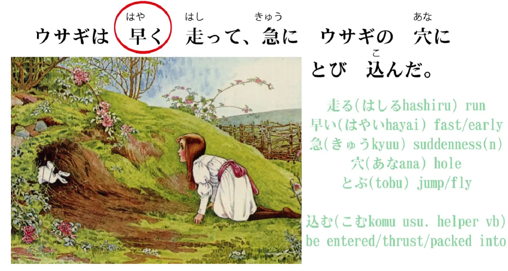
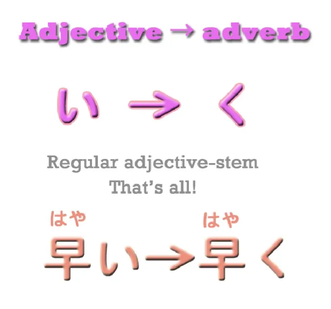
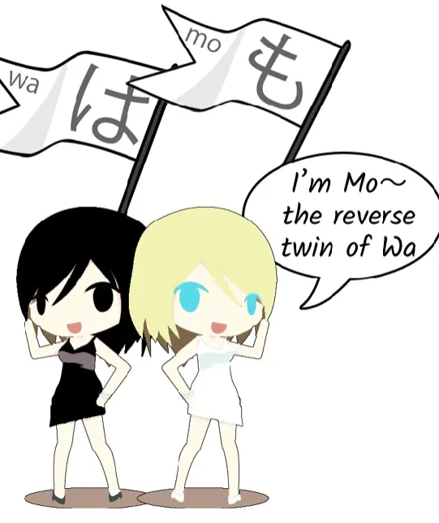
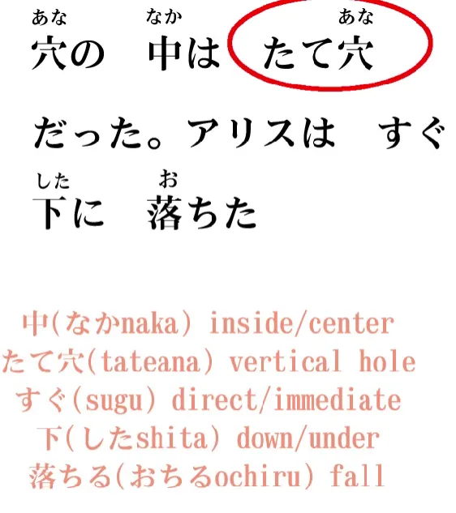
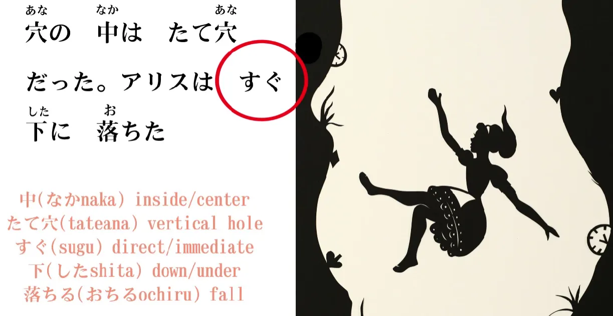

# **14. Adverbs and the も Particle** 

[**Lesson 14: All About Adverbs: Mo Particle Secret; and more Alice!**](https://www.youtube.com/watch?v=9DR9ifftMvs&list=PLg9uYxuZf8x_A-vcqqyOFZu06WlhnypWj&index=16)

こんにちは。

Today we're going to go back to Alice's adventures. If you remember, Alice had spotted a white rabbit running along. The white rabbit looked at his watch and said,`I'm late! I'm late!` and ran off. Alice called to him to stop but, whether he heard or not, he didn't stop.

> アリスはとび上がって、ウサギの後を追った

「とび上がる」 is another one of those words of the kind we looked at last week, where a verb is joined to the い-stem of another verb to create a new verb. 

The first verb here is とぶ/飛ぶ, which means either `jump` or `fly`. In this case, it obviously means `jump`, since Alice can't fly. And 上がる means `rise up`. So when you put them together, 飛び上がる means `jump up`. 

And we might notice that 上がる here, it's the same kanji as 上, which means `up`, and 上がる is a verb meaning `rise up`, and we can see that it's related to 上げる, which we looked at recently *(Lesson 11)*, and that means to `give to someone upwards / (to) raise up toward someone else`.

**But 上がる means for something to `raise itself up / rise up in itself`**. So we can see that the two are related. They're both `upping` verbs.

---

> ウサギの後を追った

後 means `behind` or `after`, and 追う (which is spelled おう) means `follow. `後を追う is a common expression and it means to `follow after / follow behind`. **But, as we've seen before, these positional expressions are always nouns in Japanese.**

::: info
What is meant is the 後 part being a noun, since 後を追う should be a verb.
:::

We talk about the `on` of the table, the `under` of the table, the `beside` of the river. And here we're talking about the `behind` or the `after` of the rabbit. So Alice followed the `rabbit's after` or the `rabbit's behind`. This is how we put it in Japanese.

> アルスは飛び上がって、ウサギの後を追った。

(Alice jumped up and followed after the rabbit.)

*As for Alice, jumped up and rabbit's after/behind followed.*

---

しゃべるウサギを見たことがない。

しゃべる/喋るmeans `talk` or `chatter`. It's a bit like `jabber` in English, isn't it? 「しゃべるウサギ」in this case obviously **しゃべる, the verb, is being used, as any verb-engine can be used, as an adjective.** 

So 「しゃべるウサギ」 is a `talking rabbit` or a `talk-rabbit` literally. 

見たことがない is a usage we're going to find very often: ことがない, ことがある. What does it mean? 

## ことがある

Well, こと, as we know, means a `thing` and it means a thing in an abstract sense, a condition, not a concrete thing like a pen or a book. 

So, 「見たこと」: 見た is modifying the noun こと, isn't it? 

It's telling us what kind of こと it is, and in this case 見る means `see`, 見た is `see` in the past tense, **so the こと is actually `seeing` in the past tense.**

**So 見たこと means `the fact of having seen`.** **見たことが ない means `the fact of having seen does not exist`.** 

So what this is saying is, `Alice had never seen a talking rabbit`. ( `**The fact of having seen a talking rabbit does not exist**`)

> しゃべるウサギを見たことがない

(Alice had never seen a talking rabbit.)

And of course in English we always want to make Alice the actor of this sentence, but **actually the subject of this sentence, the A-car, is not Alice, it's こと**.

Even if we put Alice into the sentence, we would say, 「アリスは喋るウサギを見たことがない」. She would still not be the actor of the sentence. **She would just be the topic about which the sentence was.** `Speaking of Alice, the fact of having seen a talking rabbit does not exist.`

---

ウサギは早く走って、急にウサギの穴にとび込んだ。 

Right, so this is quite a long sentence and there's quite a lot in it to unpack. I'll tell you what it means to start with. It means `The rabbit ran quickly and suddenly jumped into a rabbit-hole`. So let's look at it bit by bit. 

> ウサギは早く走って…

Now, 走る, as we know, is `run`; 早い is an adjective meaning `fast` or `early`. In this case, it obviously means `fast` – we know the rabbit wasn't early, don't we? If we want to say `the rabbit is fast`, we would say 「ウサギが早い」.

## Adverbs

**If we want to say that its movement is fast, its action is fast, we need an adverb. An adverb is an adjective that describes not an object, not a noun, but a verb.**

---

**Now, we can turn any adjective into an adverb in Japanese very easily.** **All we do is we take the regular い ending adjective and use its stem く.** 

**So 早い becomes 早く. 早い is an adjective describing a thing; 早く is an adverb describing an action.** So:

> ウサギは早く走**って**...

(The rabbit ran fast ***and***...) *- added translation for って...*

> ...急にウサギの穴にとび込んだ。

Now,「ウサギの穴」: 穴 means `hole`, so ウサギの穴 means `rabbit-hole`. とび込む is another one of these compound verbs. とぶ/飛ぶ, as we know, means `jump`, and 込む means to `go into` something. **It's not just like `enter`; it tends to be to `put into`, to `force into`, to do an action into something.** So we have a lot of verbs actually which are made up with **`込む`, which is `doing an action into` something.** So `とび込む` means `jump into`, quite simply `jump into`. So, the rabbit `jumped into a rabbit-hole.`

---

But 「急に」what does that mean? 

Well, 急 is a noun and it means `sudden`. **And when we put に onto the end of it we turn that into an adverb as well.** So here we have two kinds of adverbs. **We can form an adverb from an adjective by simply using its く-stem.** **And we form an adverb from a noun by adding に.** 

And this works with some regular nouns and pretty much all adjectival nouns. So, 急 means `sudden` or `abrupt`; **急に means `suddenly`**. `The rabbit suddenly jumped into a rabbit-hole.` 

So, the entire sentence:

ウサギは早く走って、急にウサギの穴にとび込んだ

(The rabbit ran fast and suddenly jumped into a rabbit-hole.)

> アリスもウサギの穴にとび込んだ

(Alice also jumped into the rabbit-hole.)

## The も particle

Now here we're going to meet a new element that we haven't covered before, and that is the も-flag. **も is a flag, just like は.** Why is that?

Well, we know that は ***(Lesson 3)*** is a non-logical topic-marking particle, don't we? **も is another non-logical topic-marking particle; in fact, it's the only other non-logical topic-marking particle.** So **も marks the topic of the sentence just the way は does.** What's the difference between them? 

Well, は, as we know, declares the topic of the sentence, and obviously it can also change the topic of the sentence. **If we're talking about one thing and we declare a new は topic, we have changed the topic of the sentence.**

---

Now, **も declares the topic of the sentence as well, but it always changes it.** **You can't use も unless there is a topic already current in the conversation.** So, the topic of our conversation up to this point has been the rabbit: the rabbit jumped into the hole. **And now we're changing the topic to Alice.** 

> アリス**も**ウサギの穴に飛び込んだ

**When we change the topic with も, we are saying that the comment about this topic is the same as the comment on the previous topic**, the topic we're changing from. 

---

**When we change the topic with は, we are doing the opposite of that: we are drawing a distinction between the present topic and the previous topic.** So if we had said: 

「アリス**は**お姉ちゃんのところに戻った」 – ところ` is `place` and 戻る is `return", so this would have meant Alice went back to her sister, to the place where her sister was, to her sister's place.

**If we'd said this, that は would have been drawing a distinction between what the rabbit did and what Alice did.** We would be saying, `The rabbit jumped into the rabbit-hole. As for Alice, she returned to her sister`. And you see that in English too. This has the implication that what Alice did was different from what the rabbit did. `The rabbit jumped into the rabbit-hole. As for Alice, she went back to her sister.` This is what は does.

---

If we'd used が: 「**アリスが**お姉ちゃんのところに戻った」, we'd simply have been saying, `The rabbit jumped into the rabbit-hole and **Alice** went back to her sister.`

::: info
Alice = subject of its clause here, marked by が.
:::
But with は, we are drawing that distinction; we are saying, `The rabbit jumped into the rabbit-hole, but as for Alice, she went back to her sister.` 

---

Now, **if we say も instead of は, then we are making the opposite point: we are saying that the comment we made on the rabbit is the same as the comment we're making on Alice.** 

`The rabbit jumped into the rabbit-hole and Alice **also** jumped into the rabbit-hole.` 

So, there are various uses of も, which we'll look at later, but this is the most fundamental one. **It's the topic-marking particle that tells us that the comment on the new topic is the same as the comment on the old topic.** 

---

穴の中は**たて穴**だった。アリスはすぐ下落ちた。 

中 means `the inside`, either the middle or the inside of something, so 穴の中 is the inside of the hole. たて穴/縦穴: the word たて/縦 means `vertical` or `upright` (and you can see it's related to 立つ – to stand). So, 「穴の中は竪穴だった」`the inside of the hole was a vertical hole` – it went straight down. 

> アリスは**すぐ**下落ちた。

Now,下, as we know, is `down` or `below`. **すぐ means `direct`; it can mean `soon`** in the sense of English `It'll happen directly (it'll happen soon)`, or it can mean `straight / direct` in the other sense. So **すぐ下 means `straight down / right down / directly down`.**

---

> でも驚いたことにゆっくりゆっくり落ちた

And this means `But surprisingly she fell very very slowly`. `驚く` means `be surprised`, and `驚いたこと` is an interesting expression because it literally appears to mean, doesn't it, a `surprised thing`. 

---

**But as we've seen with Japanese adjectives of emotion and desire, with things that describe emotion and desire, in Japanese they shift very easily from the thing that experiences the emotion to the thing that causes the emotion and back.**

So **`驚いたこと` here doesn't mean a `surprised thing`, it means a `surprising thing`.**

---

And に ( `こと**に**`), **is once again that technique of putting a に**, putting に, **after a noun to turn it into an adverb.** 

So, `驚いたことに落ちた.` (We'll come to `ゆっくり` in just a moment.) It means `surprisingly fell / she fell in a surprising manner`. And what kind of a surprising manner was this? `**ゆっくりゆっくり**`.

## ゆっくり adverb

Now, `ゆっくり` is a very common word that we'll encounter. **It's a slightly unusual kind of adverb** – the third kind of adverb we're going to encounter commonly in Japanese. The first two kinds, as we see, are the く-stem of an adjective or a noun with に. **`ゆっくり` is slightly unusual in that it is fundamentally a noun which can be applied as an adverb but we don't need to use に with it. It stands on its own.**

---

`ゆっくりゆっくり落ちた`. **`ゆっくり` means `slowly / leisurely / at a gentle pace`**. 

So, `驚いたことにゆっくりゆっくり落ちた` – `But surprisingly she fell very very slowly`.

So once again we've gone through the story a little more rapidly than the first time, and we've learned quite a lot.

::: info
This is where Dolly fully incorporates Kanji into her lessons, also due to people requesting it, as indeed, once you embrace Kanji, Japanese text without it is truly a headache to read, let alone to comprehend. Do not be scared or hostile to Kanji, they are your friends, believe me.

Both [**Yomichan**](https://github.com/FooSoft/yomichan/releases) (did not use to work, but it works again in the newest version) and **[Rikaichamp](https://chrome.google.com/webstore/detail/10ten-japanese-reader-rik/pnmaklegiibbioifkmfkgpfnmdehdfan)** work here, so Kanji should not pose any real issue for you, as far as reading them goes.
:::