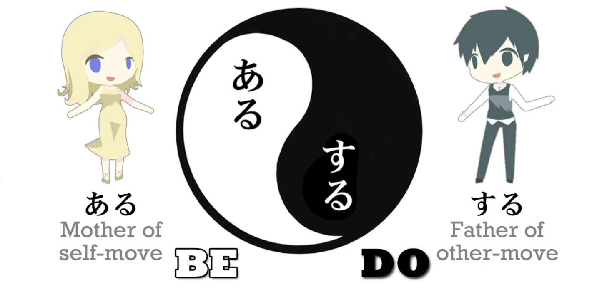

# **15. Transitive & intransitive verbs**

[**Lesson 15: Transitivity- the 3 facts that make it easy. Transitive/intransitive verbs unlocked**](https://www.youtube.com/watch?v=ELk1dqaEmyk&list=PLg9uYxuZf8x_A-vcqqyOFZu06WlhnypWj&index=17)

こんにちは。

Today we're going to look at self-move and other-move words. If you look in a standard Japanese textbook or dictionary, you usually see these defined as <code>transitive</code> and <code>intransitive</code> verbs. Now, this isn't as far off as some of the things you find in these books, such as conjugation, which doesn't exist in Japanese; passive (there is no passive in Japanese). **Transitivity and intransitivity does exist in Japanese and most of the time there is a big overlap between that and self-move and other-move verbs.** However, it doesn't work all the time and it isn't exactly what is meant by self-move and other-move in Japanese.

So, if you're familiar and comfortable with the Western terms <code>transitive</code> and <code>intransitive</code>, it doesn't hurt a lot if you use them, at least not most of the time. But if you're not familiar with them, don't try to learn them just for the sake of Japanese, because they're not really accurate.  

::: info
My guess is in regards to English, since a lot of verbs that are transitive in English are not in Japanese etc., basically it is better to regard the two as their own entities to avoid confusion.
:::

---

So what are self-move and other-move words? **In Japanese, a move-word, <code> 動詞 (doushi)</code>, is a verb, a word that denotes an action or a movement.** 

---

**So a self-move word is any verb that moves itself. So if I stand up, that's a self-move action. I'm not moving something else, I'm moving myself.** **If I throw a ball, that's an other-move action. I'm not throwing myself, I'm throwing the ball.** And really it's as simple as that.

---

**Now, Japanese has a lot of pairs of words – so we could say they're either two forms of the same word or two very closely related words – where we have a self-move and an other-move version.** So, one very good example is <code>出る(でる)</code> and <code>出す(だす)</code>. 

They both use the same kanji which means <code>come out</code>. **The base form is <code>出る(でる)</code> and that means simply <code>come out</code> or <code>emerge</code>, and that's the self-move version.** **The other-move version is <code>出す(だす)</code> and that means <code>take out</code> or <code>bring out</code>: cause something to come out. */ Take something out etc…*** 

::: info
Not to confuse the translation <code>cause something to</code> as denoting causative (Lesson 19),  
出す has its own <code>causative</code> form - 出させる(ださせる) that denotes **[its causative form](https://www.weblio.jp/content/%E5%87%BA%E3%81%95%E3%81%9B%E3%82%8B).  
*Here, you are doing the action of moving something. You are not making someone else do it.*
:::

So in the first case whatever it is is moving itself; it's coming out; it's emerging. **In the second case, the actor of the sentence, the actor of the verb, is bringing something else out or taking something else out.** 

::: info
so, just like transitive, other-move SEEMS to imply something to the grammar object, whereas intransitive/self-move verb has no direct object, since it describes/<code>moves</code> just itself.
:::

Now, this is often very useful, because in many cases it gives us two distinct words that are easy to understand because they're closely related. 

---

For example, <code>負ける (まける)</code> means <code>lose</code> – it doesn't mean lose an object or lose money, but lose a contest, lose a war, lose a battle, lose a game – be defeated, in other words. Now, <code>**負かす(まかす)**</code>, which is the other-move version of <code>**負ける (まける)**</code>, means <code>defeat</code> – in other words, cause someone else to lose / *defeat someone*. So where we have two words in English, <code>lose</code> and <code>defeat</code>, in Japanese we have fundamentally the same word in its self-move and its other-move versions.

---

So that's very useful – but not so useful if you don't understand how to form self-move and other-move versions of a word. If you look in the standard textbooks, most of the time they're going to tell you that you just have to learn all the self-move and all the other-move words separately. Sometimes they give you lists of self-move and other-move pairs – transitivity pairs, as they call them. But this isn't true and it isn't necessary. 

Most of the time we can tell which is a self-move word and which is an other-move word. There are a few very simple rules that cover most of the move-word pairs. And those rules are even easier if you understand the logic that underlies them. And that's what we're going to learn right now.

## ある ＆ する

The first thing to know is that there is, as it were, an Adam and Eve of self-move and other-move words, the mother and father of them all. And these are <code>ある</code> and <code>する</code>. 

**<code>ある</code> is the mother of all self-move words. It simply means <code>be</code>. So it's a completely inward-directed verb. You can't be or exist something else; you can only be and exist in yourself. It's fundamentally and absolutely inward-directed, self-directed.**

---

**<code>する</code>, on the other hand, means <code>do</code>. So they mean <code>be</code> and <code>do</code>. And <code>する</code> in itself, just doing, can never exist on its own, you have to be doing something. So this is the father of all other-move verbs.**

## する Family Rule

Now why do we need to know that, why is it important to know that? Because when we know that, it unlocks most of the move-word pairs that we're going to encounter.How does it do that? Well, there are what I call 3 laws of move-word pairs. **And the first of those laws is that if one of a pair ends in -す, that is going to be the other-move word, always. Why? Because that -す is related to <code>する</code>.** 

So, in the example we gave before, <code>出る (でる) / 出す (だす)</code>, <code>出る(でる)</code> means <code>come out</code> and <code>出す（だす)</code>, **which ends in -す, is the other-move verb** – that's the one that means <code>take **(something else)** out</code>. *- it requires a grammatical Object.*

In <code>負ける(まける) / 負かす(まかす)</code>, **we know that the other-move verb**, the verb that means <code>make (someone else) lose</code> is <code>負か**す**(まかす)</code> **because it ends in -す.** And an awful lot of those -す pairs actually make that particular transformation, -える to -す. **But not always.**

In some cases... we have, for example, <code> 落ちる (おちる)</code>, which means <code>fall</code>, and <code>落とす (おとす)</code>, which means <code>drop</code>. They have the same kanji; they are a pair, they don't have that regular -える to -す ending, but <code>落とす (おとす)</code> still has -す on the end, so we still know that that is the other-move partner of the pair. 

## ある Family Rule

Now, **the second rule is that where one of a pair ends in any of the あ-stem + -る**, so it ends in the sound -ある, **that is going to be the self-move partner of the pair**. Why? Because that -ある is related to <code>ある</code>, the mother of all self-move verbs.

The usual pattern here is -える to -ある. We already looked at that in the last lesson, where we have <code>上がる (あがる)</code>, which means <code>rise up/get up</code>, and <code>上げる (あげる)</code>, which means <code>raise (something) up</code>. It is very often used to mean to <code>give (something) upward (to another person)</code>. So we have <code>上がる (あがる)</code> and<code>上げる(あげる)</code>, and we know that the self-move partner of the pair is <code>上がる (あがる)</code> because it ends in -ある. The usual form here is -える to -ある, **but again it doesn't have to be.**

There are other cases, such as <code>包む(くるむ)</code>, which means <code>wrap</code>, and <code>包まる(くるまる)</code>, which means <code>be wrapped</code>, but again it doesn't matter because we know that **the one ending in -ある is always going to be the self-move partner of the pair.**

## Switch Rule

Now, **the third law is that if we take any regular verb ending in -う sound** (as they all do) **and change it to the え-row and add -る, which means that it ends in -える, that flips a self-move word to an other-move word or an other-move word to a self-move word.** **The problem is that we don't in every case know from the structure which way the word will be flipped.** 

However, this is not as difficult as it seems, because first of all this is not a large number of verbs – the majority are covered by the first two rules – **and of this group of -う to -える flips, the majority is -む to -める**. And **-める is – I would call this an honorary member of the す family.** **Or you could say that -む to -める is the honorary fourth law.** Whichever way you put it, **in -む to -める, -める is always the other-move partner of the pair.** And indeed as you get more experienced in Japanese, you will get to feel that **める-ending verbs have a する-like other-move feeling to them.** 

---

And this really is all you need to know if you're beginning with self-move/other-move verbs, because this covers really the vast majority of all the pairs you're going to encounter. So don't feel that you have to learn the rest of this lesson. You can come back to it later whenever you want to. But I'm going to just complete it, partly so that you have all the information you might need for the future and partly because it's going to give us more insight into how self-move and other-move really works.

## Honorary Rules

So the next thing to know is that as well as -む/-める, which is the big one, there are also other honorary members of the す family and these are: -ぶ to -べる – **-べる is always the other-move version** (and -ぶ and -む are very close in Japanese; you may know <code>さびしい/さみしい</code> and other words like that, where you can just use ぶ or む in the same word, **so -める and -べる naturally are both honorary members of the す family**). And also -つ/-てる – **the -てる is always the other-move pair.** 

So in the end we really have very few wild cards in this pack.

**The only ones that we really can't tell which way they are going is -く and -ぐ, to -ける and -げる, -う to -える, and those る-ending verbs that don't fit either of the first two laws.** So these are in fact the only exceptions where you really can't tell structurally which way they are going.

So is there anything we can actually do about this last small minority of self-move/other-move flips? And the answer to that is yes. But it's a little bit subtler and it will become easier as you become more competent in Japanese. So you don't need to worry about this if you're at an early stage. The rules I've given you cover most of the cases. **But when we take a verb that structurally you can't tell which way it's flipping, a lot of the time we can tell semantically** – that's to say, that **when I say that the え-row plus -る flips transitivity, I mean exactly that.** **The -える version is the flipped version; the -う version is the original, the one that's in the basic form of the verb.** 

So to take an example, <code>売る(うる)</code> means <code>sell</code>; it's a very common word.

There's a less common version of it which is <code>売れる(うれる)</code>, and **that's the flipped version.** Now, <code>selling</code> is obviously an other-move verb – I sell **something**. You can't just sell in the abstract. I sell something-or-other and so I'm moving that other thing – quite literally. But <code>売れる(うれる)</code> means <code>sell</code> in the other sense, as in <code>that game is selling like hot cakes</code>. So **in this case, they're talking about a book selling or a game selling, so the thing that is doing the selling here is also the thing that is moving, so this is a self-move version**, isn't it? **So it's clear that <code>売る(うる)</code> is basically an other-move verb but when it's flipped it has a self-move version.**

---

Now, if we take one that goes the other way, <code>従う(したがう)</code> means <code>obey</code> or <code>follow</code>, and it has a flipped version, <code>従える(したがえる)</code>, which means to <code>be followed by</code> or <code>be obeyed by</code>.

Now, it's clear here that **the basic idea is obeying or following and that the extended idea is being obeyed or being followed.** So **here it's clear that the other-move version is going to be the -える version, because that's the flipped version of the basic concept, to obey or follow.**

---

And we can also note here for those of you who've been asking yourselves, <code>Why does she say that transitive and intransitive aren't correct?</code> – this is an example. The Japanese-English dictionaries tell us that <code>従う(したがう)</code> is the intransitive version, but if you think about it <code>従う(したがう)</code> means <code>obey</code> or <code>follow</code>. This is not an intransitive word. You can't just obey or follow in the abstract. You obey someone or you follow someone. It's a transitive verb.

::: info
Dolly wrote [**this**](https://www.youtube.com/watch?v=ELk1dqaEmyk&lc=UgxUPDAQZ2p43DA_Z294AaABAg.8pKE8ZA_tQh8pKQIhLE8L6) and [**this**](https://www.youtube.com/watch?v=ELk1dqaEmyk&lc=Ugw4tQMZRgx1xrAmnOh4AaABAg.9CQONWHmDUq9CQeZrqyaG2), there is also [**this Japanese article**](https://ameblo.jp/stravaganza-no2/entry-12013152846.html) about some self-move/intransitive? verbs using を, which is normally…ungrammatical?, I am not entirely confident in explaining it since my Japanese is still quite limited, so if anything you can write me,  
:::

I guess it would be beneficial not to view them purely in transitive = always other-move etc.  
So I recommend you do your own research about this problem and decide how to go about it.*

So why do the dictionaries call it intransitive? **Because they have made the commitment to translating self-move as intransitive, but while it's a transitive verb – you obey someone, you follow someone – it is also a self-move verb.**

---

**In obeying someone or following someone, you are not moving that other person.** **You are moving yourself.** **In being obeyed or being followed, you are not moving yourself, you're moving that other person.** So this is one of the cases where self-move and other-move do not correspond to transitive and intransitive.

---

**There aren't too many of those cases, so it doesn't matter if you want to use transitive and intransitive, just be aware that the meaning is not exactly the same in any case, and in some cases it doesn't fit at all.** 

Now, as I say, if you just want to remember the three rules and nothing else, that is going to break the back of self-move and other-move verbs for you. In most cases, you can understand them with nothing but that. So the rest of what I've told you is very useful as you become more proficient at Japanese, but if you just remember the concept of self-move and other-move and the three basic rules: **the -ある version is always self-move,** **the -す and -せる versions are always other-move** and if you also remember that **the -める version is always other-move**, that's worth throwing in because that covers a lot. And with those, you really have the problem of self-move and other-move verbs mostly under control.