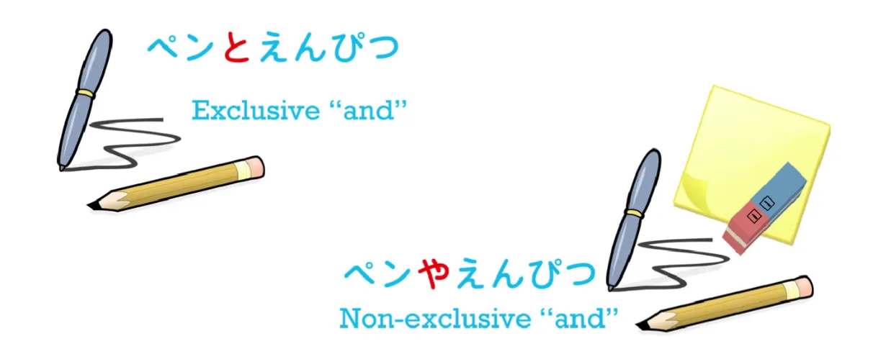

# **16. てみる, や particle, から particle, exclusive <code>and</code>**

[**Lesson 16: Te-miru, <code>try doing</code>, ya-particle, kara-particle, exclusive-<code>and</code> + more Alice**](https://www.youtube.com/watch?v=H_jePzcPFAQ&list=PLg9uYxuZf8x_A-vcqqyOFZu06WlhnypWj&index=18)

こんにちは。

Today we're going back to Alice, and we're going to be using quite a lot of trains this time because I want us to really grasp the structure of these sentences. So, if you remember from last time, Alice had just entered the rabbit hole and quite surprisingly she finds herself falling very slowly down a vertical hole.

> 落ちる間にひまがたっぷりあってまわりをゆっくり見まわせた

Now, I'm going to tell you what this means first and then we're going to break it down.

<code>落ちる間に</code>

<code>落ちる</code>, as we know, is <code>fall</code>. <code>間</code> is a period of time **and it's also the space between two things.** And obviously a period of time is always, metaphorically speaking - and we can only really talk about time in spatial metaphors - a period of time is always a space between two points, isn't it? It has a beginning and it has an end. So <code>落ちる間に</code> means <code>**while** (she) was falling / **during the period of time while** (she) was falling</code>.

---

<code>ひま</code> means <code>free time / open time</code>. It's a word you'll see quite often, and **it can be used in both a positive or a negative sense**. **It can mean free time to do what you want to do, or it can mean empty time, being bored, having time hanging on your hands.** Here it just means having plenty of time available to look around, because she's falling, she can't do anything else, and she's falling rather slowly.

---

<code>たっぷり</code> means <code>in large quantities</code>. **It's another one of these り-ending adverbs that don't need に.** And it means <code>in large quantities / in plentiful amounts</code> - rather like pouring from a tap: <code>たっぷり</code>, <code>in large quantities</code>. And **here it's an adverb describing the fact that the <code>ひま</code>, the <code>free time</code>, exists.** **So the free time exists in large quantities.**

So that's our first logical clause: <code>落ちる間に…</code> (**which simply sets the scene, the time, for the action - it's an absolute time expression because it's a particular time, so it takes に**) <code>...ひまがたっぷりあって</code> (<code>there was a lot of free time</code>).

---

Now, the next part - <code>まわりをゆっくり見まわせた</code> - is interesting because this is another example of what we were talking about last week: self-move/other-move pairs.

<code>回る</code> means to <code>go around/move around</code>. The rather childish name for a policeman is <code>おまわりさん</code>, which means <code>someone who goes around / someone who does the rounds</code>.

---

<code>回す</code> means <code>**make (something)** go around / **to send (something)** around / to cause it to go around</code> and of course, as we learned last week, we easily know which of the pair is the self-move word (going around) and which is **the other-move word** (sending around) because the sending-around one **ends in -す**.

---

Now, we don't actually have <code>回る</code> here; we have <code>まわり</code>. And as we've mentioned before, **when we take the い-stem of a verb and use it on its own it usually becomes a noun.** There is another use which we're not going to enter into right now, but in this case it is becoming a noun. So, what does <code>まわり</code> mean? <code>まわり</code> can actually mean two things: **it can be the noun-form of <code>回る</code>**, in which case it's <code>going around</code>, <code>doing the rounds</code>, and that's what we have in <code>おまわりさん</code>, a policeman - here's someone who does the act of doing the rounds, **<code>まわり</code> is <code>the act of doing the rounds</code>,**

---

**but it can also mean <code>the surroundings</code>**, and in this case it actually takes a different kanji to show that it's a slightly different meaning of the word. 
::: info
It’s this Kanji - 周り.
:::
**It's still the noun-form of <code>around</code>, but in this case it's the surroundings, not the act of going around.**

::: info
**The top right orange まわる should be まわす.** (Dolly-先生 admits [**in the comments**](https://www.youtube.com/watch?v=H_jePzcPFAQ&lc=UgzlHz19j_bcvzKlnGl4AaABAg.9CT4jGElSLJ9CTDDRs1sOu))
:::

So, <code> *(zeroが)*  まわりをゆっくり見まわせた</code> means <code>(she) could in a leisurely manner…</code>

(<code>ゆっくり</code>, that adverb we learned last week - *Lesson 14*)...

she could in a leisurely manner <code>見まわす</code>

What does <code>見まわす</code> mean? We know what <code>まわす</code> means - it means to <code>make (something) go around</code>. <code>**見**まわす</code> **is attaching <code>まわす</code> to the い-stem of <code>見る</code>.** We can't actually tell it's the い-stem, because this is an ichidan verb, and all ichidan stems look the same, as we know, **but we know that this is in fact the れんようけい/連用形, the い-stem, because that's the one that gets used for attaching verbs to other verbs.**

---

So, **<code>見まわす</code> means literally "send your looking around / send your eye-beams around the place / make your looking go around".** So, <code>まわりを見まわす</code> is <code>look around the place / send your eye-beams, send your looking around the place / *surroundings*</code>. And <code>**見まわせる**</code> is, as we've seen, the potential form of <code>**見まわす**</code>.

---

So what this is saying is <code>because a lot of time existed she was able to leisurely send her looking around the surroundings</code>.

***<code>落ちる間にひまがたっぷりあってまわりをゆっくり見まわせた</code>***

> まずは、下を見てみたけど、 暗すぎて何も見えなかった。

<code>First of all, she tried looking down, but it was too dark so nothing was visible (nothing could be seen).</code>

<code>まずは</code> means <code>first of all</code>. <code>まず</code> is <code>from the start / from the beginning</code>.

<code>まずは、下を 見てみた</code>.

Now, <code>下を見る</code> is <code>looking down / looking at the down</code>. **We know that in Japanese <code>down</code> is always a noun**, don't we? So you look <code>at the down</code> - <code>下を見る</code>. **But it doesn't say <code>見る</code> here; it says <code>見てみた</code>**. And this is a form of speech that we're going to find a great deal.

## -てみる / -て見る

**When we add <code>みる</code> to the て-form of another verb, what we're doing is saying <code>try doing something</code>; literally we're saying <code>do it and see</code>.** So, <code>食べみる</code> means <code>eat it **and see** / have a taste of it</code>.　

***A:*** <code>Do you like this?</code>　

***B:*** <code>I don't know.</code>　

***A:*** <code>食べみてください. Try it, taste it, eat it **and see**.</code>

We often say <code>やってみる</code> - <code>I'll give it a try / I'll try **and see** what happens</code>. **<code>やる</code> is a more casual form of <code>する</code>,** and **you can say <code>してみる</code>, especially in more formal circumstances,** **but more often we say <code>やってみる</code>**: <code>Give it a try / give it a go / do it and see.</code>

**So here we're actually using <code>見る</code> with <code>みる</code>. <code>見てみる</code>** - <code>try having a look / take a look / have a look and see</code>.

So, <code>下を見てみたけど、暗すぎて</code>. <code>暗い</code> is <code>dark</code> and <code>すぎる</code>, as we've talked about before, means <code>going by, going beyond</code>. **So in this case <code>すぎる</code> means <code>too much / going in excess of</code>.** In other words, it was **too** dark. It was **excessively** dark; it was **too** dark.

<code>暗すぎて何も見えなかった</code>. <code>何も</code> means <code>even as much as (something)</code> - <code>何も</code>. And [**I've done a video**](https://www.youtube.com/watch?v=00nKUtmnzvI) on these uses of も which you might want to watch. <code>何も見えなかった</code> - now, <code>見る</code> is <code>see</code>; <code>見える</code> is <code>to be able to see/*to be visible/be seen*</code>.

::: info
Might be better to translate as <code>to be visible/do see able/do seen</code> (self-move ver. of 見る)

I added this in case there would be confusion, since it is a rather nuanced difference and people were confused about this in the comments under [**the video**](https://www.youtube.com/watch?v=H_jePzcPFAQ&list=PLg9uYxuZf8x_A-vcqqyOFZu06WlhnypWj&index=22), let alone me during the first time.

What Cure Dolly says [**in the comments**](https://www.youtube.com/watch?v=H_jePzcPFAQ&lc=UgzYIfuuuSD1tlN7tr54AaABAg.9JDoZ9EQc-O9JDzxV8JLGd). I recommend reading through all comments about this.

In the video, Dolly-先生 misspeaks here (as she admits [**in the comments**](https://www.youtube.com/watch?v=H_jePzcPFAQ&lc=UgxS1dUK8UsQQcHxLKd4AaABAg.9KdTNWq3xuG9Kdu0Oxpim9)), calling 見える <code>be able to see</code>, which might confuse someone to think of the potential form 見られる instead.

---

In this case, she meant 見える as the self-move version of 見る, meaning something like <code>be visible/seeable</code> as physical visibility (of a thing etc.). It is a nuanced difference to 見られる.  
As Dolly says [**in the comments**](https://www.youtube.com/watch?v=H_jePzcPFAQ&lc=Ugz_8te5VO3ktLe0ZVR4AaABAg.96aHgVhcdAL96aMdVNs3c-), it CAN both function as a potential and self-move version of

見る. It’s a different verb to 見られる, but 見える can also function as the irregular potential form of 見る and is also the self-moving partner to 見る. **Check lesson 54 for this, even right after.**

Also, [**this point**](https://japanese.stackexchange.com/questions/43881/is-%E8%A6%8B%E3%81%88%E3%82%89%E3%82%8C%E3%82%8B-the-potential-form-of-%E8%A6%8B%E3%81%88%E3%82%8B) (if you check 見える inflections on Jisho), just like with 出来る note in Lesson 10.  
The point here is that while both imply potential, there is a difference, with <code>be able to see</code> translation being more reserved to the <code>見られる</code> instead of 見える, hence why this note.  
:::

And if we look at the trains here, **we've got to have a が marked subject in this second clause:** <code>何も **(zeroが)** 見えなかった</code>.

What is the zero in this case? If we're looking at it in English terms we might think it's Alice - <code>Alice couldn't see anything</code>. **But in Japanese it will usually in fact be <code>何</code>, which is <code>a thing / something</code>.** **<code>Nothing was able to be seen, nothing could be seen</code>,**

---

because usually with expressions like <code>**見える** / **見えない**</code>, <code>**聞こえる** / **聞こえない**</code>, <code>be able to see/*do seeable*</code> <code>be able to hear/*do hearable*</code> *(+ their ない-form not hearable etc.)*  
::: info
The <code>do seeable</code> is a rough translation of how Dolly might translate it to I guess show that it’s a verb more per some of her comments as noted on the previous page’s note.  
Another translation for 見える as per Dolly - to be visible/<code>do seen</code>/be seen/do seeable/visible.  
While -ない, as its negative form is quite adjectival ([**see this**](https://japanese.stackexchange.com/a/5092)). It doesn't really matter how it’s translated, only if you wanted to be more technical as per Dolly’s way of rough translation & to more clearly show the difference between 見られる & 見える. **Check lesson 54.**
:::

**- we apply it not to the person who's able to see, but to the thing that's able to be seen.** And of course we've covered this, haven't we, in our lesson on the potential. *(Lesson 10)*

<code>その後</code>: <code>後</code>, as we know, means <code>after</code> - we've had it in following after someone, **but it also means <code>after</code> in the other sense, <code>after that</code>.** <code>その</code> means <code>that</code>; **<code>その後</code> means <code>after that</code>.** So again, **this is just a time-expression, setting it in time.** And **this time it's a relative time-expression, <code>after that / after a particular thing</code>, so it doesn't need に.**

<code>その後、穴のまわりを見て</code> So now she's not looking down. This means <code>the surroundings</code>, again, <code>まわり/***周り***</code>, of the hole, <code>をみて</code> - <code>after that, she looked at the surroundings of the hole</code>.

---

> 目に止まるのはぎっしりならんだとだなや本だなだった.

Right, so this is quite complex. The first clause is simple enough. <code>その後、穴のまわり見て</code> - <code>After that, she looked at the surroundings of the hole</code>. The second clause has quite a lot for us to consider. <code>目に止まるのは</code> means literally <code>the thing that stopped in her eye</code>.

Now this is a similar expression to, in English, <code>the thing that caught her eye</code>, isn't it? Various things passed through her eye, passed through her vision, and the thing that stopped there was what we are going to talk about. But we also need to look at this use of の. As we've seen before, の is like apostrophe-s ('s) in English. So if we say <code>さくらのドレス</code>, we're saying, <code>Sakura's dress</code>.

Now also, just as in English, if you say, <code>Which dress do you like best?</code> Suppose that Sakura and Mary are both wearing dresses and you say, <code>Which dress do you like best?</code> In English you might say, <code>Sakura's. I like Sakura's best</code>. You could say, <code>Sakura's dress</code> but you don't have to, you can just say, <code>Sakura's</code>. **And it's the same in Japanese.** **You can say** *(just)* **, <code>さくらの</code> - Sakura's, the one that belongs to Sakura.** But this can be taken much further in Japanese, and [**I've done a whole video**](https://www.youtube.com/watch?v=Bq3GO63D9bw) about this particular use of の, which you can look at if you want to go deeper.

---

But in this case the way it's taken further is <code>目に止まるの</code> - this is <code>the thing, the one that stopped in her eye</code>. <code>Which dress do you like best? Sakura's, Sakura's one, Sakura's thing, Sakura's dress.</code> <code>目に止まるの</code> - <code>the thing, the one that stopped in her eye</code>. So, <code>穴のまわりを見て、目に止まるのは</code> - "looking at the surroundings of the hole, the thing that stopped in her eye was…" And what it was, was

<code> *(zeroが)*  ぎっしりならんだとだなや本だなだった</code>. **<code>ぎっしり</code> is yet another one of these り-ending adverbs that don't need に.** <code>ぎっしり</code> means <code>tightly packed</code>. <code>ならんだ</code> is the past tense of <code>ならぶ</code> which means <code>lined-up</code>, so <code>**ぎっしり ならんだ**</code> means <code>**tightly lined-up** / **packed together** / **lined-up and packed together**</code>. <code>ぎっしりならんだとだなや本だなだった</code>.

---

All right. Well, we'll get to the <code>や</code> in just a moment, but <code>とだなや本だな</code>. The word for a shelf in Japanese is <code>たな</code>, and when we add something before it to tell us what kind of a shelf it is, we use that <code>ten-ten hooking</code> *(〃)* that we've talked about before.  
::: info
Lesson 5, <code>The third & fourth Godan group</code>.
:::
So the <code>た</code> becomes <code>だ</code>: <code>とだな</code> - that <code>と</code> means <code>door</code>, so literally, <code>とだな</code> is a <code>door-shelf</code> and that is the Japanese word for a cupboard. And it's quite a good word, I think. That's what a cupboard really is, isn't it? Shelves, with a door. It's a better way of saying cupboard than the English way which says it's a board on which you put cups, which isn't quite what a cupboard is. <code>本だな</code> is even easier: it's quite literally a book-shelf, bookshelves.

## The や particle + exclusive <code>and</code>

Now, this <code>や</code> is something we need to cover. When you want to say <code>and</code> - something <code>and</code> something else - how do you say it in Japanese? We know that when you're putting two clauses together, we use the て-form, or sometimes we use other things, like <code>でも</code>. In English we use <code>and</code> in all cases: we say <code>bread and butter</code>, <code>pencil and paper</code>. We also say <code>I went into the baker's and bought some bread.</code> **But in Japanese we don't use the same <code>and</code> in the two cases.** We already know some of the ways we can <code>and</code> two clauses together, but when we're <code>anding</code> two things together, there are two ways to do it. And one is to use the と-particle. We know that the と-particle is the quotation particle, **but it's also the and-particle.** So if you want to say <code>pen and book</code>, we say <code>ペンと本</code>. **But we can also use the や-particle, so we can say <code>と</code> or <code>や</code> when we want to <code>and</code> together two or more objects.** What's the difference?

---

Well, as a matter of fact it's a very useful difference, and one that we could do with in English. **<code>と</code> is an exclusive <code>and</code>.** If I say, <code>What's in that box?</code> and you answer <code>ペンとえんぴつ</code> - <code>pens and pencils</code> - **you are telling me that there are pens and pencils and nothing else in that box.**

If you say <code>ペンやえんぴつ</code>, you're saying there are pens and pencils **and there might also be something else** - **and very often you're implying that there is something else because you're avoiding using the exclusive <code>and</code>.** So what <code>stopped in her eye</code> was the fact that cupboards and bookshelves **(among other things)** were tightly lined around the walls.

---

::: info
取り下ろした in the video has an extra ろ in its 下 furigana. Read <code>とりおろした</code> only.  
I fixed it here. To lower (something) can be written as 下す (おろす) or 下ろす(おろす).  
下す is the irregular okurigana usage version of 下ろす. Both are fine.*
:::

## The most basic use of the から particle

<code>たなの一つからびんを取り下した</code>

<code>たなの一つ</code>: <code>一つ</code> means <code>one</code>; **<code>から</code> is a particle meaning <code>from</code>.** Now, here she's using <code>たな</code> on its own - <code>shelves</code> - and because it's not joined to anything, it's <code>たな</code> not <code>だな</code>. And so she is saying <code>**from** one of the shelves</code>- <code>たなの一つから</code>, <code>from one of the shelves</code> - notice here that <code>たなの一つ</code> is really just the same as English <code>**one** of the shelves</code> - <code>たなの一つ</code>.

<code> *(zeroが)*  たなの一つからびんを取り下ろした.</code>

Now, <code>取る</code> means <code>take</code>, and <code>下す</code> - the kanji, as you can see, is the kanji for <code>down</code>, and again **this is part of a move-pair, self-move/other-move pair**,  
which is why I introduced them early.

::: info
The earlier furigana note also applies for 下りる, in the video there is a typo, it should only have お. I fixed it here. No 下る for (下りる) here though, it is not its irregular form.  
Then it would rather mean くだる (下る) or さがる (下る), in their irregular okurigana forms.
:::

Most courses would regard that as an intermediate thing, self-move and other-move, but I think it makes it much easier to recognize what words are doing if you're aware of this. <code>下りる</code> means <code>come down / step down</code> - come down the stairs, come off a bus. <code>下す/下ろす</code> means <code>bring *(something)* down</code>. And once again, **we know which is the other-move one** - you <code>bring (something else) down</code> - that's the one that ends in -す: <code>下す</code>. So <code>取り下ろす</code> means <code>take and bring down</code>.

<code> *(zeroが)*  たなの一つからびんを取り下ろした.</code> <code>From one of the shelves *(she)* **took down**...</code>

<code>びん</code> usually gets translated as <code>bottle</code>; in fact in this case it was more of a <code>jar</code>. What was in it? Well, we'll have to wait till next time to find out…

::: info
Again, I highly recommend going through all the comments under [**this video**](https://www.youtube.com/watch?v=H_jePzcPFAQ&list=PLg9uYxuZf8x_A-vcqqyOFZu06WlhnypWj&index=18) lesson, since some parts of it are further cleared up there by Dolly as this lesson is rather <code>intense</code> (；￣Д￣)
:::