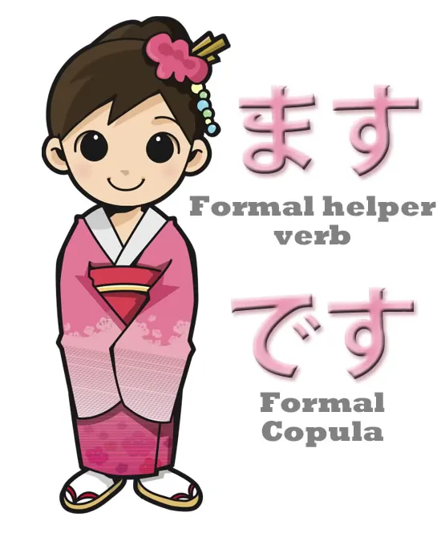
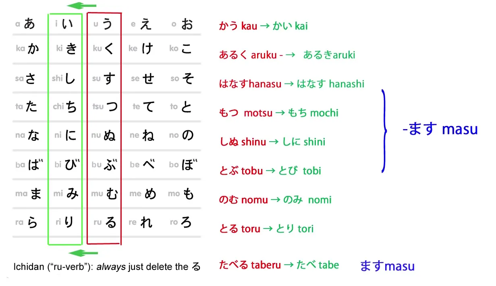
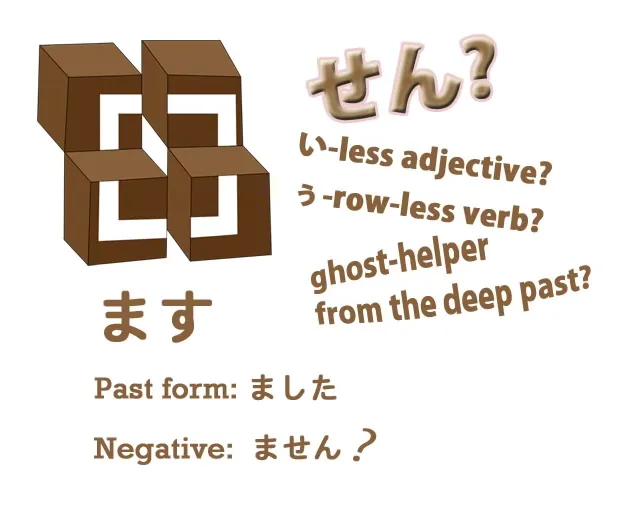
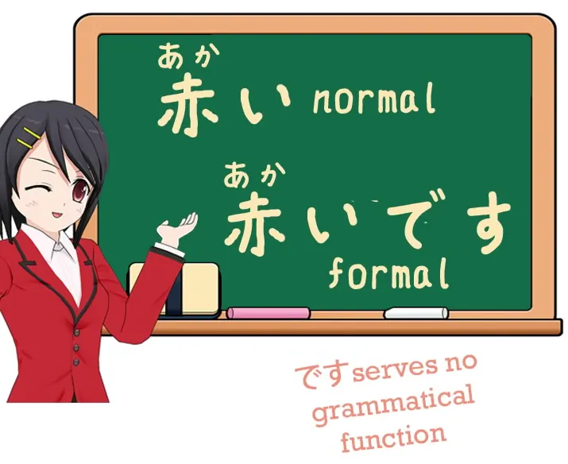
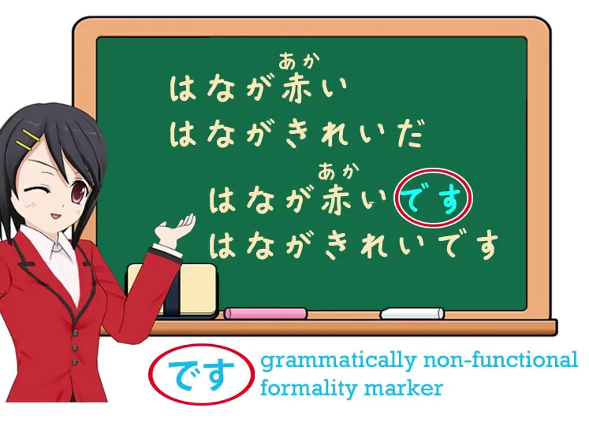
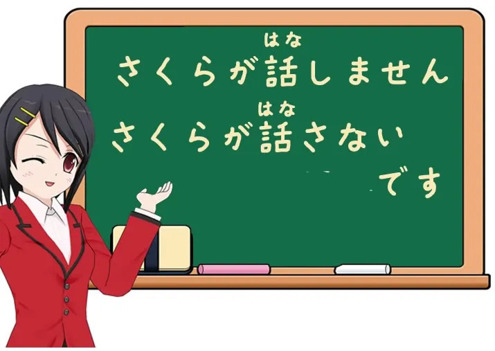
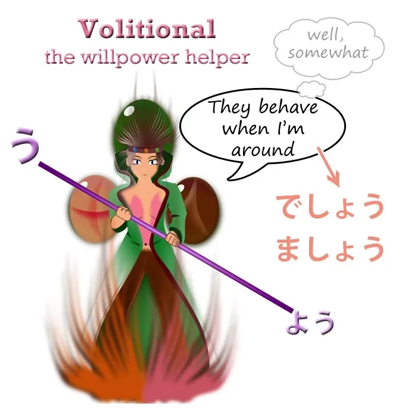
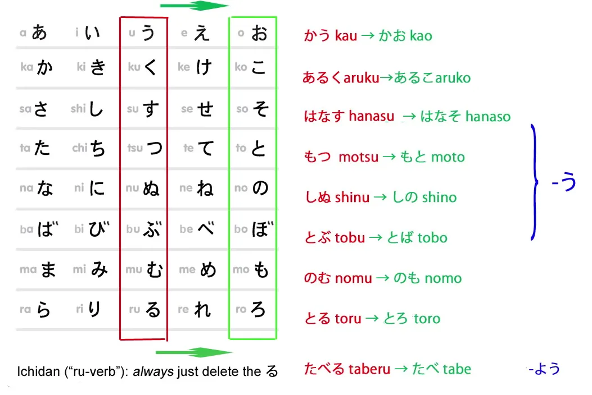
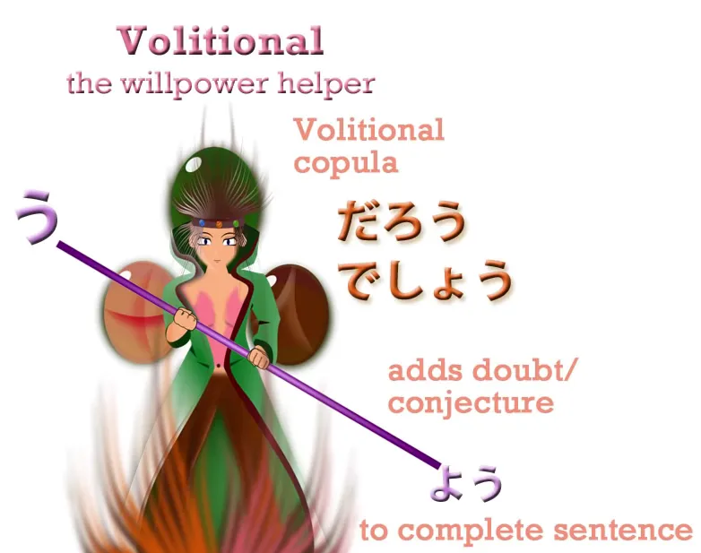
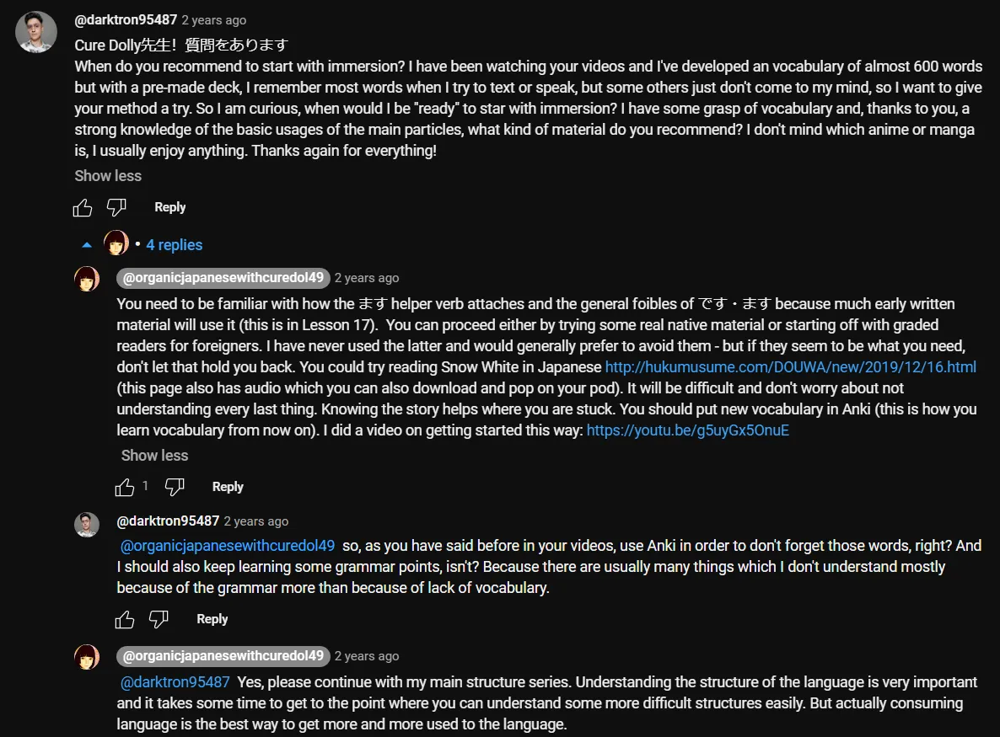

# **17. Polite Japanese and the volitional**

[**Lesson 17: How desu/masu RUINS your Japanese! + How to use it correctly. Plus the volitional**](https://www.youtube.com/watch?v=ymJWb31qWI8&list=PLg9uYxuZf8x_A-vcqqyOFZu06WlhnypWj&index=19)

こんにちは。

Today we're going to talk about **formal** *(polite)* Japanese: です/ます.

::: info
Whenever Dolly uses the term <code>formal</code> for です or ます, it should be POLITE instead, there is a difference between the two terms in Japanese, not sure why she did not bring this one up, but it is quite important to distinguish, if you look into their definitions, dictionaries mark them as polite.**
:::

***They are part of the 丁寧語 (polite language). So it is more accurate to call them polite instead.***

Some people may be surprised that we've gone for sixteen lessons without using this at all, when most courses use it from the very first lesson.

Now, there are good reasons why we haven't. **One reason is that です/ます form is actually quite eccentric**. **It does various things that most of the rest of Japanese doesn't do.** So if we learn this as the standard way to speak, we get all sorts of strange ideas about the way Japanese works. We could have started learning it a little earlier, but frankly there are more important priorities and it's a good idea to get real, standard Japanese firmly fixed in our minds before we enter the rather troubled area of です/ます. It isn't difficult once you have very firmly established standard Japanese structures in your mind, and we've done that now. **If you haven't done it yet, if you haven't followed this course, please go back to the first lesson right now.** Off you go. Right.

## ます

Now for the rest of you, let's start with <code>ます</code>. **<code>ます</code> is a verb.** **It's not part of a verb, it's a verb in itself.** It's a helper verb like lots of other helper verbs that we've looked at up to this point. **It attaches to our old friend the い-stem, and it doesn't change the meaning of the word it attaches to in any way.**

**It simply makes it formal.** So <code>歩く</code> becomes <code>歩きます</code>; <code>話す</code> becomes <code>話します</code>, and so forth. And **they're simply the formal way of saying <code>speak</code>, <code>walk</code>, etc.**

---

Now, another reason I didn't teach this earlier is because people say there are only two irregular verbs in Japanese – I've said this myself – **but the truth is that there is another one,** **and it's <code>ます</code>.** **And <code>ます</code> isn't irregular in the way that <code>くる</code> and <code>する</code> are irregular. It's much worse.** It does something that is done nowhere else in modern Japanese. Now **the good news is that the past tense is completely regular and normal.** It works the same way as any other す-ending verb: it's <code>ました</code>. But the negative is not <code>まさない</code>; **it's <code>ません</code>.**

### ません

And what kind of a word is <code>ません</code>? **It's really nothing that exists in modern Japanese at all.** The textbooks tell us that it's the negative form of the verb, but then they tell us that the verb is whatever <code>ます</code> is attached to, and they also tell us that <code>ない</code> is the negative form of a verb when it's nothing of the sort. It's a helper adjective. *(check Lesson 7)* We don't need to go into what <code>ません</code> actually is, structurally, because it doesn't happen anywhere else in modern Japanese, so we just learn it as a fact. **The negative of <code>ます</code> is <code>ません</code>.** 
::: info
The non-past form.
:::
And that's another reason I didn't teach it earlier, because there isn't much of this in Japanese: things that you just have to learn <code>as a fact</code>. If you know the principles behind things, generally speaking you can understand how everything works without a lot of memorization. **So when you start off learning that you just have to learn that the negative of <code>ます-verbs</code>, as they're called – in other words, the ます-helper verb – is <code>ません</code>, you start off with the idea that Japanese just does various random things like a European language.**

::: info
Which is a damaging mindset to get about Japanese, as we know, though some things are quite similar in a way, still it is best looking at Japanese as it is, not trying to force other language onto it outside of perhaps explaining some terminology (since we use English here) that is used if it is alright to do so.
:::

### ませんでした

Now, the negative past gets even stranger. **There isn't any past of -せん, the way -ない becomes -なかった,** so what do we do? **We just throw the past tense of <code>です</code> on to the end of <code>ません</code> and say <code>ませんでした</code>.** <code> *(zeroが)*  あるきませんでした</code> – <code>(I) **didn't** walk</code>. A lot of Japanese people who study Japanese grammar really dislike this, and I can't blame them. But it has, for better or worse, become standard Japanese grammar, so we just have to remember it. It's really only a couple of irregularities and they're not really difficult to remember just so long as we don't learn them at the beginning, where they confuse our whole understanding of Japanese.

---

If we learn <code>ます</code> as a so-called <code>conjugation</code> and we believe that that is the base-form of the verb, then to make other forms of verbs we find ourselves taking off the -ます and then changing the い-stem for a different kind of stem in order to do something else. Which would be complicated enough if we knew about stems but the textbooks don't tell us that either, so we've just got a lot of completely random European-style rules and regulations that make no sense at all.

## です

So let's move on to <code>です</code>. **<code>です</code>, as you know, is the formal version of <code>だ</code>**. **It's the copula. It works exactly like <code>だ</code>, so if you know <code>だ</code>, you know <code>です</code> already.**

Except that this also has a strange quirk, which is that if we take an adjective like <code>赤い</code> meaning <code>is red</code>, we put <code>です</code> on to the end of it in formal speech.

**It doesn't do anything; it just decorates the sentence and makes it formal.** Again, this is something you just have to learn and it's not very difficult to learn, but if you learn it at the beginning you get the impression that you need the copula with an adjective like <code>赤い</code> just as you need the copula with an adjectival noun like <code>綺麗/きれい</code>.

And of course the fact that they call adjectival nouns <code>な-adjectives</code> *(Lesson 6)* just makes it even more confusing. You think that adjectives take the copula and they don't. Real adjectives, い-adjectives, do not take the copula except that in the rather strange です/ます form, we pop <code>です</code> on the end just for decoration. Adjectival nouns, on the other hand, of course do take the copula because they're nouns – and all nouns take the copula. So we say <code>あかい</code> – <code>is red</code> / <code>綺麗だ</code> – <code>is pretty</code>; <code>赤いです</code> – <code>is red</code> **with a decoration**; <code>綺麗です</code> – <code>is pretty</code> **with the proper copula that it needs in the formal form.**

So as you see, formal Japanese is not really all that difficult. We have to learn a few rather strange facts, and it's not like most of the rest of Japanese which is terribly Lego-like and logical. It's got little quirky bits and pieces to it, but not many and so long as you've got real Japanese fixed firmly in your mind, adding on です/ます form is not particularly difficult.

A couple of other things worth knowing: one of the things is that as well as saying <code>ません</code>, **we can also say <code>ないです</code>.**

So we can say <code>さくらが話しません</code> – <code>Sakura doesn't talk</code>, or we can say <code>さくらが話さないです</code>. And that of course is perfectly logical and sensible, if any of it is, **because since we put <code>です</code> on to the end of adjectives in formal speech,** **we can also put it on to the end of the ない-helper adjective,** **which is really just another adjective.** **We don't make many changes to <code>ます</code> because it really is a sentence-ender; we put it right at the end of whatever else we're doing in order to add formality to the sentence.**

---

**However, we can use both <code>です</code> and <code>ます</code> with the volitional helper verb.**

And once again <code>ます</code> behaves eccentrically, because its お-stem is not, as you would expect, <code>まそ</code> **but <code>ましょう</code>.** **So the volitional form is <code>ましょう</code>.** Fortunately, this is only slightly eccentric and not difficult to manage. And also fortunately, **<code>です</code> forms a matching pair with <code>ます</code> in the volitional form and becomes <code>でしょう</code>.** And since we're raising the subject of the volitional, let's cover that too.

## The volitional

Its formation is very simple, and **it's one of the few things that we do with the お-stem of verbs**.

**The godan volitional helper,** like the potential helper – potential helper is just a single kana, る(-ru), and **the volitional helper is just the single kana う**(-u), **and we put it on to the end of the お-stem and it lengthens the お-sound.** So, <code>話す</code> becomes <code>話そう</code>, <code>歩く</code> becomes <code>歩こう</code> and so forth.

---

What does it mean? **Well, the name really tells you what it means. <code>Volition</code> means <code>will</code>, so the volitional expresses or invokes the will.** **The most usual use of it is setting the will of a group of people in a particular direction.** So we say, <code>行きましょう</code> *(as mentioned, ましょう is the volitional form of ます)*, <code>**Let's** go</code>. And some people call the たい-helper adjective volitional as well, **which is confusing because they aren't the same thing.**

---

**And the thing here to remember is that -たい expresses desire, want, wanting to do something.** **The volitional form expresses will. And will and desire aren't the same thing.** For example, **you may have a will to do your homework. It doesn't mean that you want to do your homework.** What you actually want is to play <code>Captain Toad</code>, but you set your will to doing your homework. And when we say things like <code>行こう</code>, <code>**let's** go</code>, for things that we might all want to do, <code>let's all have a picnic</code>, <code>let's have a party</code>, **but also** <code>let's tidy the room</code>, <code>let's do our homework.</code> **It's expressing will, not want.**

---

You'll very often see on Japanese signs things like, <code>ゴミを持ち帰りましょう</code> – <code>**let's** pick up our trash and take it home</code> – which always seems to me like quite a nice kind of exhortation, rather different from the Western signs that say, "Pick up your rubbish or we'll confiscate your car and dye your children purple".

---

Now, **there are a number of uses of the volitional along with particles like -か and -と**, but we're not going to go into them here, because I don't think that learning lists of usages is a good way to learn. We'll tackle these as we come to them, perhaps in the course of Alice's adventures. But one use of this form that is worth knowing because you'll see it pretty often is that **we use the volitional form of the copula, <code>だ</code> or <code>です</code> – <code>だ</code>, which isn't really a verb in the usual sense, the volitional is <code>だろう</code> ­– and if we add that to any other sentence it gives the meaning of <code>probably</code>.**

::: info
For です it is でしょう. Sometimes, you may see だろう called a volitional form of である instead of だ. From my research, it seems that である is just a more literary/older form of だ.  
Also do note that doubt/conjecture implication which だろう / でしょう gives to a sentence.
:::

<code>それは赤いでしょう */ だろう</code> – <code>That's **probably** red / **I think** it's red</code>; <code>さくらがくるでしょう */ だろう</code> – <code>**I think** Sakura's coming / Sakura's **probably** coming</code>.

::: info
Even though だろう is a volitional form of the だ copula, it actually seems like it can be used with adjectives normally, whereas regular だ copula cannot. It might be because it expresses <code>probably/think/guess</code> and not <code>is</code> that is part of the -い; or that it came from である?

*There also is だろ/でしょ, which are less formal versions. だろ seems to be only used by men.*

So now we know how to use the volitional and how to use formal Japanese.

:::