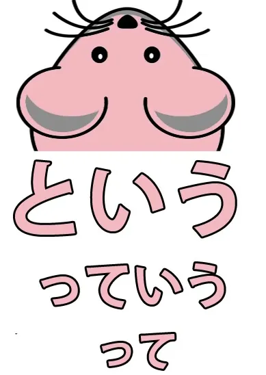

# **18. って = は?? Mysteries explained! -おうとする, とする, として, という, っていう**

[**Lesson 18: ってtte = はwa?? Mysteries explained! Toshite, toiu, to suru, ou to suru, tteiu**](https://www.youtube.com/watch?v=40avkmkQR8M&list=PLg9uYxuZf8x_A-vcqqyOFZu06WlhnypWj&index=20)

こんにちは。

Today we're going to talk about <code>trying to do something</code> and from there we're going to broaden out into the wider meanings of the <code>と</code> quotation particle because this is a very central part of Japanese that's used all the time. So we need to get a firm understanding of what it is and how it works. Now, last week *(Lesson 17)* we learned the volitional helper う and よう which makes a word end with the sound <code>おう</code> or <code>よう</code> and expresses will.

**If we're <code>trying</code> to do something we use the volitional for this.** So if we say, <code>山にのぼろうとする</code>, this means <code>**try to climb** mountain</code>. Why does it mean that? What's this construction actually doing?

Well, <code>のぼろう</code> **expresses the will to climb.**

If we say <code>山にのぼろう</code>, we're saying, <code>**Let's** climb the mountain</code>. Literally, **set our will toward climbing the mountain.**

## おうとする / とする

<code>のぼろうとする</code> **means doing the act implied by setting our will to climb the mountain.** If we just wanted to say <code>climb the mountain</code>, we'd just say, <code>山にのぼる</code>. But we're not saying <code>climb the mountain</code>, we're saying <code>**try to** climb the mountain</code>. **Therefore, do the action implied in setting our will / enact our will to climb the mountain,** **whether we succeed in actually climbing it or not.**

Some people find the distinction between <code>try climbing</code> and <code>try to climb</code> confusing. And that's really only because of the way it's expressed in English.

**In Japanese**, as we learned recently *(Lesson 16)*, **if we want to say,** <code>**try** climbing the mountain</code>, we say, <code>山にのぼってみる</code>. **The difference is that <code>try climbing / try eating / try swimming</code> doesn't imply any doubt about the fact that we can actually do it.** **It implies doubt about what would be the result when we've done it.**

---

**<code>Try eating</code> - we know we can eat, but don't know if we'll like it.** <code>Try eating</code> - <code>食べてみる</code> - means <code>eat and see</code>. Eat it and then see what the result is, see if you like it, see if you don't like it.

---

<code>山にのぼってみる</code> means <code>climb the mountain and see</code>. See whether it was hard, see what the view's like from the top.

---

<code>ケーキを食べようとする</code> - <code>**try to eat** the cake</code> - implies that we don't know whether you can in fact eat the cake or not, but try it anyway. Maybe it's a huge cake and it would be very hard to eat it all. So <code>してみる</code> - <code>do and see</code> - **implies that there's no doubt about the fact that we can do it, but there is some doubt about what the result of having done it is going to be.** Are we going to like it? Is the building going to fall down? We don't know what will happen when we've done it, but we know we can do it. **<code>しようとする</code> implies that we don't know whether we can do it or not,** **but we are going to try to do it.**

---

So, an important thing here is to see what the と-particle is doing. **-と is encapsulating the sentence that came before it:** <code>山にのぼろう</code> - will to climb the mountain. **It isn't quoting it.** It's not something we've said; it's not something we've thought, exactly. **The point is that it's taking the essence, the meaning, the import of that <code>山にのぼろう</code> and putting it into action.** And we're going to find that in other cases.

For example, we may read that someone <code>ホッとした</code> . Now, what does that mean? <code>ホッ</code> is in fact a sound effect. It's the sound effect of breathing a sigh of relief: <code>ホッ</code>. **But <code>ホッとする</code> actually does not mean <code>breathe a sigh of relief</code>.** What it means is, **<code>feel relief / be relieved</code>**.

---

**So what we're doing here is enacting the idea, the feeling, expressed in <code>ホッ</code>, the sigh of relief.** **Just as in <code>山にのぼろうとする</code> we're enacting the feeling,** **the import of setting our will toward climbing the mountain, that is, trying to climb it.**

### とする & にする

Now, similarly, if we say <code>さくらを日本人とする</code>, it means **regarding Sakura as a Japanese person.**

Now, we might also say, <code>さくらを日本人にする</code>, but that means something quite different. It means <code>**turn Sakura into a Japanese person**</code>. **に is the target of an action.**

---

A little while ago we had a lesson *(Lesson 8)* in which we talked about <code>さくらがかえるになる</code> - <code>Sakura **becomes a frog**</code>.

Now, we've also talked about *(Lesson 15)* the way that <code>ある</code> and <code>する</code> are the Eve and Adam of Japanese verbs,

<code>ある</code> being the primary self-move verb and <code>する</code> the primary other-move verb. **<code>なる</code> is very closely related to <code>ある</code> - <code>ある</code> is <code>be</code>, <code>なる</code> is <code>become</code>.** And **so if we say <code>になる</code> it means to become something.** **If we say <code>にする</code> that's the other-move version of <code>になる</code>.** It means to <code>turn something into something</code>. So if we say, <code>まじょがさくらをカエルにした</code> - <code>the witch **turned** Sakura **into a frog**</code>.

::: info
カエル is just another way to write frog, via katakana. Animals are usually written that way.  
:::

<code>さくらを日本人にする</code> - **turning** Sakura **into a Japanese person**; but <code>さくらを日本人とする</code> - **regarding** Sakura **as a Japanese person** / **taking** Sakura **as a Japanese person.**

<code>かばんをまくらとする.</code>

<code>かばん</code> is <code>bag</code>, <code>まくら</code> is <code>pillow</code> and this means <code>using your bag as a pillow</code>. **You're not turning your bag into a pillow, it's not becoming a pillow,** **but you're regarding it as one and using it as one.** So here we have some of the uses of <code>-とする</code>. **Generally speaking, it relates to how we regard something.**

## として

Now, **if we say <code>-として</code>, this isn't so much the act of regarding something as something,** **but seeing something in the light of being something.** So, in English it would usually be translated simply as <code>as</code> or <code>for</code>. Or <code>being in the role of</code>

So, <code>こじんとして の いけん</code> means <code>my opinion **as** a private person</code>, as opposed to, say, <code>my opinion **as** president of the Frog Jockey Society.</code> *- just another example sentence (contrast in words <code>private person</code> & <code>president</code>), not some difference in the function of として. The wording may delude to Dolly meaning it as if it was として that had an opposing role there.*

Or we could say, <code>アメリカ人として小さい</code> - "She's small **for** an American / **As** an American, she's small. So we can see that **the quotation function of -と is used not only to quote ideas and thoughts, but also to take the feeling of something and bundle it up and then say something about it.**

::: info
just in case, this comment may help some in regards to とする & として.

:::

## という / と言う

Of course, **the most basic thing that can follow -と is <code>いう</code>,** **in which case it's a literal quotation,** **-という/と言う** (it's usually pronounced not so much <code>-という</code> but as <code>-とゆ</code>). And **this again can be used not just in a literal quotation but also saying how something is said or what it's called.** So, <code>ふしぎの国のアリスという本</code>, means <code>book **called** ふしぎの国のアリス</code>

### っていう / って言う

**And the -と in <code>-という</code> can be reduced simply to -って.** So we can say <code>-っていう</code> - <code>ふしぎの国のアリスっていう本</code>, **or it can be reduced down to just -って.**

<code>ふしぎの国のアリスって本</code> still means <code>The book **called** Alice in Wonderland</code>. So people sometimes get a little confused when they just see this -って. **It means -と or -という**, but the thing that really confuses people sometimes is that **it can also be used in place of the は-particle.**

### って used in place of は

Now, this seems particularly strange, until you realize what it's actually doing. If we remember what the は-particle is, the は-particle is the topic-marking particle. So when we say <code>さくらは *(zeroが)* 日本人だ</code>, we can put that into English as <code>**Speaking of** Sakura, (she) is Japanese person</code>. Now, does that start to make things a little clearer?

<code>さくらって(zeroが)日本人だ</code> - <code>Sakura -say</code>, (she) Japanese-person is<code> - </code>Sakura -speaking of<code>, (she) Japanese-person is</code> - <code>Sakura **(topic)**, (she) Japanese-person is</code>. Now, **we can't say -と or -という in place of the は-particle.** **It's a very casual use.** **We just use -って.** But you can see that it's really, **even though it's very colloquial**, it's not just some random and inexplicable thing. **It's setting up Sakura as the thing we're talking about, just as は is.**

Now, there are other extended uses of -と. We'll cover those as we come to them.