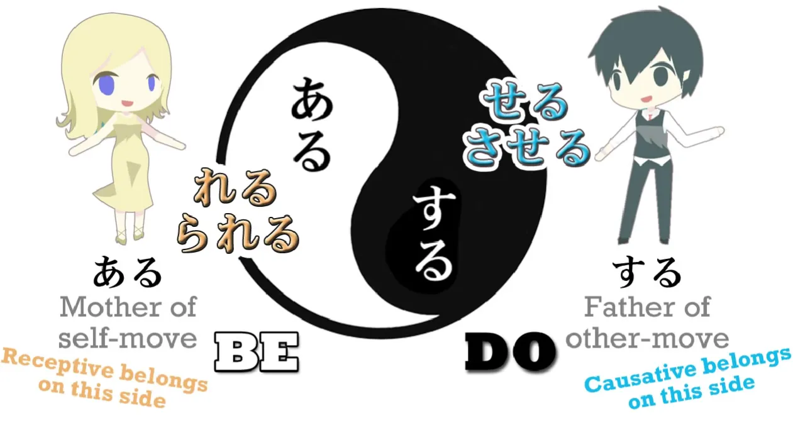

# **19. Causative + causative receptive**

[**Lesson 19: Causative + <code>causative passive</code>: what they NEVER tell you! It's logical and super easy**](https://www.youtube.com/watch?v=LCvGHWbhDKw&list=PLg9uYxuZf8x_A-vcqqyOFZu06WlhnypWj&index=38)

こんにちは。  
Today we are going to talk about the causative helper verb. In the standard grammars this is called <code>causative</code> and it's a perfectly good name because **it indicates that we are causing someone to do the verb to which it is attached.** In the standard grammars **it's often taught along with the receptive** (which they like to call the <code>passive</code>) and there's a very very good reason for doing this although the real reason is never actually explained in the regular textbooks. So, I'll be telling you that shortly. But first of all let's look at what the causative helper verb is.

It's a helper verb which, like the receptive, goes onto the end of the あ-stem of another verb, and while the receptive helper is <code>れる/られる</code>, **the causative helper is <code>せる/させる</code>.**

If they sound rather close to each other, there's a good reason for that. As we have noted earlier, the Eve and Adam of Japanese verbs are <code>ある</code> and <code>する</code> – <code>be</code> and <code>do</code>. <code>ある</code> is the mother of all self-move verbs; <code>する</code> is the father of all other-move verbs. Now, **the receptive <code>れる/られる</code> is closely related to <code>ある</code>;** **the causative <code>せる/させる</code> is closely related to <code>する</code>.**

And while it's not exact to say that they are the self-move and other-move versions of each other, we can see that they are very closely related conceptually to that.

---

**<code>れる/られる</code> indicates receiving the action to which it is attached.** **<code>せる/させる</code> means causing that action to be performed by somebody else.** And this leads on to the most fundamental similarity between the two pairs of helper verbs – the similarity that the textbooks never explain and that is most fundamental to understanding how they work. Why don't the textbooks explain it? Well, the fundamental reason is that they call the causative and the receptive helper verbs <code>conjugations</code>. And the real structure of how they work is completely destroyed and obscured by calling them <code>conjugations</code>. **A conjugated verb is by definition a single verb.** **But a verb plus the receptive or the causative helper is never a single verb.** **It's two verbs.**

**Not only is it two verbs, but the two verbs always have two separate subjects.** So in a sentence like <code>**水が**犬に飲まれた</code> – <code>**the water** **got** drunk by the dog</code> – we have **two verbs, two actions, and two different actors doing the two different verbs.**

**The main verb of the sentence, the core verb, is <code>れる</code> – <code>get</code>** – and **that's being done by the water: the water is getting** drunk by the dog. **The secondary verb is <code>drink</code> and that's being done by the dog.** This becomes clearer in a slightly longer sentence: <code>**さくらが**だれかにかばんをぬすまれた</code> – <code>**Sakura** **got** her bag stolen by someone</code>.

Again, **there are two actions going on, and always in a receptive sentence the main action, the core action of the sentence, is <code>れる</code> – <code>receive</code>: <code>Sakura received</code>.**

---

But there is a nested action within this done by the secondary verb, <code>ぬすむ</code> – <code>steal</code>. And that's done by <code>someone</code>. Now, it's exactly the same with the causative. **We always have two actors performing the two different verbs.** So if we say, <code> *(zeroが)* 犬を食べさせた</code>, which means <code>**I caused** the dog to eat</code>, there are **two actions going on.**

There is the action of eating, which is being done by the dog, **and then there is the main action, the core action of the sentence, the action of causing, which is done by me.** So as you see, we cannot possibly talk about a conjugated verb in the case of either the receptive or the causative helper. **In each case, there are two separate verbs.** **Even though they're joined together, they not only remain separate in function but they refer to two different actors.**

Now let's also take a moment to understand what <code>せる/させる</code> actually means.

We're told that in English it can mean either <code>make</code> someone do something or <code>allow</code> someone to do something. And that's correct: it can have either of those meanings. **But the important thing to understand is that it can have either of those meanings but it can also have neither of those meanings.** **The best way to translate it is with the very un-English sounding <code>cause</code> someone to do something.** Why? Because we can mean that we're forcing them to do something, we can mean that we are allowing them to do something, but we can also mean something that isn't covered by either of those English translations. An example? Well, you've already had one: <code> *(zeroが)* 犬を食べさせた</code>

It doesn't mean <code>I forced the dog to eat</code>, does it? But it also doesn't mean <code>I allowed the dog to eat</code>. **It doesn't mean that I gave the dog permission to eat or I took it off its chain so it could reach the food.** That's not what it means. **It means that I set up the conditions under which it was able to eat; I gave it food; I caused it to eat.**

---

**So <code>せる/させる</code> means <code>cause</code> a person or a thing to perform an action by whatever means, whether that causing is allowing, whether it's compelling or whether it's setting up the conditions to make it happen.**

Now, the only thing that can appear to be a little confusing about the causative is that **sometimes the person or thing that we are causing to do something can be marked by を and sometimes by に.** Now, I've told you before that Japanese particles do not change their function at random, as the textbooks strongly imply and sometimes openly state that they do – and as we have to believe if we think that <code>コーヒーが好きだ</code> *(Coffee pleasing is)* literally means <code>I like coffee</code>. And if you don't know what I'm talking about here, please watch the relevant video *(Lesson 9)*, because this is absolutely crucial to understanding Japanese correctly. So how is it that two different logical particles can apply to the thing or person we are causing to do something?

That is to say, the noun associated with <code>せる/させる</code>. **First of all, we have to understand that this thing can be seen as either the object or the target of the action (<code>せる/させる</code>) of the person or thing that is doing the causing.** If we take that object or target to be human, it becomes a little clearer. **If we treat the person as the object, we are assuming that they have no personal will in the matter; we are treating them literally as an object.** So this is more appropriate when we are compelling someone to do something; **if we treat them as a target, the implication is more mutual, we are treating them more as an equal and this goes more naturally with allowing rather than compelling.** And I've talked about these degrees of mutuality between the particles を, に and と when dealing with people [**in a video which you may want to watch.**](https://www.youtube.com/watch?v=gVqs4TzqySw)

However, the choice between に and を is not the main, or an exact, indicator of whether we mean allowing or compelling when we use <code>せる/させる</code>. Why not? There are two reasons for this. The first, as we've already mentioned, is that saying that <code>せる/させる</code> either means <code>compel</code> or <code>allow</code> is warping the meaning of the causative by trying to find exact English analogies, and there is no precise English analogy. On many occasions, as I demonstrated, it may mean neither <code>compel</code> nor <code>allow</code>. It's a sliding scale between the two; it's subtler and more graduated than that.

---

Secondly, when the action that is being compelled itself has a を-marked object – for example, <code> *(zeroが)* 犬に肉を食べさせた</code> – <code>(I) caused the dog to eat meat</code>.

You can see the implied, subordinate sentence here is <code>犬が肉を食べた</code>. The meat is the object of the dog's action, and **the dog is the thing I am causing to do that action.** Now, **in these kinds of sentences**, Japanese does not allow us to use the を-particle twice. Since there is an を-particle attached to the meat which is being eaten by the dog – in other words, **that's the object of the inner, subordinate sentence** – **we can't also use it on the dog itself who is the object or target of the causing.** Why is that? Well, really this is partly stylistic, but largely a pragmatic strategy on the part of Japanese grammar. Not only does it sound awkward if you have two をs in the sentence, it could, in some sentences, become ambiguous. We might end up with some doubt as to which を marked the object associated with <code>食べる</code> (or whatever the verb is) and which を is associated with <code>せる/させる</code>, the causing of the action. As it is, we always know that **in a <code>せる/させる</code> sentence**, a causative sentence, which also has an object of the action itself, **that object will always be marked by を,** **and the target or object of the causation**, the thing be made to do something or allowed to do something or facilitated in doing something, **will be marked by に.**

Well, that I think is the most complicated aspect of the whole thing, and it's not really very difficult, is it? Now, the other thing that people do find particularly difficult is the causative receptive (what is called the <code>causative passive</code> and, when taught with the standard grammatical model, causes people to receive a great deal of confusion)

## Causative receptive / causative passive

Now, as a matter of fact, once we have understood what the causative and the receptive really are and really do, I don't think there's anything special about the causative receptive at all. We know that helper verbs are simply verbs. They attach to other verbs, but they are verbs in their own right. If we don't understand this, everything becomes very difficult. Now also, the main structural helper verbs, like the causative, the potential and the receptive, are ichidan verbs. So if we need to attach anything else to them, we simply do what we do with every other ichidan verb – we take off the -る and attach whatever it is we're going to attach. So **if we want to attach the receptive to the causative, we simply take the -る off the causative, <code>せる</code> or <code>させる</code>, and attach <code>られる</code>**, which is the ichidan helper form of the receptive.

And it's as simple as that. Nothing complicated about it at all. But somebody's going to say, quite rightly, <code>But don't we have three verbs in the sentence now?</code> and that's exactly right. **We have three verbs in a causative receptive sentence.** For example, <code>私はブロコリを食べさせられた</code> – <code>I **got made to eat** broccoli</code>. So we have three verbs: <code>食べる</code> – <code>eat</code>; <code>させる</code> – <code>compel</code> (in this case it will be <code>compel</code>); <code>られる</code> – <code>receive</code>: <code>I received being compelled to eat broccoli</code>. So, if we have three verbs, do we have three subjects? No, **we have two subjects.**

::: info
In the video, the red <code>Secondary action: verb</code> has a typo <code>さらる</code>. Jisho, Yomichan with 27 dictionaries…nor anything else…do not even know that <code>さらる</code>. I fixed it.
:::

**And is it difficult to understand what the two subjects are going to be? No, it isn't, because the person receiving and the person eating are always going to be the same.** <code>I received being made to eat...</code> – **I was the one that received being made to eat,** **and therefore, I must have been also the one that ate.**

---

So **the first verb in the sentence, the verb to which the other two are attached,** **is always going to be performed by the same person as the last verb, the receiving.** **And the compelling of the person to do something is always done by someone else.**

---

So **we have three verbs**, **two** of which **are attached to the person who received the compulsion and who did the action because she received the compulsion.** **And the middle one belongs to the person who did the compulsion.**

::: info
If anything, take a look into [**the comments**](https://www.youtube.com/watch?v=LCvGHWbhDKw&list=PLg9uYxuZf8x_A-vcqqyOFZu06WlhnypWj&index=38), as usual.
:::