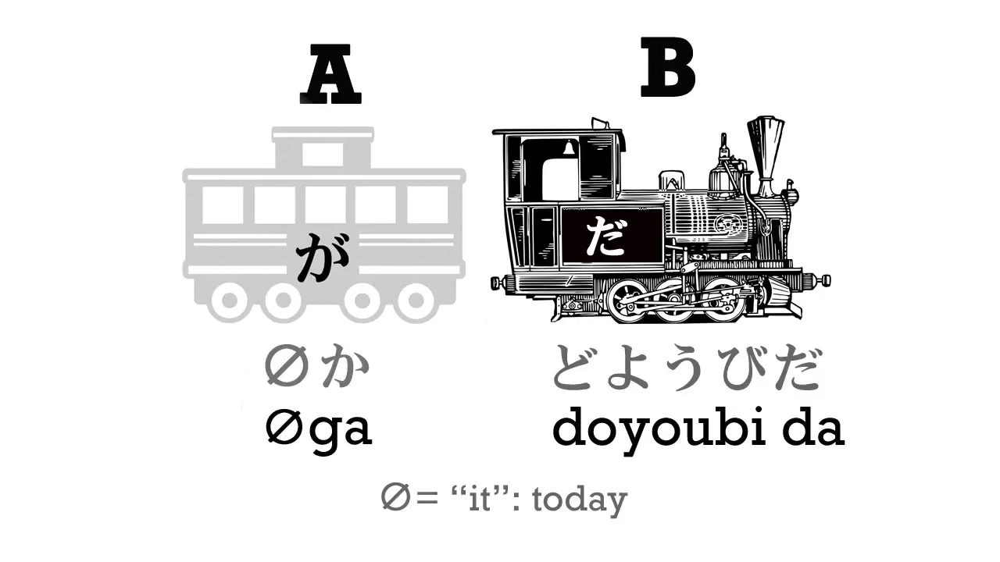
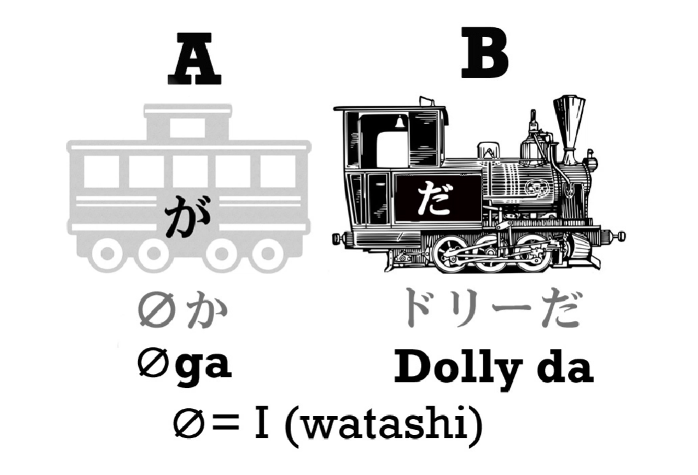
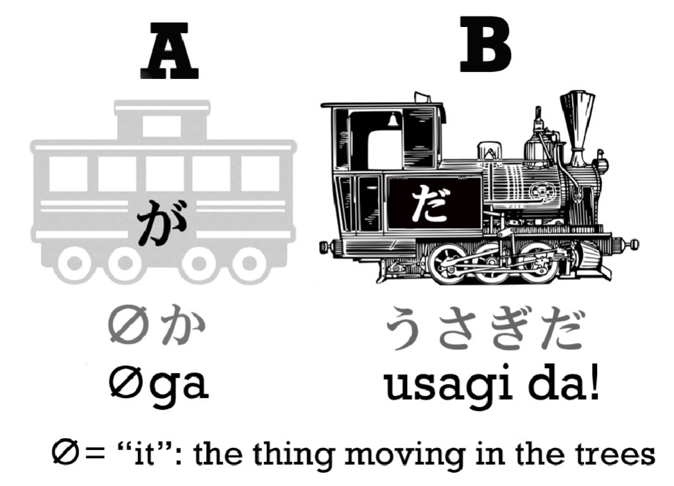
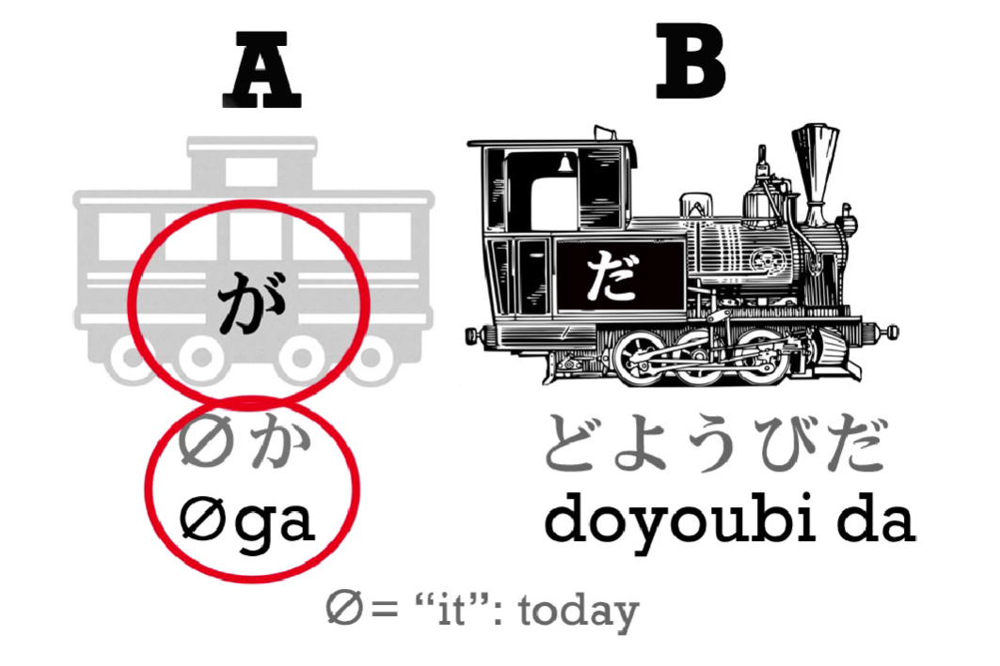
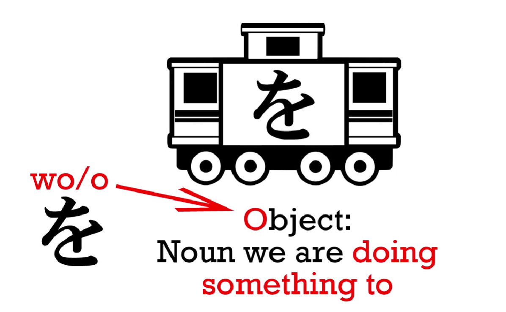
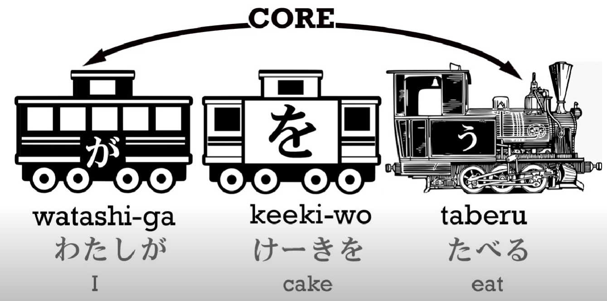
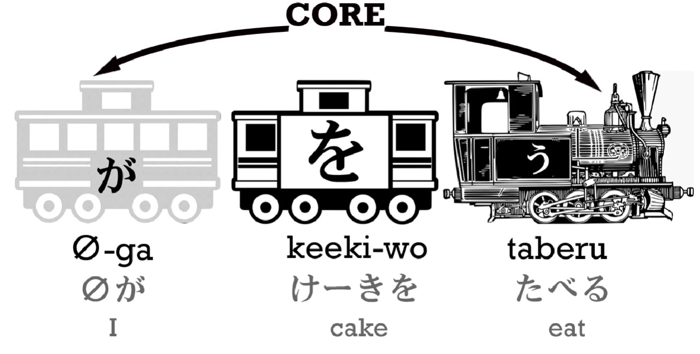

# **2. The Invisible Carriage and the を Particle**

[**Lesson 2: Core Secrets. Japanese made easy - unlocking the <code>code</code>. Learn Japanese from scratch**](https://www.youtube.com/watch?v=P3n8n0u3LHA&list=PLg9uYxuZf8x_A-vcqqyOFZu06WlhnypWj&index=2&ab_channel=OrganicJapanesewithCureDolly)

## The Invisible Carriage

In the last lesson, we learned that every Japanese sentence has the same core: the main carriage and the engine, also known as A and B, also known as the thing we are talking about and the thing we are saying about it. And I told you that we can have a lot more carriages as sentences become more complex, but they still always have the same core.

Now we are going to look at some of those extra carriages. Previously, I stated that while every sentence has the same two core elements, you can't always see both of them. You can always see the engine, but sometimes you can't see the main carriage. Why not? **When you can't see the main carriage, it's been replaced by the invisible carriage.**

So, what is the invisible carriage? In English, the closest equivalent is <code>it</code>.

Let's begin by seeing what <code>it</code> does in English. Let's look at this example:

> The ball rolled down the hill.
>
> When the ball got to the bottom, the ball hit a sharp stone.
>
> The ball was punctured and all the air came out of the ball.

Now, would anybody ever say this? Of course they wouldn't, because once we have established what we are talking about, we replace it with <code>it</code>. Instead we say,

> The ball rolled down the hill.
>
> When it got to the bottom, it hit a sharp stone.
>
> It was punctured and all the air came out of it.

<code>It</code> means nothing because it can mean absolutely anything. If I say <code>it</code>, I may be talking about a flower or about the sky. I may be talking about a tree, or my finger, or the Eiffel Tower or the Andromeda galaxy. <code>It</code> in itself doesn't mean anything: **you know what <code>it</code> is from context.**

Now, let's suppose a small child tries to say this and says,

> Ball rolled down hill,
>
> got to bottom, hit sharp stone,
>
> got punctured, all the air came out.

Now, is that difficult to understand? No, it isn't difficult at all, is it? Because in fact we don't need to use <code>it</code> every time, over and over again, to understand what's being said. While English grammar demands we do, but there's no actual communicative need to include <code>it</code> everytime.

Japanese doesn't have <code>it</code>. *(I guess what is meant is in the substituting sense as above)*

So, if a small child, or even an adult, comes down to the kitchen at night and someone sees her, she might say, <code>Got really hungry. Came for something to eat.</code> Again, there's nothing confusing or difficult about this. She means, <code>I got really hungry. I came down for something to eat.</code>

**In English this isn't a proper sentence, but in Japanese it is. All those little pronouns, like <code>it</code>, <code>she</code>, <code>he</code>, <code>I</code>, <code>they</code>, in Japanese can be replaced by the invisible carriage, the zero pronoun. But the important thing to remember is that they are still there.**

So let's look at this at work in Japanese. I might say, <code>ドリーだ</code>, and that means <code>I am Dolly</code>. Initially this looks as if it only has an engine and no main carriage, but actually the main carriage is simply the invisible carriage. The full sentence is really, <code>(**zeroが**)ドリーだ</code>.

We can say that <code>I</code> is the default value of the zero pronoun, the invisible carriage. However, the context can define it as anything. For example, if we hear a rustling in the woods and look over in the direction of it, and I say, <code>ウサギだ!</code>, that means <code>(**zeroが**)ウサギだ!</code> <code>It is a rabbit!</code> It, that thing we just looked toward, rustling in the trees, that's a rabbit.

If I say, <code>土曜日だ</code> (土曜日/どようび means Saturday), I'm saying <code>(It) is Saturday</code>. What's <code>it</code>? Today is. All these sentences are full, complete Japanese sentences, with a が-marked subject/ A carriage/main carriage, and an engine.

## The を particle

I'm going to introduce you to one more kind of carriage and that is an を car. This means a noun marked by the particle を, pronounced <code>o</code>. And if you know the English grammatical term <code>object</code>, which means the thing we're doing something to, it's a good mnemonic to remember that <code>o</code> stands for <code>object</code>.

So the を car looks like this, and as you see, it's white. It's white because it's not part of the core train. **The core train always consists of just two elements, the engine and the main carriage.** When we see white cars, we know that they're telling us something more about the engine or about the main carriage.

So let's take a sentence here: <code>わたしがケーキを食べる</code>. This means <code>I eat cake</code>.

Now, the core sentence here is <code>I eat</code>. Those are the two black carriages. The white carriage, <code>ケーキを</code>, is telling us more about the engine. The core sentence is <code>I eat</code> and <code>ケーキを</code> is telling us what it is that I eat.

Now, the interesting thing here is that we may often see this said like this: <code>ケーキをたべる</code>. And you already know what's going on when this happens. This is another case where we have the invisible A car.

**We can't have a sentence without a が. We can't have an action being done without a doer.** If we say <code>ケーキをたべる</code>, what we're really saying is <code>(zeroが)ケーキをたべる</code>. And the default value for <code>zero</code>, for the invisible carriage, is <code>わたし</code>. So usually this is going to be <code>I eat cake</code>, although if you were talking about someone else at the time, it might mean that that person eats cake.

::: info
Just in case - as can be seen from from the pictures, every particle attaches to/assigns itself to the word BEFORE it, Not after it.
:::