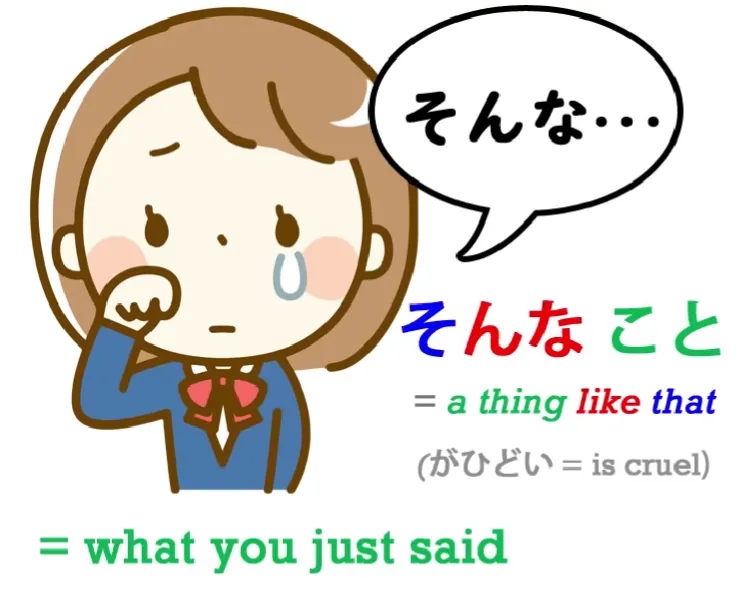

# **20. Directionals: それ・その・そんな・そう etc.**

[**Lesson 20: <code>Sore/Sono/Sonna/Sou</code> etc. how directional words REALLY work!"**](https://www.youtube.com/watch?v=xLkY6whr7T4&list=PLg9uYxuZf8x_A-vcqqyOFZu06WlhnypWj&index=31&ab_channel=OrganicJapanesewithCureDolly)

こんにちは。

Today we're going to talk about the Japanese system of directional words which use こ-, そ-, あ-, ど-.

This is commonly called the こ-そ-あ-ど system and initially it simply marks physical locations, but it then expands out to more subtle and metaphorical uses. This is common because all languages use physical metaphors to express abstract concepts. And fortunately these means of expression are often similar across languages because the conceptual world maps to the physical world in certain quite predictable ways. So let's take the most basic meaning and use of こ-そ-あ-ど, and that is actual physical locations.

## ここ, そこ, あそこ, どこ

**The most basic location use is <code>ここ</code>, <code>そこ</code>, <code>あそこ</code>, <code>どこ</code>.**

<code>ここ</code> means <code>here</code>. If you know the Japanese word <code>こころ/心</code> - <code>heart</code> - it's here, right where I am, right where my heart is. That's not the etymology of the word, but it's a mnemonic. <code>そこ</code> means <code>there</code>. Now, **often <code>ここ</code> means the speaker's place and <code>そこ</code> means the place of the listener.** **<code>あそこ</code> means <code>over there</code> and it often means distant from both the speaker and the listener.** So the あ word means over there, somewhat in the distance, so it's a bit far away, you have to aaaah - shout - to be heard over there. **<code>どこ</code> means <code>where</code>, so that's a question word.** So, **こ words mean here**, possibly near to me, the **そ words mean there**, often near to you, the **あ words mean over there**, and **the ど words form a question**. So, in anime or manga you'll often see someone saying, <code>ここはどこ?</code> - <code>Where is this?</code> Literally, <code>**Speaking of this place, where (is it)?**</code> And that seems to be the most usual way for a Japanese person to ask that question finding herself suddenly in an unknown location. The English way of asking it is more likely to be ---- <code>Where am I?</code> but **the Japanese way is <code>Where is this place?</code>** <code>ここはどこ?</code> - <code>As for this place, where?</code>

Now, that's quite simple, I think. And now we're going to look at something that does occasionally confuse people, and that's because when we come to the れ- and the の-group, in English we express both with the same word. But we do have the distinction, so let's look at those.

## これ, それ, あれ, どれ

**The れ-group is <code>これ</code>, <code>それ</code>, <code>あれ</code>, <code>どれ</code>.** **And the thing here is that the -れ means <code>a thing</code>.** こ- means a place, a location, and it can actually be written with the kanji for <code>所</code> - <code>place</code>. **-れ is related to <code>ある</code>.**

It's one of these things that's related to the fundamental <code>ある</code>, the mother of verbs. And <code>ある</code> means to <code>be</code>; **this -れ means <code>a being</code>.** When we say <code>a being</code> in English we usually mean a sentient being, an animal or a person or something, **but this means any kind of a being, anything that exists.** So, <code>これ</code> means <code>this thing/this being</code>; <code>それ</code> means <code>that thing/that being</code>; <code>あれ</code> means <code>that thing over there/that being over there</code>, and <code>どれ</code> means <code>which being/what thing?</code>

## この, その, あの, どの

Now, what these can get confused with is **the の-group: <code>この</code>, <code>その</code>, <code>あの</code>, <code>どの</code>.**

Now, -れ means a being and refers to a thing. の, as we know, is used to make adjectivals or descriptors. So if we say, <code>さくらのドレス</code>, we're saying, <code>Sakura's dress</code>. If we say, <code>でんせつのせんし/伝説の戦士</code>, we're saying, <code>legendary warrior/warrior that belongs to the class of legend</code>.

---

Now, **this is the same の that we see in <code>この/その/あの/どの</code>.** So if we take a very basic textbook phrase like <code>これは  *(zeroが)*  ペンだ</code>, we're saying, <code>this - this being - *(it)* is a pen.</code>

But if we say, <code>**このペン** *(zeroが)* は赤い</code> - <code>**This pen** *(it)* is red</code>. <code>このペン</code> - the here pen, the pen that belongs to the class of things that are here.

<code>それは *(zeroが)* ペンだ</code> - <code>That thing over there or the thing you're holding ***(it)*** is a pen</code>. <code>そのペンは *(zeroが)* 赤い</code> - <code>That pen, the pen that belongs to the class of things over there, ***(it)*** is red</code>. Now, in English we can say <code>this</code> or <code>this pen</code> and there's no distinction between the words. We're using <code>this</code> in both cases. So, once we've got used to how they work, I think those are very straightforward too.

## こんな, そんな, あんな, どんな

Now, **the next group is <code>こんな</code>,<code>そんな</code>, <code>あんな</code>, <code>どんな</code>.**

Now, **in this case we are using -な.** And -な, as we know, is the form of the copula that turns an adjectival noun into an adjective that you can place before something else. *(Lesson 6)* And this is exactly what's happening here. So, <code>**こんな**</code> means <code>**like this/this kind of**</code>; <code>**そんな**</code> means <code>**that kind of**</code>, <code>**あんな**</code> means <code>**that kind of over there/the further-away kind of**</code>. And I'm not going to go into the details of this, **but whether we use <code>そんな</code> or <code>あんな</code>is going to depend on...** **sometimes the literal position of something but very often on how far these things are from what we are talking about, from the present circumstance, from something we associate with ourselves.**

---

So, we could say, <code>**こんな食べ物**が好きです</code> - <code>I like **food like this**</code>.

<code>**そんなこと**がひどい</code> - <code>**That kind of thing**'s unkind/cruel</code>.

And in fact you'll often find in anime or manga that someone just says, <code>そんな!</code> **And when it's said in that kind of a complaining or accusing kind of way, it's short for saying <code>that kind of thing.</code>** You're saying, <code>that kind of thing</code>, and it would mean something like <code>that kind of thing is unkind/that kind of thing is mean / that kind of thing is something I don't like.</code> **<code>そんな!</code> - <code>That you said such a thing!</code>**

---

So **<code>そんな</code> is essentially a comparing adjectival:**

we're describing what something is like by comparing it to something else that we're referring to, something that's here, something that's over there or something that's way over there, either in physical space or conceptually.

---

**<code>どんな</code> is asking what kind of a thing something is.** Literally, what would we compare it to?

## こう, そう, ああ, どう

Now, when we use こ-そ-あ-ど on their own and lengthen them with -う (or in the case of あ-, with an extra -あ) so they become **<code>こう</code>, <code>そう</code>, <code>ああ</code>, <code>どう</code>**, then **we are talking about the way something is or happens.** So when we say <code> *(zeroが)* そうですね?</code> we're saying, <code>*(It)*That's right, isn't it?</code>

So what we are really saying is <code> *(zeroが)* **そう**だ/**そう**です</code> - <code>*(It)* is **like that**</code>. If we say, <code>**そう**する</code> we mean <code>do **like that**</code>; if we say <code>**こう**する</code> we mean <code>do **like this**</code>: do **in that way**/do **in this way**. If we say <code>**どう**する</code>, we say <code>do **like how?**</code> and we often say <code>**どう**すればいい?</code>

Now, **<code>すれば</code> is the conditional form of <code>する</code>.** Saying <code>どうすればいい?</code> means <code>how **if** I do will be good?</code> And we often find these combined with <code>いう/言う</code> meaning <code>say</code>. It's another example of the wider application of the concept of quotation in Japanese, which we discussed recently. And **this is often used in relation to things that are not physical, concrete things** - in other words, **the kind of things which we call <code>こと</code>** rather than <code>もの</code>.

And we're going to hear an awful lot <code>そういうこと</code>, <code>こういうこと</code> and <code>どういうこと</code>. We also hear <code>ああいうこと</code>. It's less commonly used than the others, but it is used.

So what do we mean when we say <code>そういうこと</code> - <code>a thing of that kind</code>; <code>こういうこと</code> - <code>a thing of this kind</code>; <code>どういうこと</code> - <code>what kind of a thing</code>? Why do we mean <code>what kind of a thing</code>? This kind of a thing / that kind of thing, what kind of a thing? What we're actually saying is <code>**how-said thing / how-said circumstance / how-said condition**</code>. In other words, **in what way do we describe this condition** / **what kind of a description does this circumstance or condition have?** And we often hear as a kind of exclamation, <code>どういうこと!?</code> and it means <code>what's going on here? / what is this? / what description of thing is this that's happening?</code> And it can also mean <code>what are you talking about / what are you getting at / what are you saying here?</code> <code>どういうこと!?</code> And the thing to understand here is that **the <code>いう</code> there is not referring to the fact that the person has just said it.** <code>どういうこと</code> meaning <code>What do you mean / what are you driving at / what are you talking about here?</code> The <code>いう</code> does not refer to the fact that you're saying it. **The <code>いう</code> refers to the description of the thing.** So <code>どういうこと</code> is in this case short for <code>どういうことをいう?</code> - <code>how described thing **are you saying?**</code> So we see the こ-そ-あ-ど system works both in terms of literal location and in terms of metaphorical location.