# **21. てある/ている & ておく**

[**Lesson 21: Te oku/te aru: how to REALLY understand them. What they never teach!**](https://www.youtube.com/watch?v=cYrqFjPvwSI&list=PLg9uYxuZf8x_A-vcqqyOFZu06WlhnypWj&index=27&ab_channel=OrganicJapanesewithCureDolly)

こんにちは。

Today, we're going to go back to Alice's adventures, and we're going to use them as an opportunity to look into some of the deeper and more subtle uses of the て-form. These are covered in the regular textbooks and Japanese learning websites, but as usual they don't explain the logic behind them, which makes them more difficult to grasp. And in some cases where there isn't a straightforward English equivalent they really don't tell you what's actually going on, because they only talk in terms of English equivalents, which leaves you guessing quite a bit of the time.

So, if you remember, Alice was falling very slowly down the rabbit hole and she had taken a jar off one of the shelves as she fell.
<code>そのびんにはラベルが貼ってあって 「オレンジ・マーマレード」と書いてあった</code>

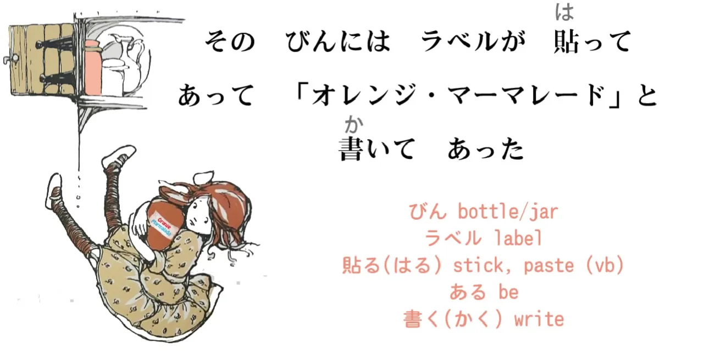

So we have three て-formed verbs in this sentence. Let's look at what they're doing.
<code>そのびんにはラベルが貼**ってあって**.</code>
<code>びん/瓶</code> is the word being used for a <code>jar</code> here. It can mean <code>bottle</code> – it's often translated as <code>bottle</code> – but it can also mean a <code>jar</code> and that's what it means here. <code>ラベル</code> means <code>label</code>. It's <code>ラベル</code> and not <code>レベル</code>, I believe, because it comes from another European language other than English. 
::: info
レベル means <code>level</code>.
:::
We can also say <code>レーベル</code>, but that's less common than <code>ラベル</code>. *(The ー is important here)*
<code>貼る</code> means <code>stick</code> or <code>paste</code> something onto something else, so this means that a label was pasted onto the bottle.

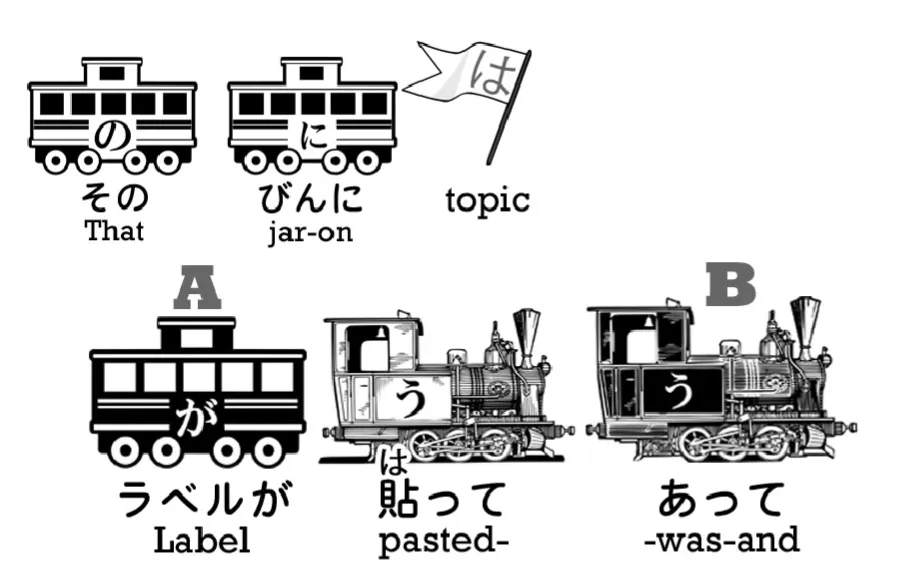

Literally, **speaking of that bottle as the target of something**, a label was pasted onto it. Now this use, <code>貼ってある</code>, we haven't covered in this course up to now. We've talked about て-form of a verb plus <code>いる</code>, and we know that <code>いる</code> means <code>be</code> and て-form of a verb plus <code>いる</code> means to be-doing that verb or to be-in-a-state of that verb.

## てある

What about <code>-てある</code>?
<code>ある</code> also means <code>be</code>, so the meaning is in fact very similar. **It also means to be-in-a-state of that verb.** However, there is a difference, and I'm going to explain that difference with another example. Let's take the sentence <code>窓が開い**ている**</code> and the sentence <code>窓が開け**てある**</code>.

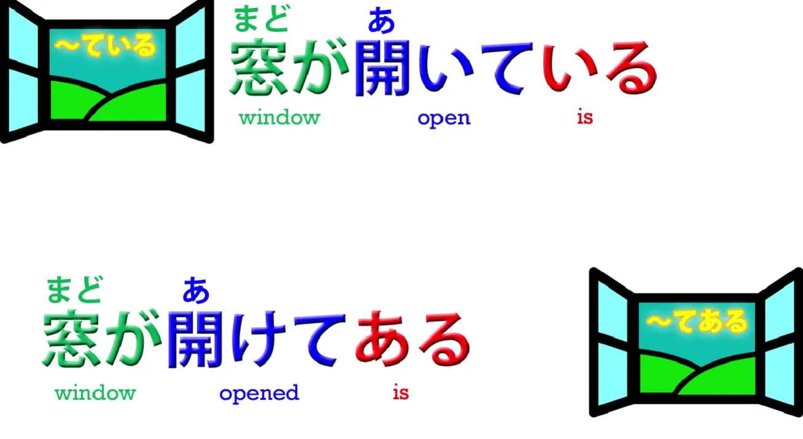

Both of them mean <code>The window is open</code>. <code>開い**ている**</code> simply means that the window is open, and we can translate that directly into English, and it's really the same thing. **But <code>窓が開けてある</code> doesn't have any English equivalent** **because it still means the window is open but it carries another implication.**

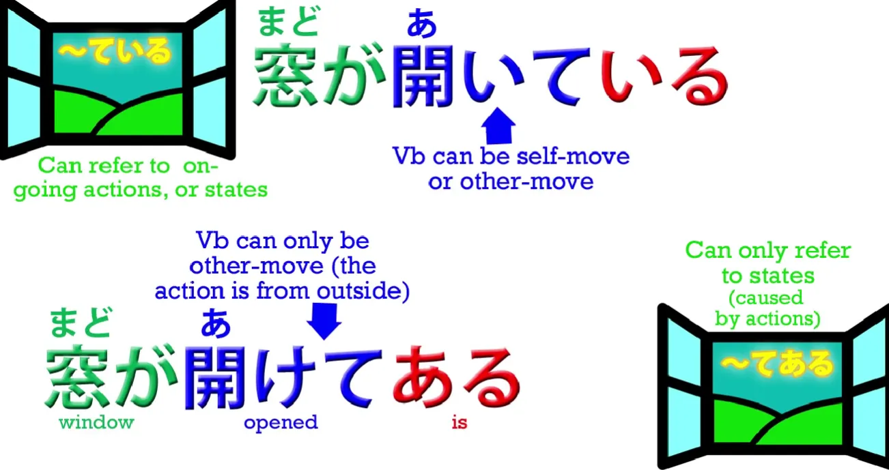

First of all, we are using the other-move version of <code>開く</code>, which is <code>開ける</code> *(bottom one)*. <code>窓が**開いている**</code> – **that's the self-move version of <code>開く</code>** and it simply means **to be open, to exist in a state of openness.** The other-move verb, <code>**開ける**</code>, which is the regular く / ける う-ending verb to え-stem + -る of the third law of self-move/other-move verbs that we've looked at already. *(Lesson 15)*

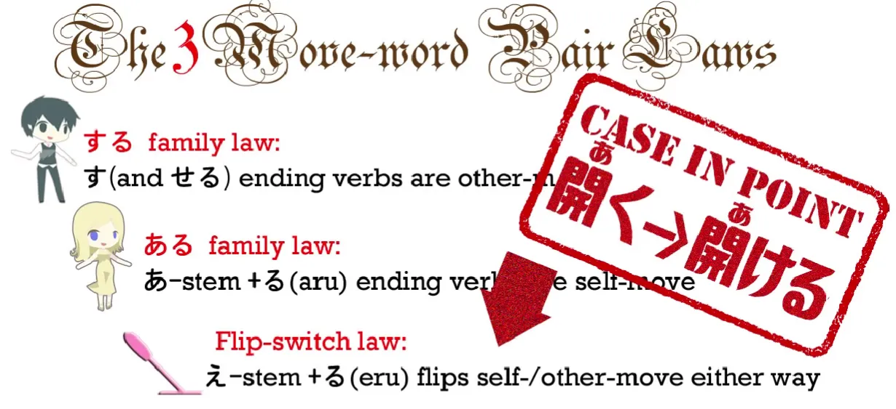

**So <code>開く</code> *(the one up)* means be open yourself, whatever you are, a box or whatever;** **<code>開ける</code> *(the one down)* means open the box, open the door etc.**

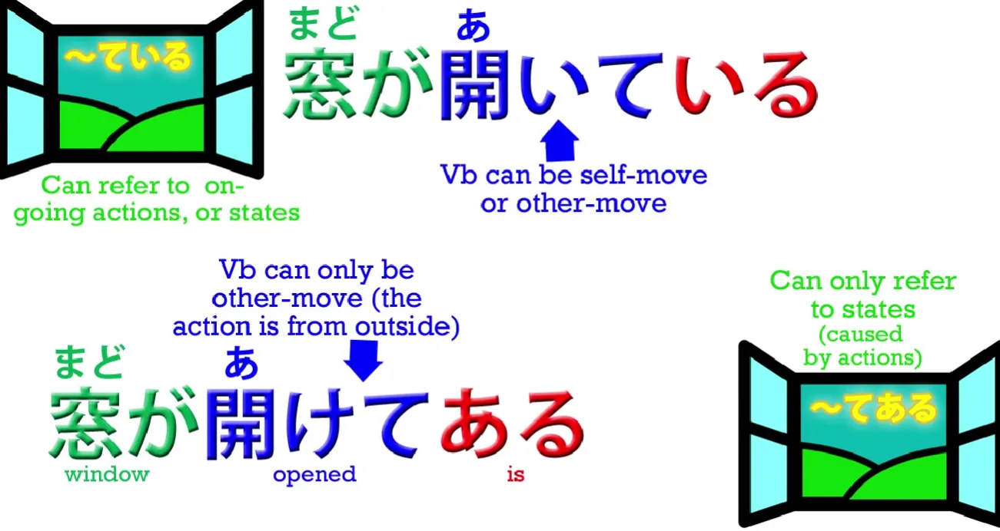

So what **<code>窓が開けてある</code> means is that the window was open,** **but it was open because somebody else opened it.** **We're signalling that in the first place by using the other-move version of the verb and** **in the second place by using <code>ある</code> instead of <code>いる</code>.**

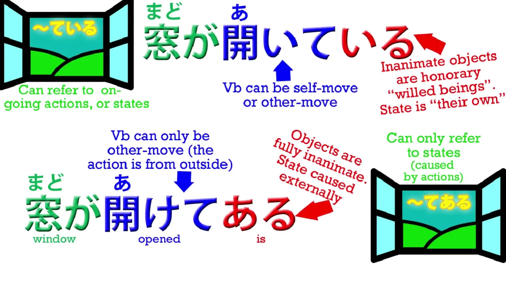

So what's the reasoning behind that? Well, when we say <code>窓が開い**ている**</code>, **although it is an inanimate object, we're using the** **version of <code>be</code> which we use for animate beings, people and animals and such.** That in fact is the part that needs explaining, isn't it? Why are we using the animate version of <code>be</code> for an inanimate object like a window? And we do this all the time. **We're always saying <code>-ている</code> for inanimate objects of all kinds.** The reason is that **in this expression we're simply saying the window was open –** **we're not implying that anybody opened the window.** So, in a way, **we can say that we're treating the window as an honorary animate being.** **The window was open, as it were, of its own volition.** **We're not saying it's open because of anybody's will other than its own.** So in a certain sense we are treating the window as an honorary animate being:
<code>窓が開いている</code>.

---

But if we say <code>窓が開け**てある**</code>, **we are saying that somebody opened the window.** **The window was the mere object of having been opened by somebody else.** **So it loses its status as an honorary animate being.** **It is treated as a mere object, an inanimate thing** – <code>開け**てある**</code>.

---

And the thing to understand here is that **even though it's lost its status as an animate being,** **even though we're using the other-move version of the verb,** **the が-marked actor of this sentence is the window:**
<code>**窓が**開けてある</code>.

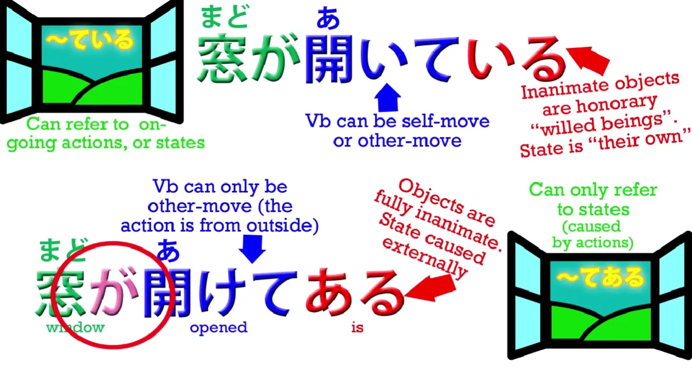

**The window is doing the action, which is <code>ある</code>: the window is existing in a state of having been opened by somebody else.**

---

And that is the same thing that's happening in our sentence from Alice.
<code>そのびんには**ラベルが貼ってあって**</code> –
<code>The jar **existed in a state of** having had **a label** **pasted** (onto it) *and…*</code>
Now, as you see, there is really nothing equivalent to this in English, so we just need to get it into our minds so that we can look at the Japanese as Japanese. This is fundamental to what I'm teaching here. I'm teaching the real structure of Japanese, not simply throwing some Japanese at you and throwing some English at you and saying, <code>Well, this kind of means that.</code> We need to get rid of English translation as far as possible and look at the Japanese as it really works in itself as Japanese. And that's why my <code>translations</code> under the trains get weirder and weirder. Because I'm not trying to translate this for you into natural English. I'm trying to tell you what the Japanese is really doing.

So the second half of the sentence... **The second て-form** *(あって)*, of course, **is simply joining the first logical clause in this compound sentence to the second logical clause**.

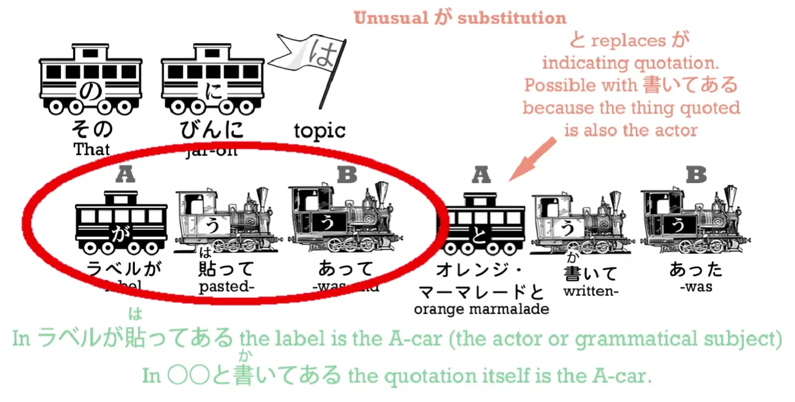

And the second logical clause is
<code>「オレンジ・マーマレード」と書い**てあった**</code>.
And here we have again this <code>-てある</code> form. And whenever we talk about something being written on something we tend to use this form. We don't say "The label said 'Orange Marmalade****', which is what we say in English, as if the label could speak. We say
<code>「オレンジ・マーマレード」と**書いてあった**</code>.
-と is our quotation particle, of course, that's quoting exactly what was written on the label, and then <code>**書いてある**</code> means that it was **in a state of having had those words written on it by somebody else.**

Now, I'm going to do something a tiny bit unusual here. I hope you won't mind. I'm going to skip ahead just a little bit in the story, because the next part contains a very interesting point that really needs a lesson of its own, and the part immediately after that includes something that really rounds out what we're doing today.

## ておく

It introduces <code>-ておく</code>, which really belongs together with <code>-ている</code> and <code>-てある</code>.

This relationship is something the textbooks don't explain and because they don't it leaves <code>-ておく</code> rather undefined in people's minds. Many quite advanced students don't really understand why <code>-ておく</code> is used in some cases. So we'll go ahead with that now and I'll just fill you in on the story in between. It's only a little bit. Alice realizes that the marmalade jar is in fact empty, and what's she going to do with it? She doesn't want to drop it because it'll fall all the way down the hole and very likely kill someone. And, if you read the newspapers, you're probably aware that there are far too many empty marmalade jar incidents in Wonderland already. So, now you know the background, let's carry on.

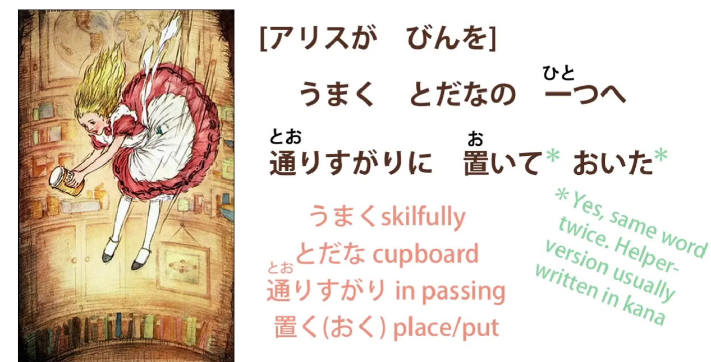

<code>うまくとだなの一つへ通りすがりに**置いておいた**</code>

<code>うまく</code> means <code>skilfully</code>; <code>とだな/戸棚</code> as we know is a <code>cupboard</code>; <code>とだなの一つ</code>, as we talked about in the last lesson *(Lesson ??)*, is <code>one of the cupboards</code>. So she skilfully in passing put it into one of the cupboards. And what's this <code>**置いておいた**</code>? Now, **they're both the same <code>置く</code>**, <code>置く</code> meaning to <code>put</code>. The first one is simple enough: she <code>put</code> it into the cupboard, but why do we have the second <code>おく</code> at the end of it – <code>置いて**おいた**</code>? Now, this is another very common and very important て-form usage and it's one that the textbooks and English-language websites tend not to explain very well, because it's something we really don't have in English. However, we already halfway know it, because **it is in a certain sense the other half of <code>-てある</code>.**

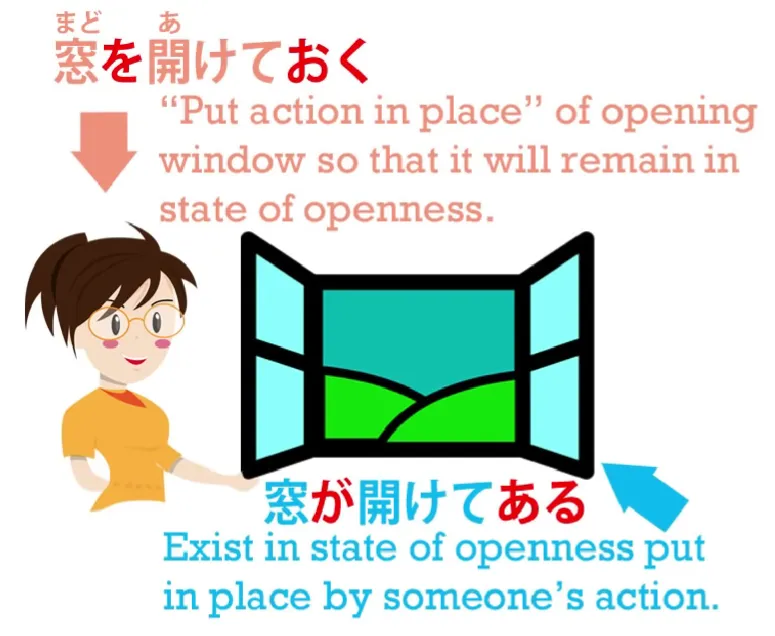

**<code>-ておく</code> means to put the action in place.** Now in this particular use, it's quite easy to see because she's putting the jar literally into place and she's putting that action into place. What the textbooks and websites tell you is that it means doing something in advance, doing something for the purpose of something else. And this is true in many cases. It's probably the nearest you can get in English. But **what it actually means is putting the action in place.** And to understand this let's go back to our example
<code>窓が開けてある</code> – <code>the window is open because somebody opened it</code>.

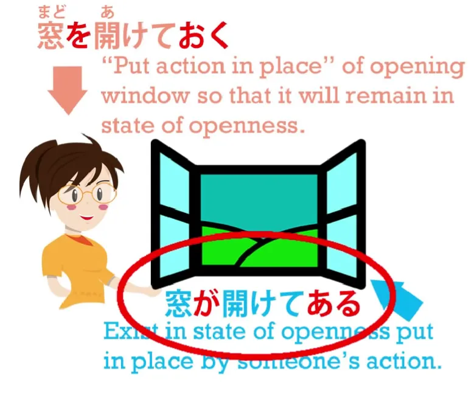

---

Now, the somebody who opened it, if we say it instead of from the point of view of the window, from the point of view of the person doing the action, 👇
<code>**開けておく**</code> is the other side of this.

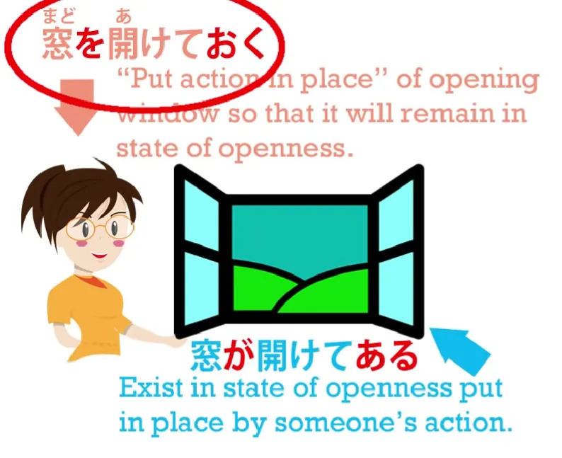

**The person put the opening of the window into place so that thereafter the window would be open.** So you see we have the two halves of the same coin.
<code>**窓が**開け**てある**</code> – **the window stands open because somebody put it there.**
<code>**窓を**開け**ておく**</code> – **open a window so that it will stand open for the future, so that** **it will then be open, put into place the action of opening the window.** And this is what <code>おく</code> means – <code>おく</code> means <code>place</code>.

---

**So you're <code>placing</code> the action, you're putting it into place, you're setting it up.** And **that's why it tends to have the secondary meaning of <code>do in advance</code> or <code>do for another purpose</code>, because you are setting up that action and the implication is that you want the effect of that action to <code>remain in place</code> for whatever future purposes it may have.**

---

In this case, Alice does not have a future purpose. **So in fact, て-form plus <code>おく</code> has a much wider range of meaning than** **the <code>do in advance</code> or <code>do for a purpose</code>** kind of English translation that it gets in the textbooks.

---

**In the case of Alice in this story, she isn't really doing anything in advance or for a purpose; she's simply trying to solve the problem of what to do with the empty marmalade jar without risking injuring the people below.** And there are many cases when this usage falls even further from the English-language definitions. For example, people say, <code>It's cruel to lock *(up)* a small child in her room</code>, and for this we use
<code>閉じ込め**ておく**</code>.
<code>閉じ込める</code> is <code>shut someone up/lock someone away</code> and **the <code>-ておく</code> here doesn't mean do it for a purpose, it doesn't mean do it in advance.** **It means do the action and leave its results in place/put the action in place and leave it in effect.** Similarly, people say, <code>It's all right to leave a baby to cry sometimes</code> – <code>泣かせ**ておく**</code>.
<code>泣く</code> is <code>cry</code>; <code>泣かせる</code> is the causative of cry: <code>allow to cry</code> in this case. *(**Lesson 19**)* And **the <code>-ておく</code>** doesn't mean do it in advance or do it for some special purpose. It **simply means do the action and leave its effects in place/put the action in place.**

::: info
This can be a bit tricky (judging also by the sheer amount of concentrated underlining, (btw. let me know if it is hard to read), so I recommend also checking [the comments](https://www.youtube.com/watch?v=cYrqFjPvwSI&list=PLg9uYxuZf8x_A-vcqqyOFZu06WlhnypWj&index=27&ab_channel=OrganicJapanesewithCureDolly), as usual.
:::
