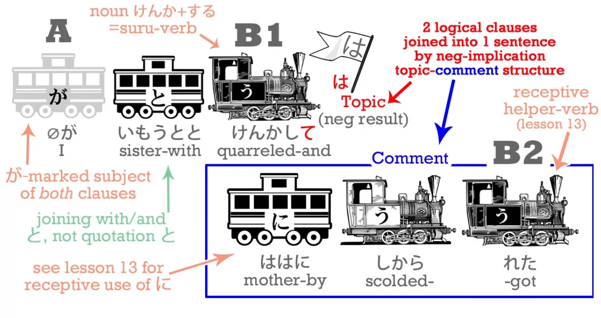

# **22. ては & ても**

[**Lesson 22: Te-wa, te-mo - topic/comment magic! How 〜ては and 〜ても REALLY work**](https://www.youtube.com/watch?v=qV-TZbsH1kI&list=PLg9uYxuZf8x_A-vcqqyOFZu06WlhnypWj&index=34&ab_channel=OrganicJapanesewithCureDolly)

こんにちは。

Today, we're going to go back and cover that little bit of Alice that we skipped last week and that's going to give us the opportunity to look at the て-form + は and the て-form + も and some other things too. So we're going to return to the point where Alice had just taken the marmalade jar off the shelf.
<code>でも, びんは空っぽだった</code> – <code>But the jar was empty</code>.

<code>空/***から***</code> means <code>empty</code>, and you can see it has the kanji for <code>sky</code> *(空 as sky is read そら)*, which I guess is the biggest empty space in this world. <code>空</code> – <code>empty</code> – is the <code>から</code> in <code>空手</code>, which is the art of fighting with empty hand, without any weapon. **<code>空っぽ</code> is a kind of strengthening of <code>empty</code>, meaning there was nothing in it, it was completely empty.** And **<code>空っぽ</code> works as a noun**, and generally speaking if you don't know what kind of word a word is in Japanese, it's most likely to be a noun.

Japanese is quite a noun-centered language, because all the words that come in from other languages like Chinese, of which there are a huge amount, and English, and other languages too come in as nouns. **You can turn them into verbs by putting <code>する</code> after them; you can turn them into adjectives with の and -な.**

**But fundamentally they're nouns.** So it's always a good guess when you don't know what a word is, that it's quite likely to be a noun. <code>空っぽ</code> is a noun, <code>empty</code>.
<code>でも, びんは**空っぽ**だった</code> – <code>However, the jar was **empty**</code>.
<code>アリスは空っぽのびんでも下へ落としては悪いと思った.</code>
Here again, we're going to see some other uses of the て-form.

## でも / ても

First of all,
<code>アリスは空っぽのびん**でも**</code>.
Now **で here is the て-form of <code>だ</code>** , and も, as we know, is the additive, inclusive sister of は: the additive, inclusive non-logical topic-marking particle. So, <code>空っぽのびん**でも**</code>.

<code>で</code>, て-form of <code>です</code>, is <code>it was (an empty jar)</code> – and <code>**でも**</code> means <code>**even though** it was (an empty jar)</code>. **も can be used to mean <code>as much as</code>** –<code>一万円もかかった</code> – <code>it took as much as 10,000 yen / cost as much as 10,000 yen</code>) – <code>**でも**</code> means something like <code>**as much as it was** (an empty jar) / **even though it was** (an empty jar)</code>. And [**I've done a video**](https://www.youtube.com/watch?v=00nKUtmnzvI) on these uses of も that you may want to watch. And we also use this <code>-ても</code> form when asking for permission, don't we?
<code>ケーキを食べてもいい?</code> – <code>Is it all right if I eat the cake? / May I eat the cake?</code> Literally, <code>If I go as far as to eat the cake, will that be all right?</code>

---

<code>空っぽのびんでも下へ落としては悪いと思った</code>.
<code>落とす</code> means to <code>drop</code>. It's another one of our self-move/other-move pairs. <code>落ちる</code> means to <code>fall</code> – that's self-move: a thing falls, by itself. <code>落とす</code>, which ends in -す, according to the first law of self-move/other-move verbs, so it means <code>drop</code>: we don't drop ourselves, we drop something else.

<code>下へ</code> : now, -へ, as we know, is the other targeting particle. It's very similar to に, **but the difference is that -へ tends to refer more to the direction** **something is moving than to its actual target.** So in this particular case, <code>下に落とす</code> **wouldn't be right**. We're not saying that we're dropping it to a particular target, like <code>テーブルの下</code> – the under of the table / under the table.

We're just dropping it downwards, dropping it in a downward direction. We don't even know what's down there. She did try looking and she couldn't see much. So dropping it in the direction of down – <code>下へ落とす</code>. Now, <code>したへ落としては悪い</code>. Now here you see, we've just had て-form plus も; now we have て-form plus は. And we know that も and は are the opposite twins. **While も is the additive, including particle, は is the subtractive, excluding particle.** **So, while -ても means <code>as much as</code>, -ては means <code>as little as</code>.**

## ては

Now, **we tend to use -ても in positive contexts** – <code>If I do **as much as** this, will it be all right?</code> **But we use -ては in negative, forbidding contexts** – <code>don't even do **as little as** that</code>. So we often say, <code>-**ては**だめ</code> – <code>**do that is** no good / **do that is** bad</code> / *if done (action), no good.* In this case, it's very similar: <code>落とし**ては**悪い</code> – <code>**even as little as** dropping it would be bad</code>. The point isn't really that dropping it is a small thing, or that eating the cake is a big thing. **The point is that we can go as far as eating the cake, that's fine, but don't even think** **about dropping it:** <code>落としては悪い</code> – doing that is right out of the question. **Very often this forbidding -ては is just contracted to -ちゃ.**
笑っ**ちゃ**だめ！- Don’t laugh! / *Even as little as a laugh is no good. (roughly)* Now this pattern continues into other uses of -ては.

## ては as a connector between two clauses

For example, we can use -ては as a connector between two clauses and **it implies that the second clause is unwanted or negative.**

So we can say, <code>雨が降っ**ては**公園に行けない</code> – <code>It's raining and we can't go to the park</code>. Now, as we know, -て can connect two sentences and if we just said, <code>雨が降って公園に行けない</code> we're saying – <code>It's raining and we can't go to the park</code>. **There's an implication that we can't go to the park because it's raining but there's** **no suggestion of whether we're happy or unhappy with the result.** <code>雨が降っ**ては**公園にいけない</code> **is indicating that the result is unpleasant or unwanted.** And you can see that **this does have its root in the restrictive quality of は.** For example, in English we might say, <code>Just because it's raining, we can't go to the park</code> and this is exactly what は means, doesn't it?

::: info
Bread is the direct object here (like in English).
:::

If we say <code>パンを食べた</code>, we're saying <code>I ate bread</code>, but if we say, <code>パンは食べた</code> **that often implies I ate bread but I didn't eat something else.**

::: info
Speaking of the bread, (I) ate. (rough translation), bread is the topic of the convo I guess?
:::

Conversely, if we say, <code>パンを食べなかった</code>, we're saying <code>I didn't eat bread</code>; if we say <code>パンは食べなかった</code>, **we're often implying I didn't eat bread, but I did eat something else.**
<code>雨が降っ**ては**公園に行けない</code> originally could imply something like <code>**Just because** it's raining, we can't go to the park</code>, but now **(with ては)** its implication is more <code>**Unfortunately, because** it's raining, we can't go to the park</code>.
<code> *(zeroが)* 妹とけんかし**ては**母にしかられた</code> – <code>**Because** (I) quarrelled with my sister, I got scolded...</code>

And again, **the は in there indicates that this is a negative result.** **So it links two complete clauses with the indication that** **the second one follows as an unfortunate result from the first one.** So this is a continuation of the negative implication of -ては.

## ても / でも as a connector

**-ても, on the other hand, when it links two sentences,** **doesn't indicate a negative result or a positive result.** **It indicates an unexpected or contrasting result to the first.** So if we said, <code>雨が降っ**ても**公園に行く</code>, we're saying <code>**Even though***/As much as* it is raining, we're going to the park</code>.

**And you can see that this is essentially the same function as <code>でも</code>,** **which gets translated as <code>but</code>, quite correctly.**

**<code>でも</code> folds up whatever went before it into that <code>で</code>, which is the て-form of <code>だ</code>.** **So we're saying <code>that all happened</code> and the も then adds to it the <code>but</code> element,** **the <code>even though</code>, <code>as much as</code> element.** So we could also say, <code>雨が降る**でも**公園に行く</code>, which means almost exactly the same as <code>雨が降っ**ても**公園に行く</code>. The difference structurally is that in <code>雨が降っても</code>, the -ても only attaches to <code>降る</code>, whereas in <code>雨が降るでも</code> the で **is wrapping up the whole of the last sentence.** In practice that gives us pretty much the same meaning.

So let's just go back to that sentence in Alice and see how it's structured.

It's a little more complex than it looks at first, but it's very easy to understand. And if we can understand it it gives us the key to analyzing much more complex sentences which could give us trouble in the future. **The core of the sentence is at the beginning and the end. The whole sentence is just telling us what Alice thought.** So the core is <code>**アリスは(zeroが)思った**</code>.

The inside of the sentence consists of two topic-comment structures. The first topic is <code>even though it's an empty bottle</code> **(topic)** - (zeroが)空っぽのびんでも and the comment on that is itself another **topic-comment** structure: <code>**as for** dropping it, that would be bad</code> - 下へ落として**は**わるい

---

**And then the whole of this double topic-comment structure is bundled up into that -と, which really means we can treat the whole thing as a kind of quasi-noun – just bundle up** **into that -と and attribute it to Alice as her thought.** *(思った)* Now, of course, as we're actually reading or looking at Japanese we don't think of <code>as for</code> or <code>speaking of</code> every time we see a topic-comment statement, because <code>as for</code> in English is much weightier, much more cumbersome than the simple は and も in Japanese. So what do we do? **Once again, as always, we don't translate it into English except when we absolutely need to, to explain it or understand it. We take the Japanese as it is in itself, and that's how we learn Japanese as opposed to just learning about Japanese.**
