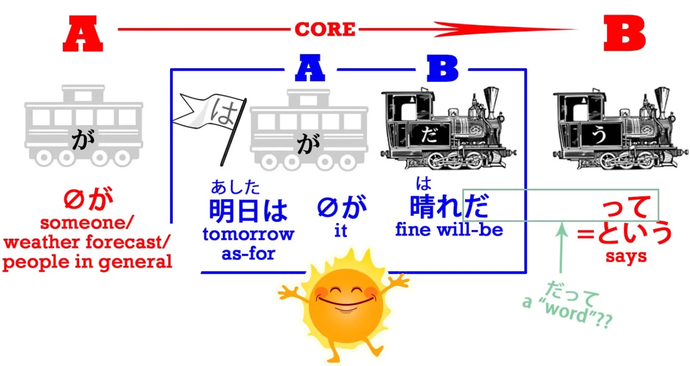

# **23. だって + だから & それから**

[**Lesson 23: だって Datte: what it REALLY means (hint: it's not a word) + dakara, sore kara**](https://www.youtube.com/watch?v=kO89HzRQygQ&list=PLg9uYxuZf8x_A-vcqqyOFZu06WlhnypWj&index=25&ab_channel=OrganicJapanesewithCureDolly)

こんにちは。

Today we're going to talk about <code>だって</code> and some of the issues that raises about the use of <code>だ</code> and <code>です</code>. One of my commenters spoke about being confused by the <code>word</code> <code>だって</code> and I'm not surprised, because if you look at the Japanese-English dictionaries they tell you that <code>だって</code> means <code>because</code> and <code>but</code> and <code>even</code> and also <code>somebody said</code>, which is quite a confusing pile of meanings for one so-called word. **And I say <code>so-called</code> word because <code>だって</code> isn't really even a word.** And the thing that never seems to get explained in dictionaries or anywhere else is what it really is, what it actually means, and therefore why it carries the range of meanings that it does. So, let's start off with the most basic meaning, which is the last one on the list, <code>somebody said</code>.

## だって as <code>somebody said</code>

**<code>だって</code> is actually simply made up of the copula <code>だ</code> plus って,** **which is not the て-form of anything, it's the って which is a contraction**, as we've talked about before *(Lesson 18)*, **of the quotation particle -と plus <code>いう</code>.**

---

**So って means <code>-という</code>, in other words, <code>says</code> a particular thing.** The **-と bundles up something into a quotation and the <code>いう</code> says that somebody says it.** So it's really as simple as that.
<code> *(zeroが)* 明日は晴れ**だって**</code> is simply <code> *(zeroが)* 明日が晴れ**...**</code>

<code>晴れ</code> means <code>sunny</code> or <code>clear skies</code> – and as with most words where there's some doubt of what kind of word they are, they usually turn out to be nouns, **<code>晴れ</code> is a noun.** So, <code>明日は晴れだ</code> simply means <code>Tomorrow will be sunny</code>. And when we add って, we're saying, <code>**It's said that** tomorrow will be fine</code>. **We might be saying that someone in particular says it or we may just be saying <code>it's said</code> in general** – <code>I hear tomorrow will be fine</code>, we might say in English. <code>They say tomorrow will be fine.</code> So that's very simple, and **that's what <code>だって</code> is:** **it's <code>だ</code> plus って, the <code>-という</code> contraction.**

And that's what it is in all the other cases too, so let's see how it works. How does it come to mean <code>but</code>?

## だって as <code>but</code>

Well, to begin with let's understand that **when it's used on its own** – and **it means <code>but</code> when it's used on its own, not as the ending of a sentence** as in the example we just looked at – **it has a slightly childish and usually somewhat negative or argumentative feeling.** So if somebody says, <code>さくらがきれいだね</code> – <code>Sakura's pretty, isn't it?</code> And you say <code>**だって**頭が弱い</code>. Now <code>頭が弱い</code> means literally <code>head is weak</code> – <code>She is not very smart</code>. So it would be like saying, <code>**But** she's not very smart</code>. **But what you're actually doing here is taking the statement that the last person said and** **adding the copula <code>だ</code> to it.**

And in order to understand that let's look for a moment at something else.

### ですね

Very often, when we're agreeing with something someone says, we might say <code>ですね</code>. And literally that just means <code>is, isn't it?</code> And how can it mean that, because really <code>だ</code> or <code>です</code> **on its own doesn't mean anything.** It has to join two other things together, and neither of them are stated here.

**But what <code>です</code> is by implication attached to is the thing the person just said.** And **what it's joining it to is**, by implication, **something like <code>本当</code> or <code>そう</code>** – <code>**そう**ですね</code>.

So we're actually saying <code>**That's true**, isn't it?</code> or <code>**That's the case**, isn't it?</code> or <code>**That's how it is**, isn't it?</code>

## それから & だから / ですから

We also do this when we say <code>**だから**</code> or <code>**ですから**</code>, which really means <code>**because**</code>.

Now, we know that <code>から</code> means <code>because</code>; it means literally <code>from</code> and therefore also means <code>because</code>. **From A, B. From Fact A we can derive Fact B. From Fact A, Fact B emerges.** **So, <code>から</code> – <code>because</code>.** We may be tempted sometimes to say <code>それから</code>, which is a literal translation of the English <code>because of that</code>. **But in fact <code>それから</code> doesn't get used to mean <code>because of that</code>.** <code>それ</code> means <code>that</code> and <code>から</code> can mean 'because", **but <code>それから</code> usually means <code>after that</code>** – <code>から</code> in the more literal sense, **<code>から</code> meaning <code>from</code>, and in this case <code>from</code> in point of time rather than space.**
<code>From that forward / from that forward in time / after that</code>; <code>それから</code> – <code>after that</code>.

---

To say <code>**because of that**</code>, we say <code>**ですから**</code> or <code>**だから**</code>, and this is really short for <code>**それはそうですから**</code> or <code>**それは本当ですから**</code>.👇 We're saying <code>**because that is the case**</code>, and if you think of it, this is more logical than what we say in English. We're saying <code>because that is the case</code>. <code>Because of that</code> really means literally in English <code>because that is the case</code> but we just cut it down to <code>because of that</code>, 👇 and **in Japanese we just cut it down to <code>ですから</code>.**

## Back to だって as <code>but</code>

Now, when we understand this, we can understand <code>だって</code> in the sense of meaning <code>but</code>.

**<code>だ</code> refers back to whatever it was the last person said, and って simply states that they said it.** So, if someone says, <code>さくらがきれいだね</code> – Sakura's pretty, isn't it, isn't she?" And you reply, <code>**だって**頭が弱い</code>. Now, **the <code>but</code> here is you saying <code>You said that...</code>.** **And <code>だって</code> is a rather childish and argumentative-sounding way of saying it, so the implication is that what comes next is going to be negating what was said.**

---

And this works in just the same way as English <code>but</code>. If you think about it, **<code>but</code> is not saying that what came before it is untrue.** **In fact it is accepting that what came before it is true, but it's then adding some information that is contrary to the impression given by that statement.**

---

So <code>さくらがきれいだね</code> – <code>Sakura is pretty</code> – <code>**だって**...</code>– <code>**You said that and I'm not disputing that that is the case, BUT** – she's not very smart</code>.

## だって as <code>because</code>

So, how does it come to mean <code>because</code>, which in some ways seems almost opposed to <code>but</code>, almost an opposite kind of meaning? Well, let's notice that **one thing that <code>but</code> and <code>because</code> have in common is that they accept the first statement.** <code>But</code> goes on to say something which contrasts with that statement, while still accepting it. **<code>Because</code> says something that goes on to explain that statement.** And **this can be a harmonious explanation which simply gives us more information about it, but it can also be a contradictory explanation.** So, for example, if someone says, <code>You haven't done much of your homework</code> and you reply, <code>Because you keep talking to me!</code> **This could be expressed by <code>だって</code> in Japanese.** Again, what it's really saying is "You say that and I don't dispute it, **but here's something** **we can add to it which undermines the narrative that you are trying to put forward."**

---

So you see, it doesn't literally mean either <code>but</code> or <code>because</code>. **What it means is,** **<code>I accept your statement and now I'm going to add something a bit argumentative</code>.** In English it could be translated as either <code>but</code> or <code>because</code> depending on the circumstances.

## だって as <code>even</code>

So, how can it come to have the meaning of <code>even</code>? Well, let's understand that this is a slightly different use. **When we use it to mean <code>even</code>, we're not using the <code>だ</code> in the way we're using it when we say <code>だから</code> or <code>だって</code> in the senses we've just talked about.** In other words, **we are not simply using it to refer back to the last statement.**

---

**We're usually attaching it to something in particular within the statement we're making.** So, if you say, <code>さくらはできる</code> – <code>Sakura can do that</code> and I say <code>**私だって**できる</code>, which is generally translated as <code>**Even I** can do that</code>, what we're actually saying is <code>**Say it's me**</code>, which means in both Japanese and English <code>**Take the hypothesis that it's me**</code> or <code>**Take the case of me in this circumstance**</code> and we're saying <code>私だってできる</code> <code>Say it's me, I can do that</code>.

Now, this has a different implication from <code>私**も**できる</code>, **which just means neutrally** <code>I can do that **too**</code>. <code>私**だって**</code>, **because it's very colloquial and because it's associated with this slightly** **negative or contradictory implication**, it means <code>**Even** I can do that</code>.

---

**And it doesn't have to be negative in the sense of contradicting anything.** Outside the context of Sakura, we might just say, <code>私だってホットケーキが**作れる**</code> – <code>Even I can make hotcakes</code>.

::: info
Dolly-先生 misspeaks by saying 作られる, but as a Godan potential, it should be 作れる. 作られる is the receptive form of 作る - we take う off, add あ stem + れる. Potential is え + る.
:::

And in this case, **we're not saying it negatively,** **but that <code>私だって</code> still has the implication of <code>even me</code>.** It still has its slightly disparaging or negative ring, because what you're saying is here <code>**Even someone like me, even me, who can't usually make very much**, can make hotcakes</code>.

So I hope this makes <code>だって</code> clearer and also the ways in which <code>だ/です</code> can be used to accept and affirm previous statements made by oneself or by someone else and add something to it.
