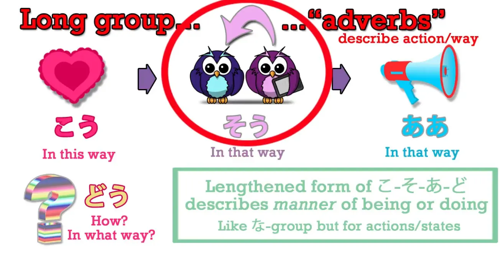
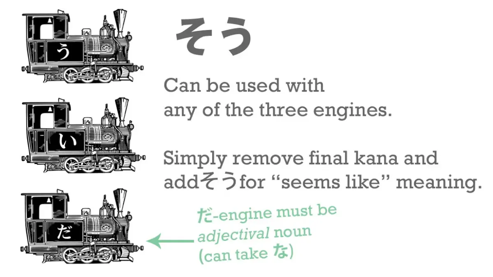
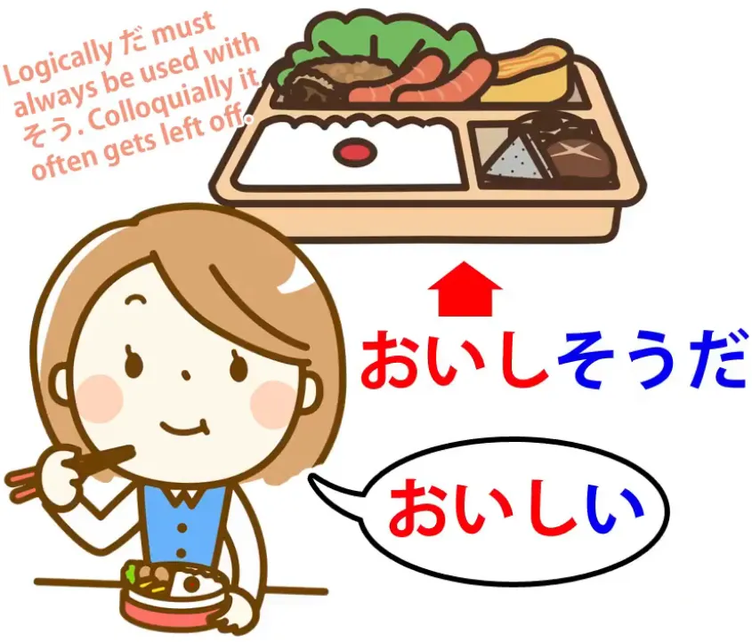
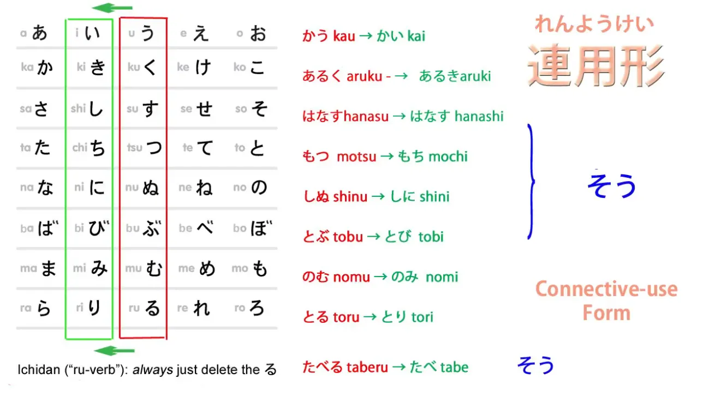
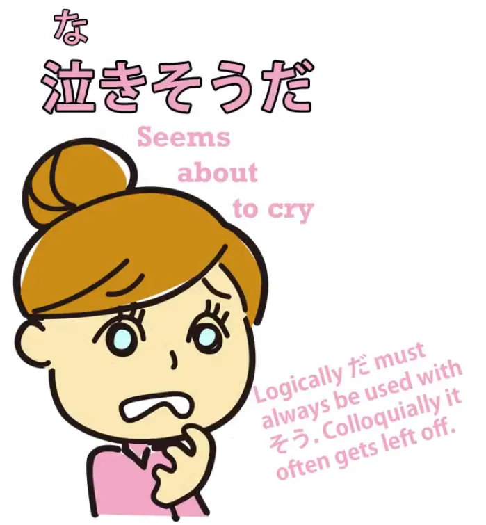
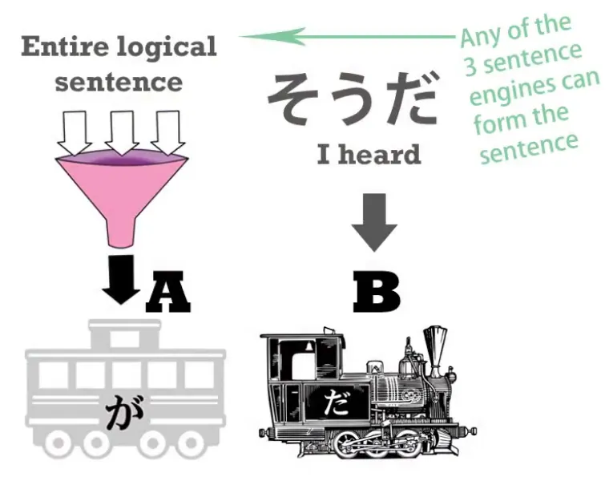
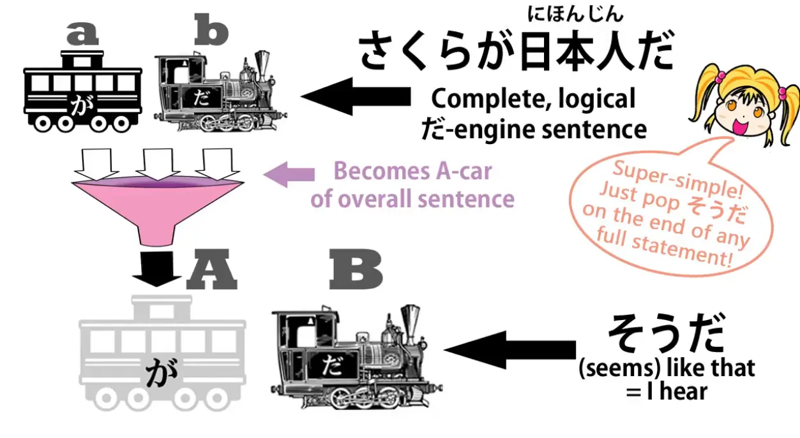
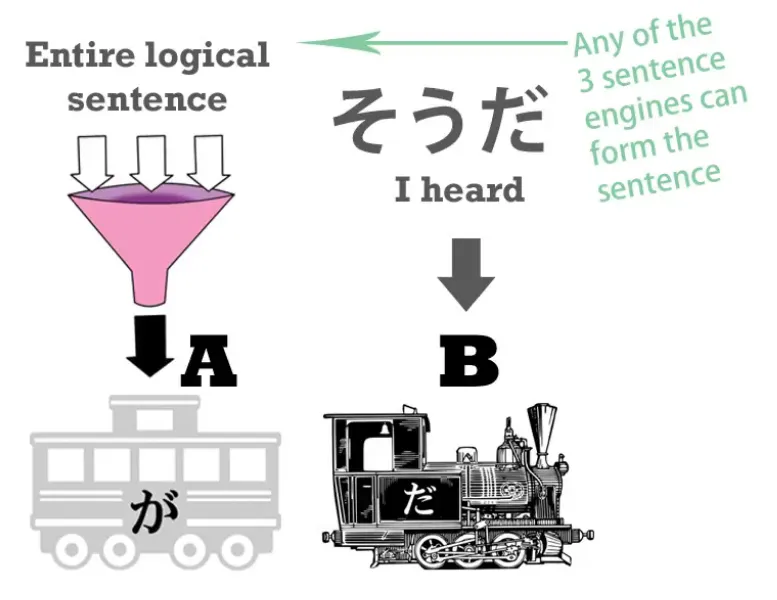

# **24. Hearsay & guesses - そう・そうだ・そうです**

[**Lesson 24: Hearsay and guesses! 〜sou da, 〜sou desu - how they REALLY work.**](https://www.youtube.com/watch?v=uSJukXcyccw&list=PLg9uYxuZf8x_A-vcqqyOFZu06WlhnypWj&index=26&ab_channel=OrganicJapanesewithCureDolly)

こんにちは。

Today we're going to talk about the helper noun <code>そう</code>, which can mean either likeness or hearsay, **either that something seems like something** or that we are **stating not our own view or opinion but something we've heard.** Differentiating the two can seem difficult, especially when the textbooks give you a list of connections to nouns and verbs and various different things. It's much less complicated when you understand the underlying principle, what's actually going on with <code>そう</code>. So you don't have to memorize a lot of different things. So, first of all, what is <code>そう</code>? **It's the same <code>そう</code> that we learned about recently that comes in <code>こう-そう-ああ-どう</code>.** *(Lesson 20)*

**So <code>そう</code> means <code>like that</code>**, which makes it of course a very good candidate for **describing something seeming like something.**

## そう as <code>seeming like something</code>

**When it's used in that way, we use it by attaching it to any one of the three engines.**

And remember, as we've learned before, that each of the three engines can be moved behind other cars to turn them into adjectives. *(Lesson 6)* **Now, once -そう has been attached to an engine** **the engine becomes a new adjectival noun.** How do we attach them? We do the same thing in every case. **We take the last kana from the engine.** That is the kana that makes it what it is, its active part.

---

**So we take the <code>だ</code> from the だ-engine - the <code>だ</code> or the <code>な</code> from the だ / な-engine.** **We take the <code>い</code> from the い-engine.** **And from the verb engine, we take that last う-row kana.** **And we just put -そう onto them**, so it's a very simple connection.

### With adjectival nouns

And **the important thing to remember here is in the case of nouns** **we can't do it with an ordinary, regular noun.** **We can only do it with an adjectival noun.**

---

In other words, **if an adjectival noun is an adjectival noun to start with,** **we can turn it into a different adjectival noun with -そう.** **If it wasn't an adjectival noun to start with, it can't be turned into an adjectival noun.** So if we take adjectival nouns like <code>元気</code> (<code>lively</code> or <code>healthy</code>) and <code>静か</code> (which is <code>quiet</code>) - if we say <code>静かだ</code> we mean <code>is quiet</code> - if we say <code>元気だ</code> we mean <code>is lively or healthy</code>. If we say <code>元気**な**学生</code>, we're saying <code>a lively or healthy-***is*** student</code>. Now **if we** take off that <code>だ</code> or <code>な</code> and **put on -そう** - and we say <code>元気**そうな**学生</code>, we're saying <code>a lively **looking**-***is*** student/ a lively **seeming**-***is*** student</code>. Similarly, if we say <code>静かな女の子</code>, we're saying <code>a quiet-***is*** girl</code>. **If we** take off that -な or だ and **put on -そう** and say <code>静か**そうな**女の子</code>, we're saying <code>a quiet-**seeming**-***is*** girl/ a quiet-**looking**-***is*** girl</code>. So that's really very simple, isn't it?

::: info
As shown above, we take off the だ / な from the OG adjectival noun, but then when we connect -そう after it, we then still use the だ / な, but it instead comes from the そう part. It may be framed a bit confusingly, considering the examples Dolly gives still contain だ / な.
:::

*So just in case, to avoid possible confusion… Because apparently [**そう is an adjectival noun**](https://jisho.org/word/%E3%81%9D%E3%81%86) itself, so the だ / な probably attaches to そう. Here, 静か is an adjectival noun to which is attached そう, another adjectival noun, that seems to serve as a suffix to which is attached な to connect it with 女. So 静かそうな is one unit. This would align with Dolly’s orange comment just below about copula being used with そう.*

*This is just my limited understanding, so take this with a grain of salt. Contact me if I am wrong.*

### With adjectives

**With adjectives that end in <code>い</code>, we simply take off that -い and put -そう onto it.**

::: info
Do carefully note that orange comment above on the picture with そう + だ. *So, if we take <code>面白い</code> (<code>interesting-*is*</code> or <code>amusing-*is*</code>), <code>おいしい</code> (<code>delicious-*is*</code>),
:::

**we just cut off the -い and add -そう.** So, <code>面白い</code> means <code>interesting-***is***</code> or <code>amusing-***is***</code>, <code>面白**そう**</code> means <code>**seems** interesting / **seems** amusing</code>. <code>おいしい</code> means <code>delicious / tasty-*is*</code>, <code>おいし**そう**</code> means it <code>**looks** delicious</code>, it <code>**looks** tasty</code>. And this is an important one to remember because, as we've mentioned before, **Japanese is a lot stricter than English in restricting us to saying** **only things that we can actually know for ourselves.**

---

**So unless you've tasted something, you can't say it's <code>おいしい</code>.** **Unless you've done something, you can't say it's <code>面白い</code> - interesting or amusing.** Logically this perhaps ought to be so in English, but Japanese is a lot stricter about it. So, it's important to know things like <code>面白**そう**</code>, <code>おいし**そう**</code> **if we haven't actually tasted the food, done the activity or whatever.**

### With verbs

Now, **with a verb we cut off the う-row kana.** Obviously, as always, in the case of ichidan verbs that's all we do. And **in the case of godan verbs we use the い-stem.**

And the い-stem is what you might call the pure stem of a verb. In Japanese it's called **<code>れんようけい/連用形</code>, which means <code>connective-use form</code>.** And that might sound strange because we know that all four stems actually connect things, but while the other three have particular uses, **the <code>れんようけい/連用形</code>, the い-stem, as well as its particular uses,** **can be used to connect almost anything.** **It can connect verbs to nouns to make new nouns;** **it can link verbs to verbs to make new verbs; and so on.**

---

So, **we connect -そう to the <code>連用形</code>, the い-stem**, the general-purpose connecting stem of verbs. What do they mean? Well, **generally speaking, they mean that something appears to be about to happen.**

::: info
Once again, the reminder comment about だ being used after そう.
:::

So, <code>雨が降り**そうだ**</code> means <code>it **looks as if** it's about to rain</code>. <code>子どもが泣き**そう*(だ)***</code> means <code>The child **looks as if** she's about to cry / **seems as if** she's about to cry.</code> And if you see that's quite similar to what we might say in English: <code>It **looks like** rain / it **seems as if** it's about to rain.</code> So these usages are really quite straightforward.

## そう as hearsay

Now what do we do when we're using <code>そう</code> to mean hearsay, to mean <code>I heard something - I'm not reporting my own observation or feeling, I'm reporting what I got at second-hand from somebody else</code>? Some people would say that this is also a suffix and we have to observe different rules for applying it, **but the truth is that it is not a suffix.**

---

**The -そう we've just discussed is a suffix.** **We join it to other words in order to form a new word.** Whatever the word was to start with, **once -そう is attached it becomes an adjectival noun.**

::: info
Seems to point to my previous idea above…
:::

*---*

**This is not what happens when we're talking about hearsay.** When we're talking about hearsay, we use <code>**そうだ**</code> or <code>**そうです**</code> **after the entire, complete sentence.**

**So the complete sentence becomes the A-car of the sentence** and **the <code>そうだ</code> becomes the B-engine.** And **the content of the sentence is now subordinate.** So let's take an example:

<code>さくらが日本人だ**そうだ**</code>. What we're saying here is <code>**I've heard that** Sakura is a Japanese person</code>. So, **<code>Sakura is a Japanese person</code> is all taken together as Car A, the subject of the sentence, and then what we're saying about it is that we've heard it.** Why do we use <code>そうだ/そうです</code> to mean <code>I've heard</code>?

Well, if you think about it, it's similar to what we might say in English. Suppose we say <code>Why isn't that car in the street any more?</code> and you say <code>It seems some masked people came and drove it away</code>. Now, when you say that, what that means is that somebody told you that, doesn't it? If you'd seen it yourself you'd have said <code>Some masked people came and drove it away</code>, but when you say <code>It seems some masked people came and drove it away</code>, what you're saying is <code>Well, that's the story I've heard</code>.

::: info
I would check [**this comment**](https://www.youtube.com/watch?v=uSJukXcyccw&lc=Ugy3WGJ0efK8lG72-N94AaABAg&ab_channel=OrganicJapanesewithCureDolly) too...
:::

And it's the same in Japanese only a little more systematically. **<code>そうだ/そうです</code> when added as the B-engine to an entire, completed sentence is always** **saying that this is what we've heard, this is the information we have, for what it's worth.**
