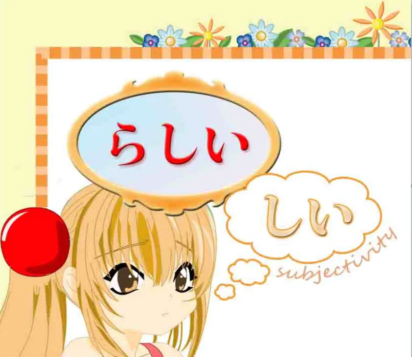
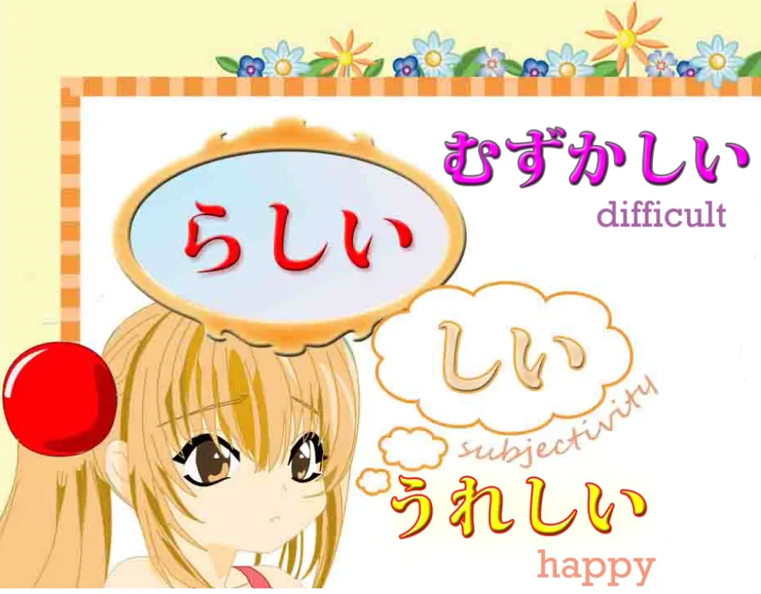
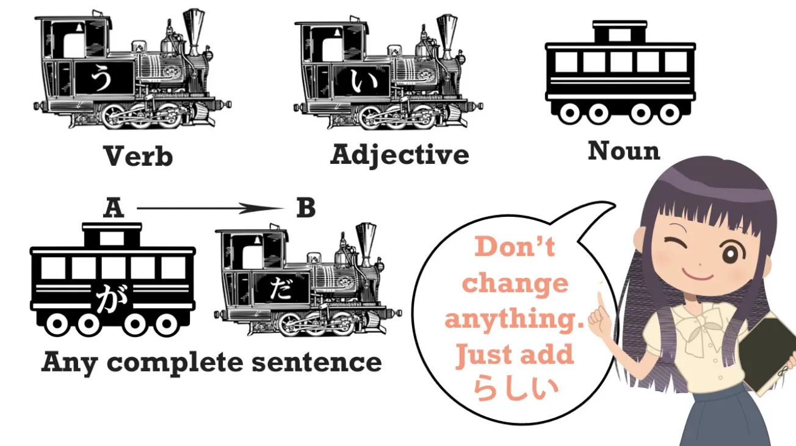
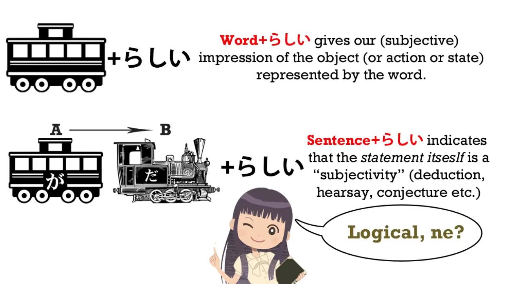
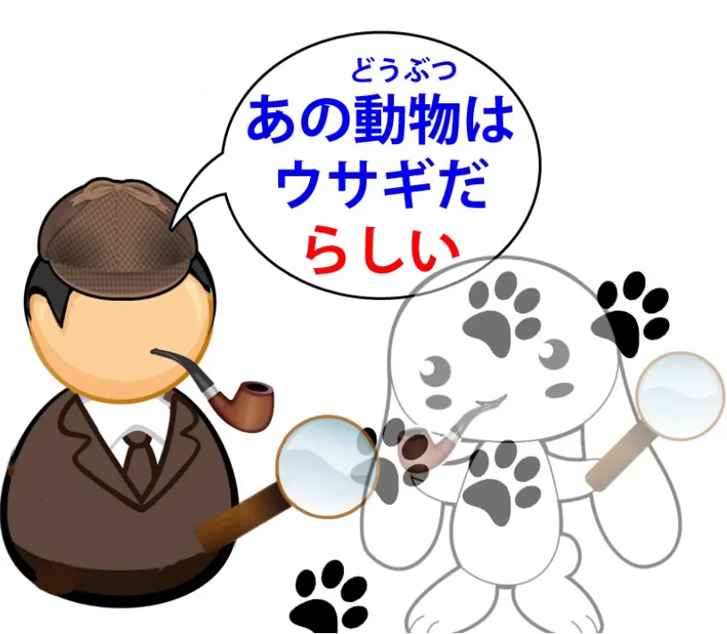
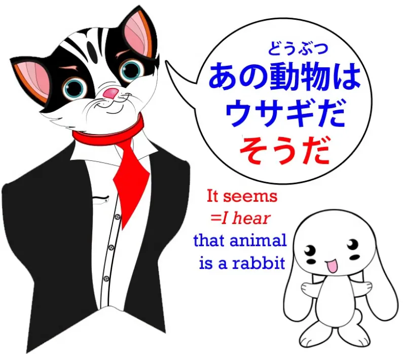
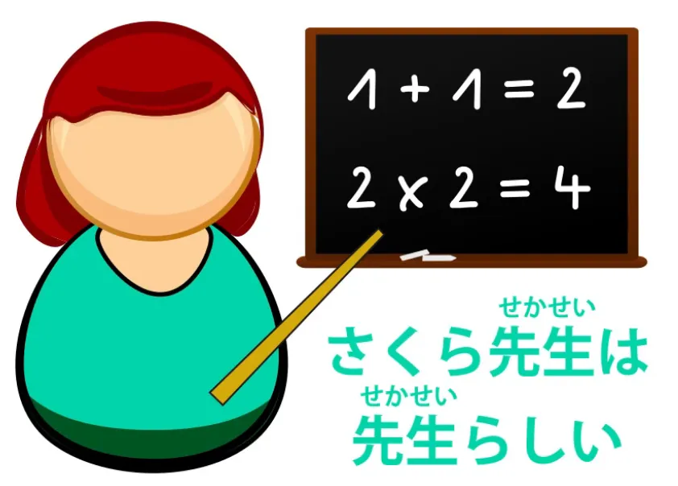
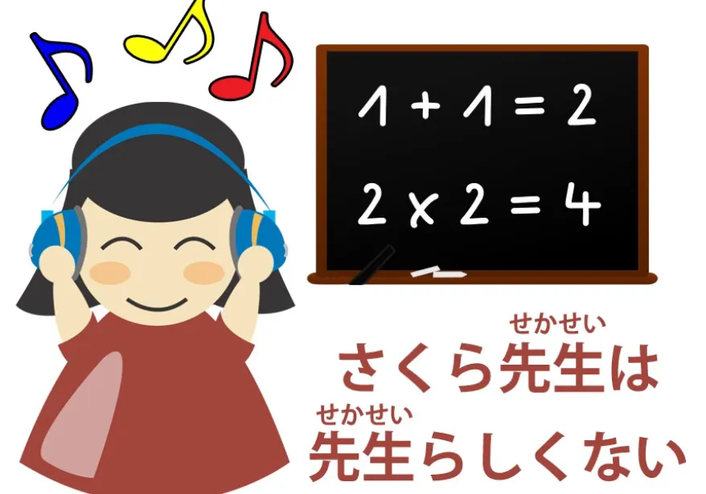

# **25. らしい vs そうだ / そうです + っぽい (ppoi)**

[**Lesson 25: らしい Rashii made rational!. Rashii vs sou desu. らしい vs そうです. っぽい ppoi**](https://www.youtube.com/watch?v=y3KlZ6IwtQ0&list=PLg9uYxuZf8x_A-vcqqyOFZu06WlhnypWj&index=31&ab_channel=OrganicJapanesewithCureDolly)

こんにちは。

Last week *(Lesson 24)* we talked about the helper adjectival noun <code>そう</code> and how we use it to express what something might be like, our impression of something, and hearsay. Today we're going to talk about other ways of expressing a similar range of ideas, how they work, how they are similar, and how they are different.

## らしい

So, we're going to look at **<code>らしい</code>, which is a helper adjective.** And **this is an adjective ending in -しい**, which is what we can call a **subclass of adjectives**.

All real adjectives, as you know, end in -い. So-called adjectives that don't end in -い are in fact adjectival nouns. *(such as きれい/綺麗)* But a group of those い-ending adjectives ends with -しい. *(I guess some of the <code>real</code> adj.)* As you see, **it's still ending in -い but it also has -し, so it's -しい.** And the characteristic of this group of adjectives is that **on the whole they express subjectivities.** That is to say, **not exact measurable qualities but things which are to some extent dependent upon human or other sentient beings' impression of them.** So, for example, <code>かな/悲しい</code> is <code>sad</code>; <code>うれ/嬉しい</code> is <code>happy</code>. <code>むずか/難しい</code> means <code>difficult</code> and while this seems somewhat more objective than <code>嬉しい</code> and <code>悲しい</code>, **it's still in some way a subjectivity because difficulty is relative to particular individuals.**

**Whether you find a thing difficult or easy depends to a large extent on** **who you are and what your abilities are.** So this, as we'll see, gives us an indication of what kind of a word this is and how it differs from <code>そう</code>. Its use is very simple. **Like <code>そう</code> it can be attached either to an individual word or** **to a complete logical clause or sentence.**

And the attachment is absolutely simple, because we never do anything at all except **just put <code>らしい</code> after the word or after the completed logical clause.** **We don't change anything, we don't do anything, so it really couldn't be easier.**

Now, **as with <code>そう</code>, if we put it after a single word** **we are talking about our impressions of that particular object.** **If we put it after a completed clause**, we are saying <code>**it seems to be that way**</code>.

## Difference between らしい & そうだ/です

However, there is a difference. If we put <code>そうだ</code> after a completed clause, as you know, we complete the clause, if necessary with another <code>だ</code>, and that usage means that **we've heard that that sentence is the case.**

### らしい vs そうだ - after a complete clause

So if we say, <code>あの動物はウサギだそうだ</code>, we're saying <code>I've heard that that animal is a rabbit</code>. Now, if we say, <code>あの動物はウサギだ**らしい**</code>, we're saying <code>**It seems** that animal is a rabbit</code>.

Now, **that can mean the same thing as** <code>ウサギだ**そうだ**</code>. It can mean <code>I've heard that it's a rabbit</code>, and sometimes the textbooks get quite convoluted and confusing about whether <code>らしい</code> actually means <code>I've heard</code> or whether it means <code>it seems</code>, but it's very simple if you understand exactly what it's doing. **What it's doing is actually saying <code>it appears</code> or <code>it seems</code>, and this has exactly the same ambiguity and lack of ambiguity as that has in English.** 

So let's take the case of this mysterious animal. Suppose I'm looking at it with a group of people and afterwards you come up to me and say, <code>What is that animal?</code> and I say, <code>ウサギだ**らしい**</code>. Now, I've given **a complete sentence with <code>らしい</code> on the end**, and the natural meaning here would be <code>**I heard from those people that** it was a rabbit.</code>

---

Now, you see this is just the same as if in English I say, <code>**It appears that** it's a rabbit.</code> Now, you would take me, in English and in Japanese, to be saying, <code>**From what I heard (from those people)**, it's a rabbit</code>. Now, take a different scenario. The rabbit's gone and I'm examining its footprints and you come up to me and say, <code>What was that animal?</code> and I say, <code>ウサギだった**らしい**</code>. Again, <code>**It appears that** it was a rabbit</code>, or <code>**It seems that** it was a rabbit.</code>

In this case, you would probably conclude from what I'm doing that by saying <code>**It appears** it was a rabbit</code>, I'm saying, <code>**From the evidence I'm looking at here, the appearances are that** it's a rabbit.</code> So you see, there's nothing particularly grammatical or complicated about this. It's just the same as in English if you said <code>It appears that it's a rabbit</code> or <code>It seems that it's a rabbit</code>, **it depends on context whether that implies that that's the information you've heard** **or that that's the conclusion you're drawing from your observations.**

---

**If you want to be completely unambiguous that you're talking about hearsay,** **that you're talking about something you heard from other people**, then you say, <code>ウサギだった**そうだ**</code>.

That is unambiguous. That can only mean <code>**I heard it from somebody**</code>.

### らしい vs そうだ - an individual word

Now, when we apply <code>らしい</code> to an individual word, the most immediate difference between <code>らしい</code> and <code>そうだ</code> is that **we can't apply <code>そうだ</code> to a regular noun.** **We can only apply it to an adjectival noun**, and there's a good reason for that.

We'll get to it in a moment. **<code>らしい</code> you can apply to any kind of noun,** **whether it's an adjectival noun or whether it's a regular noun.** But it really comes into its own when it's being applied to regular nouns.

---

As you would expect from the fact that **it is a -しい adjective** – that's to say, that we would expect it to be expressing a greater degree of subjectivity – **it has the ability to liken one thing to another.** So we can say <code>あの動物はウサギ**らしい**</code> – <code>That animal **is** rabbit**-like** / that animal**'s like** a rabbit.</code>

---

Now, the difference between this and <code>そう</code>, apart from the fact that you can only apply <code>そう</code> to adjectival nouns – and this is why you can only apply <code>そう</code> to adjectival nouns – is that when we say <code>あの動物はウサギ**らしい**</code> **we are not necessarily conjecturing that it is in fact a rabbit.** **We may be completely aware that it isn't a rabbit** and we're simply saying that it**'s like** a rabbit, it**'s** a rabbit**-like** animal. And of course, **we can turn it around into that kind of an adjective too:** <code>ウサギ**らしい**動物</code> – <code>a rabbit**-like** animal</code>. And again, it's just the same as in English. If we say, <code>That animal **looks like** a rabbit</code>, we could mean <code>**I'm guessing that it is** a rabbit</code> or we could mean <code>It's probably not a rabbit, but it certainly looks like one.</code> Now, this widens out into even greater areas of subjectivity.

### らしい for more subjective areas

For example, **we can say that something has the qualities of something.** For example, <code>男**らしい**男</code> is a <code>manly man</code>, a man **who possesses the qualities of** a man. If we talk about someone who's not a teacher and we say <code>先生**らしい**</code> – <code>That person**'s like** a teacher.</code> **We might or might not be conjecturing that she is in fact a teacher.**

---

But if we know that she's a teacher and we say, <code>さくら先生は先生**らしい**</code>, we mean that she **behaves like** a teacher.

**She is a teacher and she has the right qualities and manner for being a teacher.**

---

Conversely, we could say, <code>さくら先生は、先生**らしくない**</code> and in that case, we're saying, <code>Well, we know she's a teacher, but she **doesn't behave like** one, she **doesn't act like** a teacher.</code>

So you see, **with <code>らしい</code> we are getting into much more subjective areas.** **We're not simply guessing whether something is in fact delicious or interesting,** **which we can confirm by experience.** **We're talking about our impressions and beliefs and subjectivities surrounding the phenomenon.** Now, we can also say things like, for example, if Sakura says something unpleasant and usually she's a very sweet girl, we might say, <code>それはさくら**らしくない**</code> – <code>That **wasn't / *isn't* like** you, Sakura.</code> **So we're talking about the qualities, the subjectively perceived qualities of a thing.** So, **in some areas it overlaps with <code>そうだ</code>,** **but in other areas it moves forward into more subtle and subjective areas.**

## っぽい

Now, we're also going to quickly look at っぽい, which is a small っ followed by -ぽい, so we have a little break between that and what we're saying. So if we want to say <code>child**ish**</code>, we might say <code>子ども**っぽい**</code>. **It works very much like <code>らしい</code>. It's also a helper adjective.** **It's much more casual than <code>らしい</code>** and we usually hear it in exactly that form – <code>子ども**っぽい**</code>, <code>ウサギ**っぽい**</code>.

---

**You can't use っぽい at the end of a completed clause. You can only attach it to a word.** And apart from its colloquial nature, a difference in tendency from <code>らしい</code> is that **<code>らしい</code> will tend to imply that the quality is what something ought to have.** **-っぽい often tends to imply the opposite.** *(basically, it tends to imply an undesirable quality)*

---

There's no hard-and-fast rule here, but **there tends to be a positive inclination in <code>らしい</code> and a negative one in っぽい**, **although you will certainly hear them used the other way round on some occasions.** So <code>子ども**らしい**</code> **is more likely to imply the child's behaving in a way proper to a child**, whereas <code>子ども**っぽい**</code> tends to mean <code>child**ish**</code>. 

In fact, in English we could say <code>子ども**らしい**</code> means <code>child**-like**</code> and <code>子ども**っぽい**</code> means <code>child**ish**</code>, although it's not as hard and fast as that is in English. **It could be used the other way round without breaking any actual laws.** When I first appeared in this particular shell, this body that I'm wearing now – I am of course the ghost in the shell *(nice reference there, Dolly :D)* – I was talking in English, introducing it, but I made a little aside in Japanese because I really don't know quite how to say this in English. I said, "What do you think of me when I look like this? <code>人間っぽいね?</code> <code>人間**っぽい**ね</code> – <code>It's very human**-looking**, isn't it?</code> And while it wasn't exactly disparaging, the sense of what I was saying was <code>Good heavens, in this shell I **look really more** human **than I actually am**, don't I?</code> Which I think is why some people call me <code>creepy</code>, because I'm probably just a little bit too human-looking for someone who isn't human.

::: info
It can get a bit tricky to say which translation parts I should highlight so as to correspond to what Dolly gives in 日本語, but hopefully it helps, I try to deduce it as best as I can (p^-^)p
**Anyway, from here on, I will not use these underlines until around Lesson 78.

The later lessons will have them again, these lessons in-between do not have them because I used just bolding back then and did not add underlines until later, hence no lines on them for now.***

***Also, lessons from now up to 64 are among the first I edited, and I have not reviewed the notes there yet, so keep that in mind and take them with salt as usual just in case since my Japanese is still very limited and I have not got any more professional / advanced people’s feedback on them.
**The reason also then being that I was (and still sort am) not entirely sure whether I should or should not use them (Yomichan does not want to properly scan differently styled parts, 10ten does though…

It took a lot of time and work to underline the important parts, so maybe I will return to it later to make it consistent at least.
If you can, please let me know through Discord or Mail whether you prefer underlined important parts or simply non-underlined text since sometimes the amount of <code>important stuff</code> may be a bit harder to read when everything is underlined. With bold it was even worse, hence why I stopped using it and converted.*
:::
