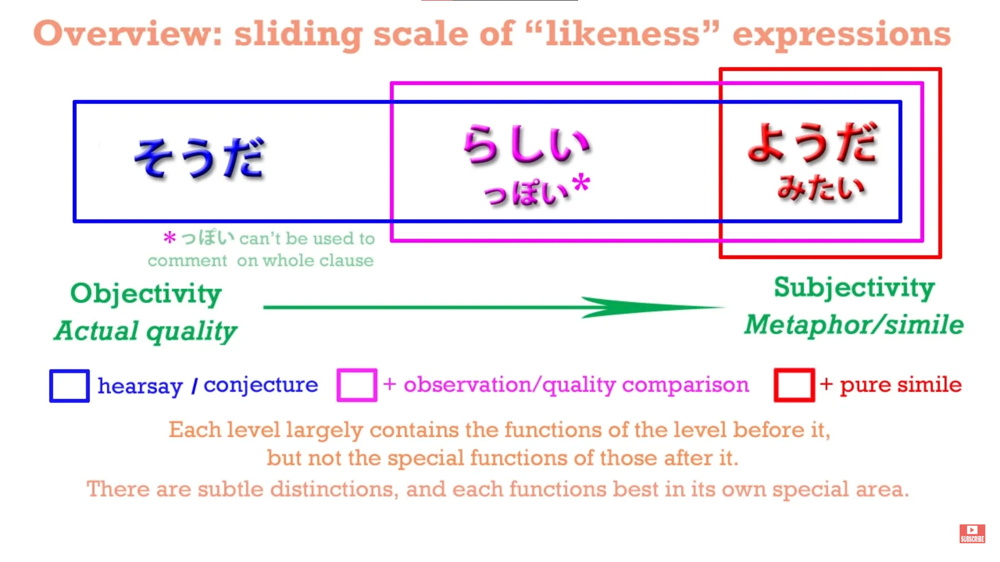
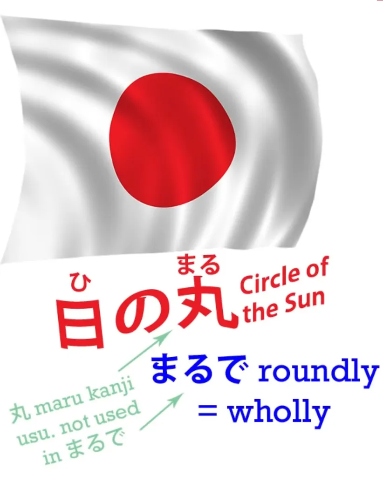
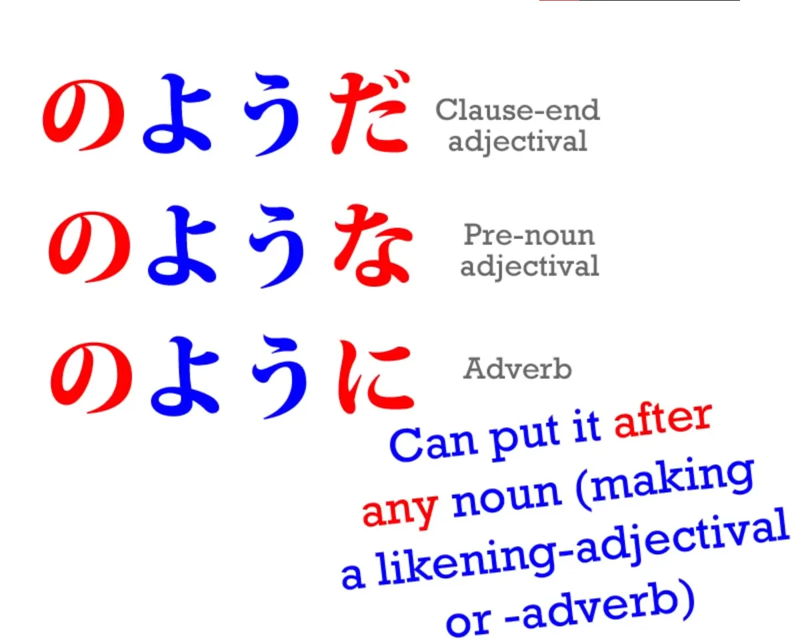
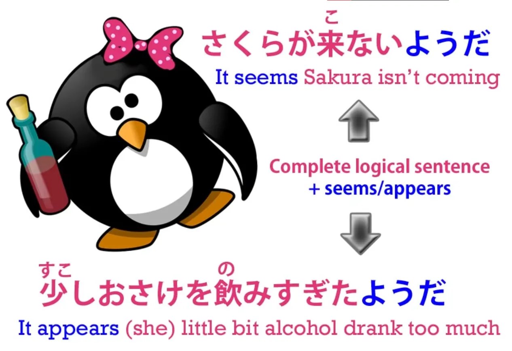
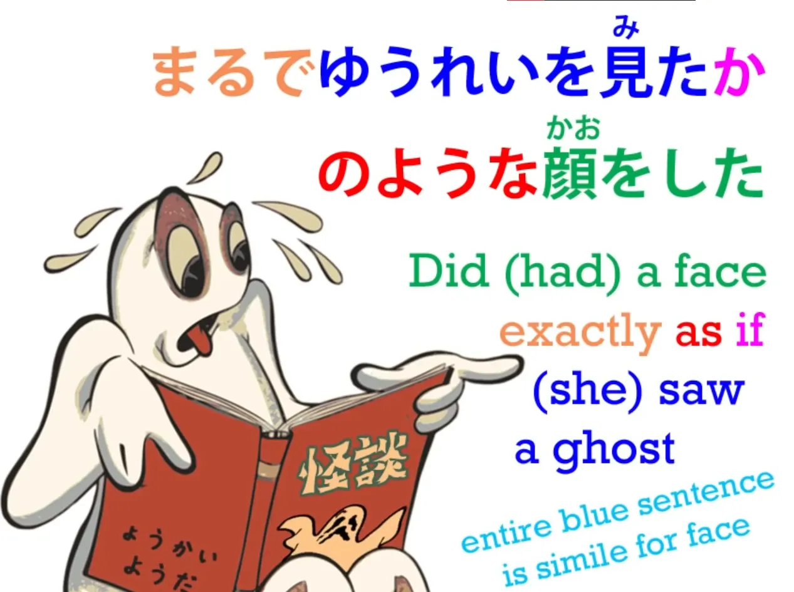
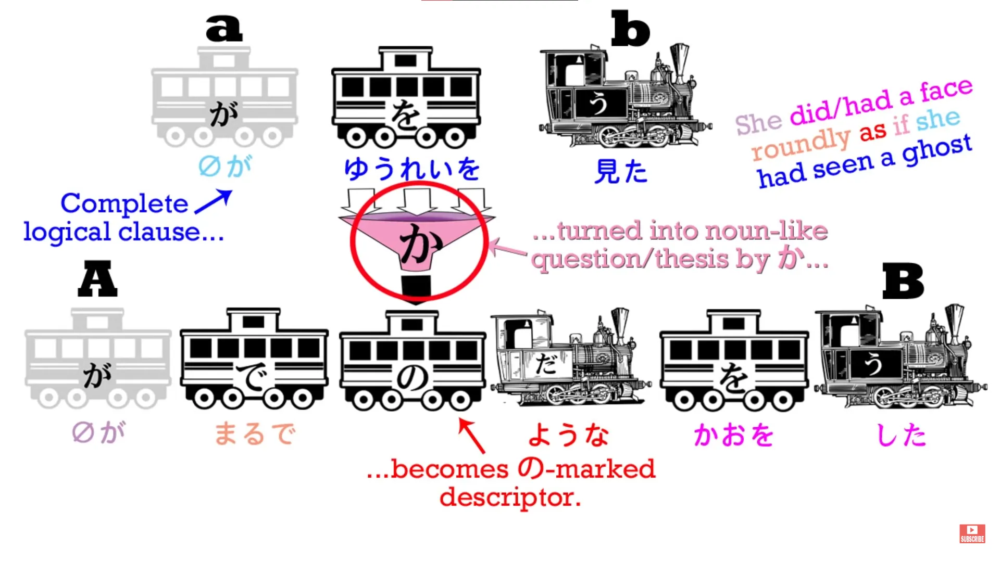
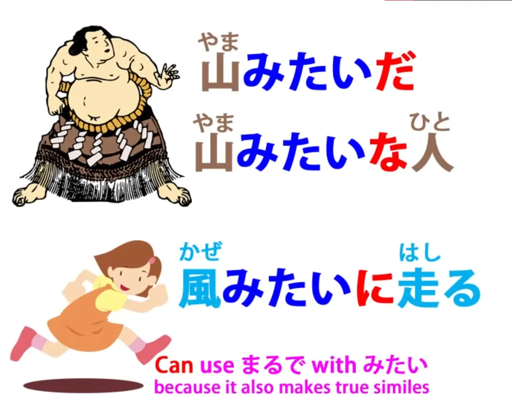
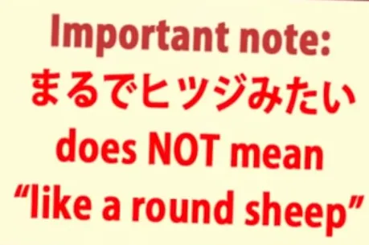
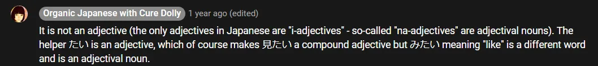
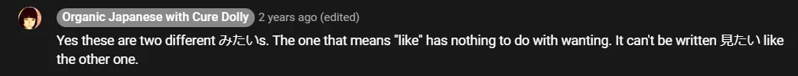

# **26. Similes: ようだ・のように・のような ・みたい**

[**Lesson 26: The crystalline logic of Japanese similes: のように・のような ・みたいgrammar**](https://www.youtube.com/watch?v=Ft_zw0mdeyI&list=PLg9uYxuZf8x_A-vcqqyOFZu06WlhnypWj&index=28&pp=iAQB)

こんにちは。

Today we're going to talk about <code>ようだ</code> and give a little mention to her cousin <code>みたい</code>. We're going to discover that <code>ようだ</code> constitutes the other end of a sliding scale with the expressions of conjecture and likeness that we discussed in the last two lessons.

At one end we have <code>そうだ</code>, at the other end we have <code>ようだ</code>, and in the middle we have <code>らしい</code>. All of these expressions can be placed at the end of a completed logical sentence in order to express that that sentence is either what we've heard or what we conjecture from the information we have or from what we can see. But when we attach them to individual words, then we have this sliding scale of meaning.

With <code>そうだ</code>, as we know, we use this to conjecture what the quality of something is. We can say <code>おいしそうだ</code> - <code>It looks delicious /I haven't tried it, but I think if I did, I would find it delicious.</code> With <code>らしい</code> we have a much greater degree of subjectivity. <code>らしい</code> overlaps with <code>そうだ</code> in many respects, but it can also do things that <code>そうだ</code> cannot do.

It can compare things to other things, to things that we know they aren't. We can say that an animal is <code>ウサギらしい</code> - <code>rabbit-like</code> - even though we know it isn't a rabbit. We can say that a person is <code>子どもらしい</code> - <code>child-like</code> - whether she is in fact a child or not. We are not necessarily conjecturing that the animal is a rabbit or the person is a child. We are just making that comparison.

## ようだ ・ように・ような

Now, <code>ようだ</code> can go much further. It can make an actual metaphor or simile. So with <code>ようだ</code> we can say such things as <code>a sumo wrestler is like a mountain</code> or <code>a person runs like the wind</code>. Now these are, if you like, literary style or poetic similes or metaphors.

We're not saying that the wrestler's anything like a mountain except in the sense that he's big and solid. We're not saying that a person is in any way like the wind except that she's fast. And one of the ways we know when <code>ように</code> is acting in this way is that we can use the word <code>まるで</code> with it. So we can say <code>まるで風のように走った</code> - <code>ran just like the wind</code>.

Literally, <code>まるで</code> means <code>roundly</code>.

<code>まる/丸</code> means a <code>circle</code> or a <code>round</code>, so when we say <code>まるで</code> we mean <code>roundly/wholly/completely</code>. And this is a hyperbole, which is common to many languages, certainly including English. We might say, in English, <code>That wrestler is exactly like a mountain.</code>

We might even say <code>I literally froze to death.</code> Now, that's the opposite of what we really mean: we don't mean that we <code>literally</code> froze to death, we mean that we figuratively froze to death. In literal reality we appear still to be alive. We don't mean that the wrestler is <code>exactly</code> like a mountain.

There isn't any snow on top of him! But the reason we say things like <code>exactly</code> and <code>literally</code> is to give emphasis to a poetic simile. And in Japanese the usual collocation here is <code>まるで</code>.

And this also demonstrates the difference between <code>ようだ/ような/ように</code> and the other likeness-making expressions. You can't use <code>まるで</code> with <code>そうだ</code> or <code>そうです</code>. You shouldn't use <code>まるで</code> with <code>らしい</code>. It's out of place with those expressions.

We use <code>まるで</code> when we're going on a kind of poetic flight of fancy. It's a hyperbolic expression that signals the coming of a simile or a metaphor. When we say that a person is <code>子どもらしい</code> or an animal is <code>ウサギらしい</code>, we are extending reality a bit; we are comparing it to something that it could be but isn't.

Now, if we look at the usage of these expressions, we can see that as usual in Japanese they're very logical.

The textbooks will sometimes give you lists of connections and ways of using them. But actually they all make sense. We don't need a list to tell us that <code>ようだ</code> can also be used as the adverb <code>ように</code> or that it can be placed before something as the adjective <code>ような</code> - because these connections are simply the same connections that you can make with any adjectival noun.

The only thing we have to know is that, just like <code>らしい</code> and unlike <code>そうだ</code>, we can use it with any kind of a noun, not just adjectival nouns. And that also makes sense because with both <code>らしい</code> and <code>ようだ</code> we can compare things to other things, whereas with <code>そうだ</code> we can only conjecture at the quality of a thing, something that can be expressed by an adjective or an adjectival noun. And when we attach it to a verb, as we've seen, it has a slightly different meaning.

However, <code>ようだ</code> has a special connection that the others don't have.

As you know, we can simply pop it onto an entire sentence, as we can the other two, with the meaning of <code>(that sentence) is what appears to be the case</code>. But we can also put it onto an entire, complete sentence with a different meaning. We can do it in order to turn the whole sentence into our simile.

So, for example, we can say <code>まるでゆうれいを見たかのような顔をした</code> - <code>She had a face (or made a face) exactly as if she had seen a ghost.</code>

Now, as we see, <code>she had seen a ghost</code> is an entire logical clause. In Japanese we have the zero-particle for <code>she</code>, but it's a complete logical clause: <code>she saw a ghost</code> - <code>ゆうれいを見た</code> - <code>zeroがゆうれいを見た</code>. Now, then we put <code>か</code> onto the end of it. What is this <code>か</code>?

## The か particle

We haven't talked an awful lot about the か-particle because in です/ます Japanese you use it to mark a question. You can use it to mark a question in informal Japanese, which is what we usually use here, but mostly we don't because paradoxically it doesn't seem polite to put <code>か</code> at the end of an informal question - it tends to seem a little bit blunt or curt.

However, the question-marker <code>か</code> has another important function. And that is that it can bundle a statement into a kind of question, and that's what's happening here. We start off with <code>まるで</code> to signal that we are going to use a simile.

Then we make our completed statement - <code>ゆうれいを見た</code> - <code>zeroがゆうれいを見た</code> - <code>she saw a ghost</code>. And then we add <code>か</code> and that turns it into a question. It gives us our <code>if</code> - <code>as if she had seen a ghost</code>.

And that <code>か</code> gives us our questioning <code>if</code>. In fact, she hadn't seen a ghost, so this isn't really a statement; it's a possibility, a potentiality, an if. What she actually did perhaps was saw the fees that PayPal charged her for an international money transfer.

We're not suggesting that she really saw a ghost. We are suggesting that the face she manifested - <code>顔をした</code> - was similar to the face that she would have manifested if - <code>か</code> - she had seen a ghost.

Now, the other thing that we need to understand about this <code>か</code> is that it in effect nominalizes the logical clause that it marks.

So what it's doing is turning this complete logical clause into a question, a hypothesis, an if, that then functions structurally as a noun. So it can be marked by の, which can only happen to a noun. And so this new noun, this object that we've created from an entire logical clause, can now be connected to another noun by the particle の.

<code>よう</code> is a <code>form</code> or a <code>likeness</code> - <code>やまのよう</code> is the form of a mountain, <code>風のよう</code> is the form or likeness of the wind, and in this case, <code>ゆうれいを見たかのよう</code> is the likeness of this object that we've created from the hypothesis of having seen a ghost. Now, again, this is not something we can do with any of the others. We can't even do it with <code>みたい</code>, which works in most respects pretty much exactly the same as <code>のよう</code>.

## みたい

<code>みたい</code> is the less formal cousin of <code>よう</code> and broadly means the same thing and broadly can be used in the same ways.

It's an adjectival noun just like that <code>よう</code>, can be used with <code>に</code> to make it an adverb or with <code>な</code> to make it a before-the noun adjective just as any adjectival noun can be. The main things to remember about it is simply that it's less formal, so you don't use it in an essay.

On the other hand, you might prefer to choose it when you're talking to a friend over <code>ようだ</code> in many cases, just because it sounds a bit less formal and a bit more friendly. But you can't use it with a completed sentence.

You can use it with a complete sentence in order to conjecture that that statement is the case, but you can't use it with <code>か</code> to use a complete sentence as a simile. You have to use <code>かのようだ/かのように</code> for that. The other thing to note is that sometimes, probably because it is very casual, the <code>だ</code> or <code>です</code> gets left off from <code>みたい</code>.

You might say <code>まるでヒツジみたい</code> - <code>just like a sheep</code>.

This isn't correct grammar - you ought to say <code>みたいだ</code> - but it's very common to leave it off. It's not common to leave it off of <code>ようだ</code>.

::: info
I will just in case add that this adjectival noun みたい is NOT the same as 見たい (an adjective meaning <code>see-inducing</code>). These are two different <code>みたいs</code>. You can’t write this みたい as 見たい, else it will be an adjective <code>see-inducing</code>. What Dolly-先生 says in the comments:  

:::
