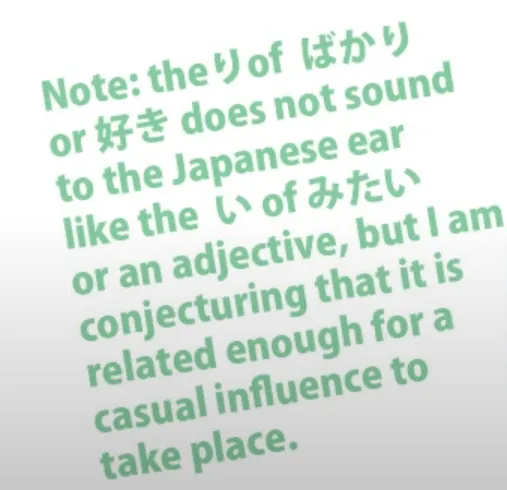

# **27. ばかり**

[**Lesson 27: Bakari meanings:: crazy patchwork or logical pattern?**](https://www.youtube.com/watch?v=jqC60f-c1ng&list=PLg9uYxuZf8x_A-vcqqyOFZu06WlhnypWj&index=29&pp=iAQB)

こんにちは。

Today we're going to talk about <code>ばかり</code>, which is one of those Japanese expressions that the textbooks can be very confusing about. They will tell you that it has a number of different, seemingly random meanings which attach with different grammar structures that you have to memorize. It's another of these laundry lists that the textbooks love to give you.

Fortunately, as is often the case, we can cut through all this simply by looking at what the word really means and how it logically works in different situations. This will give us a key both to the meanings and to the structure in its different uses. <code>ばかり</code> is essentially a noun.

You'll hear it described as other things, but in practice it works as a noun. We use <code>だ</code> after it, which we can only do with a noun, although sometimes we will find the <code>だ</code> or <code>です</code> left off in casual speech, just as with <code>みたい</code>, which we discussed last week. I notice that a lot of the times when a <code>だ</code> or <code>です</code> is left off, the word does end in -い, so I think that might be a slight influence from adjectives, although it is not an adjective.

It is a noun.

So what does it mean? Its meaning is very simple. It means <code>just</code> or <code>nothing but</code>. And one of the commonest uses is simply to place it after a past tense statement to say that that has <code>just</code> taken place.

It works exactly the same as in English. If we say <code>来たばかり</code> - <code>I just came</code> - that's exactly what we also say in English: <code>I just came</code> or even <code>I only just came</code>. It means that something has happened a very short time ago.

Why do we use, both in English and Japanese, a word meaning <code>nothing but</code> in this case? Well, like many words, it is a hyperbole. We discussed hyperboles in the case of <code>まるで</code> in the last lesson, didn't we?

When we say <code>I just came/来たばかり(だ)</code>, we are saying that nothing has happened except that I came. I came such a short time ago that there hasn't been time for anything else: <code>I just came/I only just came/来たばかり(だ)</code>. Now, this is very often very much a hyperbole.

Suppose, for example, that we meet a friend in the street and the friend says "Let's go for coffee and cakes" and we say <code>食べたばかり</code> - <code>I just ate</code>. Now, what we're literally saying here is that I ate such a short time ago - milliseconds ago - that nothing else has happened in between eating and now.

Now, obviously that's not literally true. One must have left the place where one did the eating and walked down the street at least. But hyperbolically we're saying that we ate and nothing else happened between then and now.

The textbooks will tell you that this use of <code>ばかり</code> is attached to the plain past of a verb. Now, that's true, but it's also confusing for two reasons. First of all, saying <code>plain past</code> implies this whole world where we are taught that the <code>real</code> forms of verbs are the <code>ます</code> forms, so we have to deconstruct them every time we do anything with them.

We don't need to say <code>plain past</code>, because everything we do with a verb inside of a sentence we are doing to the plain form of the verb even if we are using formal Japanese by putting ****です**** and ****ます**** on the end. <code>です</code> and <code>ます</code> are nothing more than decorative appendages that we put at the very end of a sentence.

The other thing that makes this explanation confusing is that while it's true that we do put it after the past form of a verb, we are not really attaching it to the past form of the verb. This is not logically what's happening. And it's one of those things that makes it sound like a random rule when it isn't.

What we are attaching <code>ばかり</code> to is a completed action. And what we are saying is how long ago it happened. We're saying it happened a very very short time ago.

So we have to have a completed action and of course it has to be in the past, because that's what we're saying about it. If it were in the non-past it wouldn't make any sense, would it? So we can say it attaches to the plain past of the verb or we can say it attaches exactly where it logically has to attach and where it would make no sense if it didn't.

Now, the next use of <code>ばかり</code> is one that people sometimes find confusing because it expresses that there is a great deal of something. Now, <code>ばかり</code> obviously is a limiting word, so why is it used to express that there is a great deal of something? Now, once again, this is perfectly logical and natural and we use it in English as well.

If we say <code>There are nothing but cakes in that shop!</code> - now, we may mean it literally, but very often we mean there are other things, but there are an awful lot of cakes. When I was staying in the countryside in Japan and I was moving to Tokyo for a while, somebody I knew there thought it was a bad idea for me to move to Tokyo and said, <code>東京は外人ばかりだ</code> - <code>In Tokyo there's nothing but foreigners.</code>

Now of course this person did not mean that there was nothing but foreigners in Tokyo; he meant that there are a lot of foreigners in Tokyo - and he knows that I don't want to be associating with foreigners who are going to start talking English at me. (It's all right - I avoided that.) So this is just a very obvious, natural use of <code>ばかり</code>.

Now, we can extend this further by saying that someone is doing something a lot or is doing it continuously. Again, the textbooks give you these two meanings and make it sound a little complicated, but there's nothing complicated about it. It's very easy to understand from context.

The way we do it is that we put <code>ばかり</code> after the て-form of the verb.

So, if you've ever heard <code>犬のおまわりさん</code>, which is a charming children's song about a lost kitten: <code>まいごのまいごのこねこちゃん</code> - I'll put a link below so you can listen to it if you would like to. Now, when the dog policeman (<code>犬のおまわりさん</code>) asks the kitten what her name is and where she lives, the song says <code>ないてばかりいるこねこちゃん</code>.

Now, <code>ないてばかり</code> means <code>doing nothing but cry</code>. That's what it literally means, and in this case it means it quite literally. She did nothing but cry. She went on crying and she didn't answer, she didn't say what her name was or where she lived.

And that's where we get the idea of continuing to do something. You don't stop doing it, you don't do anything else, you go on doing it: <code>してばかり</code>. It can also be used figuratively. You can say that somebody does nothing but play golf.

Now, in this case it's a hyperbole, isn't it? Nobody does nothing but play golf. Everybody sometimes eats, sometimes sleeps, and occasionally plays <code>Captain Toad</code>, because everybody plays <code>Captain Toad</code> sometimes.

So we have a hyperbole. We're not saying that someone continues doing something and doesn't do anything else. We're saying that they do it an awful lot. It's a simple enough hyperbole and exactly the same hyperbole that we would have in English: <code>She does nothing but play Nintendo</code>.

Now, <code>ばかり</code> can also be used to make two conjunctions. Conjunctions, as we know, are things that connect together two complete logical clauses in a compound sentence. So we can say <code>うたったばかりか、おどった</code> - <code>she didn't just sing, she also danced</code>.

Now, the only thing you really have to understand here is the use of <code>か</code>.

<code>か</code>, as we know, is the question marker and, as we discussed last week, it can turn a statement into a hypothesis, a question for discussion. But it can also do another thing and that is it can, especially in colloquial usage, throw things into the negative.

And we have the same in English, don't we? When we ask a question in order to show a negative. We can say <code>Do you think I'm going to do that?</code> meaning <code>I'm not going to do that.</code>

And it's the same with <code>か</code> in Japanese: in some cases we put <code>か</code> after something to say it isn't the case. So if we say <code>ばかり</code> we're saying <code>only that is the case</code> and if we say <code>ばかりか</code> we're saying <code>not only that is the case</code>.

The other common conjunction we make with <code>ばかり</code> is <code>ばかりに</code>. <code>に</code> can sometimes be added to something in order to make a conjunction. We've seen this with <code>のに</code> and I made a [**video**](https://www.youtube.com/watch?v=Au5JOtcwE7A&ab_channel=OrganicJapanesewithCureDolly) about this a while ago which you may want to watch.

<code>ばかりに</code> is an explanatory conjunction. We're saying that something happened and then we're putting a <code>because</code> at the end of it and saying it was because something else happened. The most usual explanatory conjunctions are <code>から</code> or <code>ので</code>, but <code>ばかりに</code> has a special implication.

It's not just saying that something happened because of something, it's saying that it happened JUST because of something. Again we can liken <code>ばかり</code> to English <code>just</code>. <code>耳が大きいばかりに、 誰も遊んでくれない</code> - <code>Just because my ears are big, no one will play with me.</code>

The textbooks will perhaps caution you here that <code>ばかりに</code> doesn't necessarily mean this conjunction, and that's true. But understanding it from context is simple because we all know that a conjunction can only sit at the end of a complete logical clause that's followed by another logical clause.

If <code>ばかりに</code> is not at the end of a logical clause then it's not the conjunction, and if it's in the middle of a sentence, which it normally will be, it must make sense to put a comma after it. Because all conjunctions must logically be able to take a comma after them.
