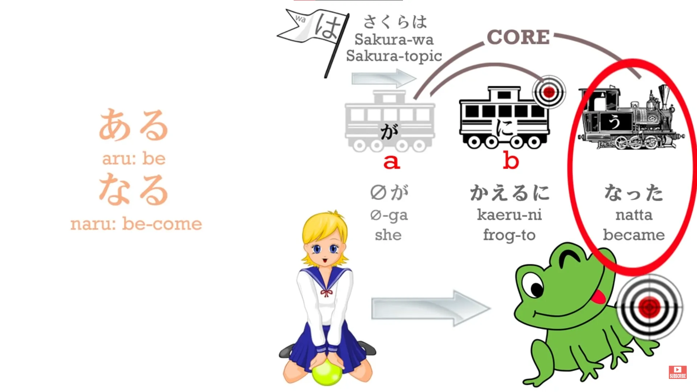
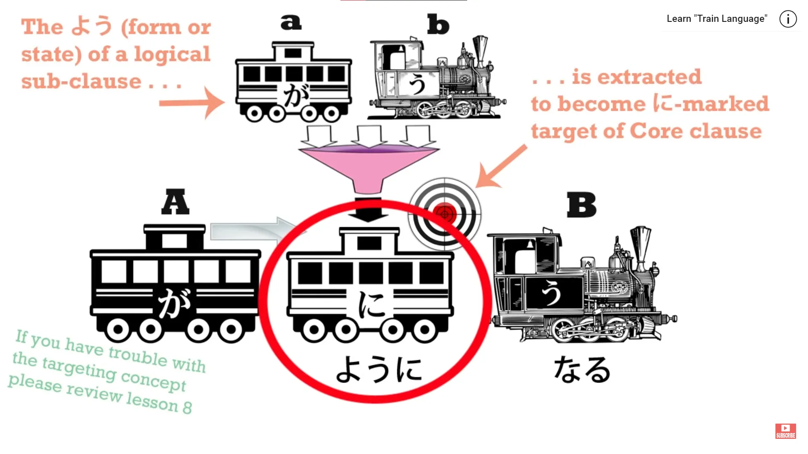
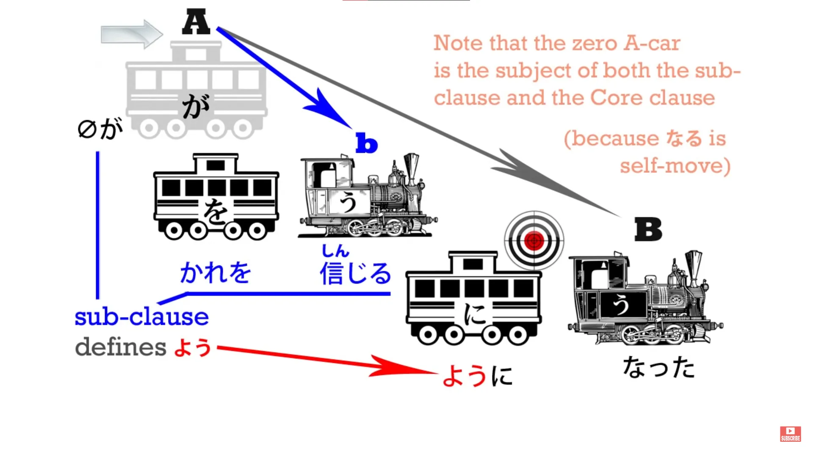
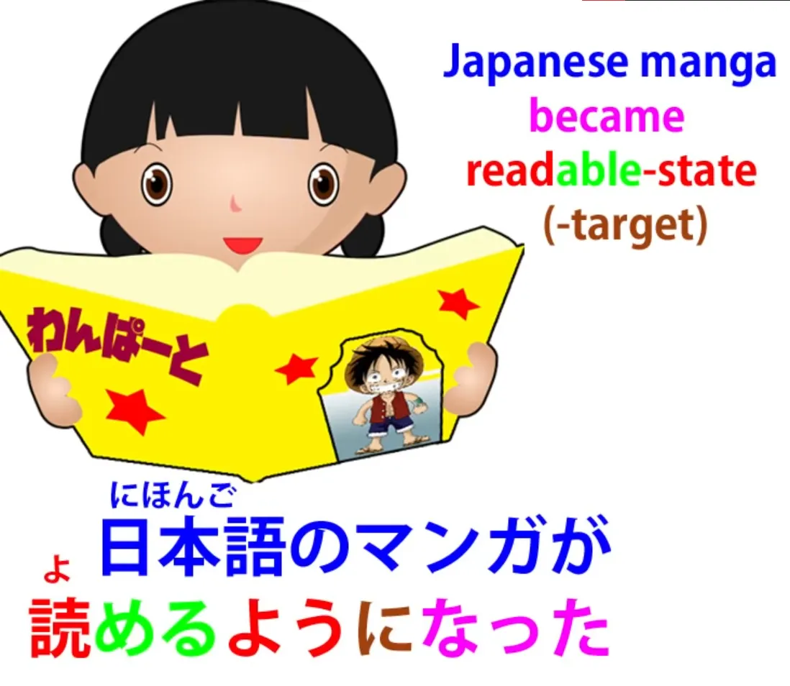
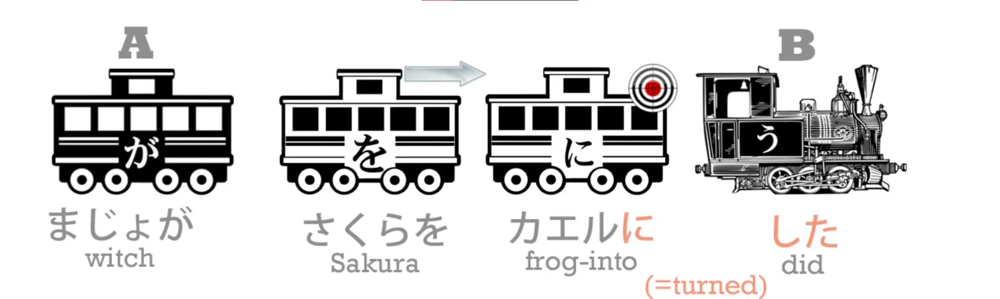
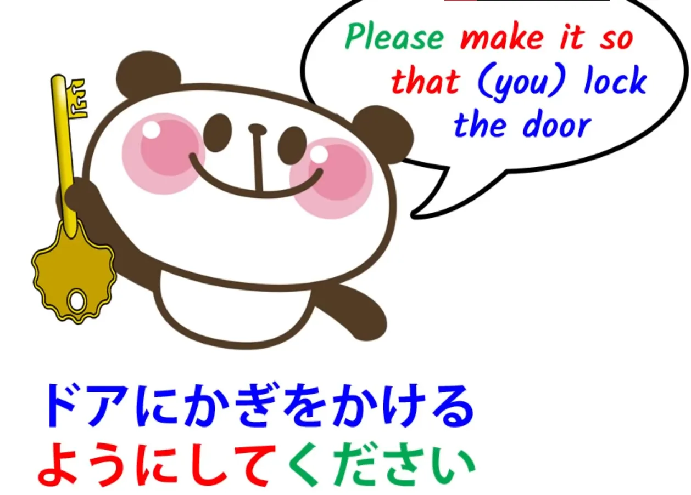
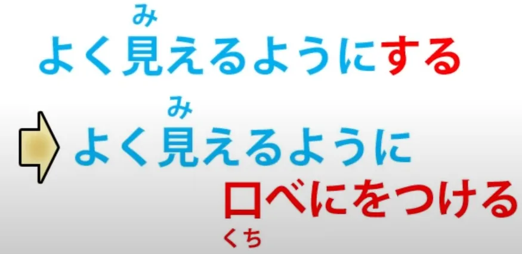

# **28. ように - one key to all the main uses**

[**Lesson 28: You ni- one key to all the main uses! It's easy when you know**](https://www.youtube.com/watch?v=IE7WgIOOGbM&list=PLg9uYxuZf8x_A-vcqqyOFZu06WlhnypWj&index=30&pp=iAQB)

こんにちは。

*Today* we're going to talk about <code>ようになる</code>, <code>ようにする</code>, ことにする<code>, </code>ことになる"*(nope)*. Now, all the elements of these expressions we've already learned, so what we need to do now is to see how they fit together in these cases, what they mean, and why they mean what they mean.

So let's just do a quick recap of <code>になる</code> and <code>にする</code>. As we know, the two primordial Japanese verbs are <code>ある</code> and <code>する</code>. <code>ある</code> is the mother of all self-move verbs and <code>する</code> is the father of all other-move verbs.

<code>なる</code> is closely related to <code>ある</code> -- <code>ある</code> means <code>be</code>; <code>なる</code> means <code>become</code> -- so we can say that <code>ある</code> and <code>なる</code> are the static and dynamic versions of the same verb. That is, the same verb being still and moving in time.

Now, we know that when we use a noun followed by <code>になる</code>, we mean that something turns into that noun.

<code>に</code> marks the target of the transformation and <code>なる</code> is the transformation itself, the becoming.

## ようになる

So, when we say <code>ようになる</code>... Well, we looked at <code>よう</code> last week, didn't we, and we saw that when we're comparing things or likening things <code>よう</code> means a <code>form</code> or a <code>likeness</code>. Its basic meaning is a form or a state of being.

When we say <code>りきしは山のようだ</code> -- <code>sumo wrestler is like a mountain</code> -- we're not saying that the sumo wrestler <code>is</code> a mountain, we're extracting the form or the state of being of the mountain and applying it to the sumo wrestler. We're not saying that the sumo wrestler is the mountain, we're saying that the wrestler is the mountain's <code>よう</code>, the mountain's form or state of being.

So in English we say the wrestler is <code>like</code> the mountain; in Japanese we say the wrestler is the form or the state of being of the mountain -- we might say, the <code>likeness</code> of the mountain. Now, when we use <code>よう</code> in the expressions we're talking about today, we don't add them to a noun like <code>山</code>, we add them to a complete logical clause.

The textbooks sometimes say we're adding them to a verb, but what we're really doing is adding them to a logical clause with a verb-engine.

And <code>よう</code>, as we know, is a noun; the logical clause becomes the adjectival, the descriptor, for that noun, so we know that any verb-engine together with the logical clause it heads can become an adjectival so we're not saying <code>のよう</code>, we're NOT saying the likeness of something else here. So when we have a logical clause plus <code>ようになる</code>, we're saying that something became or entered the state of being or the form of that logical clause.

So, for example, if we say <code>彼を信じるようになった</code>, we're saying <code>I came to believe him.</code>

<code>彼を信じる</code> (or <code>zeroが彼を信じる</code>) --<code>I believe him</code> -- is a logical clause, and we're saying that I moved into the state, I became the state of that logical clause: <code>I came to believe him.</code> This is often used with a potential helper verb.

For example, we might say, <code>日本語のマンガが読めるようになった</code> -- <code>Japanese manga became readable (to me)</code>.

As you see, in both cases something is changing its state. I change my state from not believing him to believing him; the manga changes its state from being non-readable to being readable. In all cases we are talking about a change of state, a change of the existing state in someone or something from one condition to another.

And if you're wondering why we most often in Japanese speak of the manga changing state from being non-readable to readable rather than speaking, as in English we usually do, of the person changing state from not being able to read the manga to being able to read the manga, please watch the video lesson on the potential helper verb where I explain how this works. *(Lesson 10)*

## ようにする

Now, when we say <code>ようにする</code> we know that the <code>にする</code> construction is the other-move version of the <code>になる</code> construction. If we say <code>まじょがさくらをカエルにした</code>, we're saying <code>the witch turned Sakura into a frog</code>.

So <code>ようにする</code> is to make something enter a state. It doesn't enter it by itself; somebody's making it enter the state. So if we say <code>よく見えるにする</code> -- <code>よく見える</code> means to <code>look good</code>, so <code>よく見えるようにする</code> is to make someone or something look good.

Now, <code>ようにする</code> has an extended sense, and that is when we say something essentially equivalent to <code>please make sure that you do something</code>. So, we can say <code>ドアにかぎをかけるようにしてください</code> and that means <code>please make it so that you lock the door</code>.

And I think you can see the difference here between simply saying <code>ドアにかぎをかけてください</code>, which is just <code>please lock the door</code>. In one case you're kind of assuming that the person will simply lock it as a matter of course; in the second case you're making a very special point of it: <code>Please make it so that you lock the door (this is important, so please make it be that way)</code>.

<code>It</code> in this case is just the same as it would be in English -- the <code>situation</code>, the <code>circumstance</code> -- "Please turn the circumstance from one in which you don't lock the door into one in which you do lock the door." So this makes a very special point of this instruction or advice.

Now, related to this is when you may say something about yourself, usually related to something you do regularly, such as saying <code>毎日歩くようにする</code>. And that means literally, <code>\[I\] (try to) make it so that \[I\] walk every day</code>.

But when you put it this way, rather than just saying <code>毎日歩く</code>, which is simply saying <code>I walk every day</code>, the implication is that you try to do so. You might not necessarily always succeed. And, you see, as with the other usage, there's some doubt as to whether you will do it.

You don't say <code>Please make it so that you lock the door</code> unless there is in your mind a certain doubt as to whether this is going to happen and you're trying to make it so that it does.

## ことにする

When you say it about yourself -- <code>毎日歩くようにする</code> -- there is also another factor in play in that when it's yourself you could also use <code>ことにする</code>, and that expresses a firm decision which we'll talk about next week in the second half of this lesson. So if you choose <code>ようにする</code> over <code>ことにする</code> you're inherently leaving a little room for doubt.

## <code>Cause-and-effect</code> usage of ように

Now, <code>ように</code> can also be used with a clause behind it and a clause in front of it, in order to say <code>do one thing in order that another thing may happen</code>.

The textbooks treat this as if it were a different piece of grammar, a different grammar point, but in fact it isn't, it's the same as plain <code>ようにする</code>, and the only reason it seems a bit different is because we put it a little differently in English. But we shouldn't be thinking about English; we should be thinking about Japanese. So let's take a look at how this works.

Let's take a sentence that we've already had: <code>よく見えるようにする</code> -- <code>make something (or someone) look better</code>. Now, let's change that to <code>よく見えるように口紅をつける</code> -- "in order that she will look better (or I will look better, or someone will look better), apply lipstick".

Now, as you see, in English the ways of putting those two ideas are different, and that's why the textbooks and the conventional explanations talk as if we had two separate, unrelated grammar points. But if you look at what's going on, you can see that they're actually the same thing.

In one case we're saying <code>make someone or something look better</code> without specifying the means. We're just using the neutral, catch-all verb <code>する</code>, which is the fundamental other-move verb. When we say <code>よく見えるように口紅をつける</code>, <code>口紅をつける</code> is simply replacing the <code>する</code>.

Instead of unspecifically saying simply <code>make someone look better</code>, it's saying <code>do a specific thing in order to make someone look better</code>. Now, <code>する</code> is also an action; it's just an unspecified action. It's just <code>do/act/make something happen</code>.

<code>口紅をつける</code> specifies what that <code>する</code> might be in a particular case. So you see, we have exactly the same construction here, not two separate <code>grammar points</code>, as they like to call them.

## ように at the end of a sentence

And one final note is that you will sometimes hear <code>ように</code> at the end of a sentence, usually a ます-ending sentence. This is used primarily for prayers and petitions. So you might say <code>日本に行けますように</code>.

And you might say that at a shrine or when you're wishing on a falling star or perhaps just when you're expressing a wish that a friend might be able to go to Japan. Why do we use this? Well, obviously it's a kind of shortening of <code>ようにする</code>.

If you're talking to a deity or a fairy, it might be short for <code>ようにしてください</code>. So, next week we move on to <code>ことになる</code> and <code>ことにする</code>.
