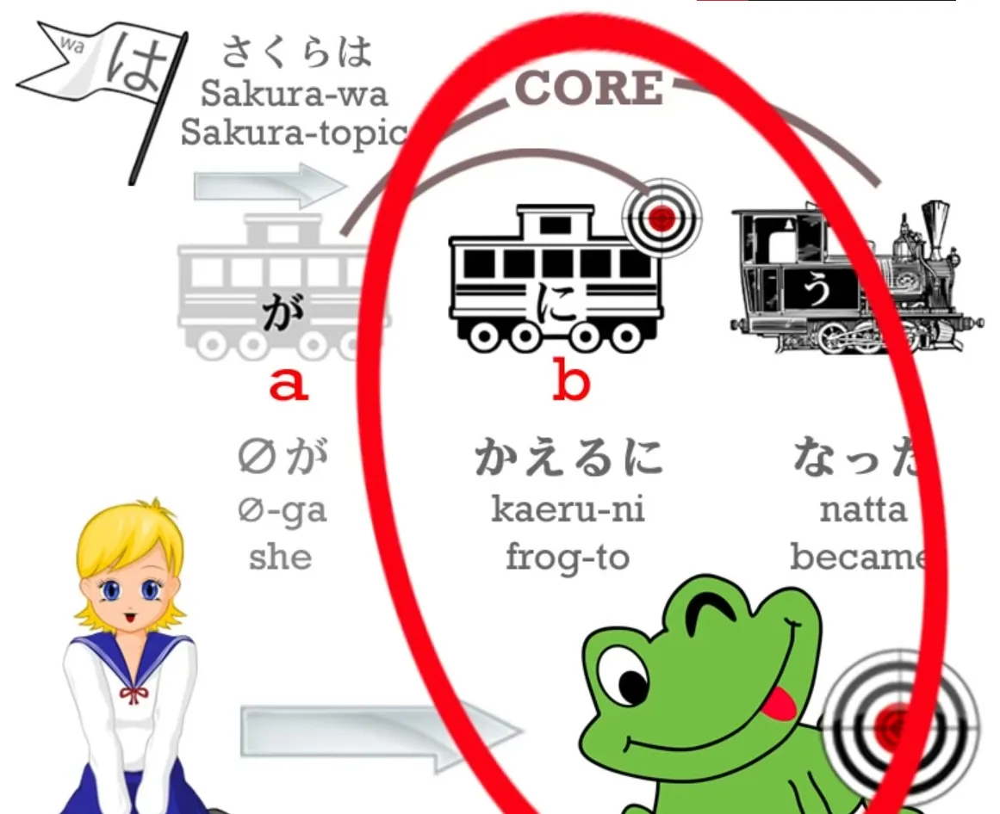
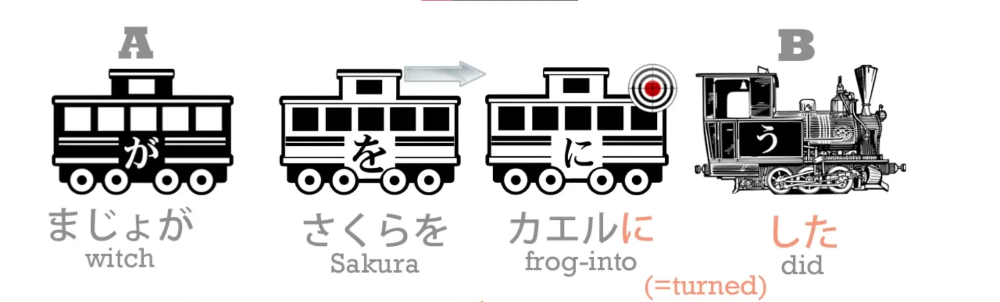
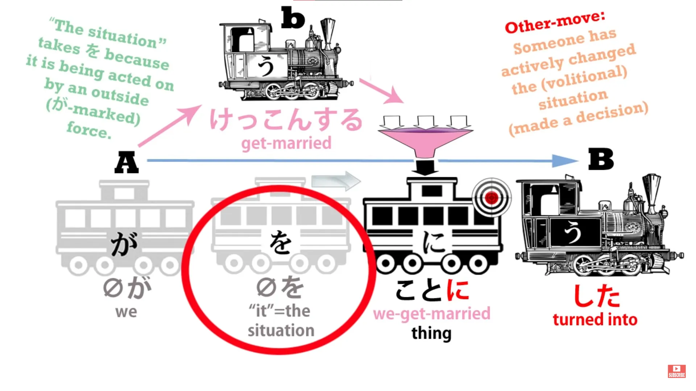
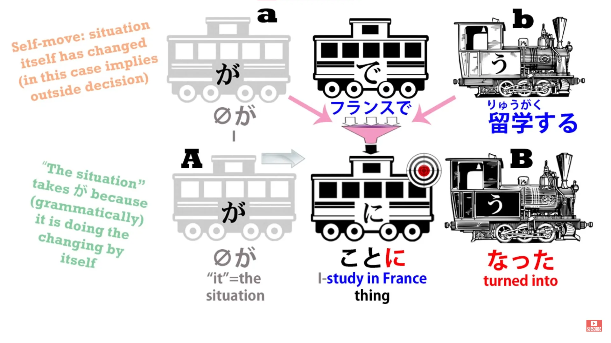
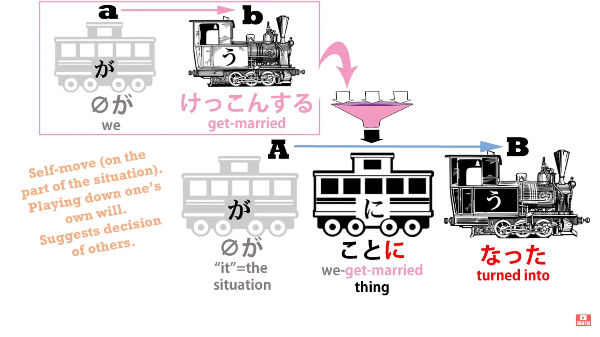
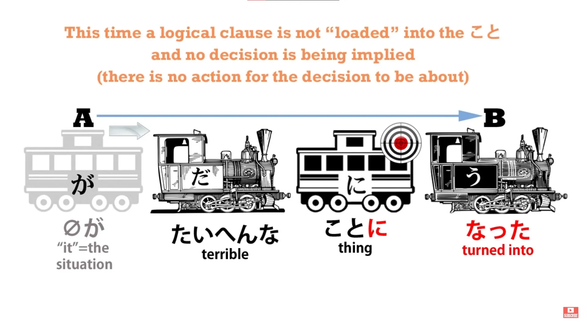
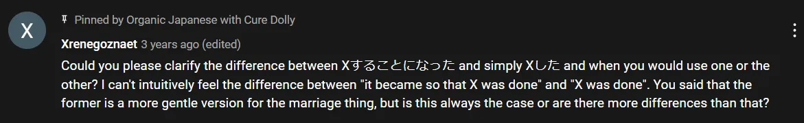
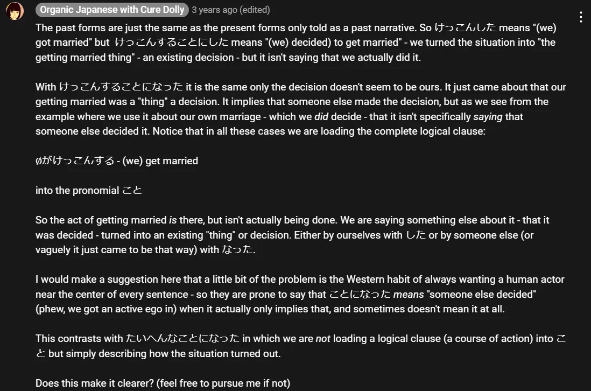
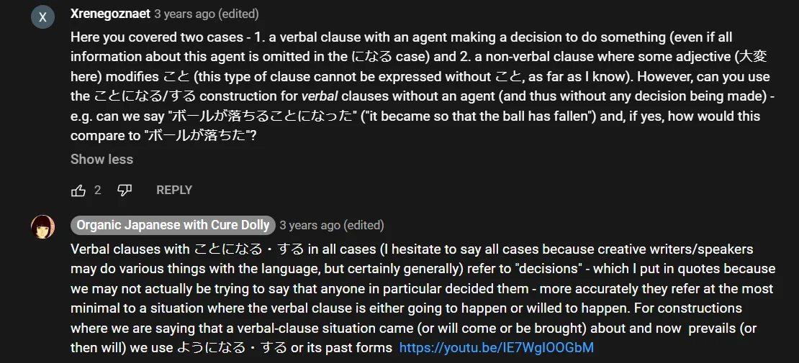

# **29. ことにする & ことになる**

[**Lesson 29: Koto ni Suru, Koto ni Naru. The simple logic behind them.**](https://www.youtube.com/watch?v=sH3iGBkA93w&list=PLg9uYxuZf8x_A-vcqqyOFZu06WlhnypWj&index=31&pp=iAQB)

こんにちは。

Today we're going to discuss <code>ことにする</code> and <code>ことになる</code>. Last week we looked at <code>ようにする</code> and <code>ようになる</code> and we briefly recapitulated the fact that when we say <code>(something)になる</code> we mean that the thing we're speaking about turned into whatever is marked by に.

So if we say <code>さくらはカエルになった</code>, we're saying Sakura turned into a frog.

If we say <code>にする</code>, we're saying that someone deliberately turned what we're talking about into the に-marked noun. So, if we say <code>まじょがさくらをカエルにした</code>, we're saying <code>the witch turned Sakura into a frog.</code>

So, what about <code>ことにする</code> and <code>ことになる</code>? We know that <code>こと</code> means a <code>thing</code>, not a concrete thing like a book or pencil *(=もの)* but an abstract thing, a situation, or a circumstance. *(=こと)* So, if we say <code>けっこんすることにした</code>, we're saying literally: It became the thing of getting married.

Obviously we have to have a zero-pronoun here, because something has to become something. So, what's <code>it</code>?

Well, <code>it</code> is what it might be in English: <code>the situation / the circumstance</code>. <code>The circumstance turned into one in which we're getting married/in which getting married is the thing.</code> We have to use <code>こと</code> here because, as you know, we can't attach the logical particle に, or any other logical particle, to anything but a noun.

So, we use <code>けっこんする</code> as the modifier for <code>こと</code> in order to give us a noun of the situation or circumstance of getting married. So what does it mean? <code>We turned the situation into the thing of getting married</code> means <code>We decided to get married</code> / <code>We brought about a situation in which getting married was the thing</code>.

And so the textbooks will tell you that <code>ことにする</code> means <code>decide (something)</code>, and it's not quite as simple as that, as we'll see in a moment. However, if we say <code>フランスで留学することになった</code>, we're saying <code>It became the thing of studying in France</code>, which really means <code>It came about that I am going to study in France</code>.

The situation turned from one in which I'm not going to study in France to one in which I am going to study in France.

Now because <code>ことにする</code> is a deliberate act done by whoever is making the decision, <code>ことになる</code> is taken to imply in many cases a deliberate decision. So we can translate this most of the time as <code>They're sending me to France to study</code> / <code>It's been decided that I'm going to France to study.</code>

The thing to notice here, though, is that there's no actual mention of a decision by anyone, and in this case it doesn't matter if we assume that that's what it means, because it probably does. Some people will say <code>けっこんすることになった</code>, which kind of means "It's been decided that we're getting married" or, more literally, "It's come about that we're getting married".

And the reason for saying this is that, even though in this day and age, the people who decide that they're getting married are almost always the people who are actually getting married, it sounds a little less forceful, a little less ego-centered, not to say <code>we've decided...</code> but just to say <code>It's been decided...</code> or <code>It's come about...</code> And I have to say that sounds a little bit more pleasant to me as well, but I'm just an android, so what do I know?

However, we may also say <code>たいへんなことになった</code>, and what that means is <code>It became -- the situation became -- a terrible thing</code>. And this does not carry any implication that anybody decided it ought to be a terrible thing.

It does not imply a decision, and there's no reason it would, because there's no mention of decision anywhere in <code>ことにする</code> or <code>ことになる</code>.

In many cases a decision is implied, but in cases like this -- and there are many times when you'll see <code>ことになる</code> working in this way -- all it's telling us is that the situation came about, not that anybody decided that the situation should come about. So this is why it's important to learn structure in Japanese, because if we just get a handful of Japanese and a handful of English thrown at us -- <code>ことになる</code> means <code>it is decided</code> -- well, sometimes it does and sometimes it doesn't.

The important thing to know is what's actually going on in the sentence. Then we can make a sensible assessment ourselves of what's being said when we see it in an anime or a book or in conversation.

::: info
I will just in case put up a further explanation by Dolly-先生, responding to a comment regarding this ことになる/する, which she later pinned, since I feel it can be a bit tricky.

  
Continuing with - the link is for the Lesson 28 by the way,  

*Hopefully this helps a bit in case the lesson explanation was a bit confusing, you can read the other comments [**under the video**](https://www.youtube.com/watch?v=sH3iGBkA93w&list=PLg9uYxuZf8x_A-vcqqyOFZu06WlhnypWj&index=31&pp=iAQB) if you want, perhaps some other one may also help.*
:::
