# **3. The は Particle**

[**Lesson 3: WA-particle secrets schools don't ever teach. How WA can make or break your Japanese**](https://www.youtube.com/watch?v=U9_T4eObNXg&list=PLg9uYxuZf8x_A-vcqqyOFZu06WlhnypWj&index=3&ab_channel=OrganicJapanesewithCureDolly)

こんにちは。

Welcome to Lesson 3. Some of you who have done some Japanese already may be wondering how I've managed to get through two entire lessons without using or even mentioning the は *(always read as wa)* particle. I'm well aware that most courses start you on は from the beginning. <code>わたしはアメリカ人だ</code> <code>ペンはあおい.</code> And this is really a very very bad idea because it leaves you completely unclear about what the particles really do and about the logical structure of sentences.

However, we're now ready to look at the は particle and find out what it does and, just as important, what it doesn't do. **The は particle can never be a part of the core sentence. It can never be one of the black carriages**, **the main car A** (the thing we are saying something about) **or the engine B** (the thing we are saying about it).

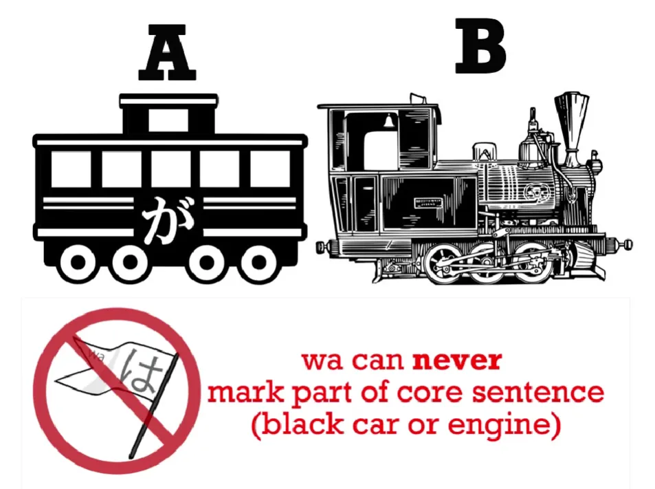

**It can't be a white car either, because white cars like the を (wo) car, are part of the logical structure of the sentence.**

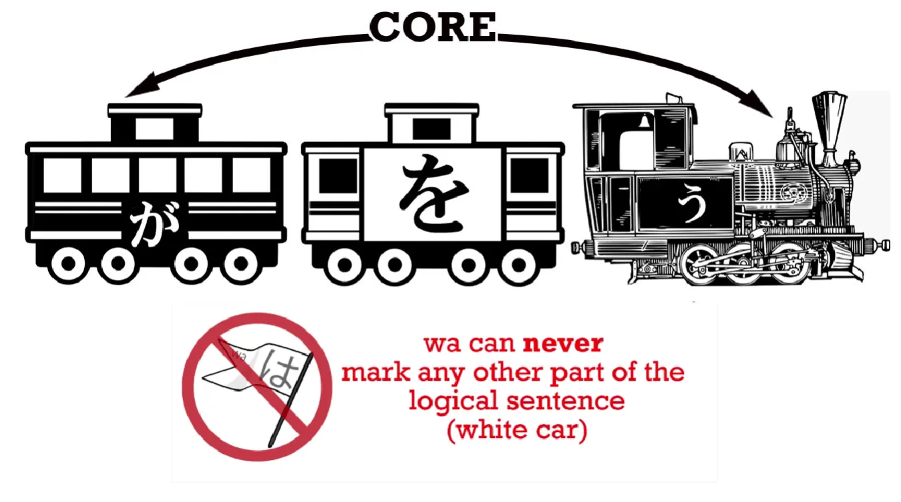

**And a は-marked noun is never part of the logical structure of a sentence. は is a non-logical particle.**

So if は is not a black car or a white car, what kind of a carriage is it? Well, it's not a carriage at all. A は-marked noun looks like this…

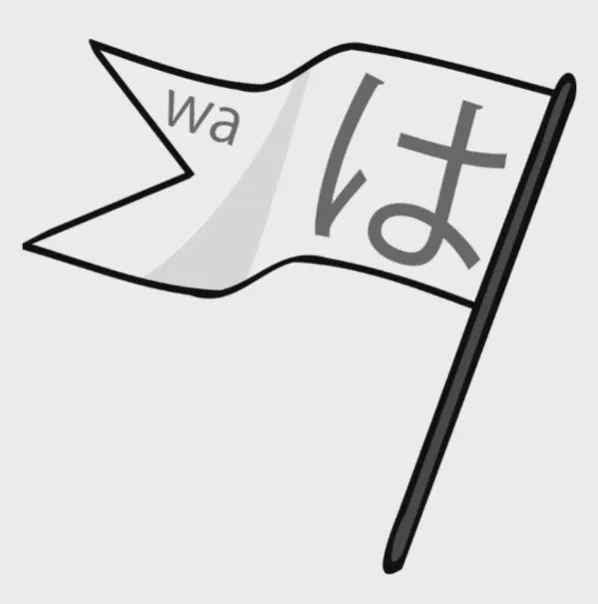

That's right, it's a flag. Why do we depict it as a flag? Because that is what は does. **It flags something as the topic of the sentence. It doesn't say anything about it. That's what the logical sentence is there for. Wa simply flags the topic.**

Now, some of the textbooks will tell you that a sentence like <code>わたしはアメリカ人だ</code> literally means <code>As for me, I am an American</code>, and that is exactly correct. If they would stick with that logic and carry it through, we wouldn't have the trouble we have.

So, <code>わたし/私は</code> means <code>as for me</code>. <code>アメリカ人だ</code> means <code>=American</code> or <code>am American</code>. So as you see, with a sentence like this something is missing, both from the Japanese and the English. We can't say <code>as for me, am American</code>. Neither can we have a sentence without an A car, without a が-marked doer. So if we put the A car in, it makes sense in both English and Japanese.

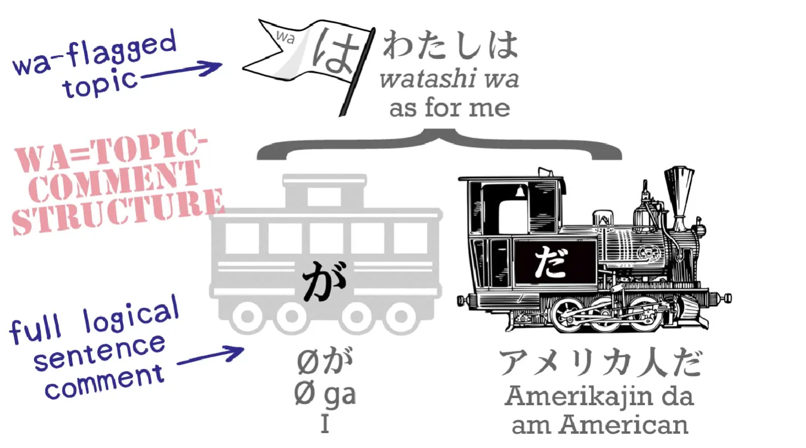

<code>私は(**zeroが)**アメリカ人だ</code> – <code>As for me, (**I)** am an American.</code>

Now, some of you may be saying, "Isn't it over-complicated? Can't we just pretend that **わたしは** is the main car of the sentence?" And the answer to that is <code>**No**</code>. Because although it works in this case and some other cases, it doesn't work in every case and that is why we really mustn't do it.

Let's take an example. There's an old joke among Japanese learners and it's only possible because of how badly Japanese is taught. The joke is: A group of people are dining in a restaurant and they're discussing what they're going to eat, and somebody says, <code>わたしはうなぎだ</code>. Unagi/うなぎ means eel, so the joke is that this person has literally said, <code>I am an eel</code>.

After all, if <code>わたしはアメリカ人だ</code> means <code>I am an American</code>, then <code>わたしはうなぎだ</code> must mean <code>I am an eel</code>. That's absolutely perfect logic – **except that <code>わたしはアメリカ人だ</code> doesn't mean <code>I am an American</code>. It means <code>As for me, I am an American</code>.**

As we know, the default value of the invisible car, the zero pronoun, is <code>私/わたし</code>, but that isn't its only value. Its value depends on context.

---

In <code>わたしはアメリカ人だ</code> (<code>As for me, I am an American</code>) the value of the zero pronoun is indeed <code>私/わたし</code>. But in <code>わたしはうなぎだ</code>, which is <code>わたしは(**zeroが)**うなぎだ</code>, zero is not <code>私</code>. Zero is <code>it</code>. <code>It</code> is the thing we are talking about, the subject of the conversation: what we are eating for dinner.

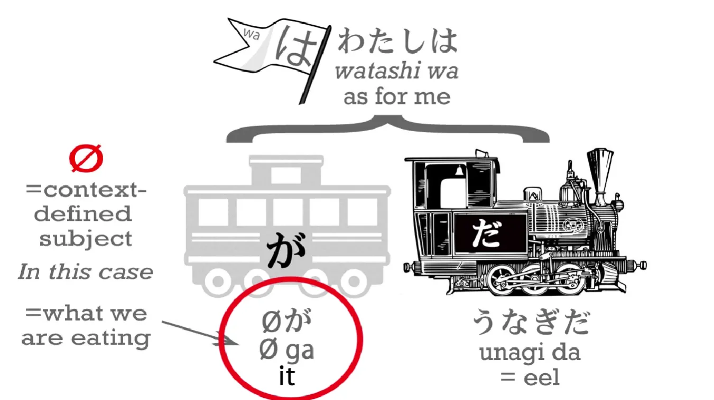

And this is going to affect all kinds of sentences as we become more advanced in Japanese. So what we are going to do now is take another one of the cars and look at that and then see how it all works together with は.

The car we're going to introduce today is a white car, and this is the に (ni) car. It makes a kind of trio with が (ga) and を (wo). In <code>A does B</code> sentences, が tells us who does the doing, を tells us what it is done to, and **に tells us the ultimate target of that doing**. Now, we don't always have a を; we don't always have a に.

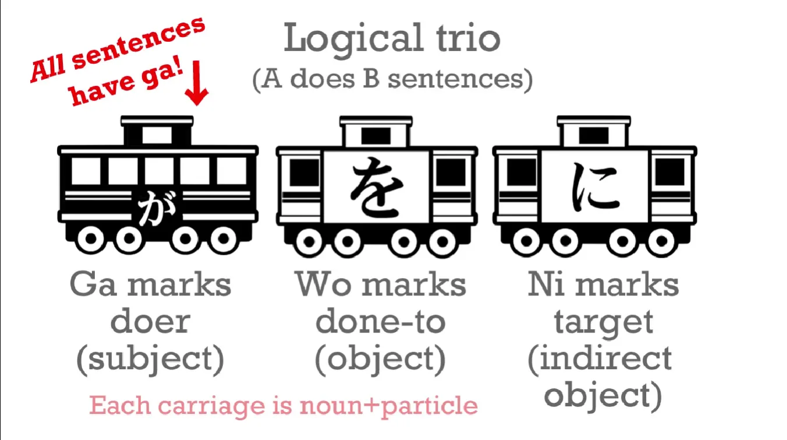

But let's take this を sentence: <code>わたしがボールをなげる</code>

ボール is ball and なげる means throw. So this is, <code>I throw a ball</code>. The core sentence is <code>I throw</code> – <code>わたしがなげる</code>, and the white car tells us what I threw: it was a ball.

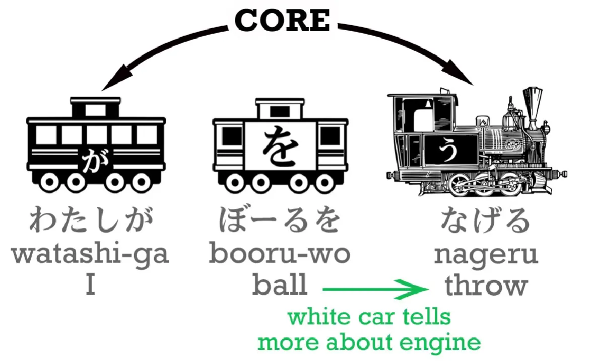

Now, if we say, <code>わたしがボールをさくらになげる</code>, this means <code>I throw a ball at Sakura</code> (or <code>to Sakura</code>). **Sakura is the destination, the target, of my throwing.**

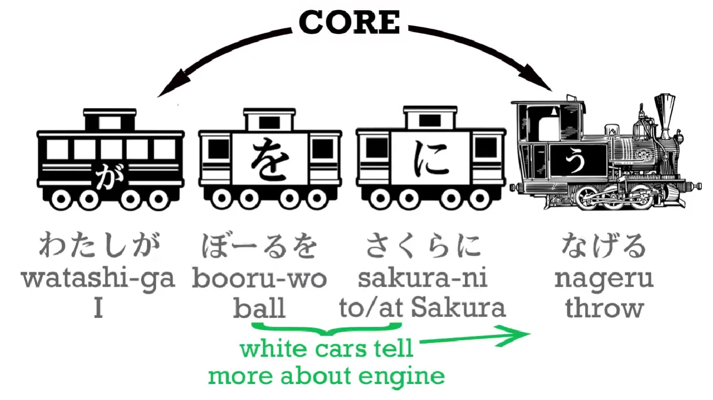

And **it's very important to note here that it is the logical particles – が, を and に – that tell us what is happening. The order of the words doesn't really matter the way it does in English. What matters is the logical particle.**

So if I say, <code>わたしにさくらがボールをなげる</code>, I'm saying, <code>Sakura throws the ball at me</code>.

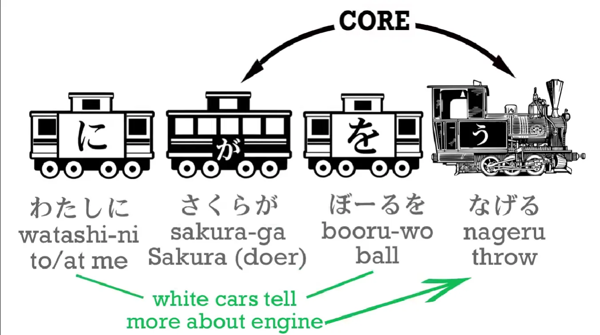

If I say, <code>ボールがわたしにさくらをなげる</code>, I'm saying, <code>The ball throws Sakura at me</code>. It doesn't make any sense, but we might want to say it in a fantasy novel or something.

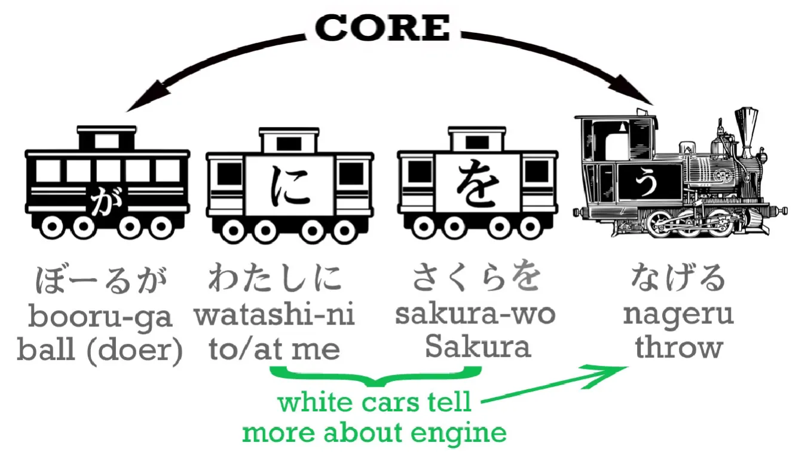

**We can say whatever we like in Japanese so long as we have the logic of the particles correct.** But now let's introduce は into this sentence: <code>わたし**は**さくらにボールをなげる.</code> This is <code>わたし**は**(zeroが)さくらにボールをなげる</code>. As we know, what it means is <code>As for me, I throw the ball at Sakura</code>.

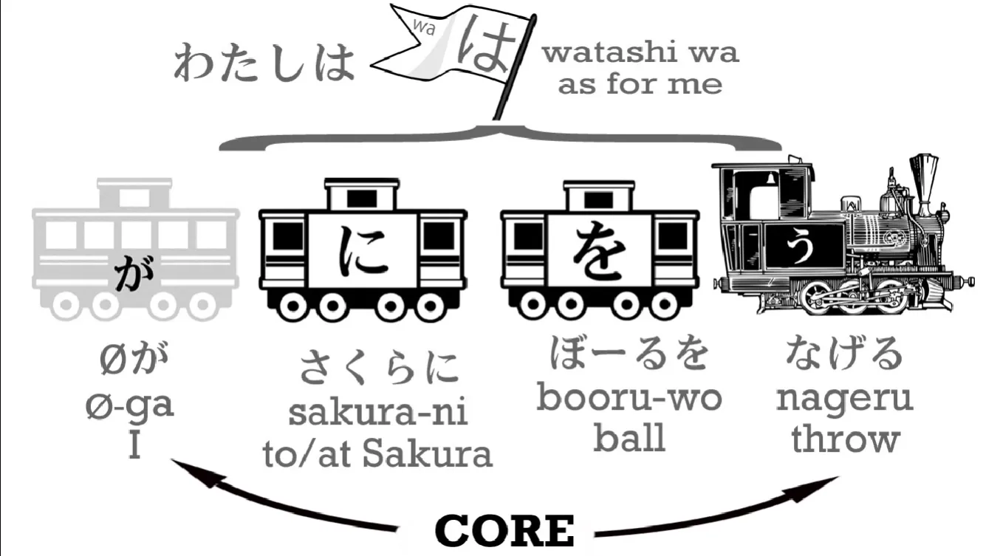

Now let's give the は to the ball: <code>ボールは私がさくらに**(zeroを)**なげる</code>. What we are saying now is <code>As for the ball, I throw it at Sakura</code>.

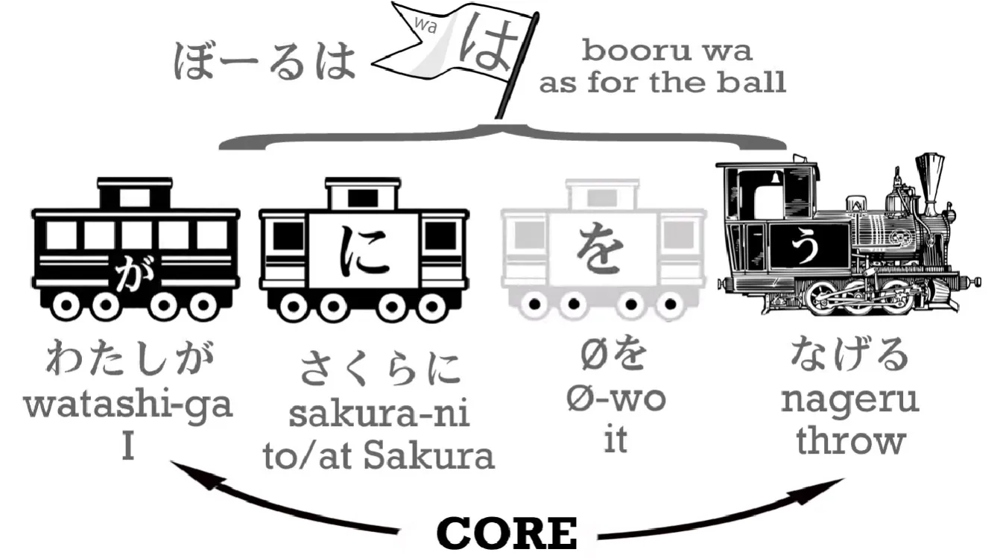

The important thing to notice here is that when we change a logical particle from one noun to another we change what's actually happening in the sentence, **but when we change the non-logical particle は from one noun to another – I can change it from me to the ball – it makes no difference to the logic of the sentence. It makes a difference to the emphasis: I'm now talking about the ball, <code>as for the ball...</code>**

---

What happens to the ball is that I throw it at Sakura, but who is doing what, and what they are doing it with and what they are doing it to, **none of that changes when you change the は particle** and that's the difference between a logical and a non-logical particle.