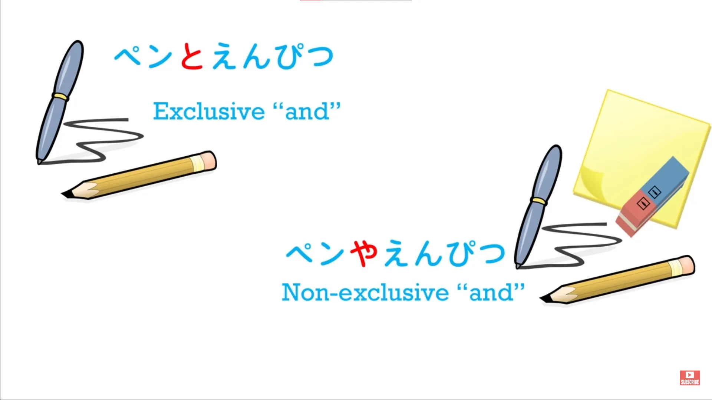
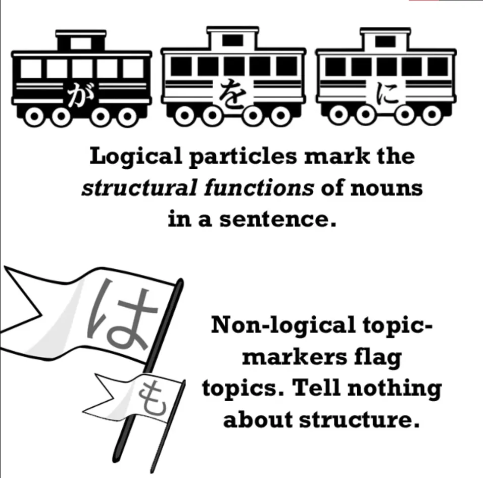
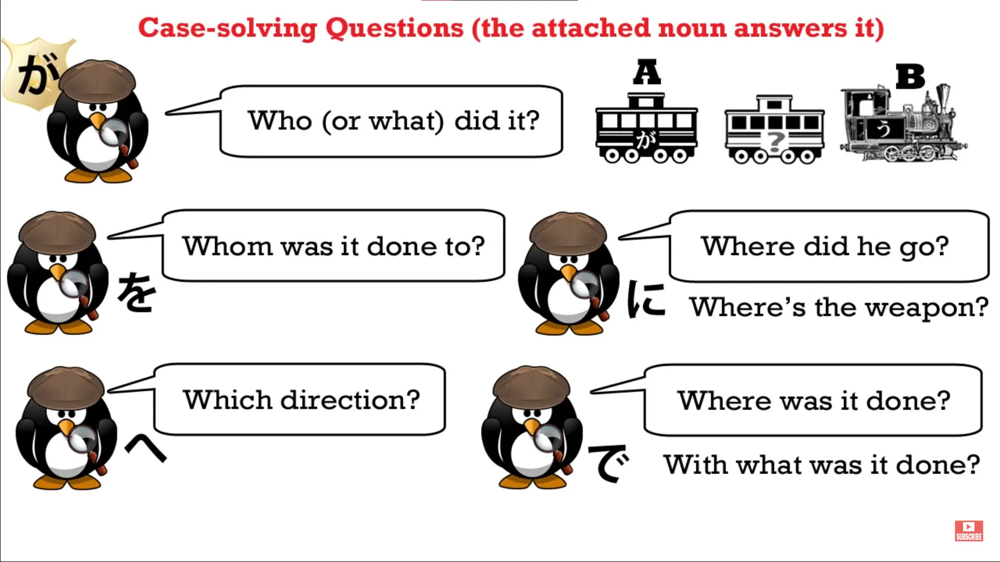
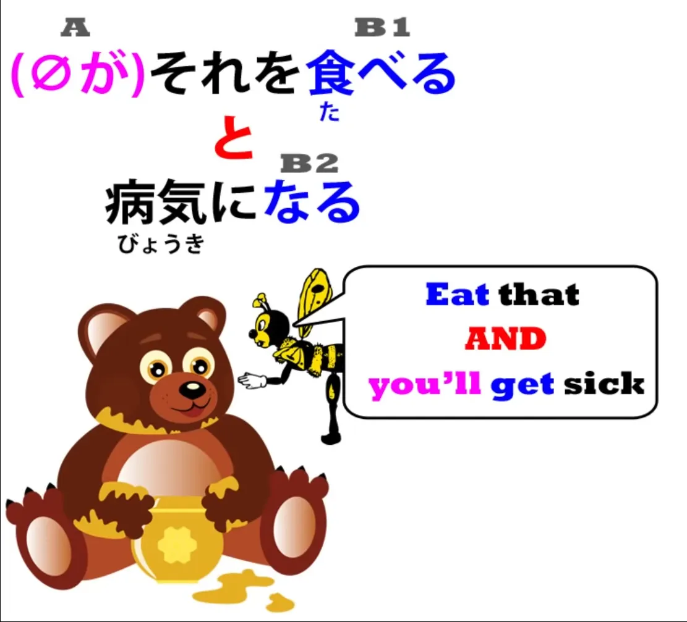

# **30. Japanese Conditionals: と**

[**Lesson 30: Japanese conditionals: とTO. What the textbooks don't tell you.**](https://www.youtube.com/watch?v=IkolA524WC0&list=PLg9uYxuZf8x_A-vcqqyOFZu06WlhnypWj&index=32&pp=iAQB)

こんにちは。

Today we're going to start talking about Japanese conditionals. Conditionals are when you say something like <code>If...</code> or <code>When...</code> And in Japanese there are a number of different conditionals, and this can cause some confusion to learners. Which one do we use, and when, and why?

As usual, we tend to get a list of these things from the text-books with complicated instructions, and as usual it helps a great deal if we can understand the underlying logic. So, this lesson we're going to start with the conditional と. Now, we've already met this と.

It is the <code>exclusive and</code> particle. I'm not talking about Boolean logic here. I'm talking about the fact that Japanese has two words for <code>and</code> which are used to connect two nouns.

One is や, and や is the same as English <code>and</code>. It means one thing <code>and</code> another <code>and</code> possibly other things too. If we say <code>hat and coat</code>, we may well have on shoes and skirt and pants and other things too, but we just say <code>hat and coat</code>.

In Japanese, if we say <code>ペンや本</code> – <code>pen and book</code> – we're saying, just like English <code>and</code>, <code>a pen and a book and maybe some other things and maybe not</code>. But if we say <code>ペンと本</code>, that is exclusive.

We're saying <code>pen and book and nothing else</code>. Now, this is important to understand because this is exactly the same と that we use as a conditional. The textbooks tend to introduce this と as if it were something different from the <code>and</code> と, but it's not – it's the same.

There is another と and that is the quotation particle which we've covered at some length in more than one lesson. That is separate from the <code>and</code> と. But the conditional と is not: it's the same と. And when we understand that, it becomes much easier to see what's going on with this particular conditional.

Now, one more thing we need to know is that this と is a particle, but it's not a logical particle. And it's not a non-logical particle either.

What do I mean by this? Well, a logical particle is a particle that marks the case of a noun. Now, you don't need to know what that means – it's not important to get that theoretical knowledge.

What it means is, in plain English, that it tells us what the noun is doing in the sentence in relation to other nouns and in relation to the verb. The が particle tells us that the noun is being or doing something; the を particle tells us that it is having something done to it; the に particle tells us that it is a target.

So what logical particles do is tell us who is doing what to whom and where and when. Non-logical particles は and も mark the topic, which is not a logical construction. They tell us what noun we're talking about but they don't tell us what part it plays in the sentence.

Now the point about logical particles is that they must attach to nouns. They can't do anything other than attach to a noun. And this is obvious, because that's their function – to tell us what role a noun plays in a sentence.

と is not a logical particle and therefore, while it can attach to nouns, it can also attach to a logical clause and that's what allows it to be a conditional. All right. So now we know enough to go ahead.

If I say, <code>冬になると寒くなる</code> – <code>When it becomes winter (or, if it becomes winter) it gets cold.</code> So why is this connected with the <code>exclusive and</code> function of と? It is connected with it because what we are saying is that only one possibility exists, only one result can follow from what we're talking about.

If winter comes, it will get cold – there's no other possibility. If rain falls, the ground will get wet – there's no other possibility. It can also be used in a hyperbolic fashion. We've talked about hyperboles before, haven't we?

This is where you say something that exceeds the truth. And human language does this all the time. So, someone might say <code>それを食べると病気になる</code> – <code>If you eat that, you will get sick.</code>

Now, this is not like winter coming and it getting cold or the rain falling and the ground getting wet. It's possible that you might eat it and not get sick, but this is a hyperbole. What you are trying to say to someone is <code>If you eat that, you will get sick</code>.

<code>If you keep playing those games, you'll fail the exam.</code> Now again, it's possible that the person might keep playing the games and still get through the exam, but the hyperbole is <code>Do A and B will happen</code>. <code>Keep playing those games and you'll fail the exam.</code>

<code>Eat that and you'll get sick.</code> We are putting something forward as an inevitable result, an exclusive result, a result to which no other alternative exists.

Now, we can also use this と to mean that something is necessary. We can say <code>行かないとダメ</code> – <code>If I don't go, it will be bad.</code>

::: info
だめ is in katakana, usually it’s done for style, to spot words better in-text/avoid confusion or for emphasis of it, maybe to give it more emotional force or such.
:::

<code>勉強しないと行けない</code> – literally, <code>If I don't study, it can't go</code> but what that means is <code>If I don't study, it won't be good</code> (<code>...it won't do</code>, as we might say in English). And what it actually means is <code>I must study / I've got to study</code>.

And very often you'll hear this just on its own. For example, <code>逃げないと!</code> And that just means, literally <code>We don't run and...</code> That's to say, <code>If we don't run...</code> And the implication here is that if we don't run, something bad will happen.

So if in an anime somebody says, <code>逃げないと!</code> they're really just saying <code>Run! / We must run.</code> And in this sense, と, because it is so absolute, because it is so exclusive, is stronger and a little more colloquial than similar uses like ば/れば.

And we'll talk about the ば/れば construction next time.
