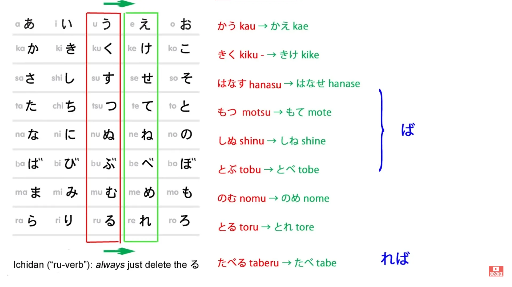
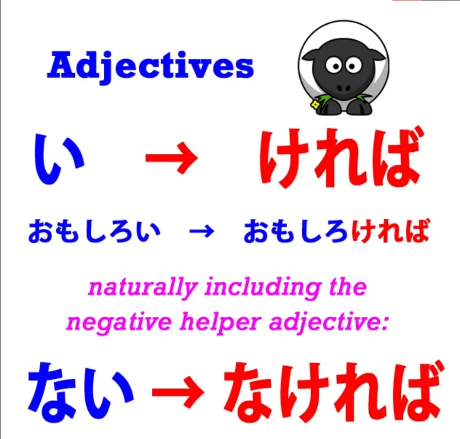
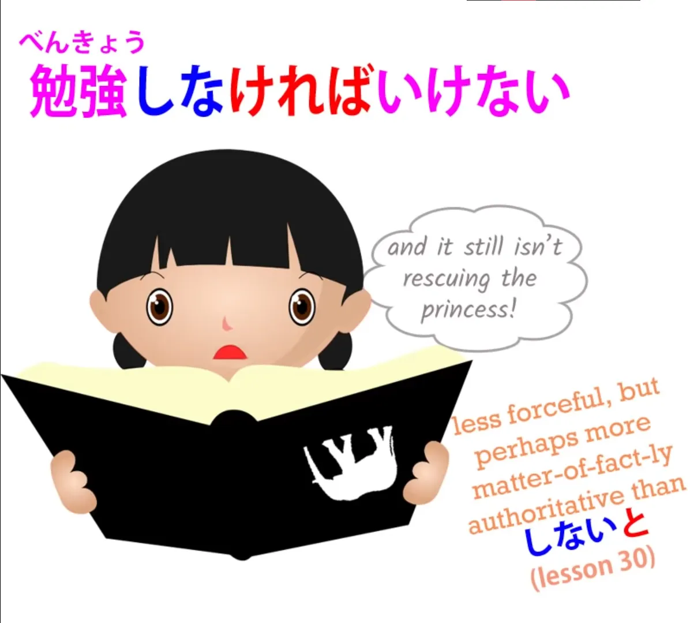
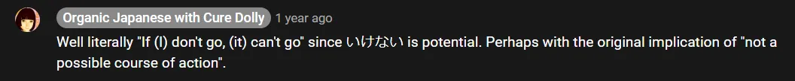
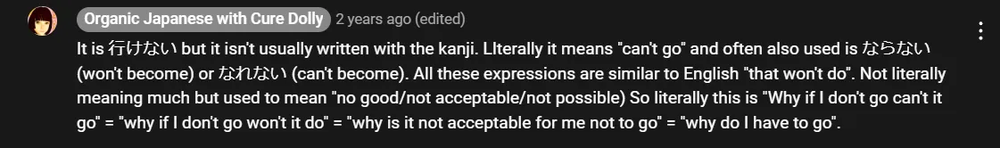

# **31. The ば / れば Conditional**

[**Lesson 31: The BA conditional. What it really means and how to use it easily.**](https://www.youtube.com/watch?v=O81EPCsPUpw&list=PLg9uYxuZf8x_A-vcqqyOFZu06WlhnypWj&index=33&pp=iAQB)

こんにちは。

Today we're going to talk about the conditional ば/れば. Last week we looked at the と conditional and we saw that its particular characteristic was its exclusiveness, its implication that only one outcome is possible. In many cases we can use any or most of the conditionals without changing the meaning to any great extent, but each conditional has its own particular qualities.

So today we're going to look at the special quality of ば/れば and some of the things it does and why it does them. First of all, what is ば/れば? ば/れば is a helper which we put on to the え-stem of a verb.

The え-stem is one of the lesser used stems but ば/れば is one of the things that uses it. So, for godan verbs we put it on to the え-stem and for ichidan verbs, as always, we simply put it on to ... we simply take off the -る and add the ichidan form, -れば.

For the two irregular verbs, in this case they work exactly like regular ichidan verbs. So <code>来る</code> becomes <code>来れば</code> and <code>する</code> becomes <code>すれば</code>. Actually, <code>来る</code> and <code>する</code>, I would say, are in fact ichidan verbs, but they're strong ichidan verbs.

A strong verb is a verb that can change its vowel sound. In English we have <code>come</code> and <code>came</code>, <code>eat and </code>ate". And <code>来る</code> and <code>する</code> in some cases change their vowel sound. <code>来る</code> in the negative becomes <code>こない</code>, <code>する</code> becomes <code>しない</code>.

But in this case they don't change their vowel sound at all, so that's very simple -- they just work like the ichidan verbs that they fundamentally are. For adjectives, we take off the -い and use the helper -ければ.

You might notice that when we do anything with an adjective other than simply take off the -い and add whatever we're going to add, the specific adjectival modifications all come from the か-き-く-け-こ row. So, the negative of an adjective is -くない (<code>面白い</code> --> <code>面白くない</code>); the past is -katta (<code>面白い</code> --> <code>面白かった</code>); and **the ば conditional is -ければ** (<code>面白い</code> --> <code>面白ければ</code>).

So in a way we could say that if adjectives had an え-stem, it would be -け. And that's what we use in that case. So what's the special characteristic of ば/れば?

-と, as we know, its special characteristic is its exclusiveness. The special characteristic of ば/れば is that it is used for hypotheticals. So it must always mean <code>if</code>. **It can't ever mean <code>when</code>**, because we never know for sure if the condition will take place and consequently if we use it about something that happened in the past it has to be something that didn't happen because if it did happen we wouldn't be dealing with a hypothesis, we'd be dealing with a fact.

Now this hypothetical nature of ば/れば allows it to be used in many common and very important Japanese expressions. For example, <code>どうすればいい</code>. What this literally means is <code>how, if I act, will be good</code>.

And I'll just note here that while <code>する</code> is generally translated as <code>do</code>, in many cases the best way to render it into English is as <code>act</code>. So, for example, if we say <code>静かにする</code>, we're not saying <code>do quietly</code>, we're saying <code>act quietly</code>.

So, <code>どうすればいい</code> -- <code>how, if I act, will be good</code>. And in English what we'd normally say is <code>What should I do?</code> But in Japanese we don't say that.

As we'll see, this is partly because the concept of <code>should</code> isn't quite the same in Japanese, and ば/れば is often used to solve the problem. We'll come back to that in a moment.

Another common use of ば/れば is in <code>すればよかった</code>. For example, <code>かさを持ってくればよかった</code>. In English we would say <code>I should have brought an umbrella</code>.

What we're actually saying here is <code>If I had brought an umbrella, it would have been good</code>. <code>持ってくる</code>, as I've explained elsewhere, we join the word <code>carry</code> and the word <code>come</code> to mean <code>bring</code> (<code>carry-to-here</code>) and we notice that <code>よかった</code> throws it into the past tense.

As you know, in Japanese, we mark the past tense at the end of a logical clause. So even though it may be true that if it's raining right now, if I had brought an umbrella it would have been good and it still would be good, we throw the whole thing into the past tense with that final <code>よかった</code>.

<code>かさを持ってくればよかった</code> -- <code>I should have brought an umbrella / I wish I had brought an umbrella.</code> Now notice that in both these cases, <code>どうすればいい</code> / <code>かさを持ってくればよかった</code>, we are using this <code>if it were done, it would be good</code> to mean <code>should</code>.

And this happens again in an even commoner Japanese construction. <code>勉強しなければいけない</code> -- <code>If I don't study, it won't go / it won't do.</code> Now what we are actually saying here is <code>I must study</code>.

There actually isn't a word for <code>must</code> in Japanese, so we always construct it this way. We say <code>If I don't... (whatever it is)</code> and then we can say <code>it won't be good / it will be bad / it'll be a disaster...</code>

Whatever we say, some negative construction then follows this, and what we're saying is <code>I must go / I've got to go / I've got to do this / I've got to do that</code>, and this is because we don't have that construction <code>got to</code> and we don't have <code>must</code> in Japanese. It always has this rather lengthy "If I don't do, it won't be good / if I don't do, it won't do / If I don't do, it's bad<code> -- </code>無ければ / なければダメ".

And because it is indeed a very long-winded way of saying something common like <code>must</code> or <code>got to</code>, it often gets cut down in casual speech to just <code>しなければ</code> or even <code>しなきゃ</code>, which is short for <code>しなければ</code>, without adding the negative ending, because that's just implied. However, even in very casual speech it's often said in full, and I think this is to emphasize the nature of the <code>must</code>.

<code>なぜ行かなければいけない?</code> -- <code>Why have I got to come/go?</code>
::: info
if it helps, more literally something like <code>Why if (I) don’t go, (it’s) bad/it won’t do?</code>
Or as Dolly-先生 says in the comments for 行かなければいけない + what that いけない means:
:::
***
**

In cases like that, where we're putting stress on it as opposed to cases where we're just saying casually <code>行かなきゃ</code> -- <code>I've got to go</code>.

::: info
literally maybe <code>If (I) don’t go…</code>, negative afterwards is just implied/unvoiced
:::
So this is the special characteristic of ば/れば, that it's dealing with hypotheticals.
