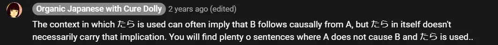

# **32. The たら, なら Conditionals**

[**Lesson 32: Conditionals made clear! Tara, nara - how they really work**](https://www.youtube.com/watch?v=fzNo53_b8W0&list=PLg9uYxuZf8x_A-vcqqyOFZu06WlhnypWj&index=34&pp=iAQB)

こんにちは。

Today we are going to complete our mini-series on conditionals with the conditionals たら and なら.

## たら Conditional

The -たら conditional is particularly easy to form because all we do is form a verb or an adjective into its -た/-だ past form, and we know how to do that. Once we've done that, all we do is add -ら and we have the conditional ready-made.

It's no coincidence that -たら and -だら are formed on the past, because this is the only conditional that can be used about past events. Now, of course, when we are using it about past events it's not really a conditional, because we are no longer saying <code>if...</code>, we are saying <code>when...</code>

We know that the condition was fulfilled because it's already happened. But what it does is shows that the event that happened in the past was unexpected or surprising, and this is because rather than using one of the more regular means of showing that one event followed another, such as the -て form or -から, we are using an if-type conditional.

So we are stressing the fact that what did happen might well not have happened and indeed it might have been more in line with expectation if it hadn't happened. So, if we say <code>家に帰ったらさくらがいた,</code> we're saying <code>When I returned to the house, Sakura was there,</code> and obviously we're very surprised to find that Sakura is there.

She didn't even have a key; she must have gotten in through the window. Sakura does that sort of thing sometimes, you know. Now, of course, we can also use it as a true conditional about future events, and when we do that, it tends to throw stress on what will happen if the condition is fulfilled, as opposed to -ば/れば, which throws more stress on the question of whether or not the condition will be fulfilled or even the fact that it wasn't fulfilled.

And this is perhaps natural, because just as in its past form -たら can mean more-or-less <code>when</code> something takes place as much as <code>if</code> it takes place, it certainly can be used for things that we don't know whether they will be fulfilled or not. Most of the conditionals are interchangeable in many cases, but if we're talking about a condition which we're fully expecting to be fulfilled, we're really saying more <code>when</code> than <code>if</code>, we're most likely to use -たら.

Another note on the -たら and -ば/-れば is that we sometimes use the forms -ったら and -ってば with a small っ before them **to indicate exasperation**. So we might say <code>さくらったら</code> or <code>さくらってば</code>.

And what this literally means is the construction *(of which they are abbreviations)* of <code>さくらと言ったら</code> or <code>さくらと言えば</code>, in other words <code>When you speak of Sakura...</code> And this is a bit like saying, <code>Oh, you</code> or <code>When you speak of Sakura, it's always something like this, isn't it?</code>

It's not flattering, it is critical, but it's not very strongly so, especially in the case of -ったら. It can be quite humorous or joking or a kind of friendly exasperation. In my experience, -ってば is more likely to express real exasperation, and it can be put on to the end of other things than just a person's name.

For example, we might say <code>もう言ったってば</code>, which is <code>I've already said that, haven't I?</code>

::: info
This may be a useful note about たら, so I will leave it here.

:::

## なら Conditional

Now, -なら is really the easiest of all conditionals to form, because all we ever do is put -なら after what we say and that turns it into a conditional. We can put it after nouns and we can put it after complete logical clauses.

It's very comfortable after nouns and we don't need to use a copula, probably because the -な of -なら has its roots in the copula itself. There are ways of grafting the other conditionals onto nouns, but I haven't mentioned those, because I think it would just be unnecessary complication at this stage.

Generally speaking, all other things being equal, we're most likely to use -なら with nouns. Now, a characteristic of -なら is that more than the others it can be used of present and future conditions that really aren't in doubt at all.

So, for example, if Sakura is worried that something may not be possible to her, we might say <code>さくらなら, できる</code> and that means <code>If it's Sakura, it will be possible</code>. Now, of course, we know it's Sakura, we're talking to Sakura, so what we're really saying is <code>Since it's Sakura, it will be possible</code> and we're using it to reassure Sakura that we have confidence in her.

You might ask the way to the station; you might say, <code>駅はどこですか</code> and someone might reply, <code>駅なら, あそこです</code> and that's saying <code>If it's the station you're asking for, it's over there.</code> Now, of course, there isn't any real doubt that it is the station you're asking for, so it's more like <code>Since it's the station you're asking for, it's over there.</code>

In both these cases there's no doubt. In the case of Sakura, we're expressing confidence in her as a person -- if it was someone else, it might not be possible, but if it's Sakura, since it's Sakura, it will be possible. And with the station, we're really just confirming that it's the station we're talking about.

And, as I say, the conditionals are very often interchangeable, but knowing the special characteristics of each one helps us to understand exactly what's going on and which one we might choose ourselves.

::: info
There were no notable pictures in the video - as for their lacking in this lesson here.
:::
