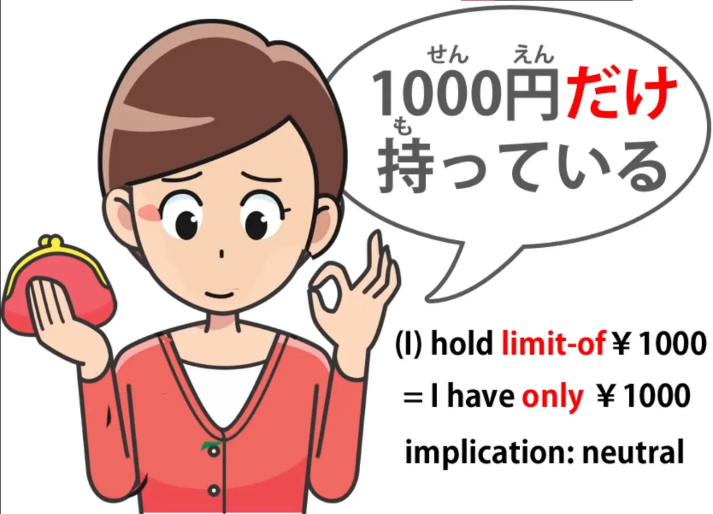
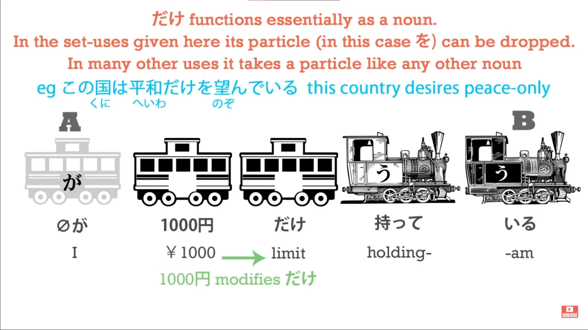
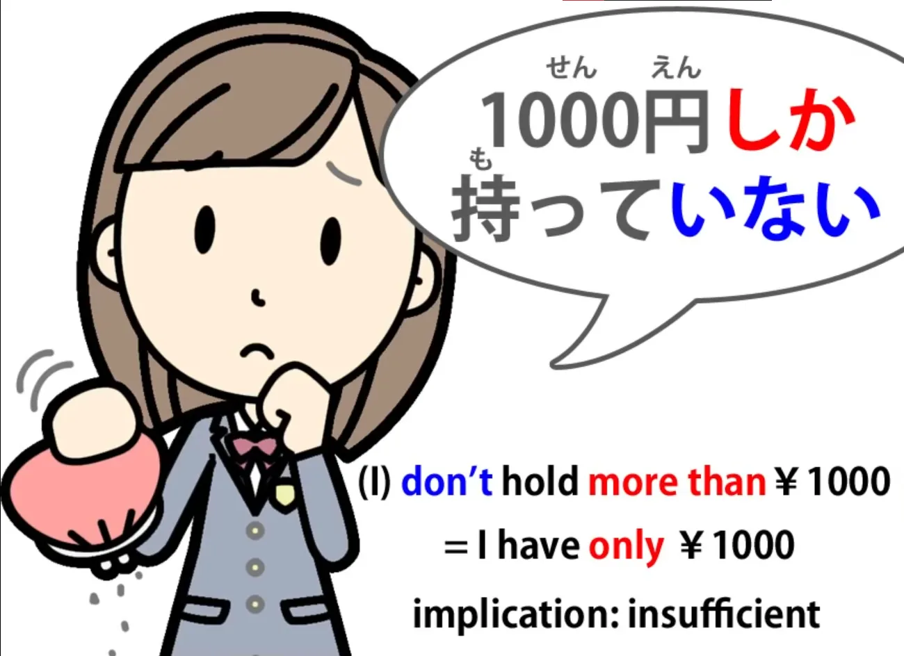
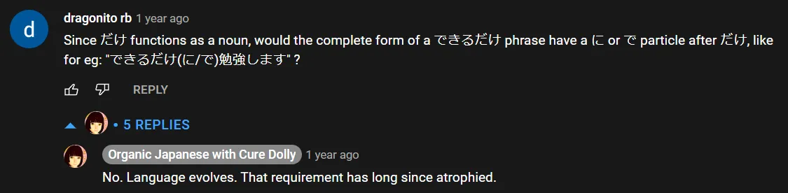
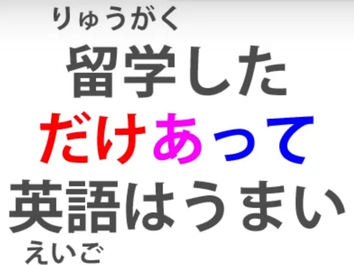
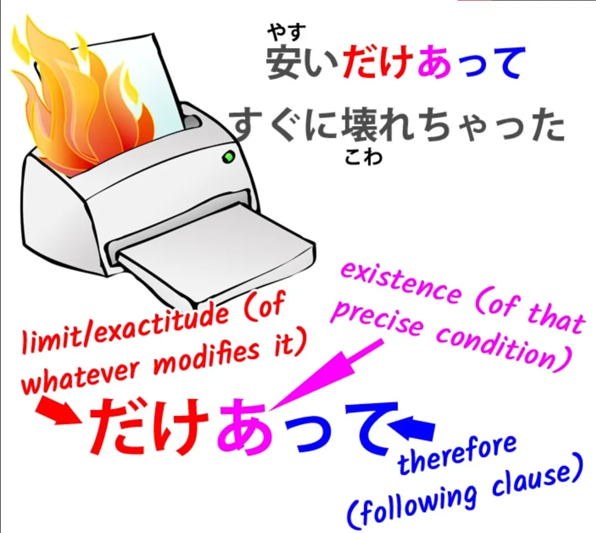
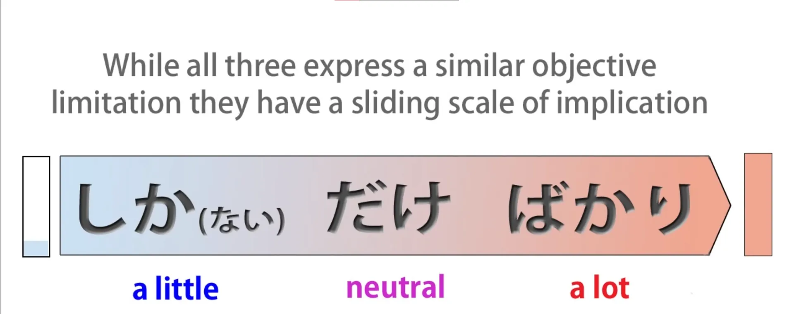

# **33. Limiting terms: だけ, しか, ばかり, のみ**

[**Lesson 33: Dake, shika, bakari, nomi: making SENSE of Japanese limiting terms.**](https://www.youtube.com/watch?v=OoJLexUR_o0&list=PLg9uYxuZf8x_A-vcqqyOFZu06WlhnypWj&index=35&pp=iAQB)

こんにちは。

Today we're going to talk about terms of limitation: <code>だけ</code>, <code>しか</code>, <code>ばかり</code> (we're already covered <code>ばかり</code> in a video of its own, but we're going to look at how it fits in here) and <code>のみ</code>. <code>のみ</code> is very easy and you won't need to use it anyway, but it is important to understand it when you see it.

A lot of people find these terms confusing, but that's only because they're taught in a confusing way. Once you see how they really work, they're not difficult at all.

## だけ

So, let's start with the most basic word, <code>だけ</code>. <code>だけ</code> means <code>limit</code>. We're sometimes told that it means <code>only</code>, and in its most basic form of expression <code>only</code> is what we would say in English.

However, it's important in some of its other uses to realize that what it actually means is <code>limit</code>. So, if I say <code>千円だけ持っている</code>, what I'm saying is "I have a thousand yen limit / A thousand yen is the limit of what I have".

<code>だけ</code> is a noun, and when we put <code>千円</code> behind it, we're using <code>千円</code> as the modifier to the noun <code>だけ</code>.

So we're saying I have a limit of a thousand yen, a thousand yen is all I have. So that's simple enough. We'll come back to <code>だけ</code> in a moment.

Now let's look at <code>しか</code>.

## しか

Now, <code>しか</code> does confuse people and that's because they're given the impression that it means the same thing, more or less, as <code>だけ</code>. And what it in fact means is the opposite of <code>だけ</code>.

<code>しか</code> means <code>more than</code>.

And if we understand that, we'll never get confused about <code>しか</code> because it's very simple. The point is that it's only ever used in negative sentences. So, we always have a <code>ない</code> or an <code>ありません</code> when we use <code>しか</code>, so it ends up saying <code>not more than</code>.

And this is what makes it very similar to <code>だけ</code>. But if we don't realize that it actually means <code>more than</code>, we get very confused about how it fits into a sentence structurally.

So, if we say <code>千円だけ持っている</code>, we're saying a thousand yen is the limit of what I have. If we say <code>千円しか持っていない</code>, we're saying I don't have any more than a thousand yen. And as you can see this is a negative sentence and the stress is on the negative.

It's very similar to what we might say in English: we might say <code>I only have a thousand yen</code> / *(<code>千円だけ持っている</code>)* or we might say <code>I don't have any more than a thousand yen</code> / *(<code>千円しか持っていない</code>)*. And you can see the difference between those two, and the difference is exactly the same in Japanese.

<code>だけ</code> doesn't imply that a thousand yen is a lot or a little; it doesn't imply anything about it, it's just saying that that's what I have and that's all I have. <code>I don't have any more than a thousand yen/*千円しか持っていない*</code> is putting emphasis on the fact that this might be too little, or that if you were wanting any more you're not going to get it, or whatever.

It has this negative emphasis because we're putting all the emphasis on what I don't have, not what I do have. And that, in this context, is the difference between <code>だけ</code> and <code>しか... ない</code>.

And <code>しか... ない</code> can also be used in circumstances such as <code>にげるしかない</code>. <code>にげる/*逃げる*</code> is to <code>run away</code> or <code>escape</code>; if we say <code>にげるしかない</code> we're saying <code>There's nothing for it but to run / There's no other course of action but to run.</code>

So just as <code>千円しかない</code> means (I) have nothing more than a thousand yen, <code>にげるしかない</code> means there's nothing we can do other than -- or more than -- run. So now let's go back to some of the other uses of <code>だけ</code>.

## Other uses of だけ

One of the commonest is <code>できるだけ</code>, which means <code>as much as possible</code> or <code>if at all possible</code>. Now, you see, at this point, if we're thinking of <code>だけ</code> as meaning <code>only</code> we can start to get confused.

Is this a completely different kind of <code>だけ</code>? No, it's exactly the same. <code>できるだけ</code> means <code>to the limit of possibility</code>.

<code>できるだけ勉強します</code> -- <code>I will study if I can</code> or <code>I will study as much as I can</code> / <code>to the limit of the possibility I will study.</code>

::: info
In case someone may have been wondering…
:::

Another use which you'll certainly see quite often is <code>だけあって</code>. Now this <code>あって</code> is <code>ある</code> -- to <code>be</code>. And we're often told that it means something like <code>not for nothing</code>.

So <code>留学しただけあって英語はうまい</code>.

And this literally means <code>Because of the limit of the fact that she studied abroad...</code> (and the <code>because</code> here is that て-form, which often implies the cause of the following effect) <code>... her English is excellent.</code> Now the translation we're given is <code>Not for nothing did she study abroad, her English is excellent.</code>

But what is actually being said here is <code>Precisely because and only because she studied abroad, her English is excellent.</code> Now, you might think I'm splitting hairs here and being a bit too geeky about the exact meaning.

But let's take another example. <code>安いだけあってすぐに壊れちゃった</code> Now, this means <code>Because of the limit of its being cheap, it quickly broke.</code>

Now, it wouldn't make any sense here to say, would it, <code>Not for nothing was it cheap, it broke quickly.</code> What we're actually saying is <code>Precisely because it was cheap, it broke quickly.</code>

That <code>だけ</code> is using the limiting function to limit something down to something precise. If we want to bring in the <code>only</code> aspect of it, the way it works is that what we're saying is <code>Only by studying abroad would you get that good at English</code> <code>Only something really cheap would break that quickly.</code>

So that's how the limitation, the <code>only</code>, function of <code>だけ</code> is actually working here. We're using it to give precision to the statement: <code>Precisely and only because of this the result followed</code>; <code>だけあって</code> -- <code>It exists because of and limited to this fact.</code>

Now let's bring in <code>ばかり</code>.

## ばかり

<code>ばかり</code>, as we know, also expresses the same kind of limits. It means <code>just such-and-such a thing</code>. So let's compare it with the other two.

If we say <code>あのお店はパンだけ売る</code>, we're saying <code>That shop only sells bread</code>. If we say <code>あのお店はパンしか売らない</code>, we're saying <code>That shop doesn't sell anything but bread</code>.

If we say <code>あのお店はパンばかり売る</code>, we're again saying <code>That shop only sells bread</code> but as we know from the <code>ばかり</code> lesson, what we're likely to mean by that is <code>That shop sells an awful lot of bread</code>. It may not even be true that it only sells bread, because <code>ばかり</code> can be used hyperbolically.

We can say <code>東京は外人ばかりだ</code> -- <code>In Tokyo there's nothing but foreigners</code> which doesn't mean, any more than it would in English, that there really aren't any Japanese people in Tokyo. It means there are an awful lot of foreigners in Tokyo. So, we can put these three on a sliding scale.

<code>パンしか売らない</code> is implying that only selling bread is very little, it's insufficient. Maybe we want something other than bread but we can't get it. <code>パンだけ売る</code> doesn't have any implication. It's neutral.

It could mean that the shop specializes in bread and therefore it's very good. It could mean, indeed, we can't get anything if we're wanting something other than bread. It doesn't have any particular implication. It's just neutrally saying that the shop only sells bread.

<code>パンばかり売る</code> implies that there's an awful lot of bread there. The fact that it's limited to bread is essentially making the point that bread is there in abundance to the extent that we might hyperbolically say that nothing else but bread is there even though with <code>ばかり</code> in fact it could be.

## のみ

And before we end, I'm just going to cover <code>のみ</code>. <code>のみ</code> is very easy because all it means is <code>だけ</code> in its simplest sense.

So we say <code>パンだけ売る / パンのみ売る</code>. They both mean the same thing. They mean <code>only sells bread</code> without any special implication.

<code>のみ</code> is used in formal contexts, it's mostly used in writing, and unless you're trying to use very formal Japanese you won't really need to use it. The reason it's important to know is that, for example, if you were going to go into a place and the sign was telling you that only members are admitted it could save a lot of embarrassment if you knew that that <code>のみ</code> means the same thing as <code>だけ</code>.

And that kind of sign is precisely where they would use <code>のみ</code>, because it tends to get used in these formal, official kinds of context.
