# **34. Understand any sentence**

[**Lesson 34: Understand any sentence. Powerful analysis technique.**](https://www.youtube.com/watch?v=uot49Z85wNs&list=PLg9uYxuZf8x_A-vcqqyOFZu06WlhnypWj&index=36&pp=iAQB)

こんにちは。

Today we are going to discuss the most fundamental thing in Japanese. And, if we understand this, we can understand any Japanese sentence. If we don't, we can't. It's really as fundamental as that. And I introduced this in our very first lesson, because if we don't have this, we're going nowhere.

What we are going to do today is start talking about how we can apply this to any Japanese sentence that we find in the wild. Now, the fundamental core of Japanese, as you know, is the core Japanese sentence. It's what I call the A-car and the B-engine. Both of those elements have to be there in every sentence.

We can always see the B-engine. We can't always see the A-car, but it's always there. In English these are called the subject and the predicate and in Japanese they are called the 主語/しゅご and 述語/じゅつご, but we are going to continue calling them the A-car and the B-engine because this way we can visualize exactly what's going on in a sentence by using trains.

Now this lesson begins with a question asked by my Gold Kokeshi patron Pantelis Chrysafis-sama (and I hope I'm pronouncing your name right). It was a very simple question, but a very good one, a very fundamental one. It was simply, <code>How do we know where a logical clause ends?</code>

And that's really the same as the question <code>How do we identify a logical clause?</code> We need to know where it ends and we need to know where it begins. The factors complicating this are that there can be more than one logical clause in a compound sentence (but as I'm going to demonstrate, that isn't really as difficult as it seems) and also the fact that we can't always see the A-car.

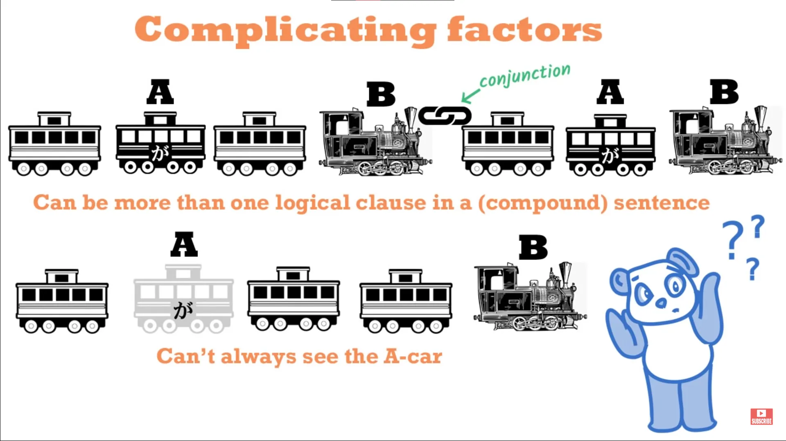

The other complicating factor is the fact that we will see the elements of logical clauses and even complete logical clauses that are not part of the sentence core. And if they're not part of the sentence core, what they are doing is modifying or telling us more about either the A-car or the B-engine.

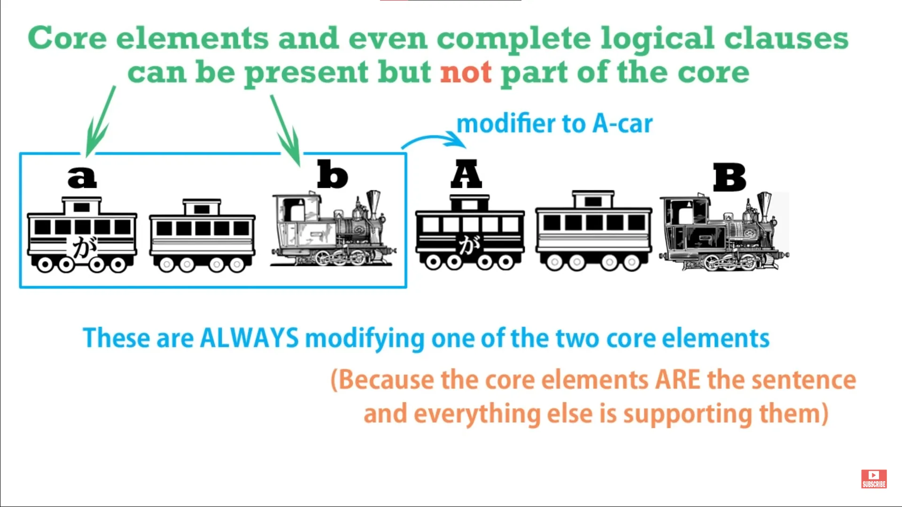

That's the only thing they can ever be doing, because the sentence is its core and everything else in the sentence is related to and telling us more about that core. Now, sentences where there is more than one logical clause have to be connected by some kind of conjunction. And this is very important, because this gives us the key to seeing whether or not there is more than one core and if there is, where they are and how they're working.

In our recent series on conditionals, we were in fact dealing with conjunctions. There are various kinds of conjunction: and, but, when, if, etc.

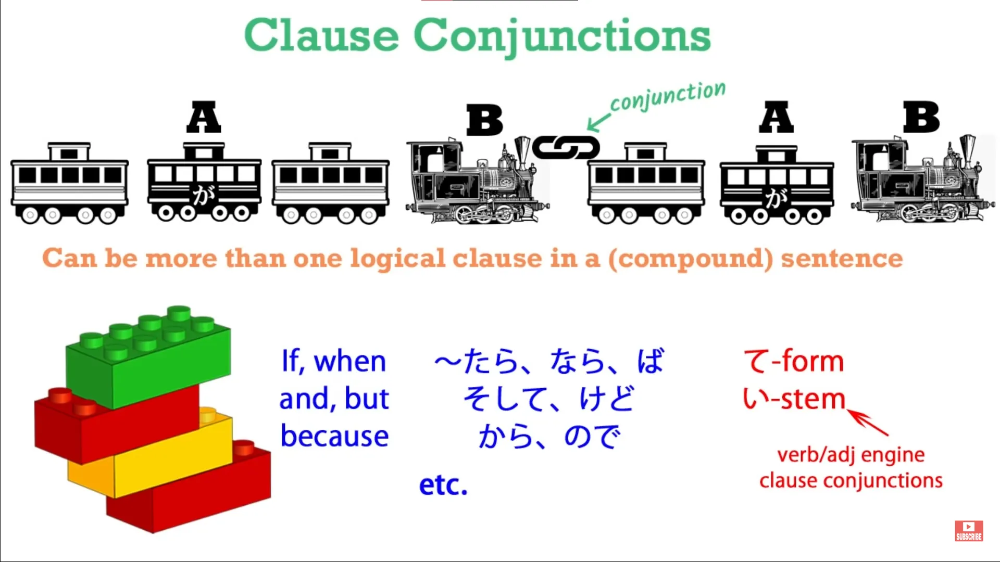

And the two other kinds of conjunctions that we need to look out for are the て-form, which can join two clauses together into a compound sentence, as we looked at in our first lesson on compound sentences *(Lesson 11)*, and the い-stem of a verb. You've seen how the い-stem is the main conjunctive stem out of the four stems of verbs.

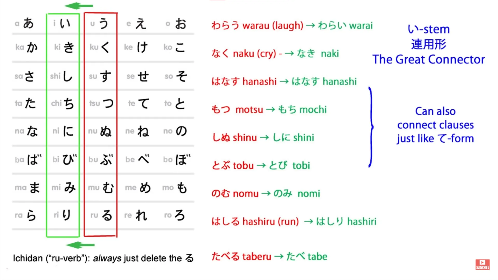

It can connect nouns to verbs; it can connect other verbs to verbs; it can connect various helpers to verbs; and it can also connect one logical clause to another. This is slightly more literary, slightly more sophisticated, perhaps, than the て-form, but it's the one other thing you need to look out for when you're investigating whether there is more than one logical clause in a sentence. We'll talk about this more in a later lesson.

Now, let's talk about the complications that can arise and how we can see through them, how we can use our detective powers to see what's really going on. I'm going to take a simple conditional sentence that we used before. <code>かさを持って来ればよかった</code> which means "I should have taken an umbrella / I wish I'd taken an umbrella".

What it literally means is <code>If I had taken an umbrella, it would have been good.</code> Now, we can see the first logical clause easily, can't we? That is <code>かさを持って来れば</code>, which is simply <code>かさを持ってくる</code> -- <code>bring an umbrella</code> -- turned into its conditional form -- <code>if I bring an umbrella</code> -- and that's going to be thrown into the past tense by the final engine in the sentence, which is the way Japanese works.

So, we have clause one, which is <code>かさを持って来れば</code>. We know that it's a complete clause and we know it's going to be followed by a second clause because we have a conjunction there in the form of a conditional. But what follows it is simply <code>よかった</code> which is the past tense of <code>いい</code> and it means <code>good</code>.

Is this a core sentence? Yes, it is. The first sentence is <code>かさを持ってくれば</code> ; the second sentence is <code>(zeroが)よかった</code>. We know this because <code>よかった</code> is an engine.

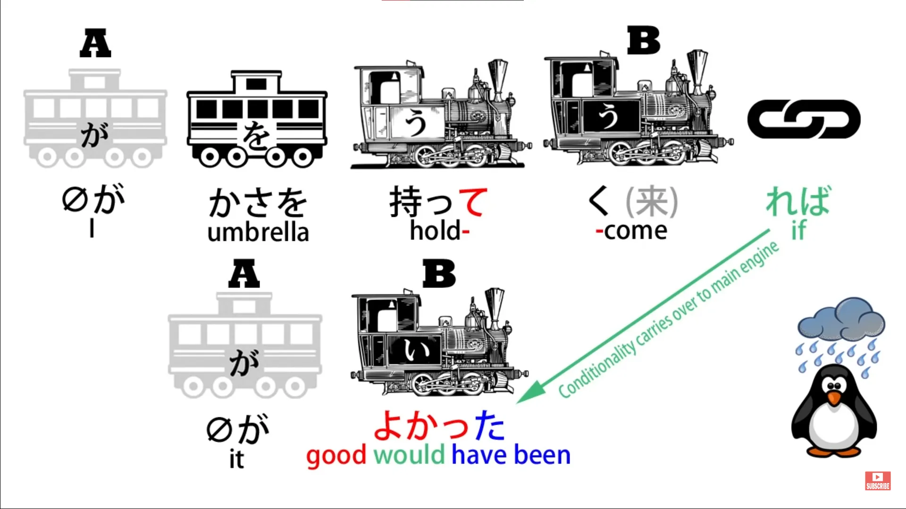

It's an adjective, it's a describing word and it has to be describing something. Wherever you've got an adjective, the adjective must be describing something. Wherever you've got a B-engine, there must be an A-car to correspond to it.

So what is the A-car here? What is <code>よかった</code> describing? What is it telling us <code>would have been good</code>? This is a very important point.

If we translate it into very literal English, what we're saying is "If I had brought an umbrella, it would have been good." And this is exactly what the Japanese means. <code>It</code> would have been good. The A-car is <code>it</code>.

So what is <code>it</code>? This is the important point: <code>It</code>, or the zero-car, does not have to be clearly definable, either in English or in Japanese. What <code>it</code> means here is <code>the circumstance / things in general (would have been good)</code>.

And we do this in Japanese all the time. And we do it in English all the time. So, for example, if we say in English <code>It's sunny, isn't it!</code> In Japanese we might say <code>(zeroが)晴れだね!</code>

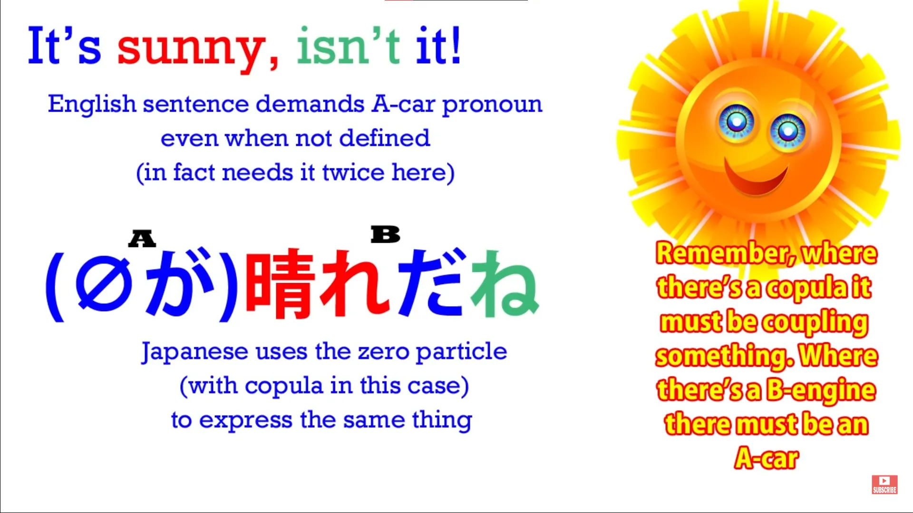

They mean the same thing. In English we have to say <code>It is sunny</code> -- we could say <code>Sunny, isn't it?</code> but that's only because we're leaving out the <code>it</code>. And we've still got it at the end, because we don't ever say <code>Sunny, isn't!</code>

We say <code>Sunny, isn't it!</code> which must be short for <code>It is sunny, isn't it!</code> In Japanese we say <code>晴れ...</code> (which means <code>sunny</code> or <code>clear</code> in the sense of clear skies): <code>晴れだね!</code> Now, <code>だ</code> is the copula.

It's got to be connecting that <code>晴れ晴れ</code> to something else, which is our zero-particle. What is it connecting it to? Well, in this case we don't know.

It could be the day -- <code>The day is sunny</code>. It could be the weather -- <code>The weather is sunny</code>. It could be the sky -- <code>The sky is clear</code> -- because <code>晴れ</code> can mean <code>clear</code> as well in that sky sense.

It doesn't matter. It doesn't matter in Japanese and it doesn't matter in English what we mean by <code>it</code> when we say <code>If I'd brought an umbrella, it would have been good</code> or <code>It is sunny</code>.

But we can't do without it. We can't do without it in Japanese and we can't do without it in English. Because in both Japanese and English we have to have an A-car and a B-engine.

A subject and a predicate. A 主語/しゅご and a 述語/じゅつご. In English we always have to be able to see both of them.

In Japanese we don't need to see the first one. We do need to see the second one. But the first one is always there, and if we don't understand that we're going to have great difficulty picking out the core sentence, especially as things get more complex.

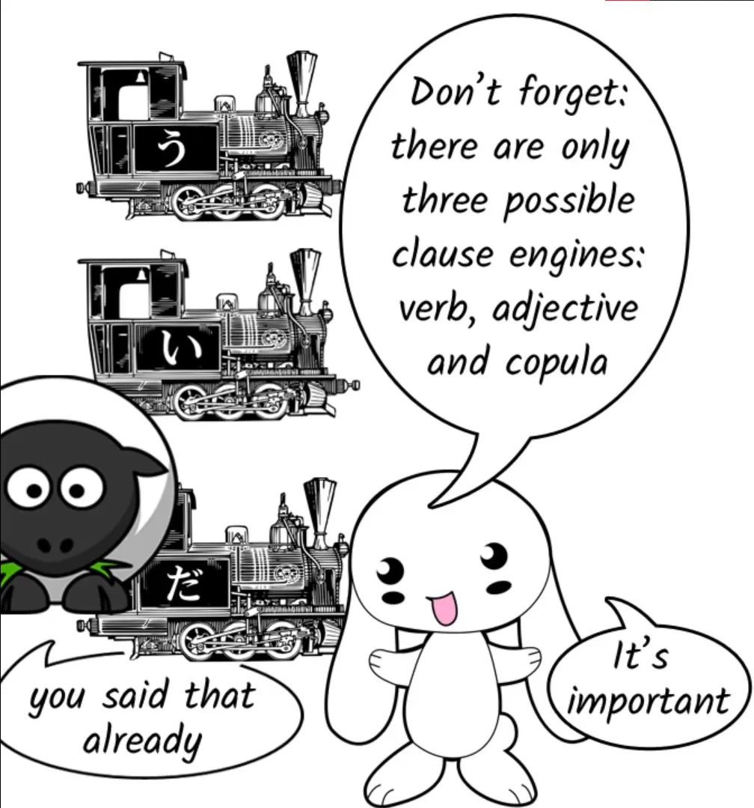

So, to get directly to the question, how do we find the end of a logical clause? Now, the main logical clause, the head clause of the sentence, is always the last one, and we can find the end very easily because the end of the logical clause is the end of the sentence.

In Japanese, a sentence has to end with an engine, that is to say, an adjective, a copula (<code>だ</code> or <code>です</code>) or a verb. So the last engine in the sentence will be the end of the head clause of the sentence, the main final clause of the sentence, always.

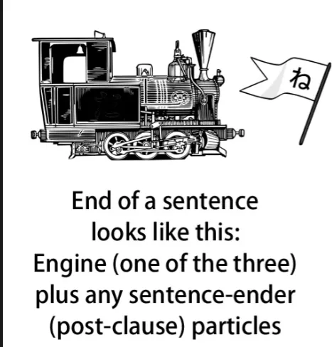

It will be the last thing in the sentence apart, perhaps, from one or two sentence-ender particles like <code>よ</code> or <code>ね</code> or <code>よね</code>. We call them sentence-ender particles, but in a way it might be more accurate to call them particles that come after the end of the sentence.

The final engine is the end of the logical sentence and the ender particles are just a little add-on that we put on right after the end of the sentence. So it's very easy to find the end of the last logical clause in a sentence or the end of the entire logical clause if there is only one logical clause in the sentence.

The more difficult question -- but it's not really all that difficult, but the question that can cause problems is the question of how do we find or how do we eliminate the possibility of a compound sentence?

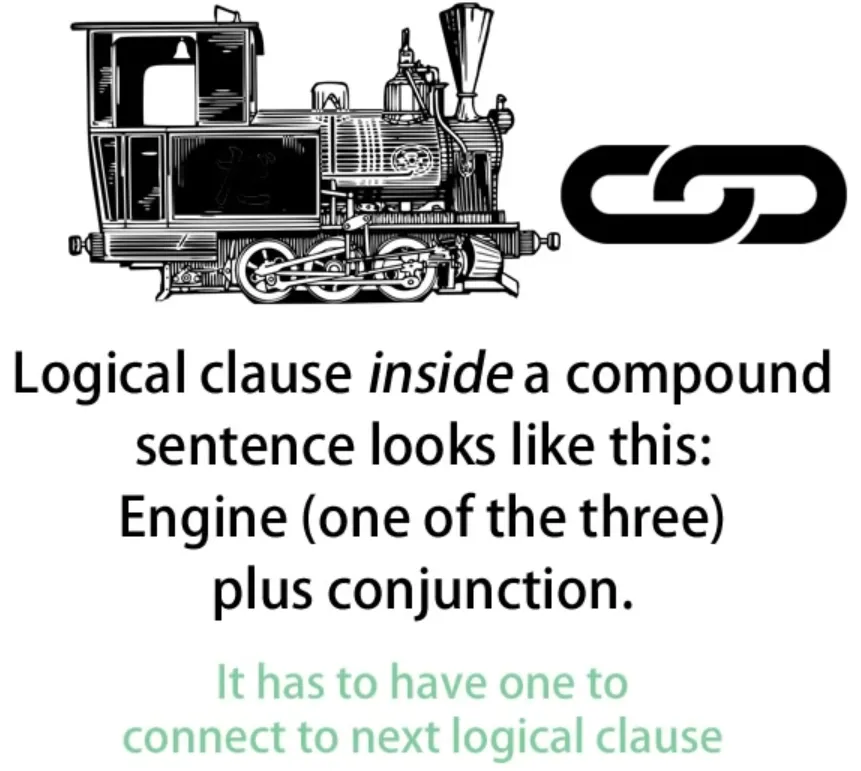

How do we know there are no other logical clauses in the sentence or, if there are, how do we find them? And the answer to that is again very simple and straightforward.

A logical clause will always end with an engine: a verb, a noun followed by a copula (<code>だ</code> -- it won't be followed by <code>な</code>, because if the copula <code>だ</code> has become <code>な</code> then it must be a modifier, it can't be a logical clause in itself) -- a noun with the copula <code>だ</code>, or an adjective. And if it is a clause before the final clause in a compound sentence, it's going to end with a connector.

It has to, because it has to connect to the next logical clause. So, now what we're going to do is look at the sort of complex sentence that can confuse people and we're going to look at how we tackle that sentence.

So the sentence is "私がさくらに話した日本語ができる留学生は *(zeroが)* 五輪金メダルを獲得した女性と結婚した" Now, as you can see, that looks pretty complicated. How do we go about it, how do we go about analyzing it?

Jay Rubin-先生, for whom I have great respect, suggests that if we're really stuck we should work backwards through a Japanese sentence. And there's some sense in that, because Japanese sentences do in a certain way and up to a certain point run in reverse order from an English sentence.

However, we can only do that with written sentences. We can't do it with spoken sentences because people won't speak backwards for us most of the time. However, one thing I do think is useful if you're feeling particularly stuck with a sentence is to make sure you've got the head verb or the head copula or the head adjective, whatever is the head of the sentence, in your mind.

So if we just take a peek at that first so we know where we're going to. And the head of this sentence is very straightforward, isn't it? It's <code>結婚した</code>.

The head verb is simply <code>した</code> -- <code>did</code> -- but that's making a する-verb with <code>結婚</code>; so, <code>結婚した</code>. What the sentence is telling us is that somebody got married.

All right. But now let's do what I think we should do so long as we can, and most of the time we really can -- Start from the beginning. All right.

So, the first part of the sentence, the first clause: <code>私がさくらに話した</code> Now, that could be a complete logical sentence in itself, couldn't it? <code>I spoke to Sakura.</code>

Or it could be <code>I told Sakura</code> in which case it couldn't be complete in itself, could it? Because I would have to tell her something. Now, which is it in this case?

Well, we know that's it's not a complete logical clause, <code>I spoke to Sakura.</code> Why not? Because it's not ending in any kind of conjunction, is it?

It's followed directly by a noun, <code>日本語</code>. There's no conjunctive word, there's no て-form and it's not the い-stem of <code>話す</code>. So we know that this is in fact a modifier for something else.

So, what have we got next? <code>日本語ができる</code> -- now, that means <code>Japanese is possible</code>. <code>日本語ができる</code> could be a complete sentence in itself, couldn't it?

<code>To me, Japanese is possible.</code> The <code>to me</code> would be implicit, but that's fine, we do that all the time. But we know it isn't because it doesn't end in any kind of conjunction.

So this also can't be a complete logical clause within a compound sentence. It must be a modifier for something. And what we expect it to be a modifier for would be a person: a person to whom Japanese is possible.

And that's exactly what we get next: <code>留学生</code>. <code>留学生</code> is an exchange student, usually from a foreign country. So, <code>日本語ができる</code> modifies <code>留学生</code> -- <code>an exchange student to whom Japanese is possible / a Japanese-speaking exchange student.</code>

And <code>私がさくらに話した</code> is modifying all that. <code>The Japanese-speaking exchange student who I told Sakura about</code> And then that's followed by は.

Now, <code>留学生は</code> indicates it's very likely, isn't it, that this is going to be the topic of the sentence and that the topic of the sentence is going to be the doer, the A-car of the sentence. But let's continue the sentence and see if that seems to be the case.

We now have <code>五輪金メダル</code> and that means an Olympic gold medal. <code>五輪</code> means <code>five circles</code>.

<code>五輪金</code> -- which is gold -- <code>メダル</code> -- an Olympic gold medal -- <code>を獲得した</code>. Now that is not, that can't be a logical sentence because it's not a logical sentence, is it?

It's not a logical sentence without a doer, and there's no doer implied here. But we have the doer right afterwards, don't we?

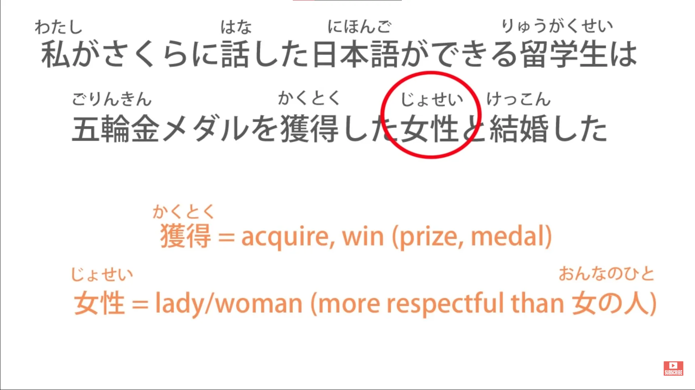

So we know that we have here a modifier for another noun, not a logical sentence in itself: <code>五輪金メダルを獲得した女性</code>. So now we have another modified noun: <code>A woman who won an Olympic gold medal</code>.

And now we've come to the head-verb of the sentence: <code>-と結婚した</code>.
::: info
about that と*
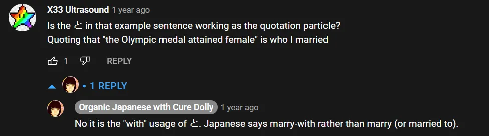
:::

So we were right. *(about the は presumption)* We have the A-car, which is the exchange student *(in the sentence it would be more specifically the zeroが after <code>留学生は</code> which implies said exchange student, that is the invisible subject, so subject is also the topic here)* who can speak Japanese that I told Sakura about married *(B car - predicate)* a woman who won an Olympic gold medal.

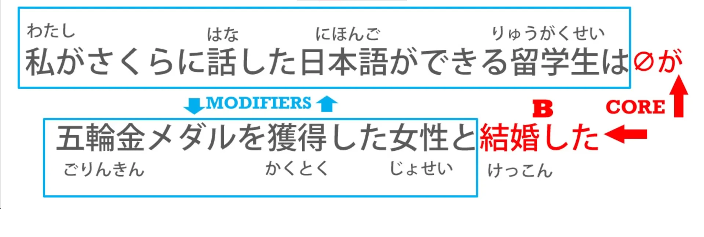

And as you see, we've got various actions going on in this sentence; we've got various things that could, under different circumstances, form logical clauses of their own, but none of them actually can. We now know that this is not a compound sentence.

This is one rather complex sentence with a single A-car *(zeroが = 留学生)* and a single B-engine *(結婚した).* Where a logical clause ends is either at the end of the sentence or before a conjunction.

And if you can do that, you can analyze just about any Japanese sentence, however complicated it looks, and see what's going on in the sentence.

::: tip
if still confusing, I recommend you read the comments under that **[video](https://www.youtube.com/watch?v=uot49Z85wNs&list=PLg9uYxuZf8x_A-vcqqyOFZu06WlhnypWj&index=38&ab_channel=OrganicJapanesewithCureDolly).** With lots of input, the brain should sort it out eventually, but it needs work and time. Dolly just prepares for that dive. At this point, you might want to slowly start with input if you have not yet, together with Dolly grammar. Once finished with the transcript, refer to it when you encounter something confusing or want to review, but comprehensible input/<code>immersion</code> is the key **([as Dolly herself advocated](https://learnjapaneseonline.info/2015/07/01/japanese-immersion-why-massive-input-is-necessary/))**. This way, you will be ready to apply stuff in Lessons 45-48 right away.
But it is up to you, it would be good to get the tools etc. ready now at least & start after 45-ish.
As mentioned on the first page, I have written a long document - [**LINK HERE**](https://docs.google.com/document/d/1kxYa53a2UjnpMZyHdU-YNuctkq6wHT3cJ00Z5poj2hY/edit#) - containing my most favourite sites that have hundreds of extremely useful and varied resources, tips, guides, tools and everything needed for deep Japanese immersion that you may find somewhat helpful.
:::
