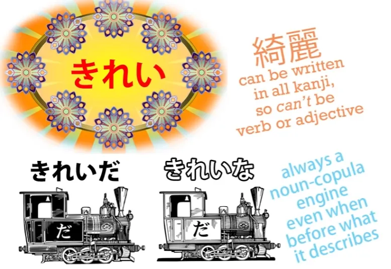
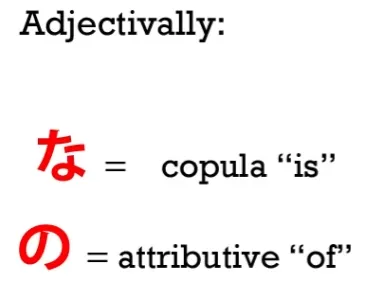
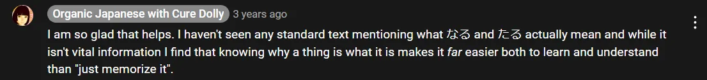
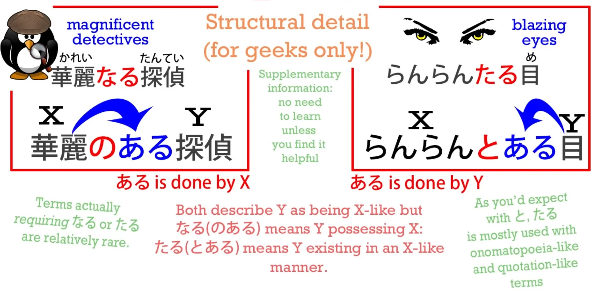

# **37. New structure secrets + な vs の, なる & たる adjectives**

[**Lesson 37: Dominate Japanese Text! New structure secrets + <code>na vs no, naru & taru adjectives</code>**](https://www.youtube.com/watch?v=GB8fWjQuz9A&list=PLg9uYxuZf8x_A-vcqqyOFZu06WlhnypWj&index=39&pp=iAQB)

こんにちは。

Today we're going to go a little deeper into Japanese structure. But perhaps unexpectedly, that's going to make things even simpler than we might have thought they were. And it's going to make it much easier to look at a page of Japanese and, even when it looks very complicated, have a much clearer idea of what the elements are and how they're likely to fit together.

You may have noticed that I map sentences very often using trains, and you may have noticed also that we have a relatively small number of carriage types. We have the three engines: the verb engine, the adjective engine, and the noun-plus-copula engine.

And we have the various cars, all of which represent nouns with their various attached logical particles, which tell us what the nouns are doing in the sentence. Now, this relatively small number of cars actually boils down to only three types of word.

We have the い-engine, which is adjectives, we have the う-engine, which is verbs, and everything else is a noun. We have the noun-plus-copula engine and we have the various noun carriages with their different particles.

And we may notice that I haven't introduced an adverb car, and that's because most adverbs -- not all but most -- are in fact variants on an adjective or variants on a noun. There are a few genuine other kinds of word, but most of what you see in Japanese is going to boil down to one of these three, despite what the dictionaries will sometimes tell you.

And if it's not a verb or an adjective, then it's likely to be a noun. What the dictionaries call な-adjectives are nouns, what they call の-adjectives are nouns, what they call する verbs are nouns.

And most of the things that they put into other categories -- not all but most -- turn out to be nouns. Japanese is a very noun-centric language. We could be tempted to attribute this fact to the fact that there are a lot of foreign words in Japanese and all of them are nouns.

A great part of the Japanese vocabulary comes from Chinese. There are also words from English and German and other languages, but they pale into insignificance compared to the older Chinese vocabulary in Japanese, which is similar to the large amount of the English vocabulary which is Latin, either directly from Latin or indirectly via French.

The difference is that, as I've said, in Japanese everything that comes from any language other than native Japanese comes in as a noun. And I said that we might be tempted to attribute to that the noun-centric nature of Japanese, but in fact, I would say it's the other way around.

It's because Japanese is so fundamentally noun-centric that it seems natural to import anything into the language as a noun. Once it comes in as a noun, if we want to use it in the manner of a verb or in the manner of an adjective, there are ways of doing this.

And we're somewhat familiar with those ways, aren't we? When a noun comes in from Chinese, if we want to use it as a verb, we turn it into what the dictionaries call a <code>する verb</code>. And in this one case I have no quarrel with the dictionaries.

<code>する verb</code> is a real thing, but this is an exception because in nearly all other cases where a noun comes in, it stays a noun even when it's used for a different purpose. So, let's start by looking at する verbs.

They're very simple. If we take the word <code>勉強</code> from Chinese, which comes in as the noun meaning <code>the act of studying</code>, we can say <code>勉強をする</code>, which means to <code>do the act of studying</code>, but we can also glue the words directly together and say <code>勉強する</code>, which means <code>(to) study</code>.

We have, in effect, by welding <code>する</code> onto the noun turned the combination into a true verb. So, in this particular case, we can say that a noun came in from Chinese and really became naturalized as a する verb.

However, if we want to use a noun as an adjective, let's say the noun <code>綺麗/きれい</code>, which means <code>prettiness</code> or <code>cleanness</code>, it never stops being a noun.

The dictionaries and textbooks tell us about <code>な-adjectives</code>, but the word is really nonsense. There is no such thing as a な-adjective.

There is an adjectival noun which continues to act in almost every respect like any other noun. The only difference between an adjectival noun and any other noun is that we can use <code>な</code> with it.

And <code>な</code>, as we know, is simply the connective form of <code>だ</code>. So, we can say <code>女の子は 綺麗/きれい だ</code> -- <code>the child is pretty</code> -- or we can say <code>きれいな女の子</code>, which means <code>pretty child</code>.

<code>きれいだ</code> means <code>is pretty</code> and <code>きれいな</code> also means <code>is pretty</code>, so we're saying <code>child is pretty</code> or <code>is-pretty child</code>. <code>な</code> and <code>だ</code> are the same copula.

Now, the reason these are called adjectival nouns is that we can't do this exact thing with other nouns. But we can do something very close, and we'll come to that very shortly.

But I'll just note before passing on that we can say that there are essentially two types of adjectival noun, and that is, the ones like <code>綺麗/きれい</code>, which really are not used as ordinary nouns at all; they're almost entirely dedicated to being adjectival: we don't talk about a person's <code>きれい</code>. And then there are the ones which continue to work as independent nouns, like <code>元気</code>.

So we can say <code>子どもが元気だ</code> -- <code>the child is lively</code>; we can say <code>元気な子ども</code> -- <code>lively child</code>. But we can also say things like <code>元気を出して</code>, which loosely translated means <code>cheer up</code>, but literally translated means <code>get out your 元気</code>.

<code>元気</code> is a thing here: it's marked by the を-particle, and you can't put a logical particle onto anything but a noun. So, <code>元気</code>, even though it's primarily adjectival and is classed as an adjectival noun, works as both an adjectival and a noun.

Now, if a noun is not classed as an adjectival noun we can still use it adjectivally. So, the word <code>魔法/まほう</code>, which means <code>magic</code>, can be used as a noun just as it can in English.

We can talk about magic as a thing. But we can also say <code>魔法の帽子</code> -- <code>magic hat</code>.

It's not an adjectival noun, but as you see, we can achieve pretty much the same effect just by using <code>の</code> instead of <code>な</code>. There are also some words that can be either の- or な-adjectivals.

A good example of this is <code>不思議/ふしぎ</code>, which means a <code>mystery</code> or a <code>wonder</code>. It tends to get used very often as an adjective as in <code>不思議な屋敷/やしき</code> -- <code>mysterious mansion</code> – but it's also used quite often as a noun.

We can talk about the school <code>七不思議</code> -- which means literally the ****seven wonders**** or <code>seven mysteries</code> of the school, and what it usually refers to is in fact ghost stories connected to the school, such as <code>トイレのはなこさん</code>, who you may have heard of -- the girl who haunts the lavatory.

Now, <code>不思議</code>, if we're using it adjectivally, it can be what the dictionaries call either a <code>な-adjective</code> or a <code>の-adjective</code>, that is to say, we can use either <code>な</code> or <code>の</code> when we're using it adjectivally.

Is there a difference between the two? I would say yes, there is a subtle difference.

<code>Alice in Wonderland</code> in Japanese is called <code>不思議の国のアリス</code>. Now, it could have been called <code>不思議な国のアリス</code>, but I think <code>不思議の国のアリス</code> is a much more appropriate title and a much better translation of the original title, <code>Alice in Wonderland</code>.

<code>不思議な国のアリス</code> would mean <code>Alice of the mysterious country</code>, to say literally <code>Alice of the mysterious-is country</code>. <code>不思議の国のアリス</code> implies more <code>Alice of the country of wonders</code>.

We're leaving <code>不思議</code> more as a noun in itself and attributing it to the country. It's a subtle difference, but it's one that's worth bearing in mind, especially where there is a choice between the two.

But the most important thing to bear in mind is that whether a noun is an adjectival noun or an ordinary noun being used as an adjective with <code>の</code>, it's always going to function as a noun. Now, the dictionaries also like to mix things up by telling us that there are other kinds of adjective too;

## なる & たる <code>adjectives</code> (nouns)

they're less common, but there are <code>なる-adjectives</code> and <code>たる-adjectives</code>, and what on earth do these mean and what's the story about them? Well, the truth is that they again are simply nouns.

### なる

So, if we take a book that my little sister likes... it's called <code>アリスとペンギん:華麗なる探偵</code>, which means <code>Alice and Penguin: The Magnificent Detectives</code>. Actually, <code>華麗/かれい</code> is an adjectival noun, so we can use it with <code>な</code>, but in this case the author has chosen to use <code>なる</code> instead.

What does <code>なる</code> mean here? Is it the <code>なる</code> that means <code>become</code>? No, it isn't.

It's a contraction of <code>のある</code>. And as I have explained in another video, <code>の</code> can be used in place of <code>が</code> in adjectival phrases.

And I've explained why that is in the other [**video**](https://www.youtube.com/watch?v=wxX6poiuyAI&ab_channel=OrganicJapanesewithCureDolly). So <code>華麗なる探偵</code> means <code>華麗のある探偵</code> which means <code>華麗がある探偵</code> which means <code>detectives possessing **華麗/かれい**</code>. (lit. 華麗-exists detectives)

What is <code>華麗/かれい</code>? Well, it's <code>splendor</code> or <code>magnificence</code>.

::: info
there is [**a recent comment**](https://www.youtube.com/watch?v=GB8fWjQuz9A&lc=UgzSIge_mK0a_8dz6s14AaABAg.9e0E5zhgA3t9fc3pGOOLln&ab_channel=OrganicJapanesewithCureDolly) made by one Nihil, who gives a highly useful & detailed breakdown of this なる being short for にある and not のある. From my look into japanese dictionaries, I also found it referring to にある (from archaic なり) instead of のある. Thus, I highly recommend reading through Nihil’s comments under [**the video**](https://www.youtube.com/watch?v=GB8fWjQuz9A&lc=UgzSIge_mK0a_8dz6s14AaABAg.9e0E5zhgA3t9fc3pGOOLln&ab_channel=OrganicJapanesewithCureDolly). Unfortunately, since Dolly is no longer around, we may not entirely know what she meant here, but she does admit in the comments also that she did not find what なる actually means (in full form). Of course, this may not be some huge thing in the grand scheme of understanding for some, but I think it is good to know and Nihil’s answers are just incredible, so they deserve some recognition:)

:::

---

The author actually supplies an English translation, although the book is entirely in Japanese, of the title: <code>Alice and Penguin: The Excellent Detectives</code>. But I would say this is not a very good translation into English.

<code>華麗</code> means something more than <code>excellent</code>, but even more than that, the choice of <code>なる</code> rather than <code>な</code> -- what does that mean? Does that have an implication, like the one in <code>不思議の国のアリス</code>?

I would say it could have done, in the past, up to a certain point, but with a modern text, making the choice to use <code>なる</code> has a different meaning. It's being chosen because it sounds a bit more old-fashioned, a bit more literary, a bit more somehow portentous.

Therefore, in English I would choose the rather overblown term <code>magnificent</code>, because <code>華麗</code> is in fact quite an overblown word to use in the first place and choosing to use <code>なる</code> with it blows it up even further.

### たる

<code>たる</code>, which is also sometimes used, is a contraction of <code>とある</code>, so that <code>ある</code> is actually being attributed to the thing being described rather than to the thing that's describing it.

It's saying that the thing being described exists in the way implied by the noun that it's using as a descriptor. In practice, the difference isn't huge, but it's worth bearing that in mind just to see what the subtler implications might be.

---

But the point here is that we're playing with a very small number of elements. We have verbs and we have adjectives and most of what is not one of those is simply going to be a noun.

Even if it works as an adverb, it's going to be fundamentally either a noun or an adjective. And an important thing to bear in mind, because every word that's imported from Chinese is a noun, if we see a word that is made up of kanji without any okurigana, without any attached hiragana, we know that that word is almost certain to be a noun.

So, understanding the noun-centric structure of Japanese makes it easier for us to see what's going on when we look at a page of Japanese. One thing that can be confusing, however, is the fact that we will sometimes see groups of kanji sitting together with no kana in between them.

What's going on on these occasions? We know that free-standing kanji are going to be nouns, so when we see a lot of them together, what's happening?

Well, what's happening is that one noun is modifying another. We've seen the ways in which nouns modify each other with <code>な</code> or <code>の</code> or even <code>なる</code> or <code>たる</code>, but they can also modify each other with nothing, and we're already familiar with that where two words glue together to make another word, such as <code>日本語</code>.

<code>日本</code> is <code>Japan</code>, <code>語</code> is <code>language</code>, and if you put the two together you have <code>日本語</code> -- <code>Japanese language</code>. Now, we see that in many, many cases, some of which we've already covered.

And this works exactly the same way as in English. For example, in English we have words like <code>bookshelf</code> and <code>seaweed</code>.

In Japanese we can do exactly the same thing. So we have <code>本棚</code> -- <code>本</code> is <code>book</code>, <code>棚</code> is <code>shelf</code>: <code>本棚</code> is <code>bookshelf</code>.

<code>海草</code> -- <code>海/かい</code> is the 音読み-reading of <code>海/うみ</code>, <code>sea</code>; <code>草/そう</code> is the 音読み-reading of <code>草/くさ</code>, <code>grass</code>, and together they make <code>海草</code> -- <code>seaweed</code>, because <code>grass</code> can mean any kind of plant-life, which is why we have Grass Pokemon.

And this also happens in the case of combinations that don't exist in English, such as <code>指輪</code>. <code>指/ゆび</code> is <code>finger</code>, <code>輪/わ</code> is a <code>ring</code>, so <code>指輪</code> is a finger ring.

However, we can see larger combinations too, for things that would be phrases rather than words in English. And again this is done in exactly the same way as it happens in English, so it should really be no cause for alarm.

For example, we have <code>大学教育</code> -- <code>大学</code> means <code>university</code>; <code>教育</code> means <code>education</code> or <code>training</code>. So <code>大学教育/だいがくきょういく</code> is <code>university education</code>.

And, as you see, again it works exactly the same way as in English. We don't need, in English, to say <code>education at a university</code> every time; we can say <code>university education</code>.

And in Japanese we can say <code>大学教育</code>, and we don't need any <code>な</code> or <code>の</code> or anything else to join them. They create a commonly used phrase on their own.

We can't do this every time. It's like adjectival nouns. There are certain expressions where this is known and accepted and certain kinds of construction where this is frequently done.

Now, we may see longer blocks of kanji which can look very daunting until you understand what they are, how they work and what they're likely to be. It's often done in the case of institutions and things like that.

For example, <code>日本語能力試験</code>. Now, that looks quite a daunting block of kanji perhaps, when you're not familiar with the idea.

But what this actually is is the Japanese Language Proficiency Test, which you've probably heard of and of which I'm not a great advocate. And we can see that exactly the same thing is happening in Japanese as in the English equivalent:

<code>日本語</code> -- <code>Japanese language</code>; <code>能力</code> -- <code>proficiency</code> or <code>ability</code>; <code>試験</code> -- <code>examination</code>. And exactly as in English we can use one noun to modify another noun and then the two of them together to modify the third noun -- and so on.

So, <code>日本</code> modifies <code>語</code> (what kind of a language? Japanese language). <code>日本語</code> modifies <code>能力</code> (what kind of proficiency? Japanese language proficiency).

And then all of it modifies <code>試験</code> (what kind of exam? A Japanese language proficiency exam). So even when you see kanji piled up in this way, there's no need to panic.

Just take a breath and see what it's all made up of.
