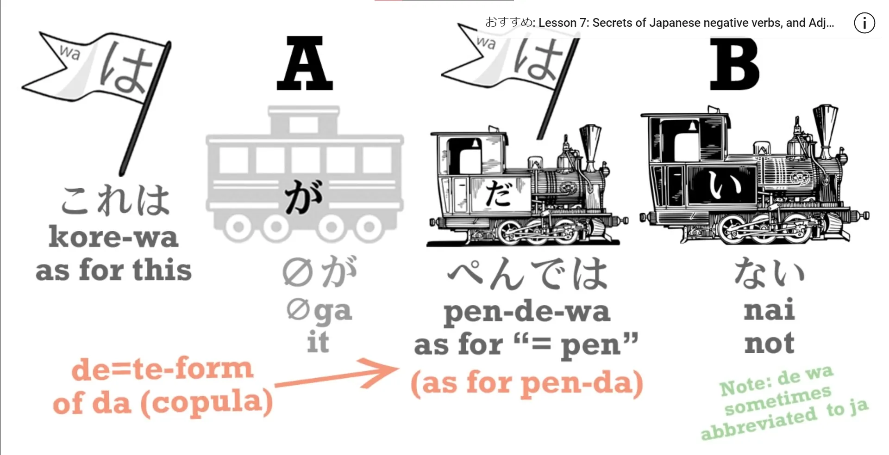
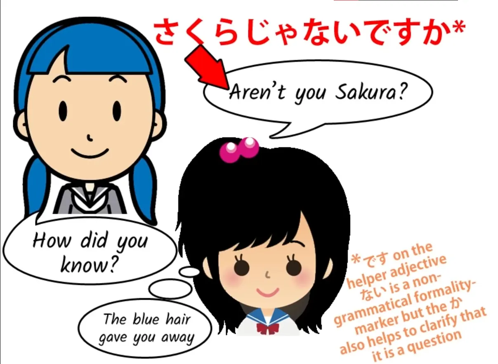
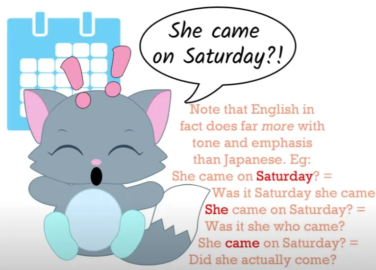
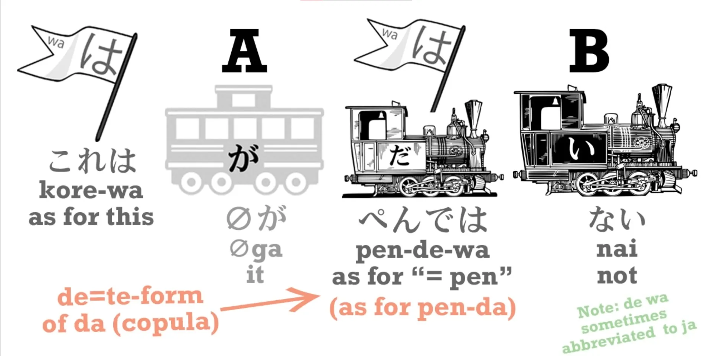
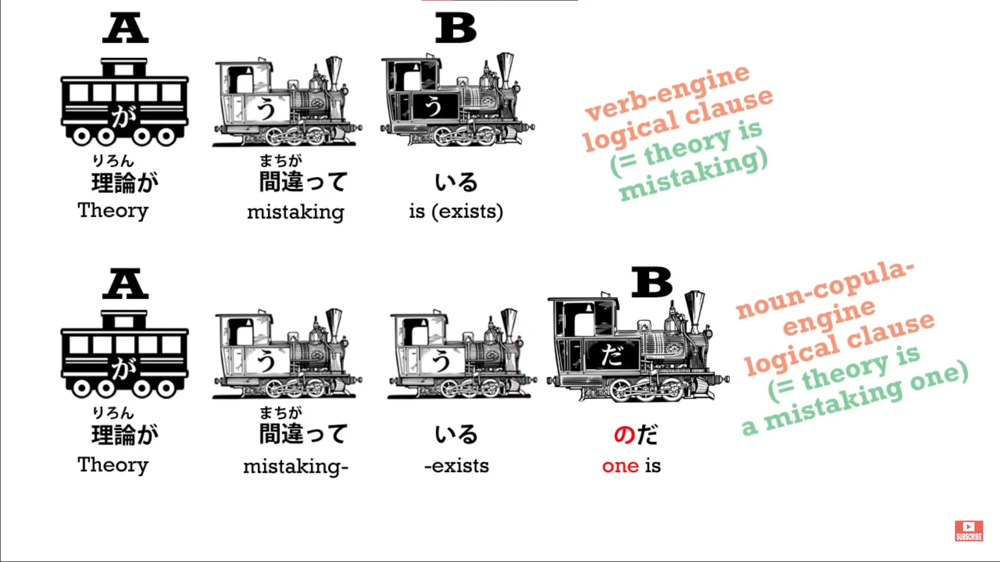
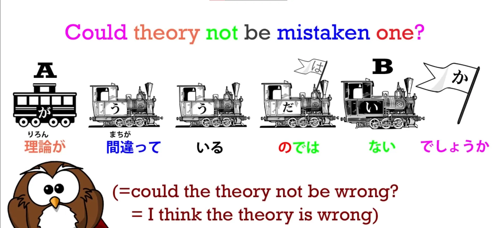
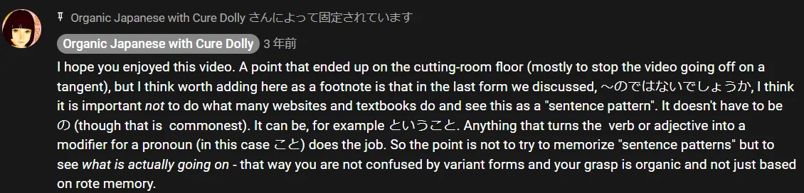

# **38. When <code>it isn't</code> means <code>it is</code>: mysteries of じゃない janai, ではない de wa nai**

[**Lesson 38: Know when <code>it isn't</code> means <code>it is</code>: mysteries of じゃない janai, ではない de wa nai**](https://www.youtube.com/watch?v=so7BXOwSyEU&list=PLg9uYxuZf8x_A-vcqqyOFZu06WlhnypWj&index=40&pp=iAQB)

こんにちは。

Today we're going to talk about something that puzzles many learners of Japanese, especially once they've learned a little Japanese and they start reading Japanese or listening to anime etc. And this is the fact that Japanese people often make what appear to be negative statements when they may mean in fact a positive statement.

For example, someone may say <code>さくらじゃない</code>, which would appear to mean <code>That isn't Sakura.</code> But its actual meaning is <code>That is Sakura, isn't it?</code> or even simply <code>That is Sakura</code>. Now, how does this work, how do we recognize it, and how do we understand it?

For a start, <code>じゃない</code> is the contraction of <code>ではない</code> which, of course, is the negative of the copula, as we learned right back in our lesson on Japanese negatives.

So, <code>A,Bだ</code> or <code>A,Bです</code> means <code>A is B</code>. <code>A,Bではない (or ではありません)</code> means <code>A is not B</code>. So there is no question here that we are in fact hearing what is, grammatically, a negative statement.

So how do we interpret this? Well, to begin with, let's remind ourselves of the fact that negative questions are used in most languages, including English, to elicit a positive response.

So if we say <code>It's a nice day, isn't it?</code> we mean that it is a nice day and we expect our hearer to agree. If we say <code>Are you Sakura?</code> this is a neutral question.

We're not suggesting that we either think it is or it isn't. We're simply asking the question. But if we say <code>Aren't you Sakura?</code> then we are in fact indicating that we think you are Sakura.

And a negative question asking for a positive response like <code>It's a nice day, isn't it?</code> is common certainly to all the languages I know. In French we have <code>n'est-ce pas</code>, in German we have <code>nicht wahr</code>, and of course in Japanese we have <code>ね</code>, which is originally a negative question.

So if we say <code>さくらじゃないですか</code> we're saying exactly the same thing as in English <code>Isn't that Sakura?</code> meaning we think it is.

The first problem that arises here is that, while we say in formal speech <code>さくらじゃないですか</code> because in formal speech the <code>か</code> acts as a verbal question mark, turning any statement into a question, we don't usually use <code>か</code> as a question-making sentence-ender in ordinary, non-formal Japanese. So what would be <code>さくらじゃないですか</code> in formal Japanese becomes <code>さくらじゃない</code> in regular Japanese.

<code>さくらじゃない</code> has fundamentally three potential meanings. *(indicated by tone in speech)* We can say <code>さくらじゃない。</code> -- that means <code>That isn't Sakura</code>.

We can say <code>さくらじゃない？</code> and that means <code>That's Sakura, isn't it?</code> But we can also say, perhaps meeting Sakura after quite a long time, <code>さくらじゃない！</code>, and that certainly doesn't mean it isn't Sakura and it's not a question either.

We've actually recognized her and what we're saying is something that could perhaps best be rendered into English as <code>If it isn't Sakura!</code> meaning it is Sakura. Now there's nothing particularly mystical and Japanese about this.

We do the same sort of thing in English. For example, if we said <code>She came on Saturday</code>, that's simply conveying a piece of information.

If we say <code>She came on Saturday?</code> we're asking whether she came on Saturday or not. And if we say <code>She came on Saturday?!</code> we've just received the information that she came on Saturday and we are expressing surprise about it.

We know how to interpret this in English and it's easy to learn how to interpret <code>じゃない</code> in Japanese once we understand the range of meaning it possesses. <code>じゃない</code> gets used with other meanings too.

Particularly, it gets used as a negative question tag-ending very much like <code>ね</code>. For example, we might say <code>暑いじゃない</code> which means pretty much the same thing as <code>暑いね</code>.

It's something like a tag-question, expecting our listener to agree with us. And we can note here that there's no ambiguity at all in this, because <code>暑いじゃない</code> is not the negative of <code>暑い</code> – that's <code>暑くない</code>.

---

And it can also be put after verbs. For example, <code>もう言ったじゃない</code>, which means <code>I already said that, didn't I?</code>

We should also note that <code>じゃない</code> is often reduced to just <code>じゃん</code> in very colloquial speech, and it's often used in that way when it's affirming something or asking for confirmation. Now, it's clear that these expressions are very colloquial and in fact so colloquial that when we use them with a verb or an adjective they're not in fact grammatical.

And the reason for this, as I've already alluded to, is that, for example, <code>暑いじゃない</code> is not the negative of <code>暑い</code> because that's <code>暑くない</code>. Why can't we use <code>じゃない</code> with verbs or adjectives?

Well, that's because, as we learned right back in the first lesson, <code>じゃない</code> is in fact <code>ではない</code>, which is the negative of the copula. So if we say <code>これはペンだ</code> we're saying <code>This is a pen</code>; if we say <code>これはペンではない</code>, we're saying <code>This is not a pen</code>, and you can't properly use <code>ではない</code> with anything but two nouns.

I don't actually think that these colloquial statements are fundamentally ungrammatical. It's just that being colloquial may leave a few steps out of the process.

There are in fact much more formal ways of using <code>ではない</code> as a positive statement, but these of course tidy up the grammar. So, for example, if we say <code>その理論が間違っているのではないでしょうか</code>, we're saying <code>Might that theory not be in error?</code>

And we see we have essentially the same construction that we've been dealing with before: <code>その理論が間違っている... ではない</code>, but that <code>の</code> turns it into a grammatical statement. Why?

Because <code>その理論が間違っている</code> means literally <code>that theory exists in a state of mistaking</code>. That's a verbal clause complete in itself.

However, when we add <code>の</code>, that <code>の</code>, as we've seen in [**other lessons**](https://www.youtube.com/watch?v=Bq3GO63D9bw&ab_channel=OrganicJapanesewithCureDolly), plays the role of a pronoun like <code>thing</code> or <code>one</code> which is being modified by <code>間違っている</code>.

So now we have <code>that theory exists in a state of error one</code>. So we have two nouns and we now need the copula to join them together.

So <code>その理論が間違っているのではない</code> means <code>that theory existing-in-error-one is not</code>. The <code>でしょうか</code> doesn't add anything grammatically to the statement.

As we know, adjectives like <code>ない</code> stand on their own. They don't require a <code>だ</code>, even though they get a <code>です</code> as a mere decoration, a non-grammatical decoration, in formal speech, so what <code>でしょうか</code> is doing here is it's simply a flag put at the end of the complete grammatical statement: <code>その理論が間違っているのではない</code>.

<code>でしょうか</code> turns it explicitly into a question and into a suggestion rather than a statement. So we're saying <code>Might that theory not be a mistaken one</code>?

Now, this can mean what it seems to say. It can mean that we're in some doubt and we're actually asking whether that might not be the case.

But a lot of the time this is used not just as an assertion but as a quite strong assertion. We might use this to sum up our argument when we have definitively disproved the theory in question.

An American writer or speaker might sum up such an argument with "It is now clear to anyone with an intelligence greater than that of a Roomba that this theory holds about as much water as a topless thimble in the Sahara Desert."

However, that kind of definite assertion in Japanese is not considered either polite or very persuasive. It sounds as if you're trying to make up for a weak argument by a strong assertion.

So the equivalent Japanese speaker may sum up the same completely persuasive argument with <code>ですからその理論は間違っているのではないでしょうか</code>. And that means exactly the same thing, allowing for cultural differences…

::: info
if anything is still unclear, delving into the comments of the video might be helpful.

:::
