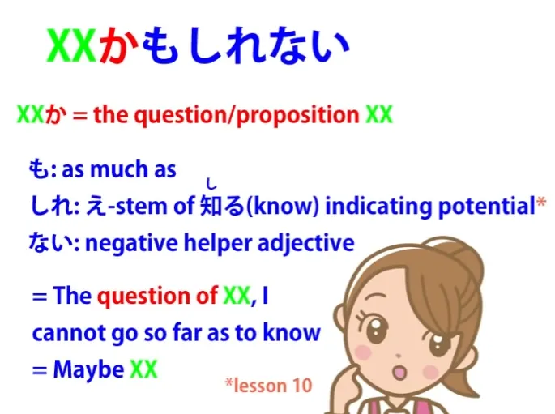

# **39. The か Particle: <code>Buried questions</code>, かな, もんか, かどうか...**

[**Lesson 39: The か Ka-particle's Secret Life! <code>Buried questions</code>, Kana, Monka, Ka dou ka & much more**](https://www.youtube.com/watch?v=TOv3voBcEv8&list=PLg9uYxuZf8x_A-vcqqyOFZu06WlhnypWj&index=41&pp=iAQB)

こんにちは。

Today we're going to talk about questions that aren't questions. They come up all the time in Japanese, so it's important to understand what they are and how they work. So, what we're going to talk about is the particle -か.

Now, we probably know the particle -か as a kind of verbal question mark that goes at the end of です/ます sentences to turn them into questions. However, we don't use -か, as we explained last week, at the end of sentences to mark them as questions in regular, non-formal Japanese.

Why not? Because putting -か at the end of a non-formal sentence sounds kind of blunt and rough. It's not ungrammatical, and it's sometimes used by male speakers who want to sound blunt or rough.

But generally speaking, we don't use it. We indicate questions by intonation in regular speech. But we do use the -か marker all the time, just not at the end of sentences.

What do we use it for? Well, we use it to mark questions, but not quite what we normally think of when we say <code>question</code>.

So let's start right off with an example. Suppose we say, <code>さくらが来るかわからない.</code> What we're saying is <code>I don't know if Sakura will come.</code>

And what's literally happening here is that we're turning the logical sentence, the proposition, <code>さくらが来る</code>, which means <code>Sakura will come</code>, into a question, and then we're saying <code>わからない.</code> So we're essentially saying <code>Sakura come (question), not clear / The question of whether Sakura will come is not clear to me.</code>

In English, <code>I don't know if Sakura's coming.</code> Now, we can use this as part of an actual question.

We might say <code>さくらが来るか知っていますか.</code> Now, if we ask that in です/ます form, as I just did, we use a second -か at the end to mark the actual question.

So we're saying <code>The question of whether Sakura will come, do you know?</code> And we should notice here that what's happening is, first of all, the -か is turning the proposition, the question, into something noun-like which we can then use as the basis of a new sentence.

So that's the first thing we need to notice, and the second thing we need to notice is that -か displaces logical particles most of the time. So, normally when we say <code>わからない</code>, we say <code>(何-何)がわからない</code>; if we say <code>知ってる</code>, we say <code>(何-何)を知ってる</code>; but in this case the -か particle displaces the normal logical particle.

So we say <code>さくらが来るかわからない</code> not <code>さくらが来るかがわからない.</code> So <code>さくらが来るか</code> is a noun-like entity which, because it ends in -か, doesn't need to take the usual logical particle.

## かどうか

Now, it also gets used in the common expression <code>かどうか</code>. And although we can learn this as a glued-together expression meaning <code>whether or not</code>, so <code>さくらが来るかどうかわからない</code> means <code>I don't know whether Sakura's coming or not,</code> (in English that's how we'd say it, as opposed to <code>さくらが来るかわからない</code> -- in English we'd say <code>I don't know if Sakura's coming</code>; <code>さくらが来るかどうかわからない</code> – we'd say in English <code>I don't know whether Sakura's coming or not.</code>)

what we're literally saying here is <code>Sakura coming (question) how (question) わからない.</code> So what we're saying is something like <code>I don't know if Sakura's coming or how it will be.</code> And from this we can see how we get the use of -か to mean <code>or</code> between nouns.

So we can say <code>お茶かコーヒーどちらがいい?</code> -- <code>Tea or coffee, which would you like?</code> Now, how is this working?

Well, essentially this is an abbreviation of <code>お茶かコーヒーかどちらがいい?</code> So, we're putting two propositions side by side, <code>whether coffee or whether tea,</code> and then asking <code>どちらがいい?</code>

And once again although this seems like a different use, -か is doing the same thing -- it's bundling something up as a proposition. But remember that when we use <code>or</code> in English it's always got to be a question.

It's never a certainty. If we say <code>A or B</code> we're saying it might be A and it might be B.

If we say <code>A and B</code>, we know what we're talking about. We know that both A and B exist or do whatever it is that we're saying.

But if we say <code>A or B</code>, we don't know whether it's A or whether it's B. We know it's one of them.

So, again this -か, this questioning-whether particle, is continuing to use that function of marking a possibility, a question, something that might happen or might not happen, might be there or might not be there.

## かも知れない

Now, we see this at work, for example, in <code>かも知れない</code>.

Now, this is taught as if it were a word or expression that means <code>maybe</code>. And it is, but teaching it as a lump like that, as I've explained in another video, is misleading.

The point of that misleadingness that I would like to talk about here is that it confuses us about what that -か is actually doing. That -か is attached to the proposition that we are talking about.

So, if we say <code>さくらが来るかも知れない</code> -- <code>Perhaps Sakura will come</code> -- what we're saying is <code>さくらが来るか</code>, that's the question or proposition that we're talking about, and then <code>も知れない.</code> The も is giving us the meaning of <code>even</code> or <code>as much as</code>, as I've explained that it very often does, and <code>知れない</code> is <code>知る</code> -- <code>know</code> / <code>知れる</code>-- <code>ability to know or be known</code> and the helper adjective <code>-ない</code>.

So the whole thing actually means <code>さくらが来るか</code> -- <code>the question of whether Sakura comes</code> – <code>も知れない</code> -- <code>I can't go so far as to know / Maybe Sakura will come, maybe she won't.</code>

## かな

Similarly with <code>かな</code>, which is sometimes presented as a particle meaning <code>I wonder</code>, you see how this actually works.

::: info
in the video, there is a typo where the red line says が instead of か. I fixed it.

:::

<code>か</code> is taking the proposition, so if we say <code>さくらが来るかな</code>, we're saying <code>さくらが来るか</code> -- <code>the question of whether Sakura will come</code> -- <code>な</code>. Now, <code>な</code>, as we've discussed in [**another video**](https://www.youtube.com/watch?v=IWEok4Ivfyc&ab_channel=OrganicJapanesewithCureDolly), is a marker that indicates addressing something to yourself.

So, you're saying <code>Will Sakura come?</code> addressing that to yourself. The way we would say that in English is "I wonder if Sakura will come / I am pondering the question of whether Sakura will come."

And while it's all right to learn things like <code>かな</code> and <code>かも知れない</code> as if they were what the textbooks say they are, lumps of grammar that you just have to memorize, it helps not only with those but with structure as a whole to understand what they're really doing. They're bundling something into a question, so a proposition becomes a question which is a noun-like entity which we can then add something like "do you know / I don't know / I can't be sure<code> or </code>I wonder (I'm addressing this question to myself)."

Now, from this proposition-making quality and questioning quality of -か, we get expressions such as one which we discussed in a previous video, <code>まるでゆうれいを見たかのような顔.</code>

Now, that means <code>a face as if one had seen a ghost.</code> So what's the -か doing here?

It's doing the same thing as before. It's marking <code>ゆうれいを見た</code> as a question, a proposition, a thing that's not certain, in fact in this particular case, a thing that hasn't happened: we're not saying that the person HAS seen a ghost, we're only saying that she had a face AS IF she had seen a ghost.

So we're marking the proposition that she'd seen a ghost as a question and then continuing to comment on it, and in this case we actually are attaching a logical particle, the logical particle の, to the か-marked noun-like entity that we have made of the proposition that she is seeing a ghost.

So with a の-particle, unlike the が and を-particle, we can attach this to a か-marked entity. Now, there is another use of -か, which is a little different but still closely related to its question-making quality.

## もんか/ものか

And that is in certain expressions where it negativizes what we're talking about.

An example of this that you've probably come across if you've been watching anime or reading manga is <code>もんか</code>. And that's short for <code>ものか</code>, and it can be used in more formal speech, in which case we say <code>ものですか</code>.

So, if I were to say <code>そちらへ行くものですか,</code> I'm saying <code>I won't go there / I'm not going there.</code> If I say <code>さくらが来るものですか,</code> I'm saying "Sakura is not coming / She won't come / There's no likelihood of her coming."

What does <code>ものですか</code> mean? It means literally <code>Is that a thing?</code>

So, it's a question, but it's the kind of negativizing question that we also get in English when we say things like <code>Do you think I'm going to do that?</code> or <code>Would I do that?</code> or <code>How likely is that?</code>

In all those cases, by turning something into a question we're denying its likelihood. Now, when we say <code>ものか</code> it's the same thing, and it often gets reduced right down to <code>もんか</code>.

So someone might say <code>それを食べるもんか</code> -- <code>I'm not eating that.</code> And you notice here that we are in fact using the か marker after a regular non-formal sentence, and that's because <code>もんか</code> or <code>ものか</code> is in fact rather a rough way of talking.

You're denying something very forcefully and often in opposition to somebody.

## どころか

Another place where we often see -か as a negativizing question marker is in <code>どころか</code>. Now, <code>どころ</code> is a form of <code>ところ</code>, which we talked about in a recent lesson, didn't we? *(Lesson 36)*

<code>ところ</code> can mean not just <code>place</code> in the literal sense, but a time or a circumstance or condition. When it's said as <code>どころ</code> it's usually negative, so when we say <code>どころか</code>, we're negativizing what came before it and usually putting an even stronger negative after it.

So if we say, for example, <code>漢字が読めるどころかひらがなも読めない</code> -- <code>Not only can't I read kanji, I can't even read hiragana.</code>

What's <code>どころか</code> doing here? Well, of course it's negativizing, just as we've already seen that it can, but it's also using the concept of place / <code>ところ</code>, that's to say, conceptual space rather than literal place.

We're saying <code>Not only can't I go as far as reading kanji, I can't even get to the point of reading hiragana.</code> That's the metaphor that's being used here: not only has the situation not reached this far place, it hasn't even reached a nearer place than that.

So we see that while -か has a variety of meanings, all of them are closely connected to its ability to make a question and turn the question into a proposition, but never a proposition that exists in actuality, always a hypothetical condition…
