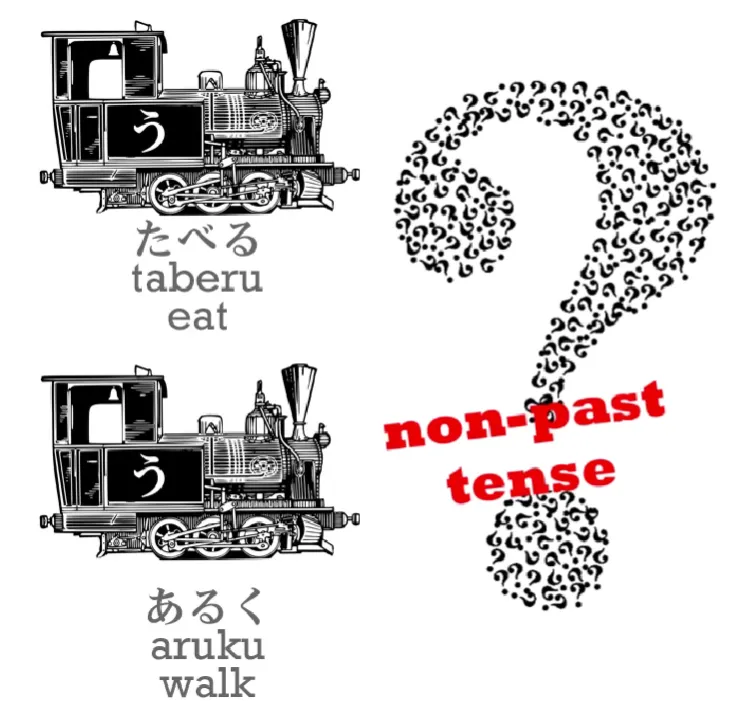
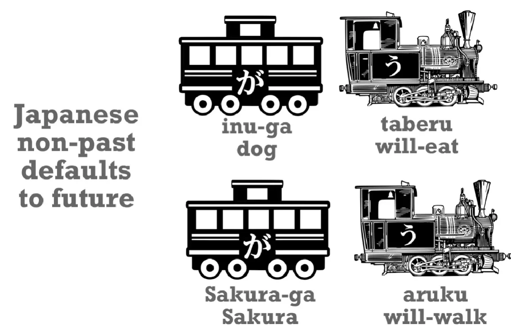
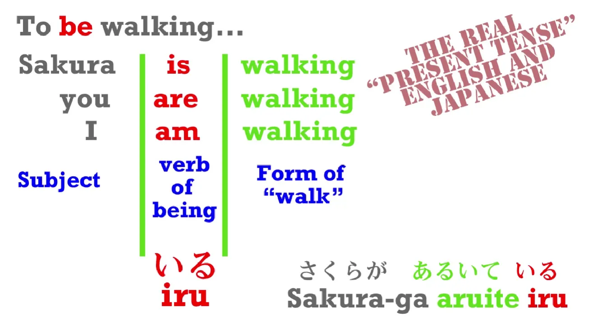
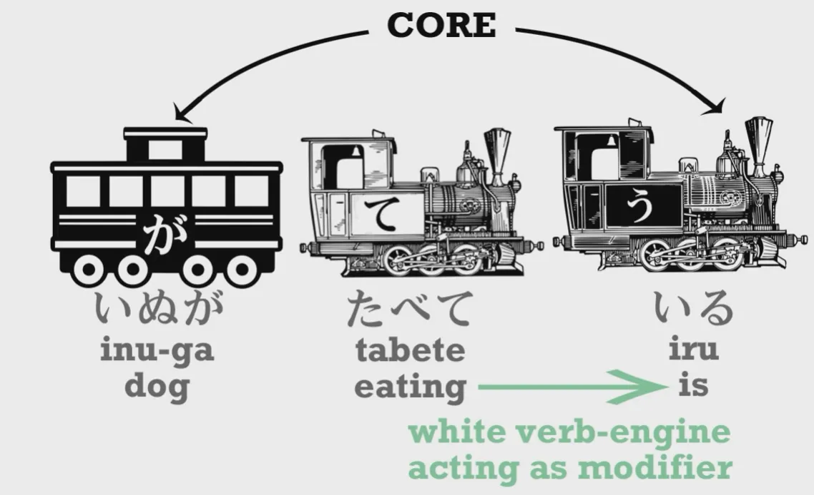
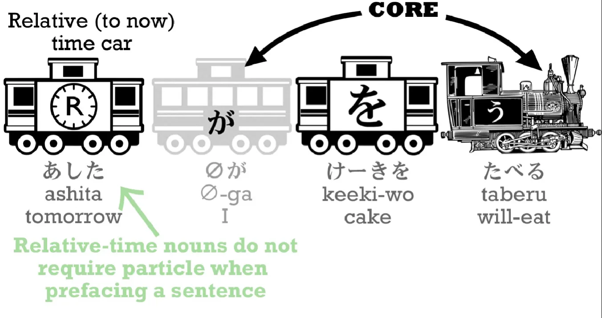
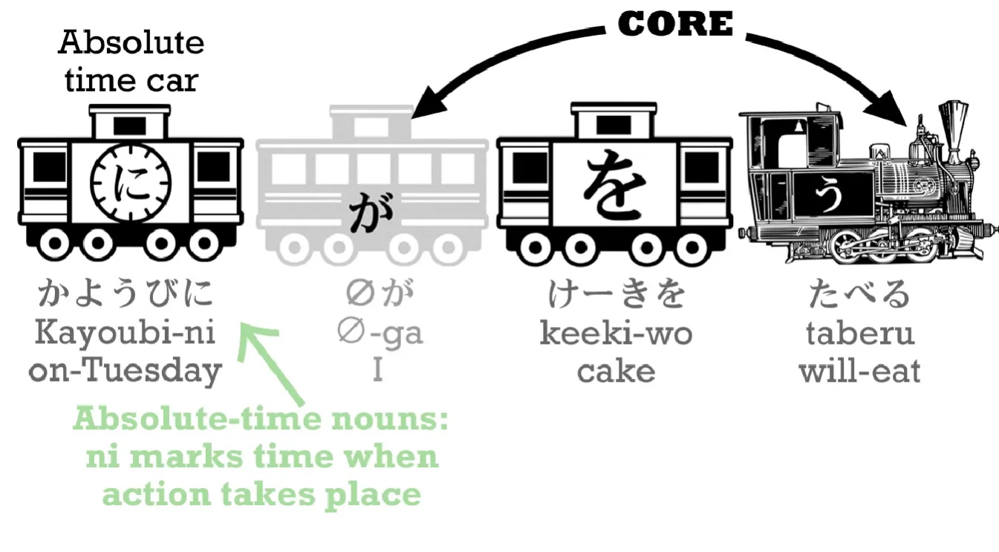
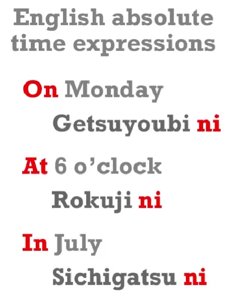

# **4. Japanese Verb Tenses**

[**Lesson 4: Japanese past, present, and future tense. How Japanese verb tenses really work**](https://www.youtube.com/watch?v=lU5rmrAORDY&list=PLg9uYxuZf8x_A-vcqqyOFZu06WlhnypWj&index=4&ab_channel=OrganicJapanesewithCureDolly)

こんにちは。

Today we're going to talk about tenses. Up to now, we've only been using one tense, and that is the one represented by the plain dictionary form of verbs: 食べる/たべる - eat; 歩く/あるく - walk, and so forth. To use natural-sounding Japanese, we need three tenses. You might think they would be past, present and future, but in fact they're not.

## The non-past tense

The one we've been using up to now is not a present tense. It's called the non-past tense, and a lot of people think this is confusing. Why can't Japanese have a simple present tense like English instead of something vague and mysterious like a non-past tense?

Well, actually it isn't confusing at all, and what makes it confusing is, for a change, not the fact that Japanese is taught in a strange way, but the fact that English is taught in a strange way. The truth is that the Japanese non-past tense is very similar to the English non-past tense.

What is the English non-past tense? Well, it is the plain dictionary form of English words: eat, walk, etc. Why do I call it a non-past tense? Well, let's take an example. Suppose you get a message on your 携帯/けいたい (phone) saying, <code>I walked to the cafe and now I eat cake and drink coffee</code>. What would you know about the person who sent that message? Well, you'd know that it was not a native English speaker, wouldn't you? Because no native English speaker says <code>I eat cake and I drink coffee</code> when they mean <code>I am eating cake and drinking coffee right now</code>.

When so we say <code>I eat cake</code>? Well, we might say it when we mean that we eat cake sometimes: "I eat cake. I'm not one of these people who doesn't eat cake. I do eat cake. Whenever there's any cake around, I eat it. But that doesn't mean I'm eating cake right at this moment."

When else do we use the English non-past plain form of verbs? Well, sometimes we use them for future events: <code>Next week I fly to Tokyo.</code> <code>Next month I have an exam.</code> And sometimes we use them for something that's going on right now, but not mostly. For example, in a literary description: "The sun sinks over the sea and a small happy robot runs across the beach." But that isn't the way we use it most of the time in everyday speech, is it?

So, the Japanese non-past tense is very similar in the way it functions to the English non-past tense. If you understand one you can pretty much understand the other. **Most of the time, the Japanese non-past tense refers to future events.** <code>いぬがたべる</code> - <code>The dog will-eat</code>; <code>さくらがあるく</code> - <code>Sakura will-walk.</code>

The way we've been using it up to now - <code>Sakura walks</code> - is possible, but it isn't the most natural way. We've been using it that way because it was the only tense we knew.

## Continuous actions and ている

If we want to say something more natural, like <code>Sakura is walking</code>, what do we do? Well, what do we do in English? In English we say, don't we, <code>Sakura IS walking</code>. We use the word <code>to be</code>. You can <code>BE walking</code>. <code>Sakura IS walking</code>; <code>We ARE walking.</code>

Fortunately, in Japanese we don't have all these different forms of the word <code>to be</code>. We use the same word every time, and the word is <code>いる</code>. <code>いる</code> means <code>be</code> **in relation to animals and people**, and to make this continuous present tense, we always use <code>いる</code>.

So, <code>Sakura is walking</code> – <code>さくらがあるいている</code>. <code>Dog is eating</code> – <code>いぬがたべている</code>

Now, let's notice that in a sentence like <code>いぬがたべている,</code> we have something we haven't yet seen, and that's a white engine. **A white engine is an element that could be an engine but in this case it's NOT the engine of this sentence. It's modifying, or telling us more about, one of the core elements of the sentence.**

So, the core of this sentence is <code>いぬがいる</code> - <code>the dog is</code>. But the dog isn't just existing – the dog is doing something. And that white engine tells us what it is doing. It is <code>eating</code>. And we're going to see this white engine structure over and over again as we go deeper into Japanese.

And just as in English we don't say <code>the dog is eat</code>, we use a special form of the verb that goes along with the verb of being. So in English we say <code>is walking</code>, <code>is eating</code>. In Japanese we say <code>食べている/たべている</code>, <code>歩いている/あるいている</code>.

---

Now, how do we form this <code>て-form</code>, which is the form we use for making the continuous present? With a word like <code>食べる/たべる</code>, it's very easy indeed. All we have to do is take off the <code>る</code> and put <code>て</code> in its place. たべる becomes たべて.

The bad news is that with other verbs, we do have slightly different ways of attaching the <code>て</code>. Apart from the plain る-form, there are four other ways. The textbooks will say five, but in fact two of them are so similar that we can treat them as four. And I've made a video on exactly what these ways are *(Lesson 5, so the next lesson).* And it makes it much simpler than most explanations.

So it's very important to watch that so that you can learn how to form the continuous present tense. The good news: it's perfectly regular. Once you know the ending of a verb you also know how to put the <code>て</code> onto it. The only one that's a bit tricky is る-ending verbs, but the video will explain that.

## Past tense

So, how do we put things into the past tense? Fortunately that's very easy indeed. **All we do is add <code>た</code> – that's the whole thing.** So, <code>いぬがたべる</code> – <code>dog will-eat</code> / <code>いぬがたべた</code> – <code>dog ate</code>.

Now, there are different ways of attaching <code>た</code> to different kinds of verb, verbs with different endings, but the good news here is that they are exactly the same as the ways that you attach <code>て</code>. So once you've learned the ways that <code>て</code> attaches, you've also learned the ways that <code>た</code> attaches. So if you watch that て-form video ***(Lesson 5)***, you'll be able to do both the continuous present and the past.

Now, there's one more thing about time expressions that is useful to learn now. If we want to make it clear, when we say <code>私はケーキを食べる</code>, we're talking about a future event, we can say <code>明日/あした</code> (which means <code>tomorrow</code>) <code>あしたケーキを食べる</code>. That's all we have to do.

## Time expressions

We just say <code>tomorrow</code> before we say the rest of the sentence, just as we do in English. <code>Tomorrow I'm going to eat cake</code> – <code>あした *(zeroが)* ケーキを食べる</code>.  
::: info
Sometimes I add zeroが even when Dolly does not say it in the transcript, BUT she shows it in the videos, I obviously only add it then if it is shown by her, I do not do it on my own…
:::

Now, <code>tomorrow</code> is what we call a <code>**relative** time expression</code> because it's relative to today. Today is yesterday's tomorrow.

And with all relative time expressions like that: yesterday, last week, next year, and so forth, times that are relative to the present time, we just do what we did then. **We put the time expression at the beginning of the sentence and that puts that whole sentence into that time.**

---

However, when we have an <code>absolute time expression</code>, an expression that is not relative to the present, such as Tuesday or six o'clock, then **we have to use <code>に</code>**.

Tuesday is <code>火曜日/かようび</code> and we may may say <code>かようびに *(zeroが)* ケーキをたべる</code> – <code>On Tuesday (I) will eat cake.</code>

The important thing here is that it can seem a bit complicated to have to work out, <code>Is the time absolute or relative?</code> And the good thing to know here is that it's not complicated at all, because it works exactly the same as English.

In English, we say, <code>Tomorrow I eat cake</code>, <code>Next week, I have an exam</code>, and so forth, **but when we use an absolute time expression** we say, <code>**On Monday** I will eat cake</code>, <code>**At six o'clock** I have an exam</code>; if we're talking about a month we say, <code>**In July** I'm going to Tokyo</code>.

Now, Japanese works in exactly the same way except that we don't have to remember when we're using <code>on</code>, when we're using <code>at</code> and when we're using <code>in</code>. **In Japanese we use <code>に</code> every time.**

But in English when we need one of those little words, <code>on</code>, <code>in</code> or <code>at</code>, then we need <code>に</code> in Japanese. And when we don't, then we don't need <code>に</code> in Japanese. **English and Japanese are identical in that respect.**

So rather than sitting down to work out <code>Is this relative, or is this absolute?</code>, **just think whether you need an <code>on</code>, <code>in</code> or <code>at</code> in English, and if you do, you need <code>に</code> in Japanese.** And if you don't, you don't need <code>に</code> in Japanese. It's really as simple as that.