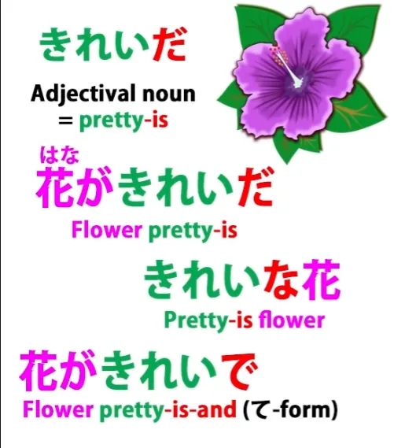
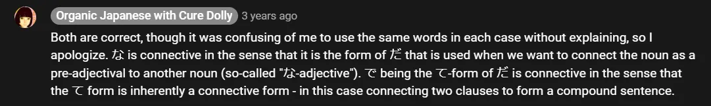
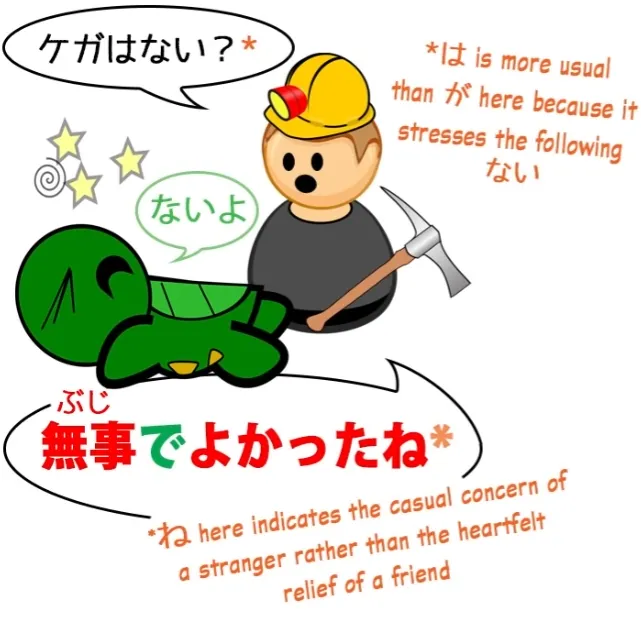
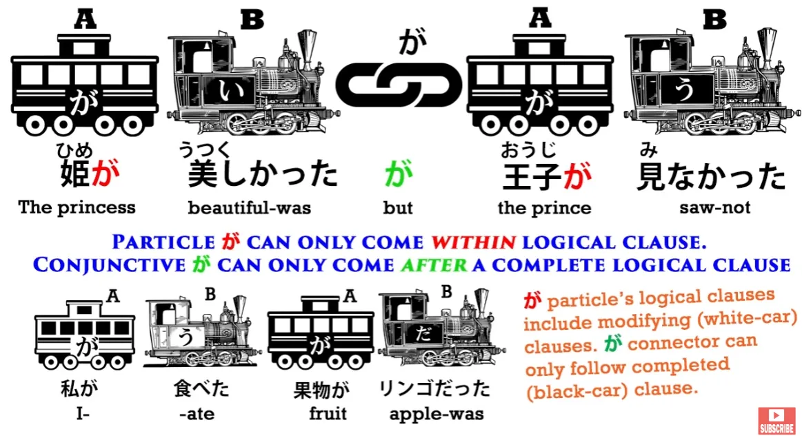
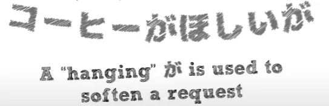
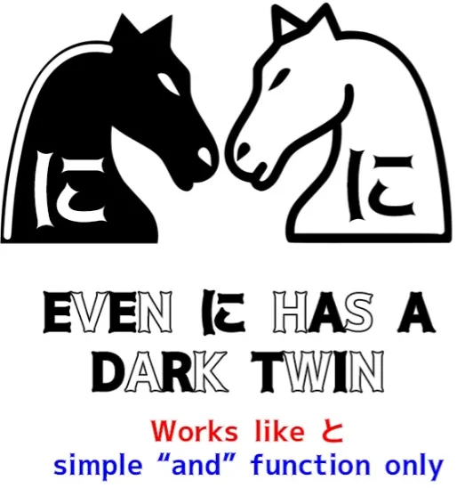
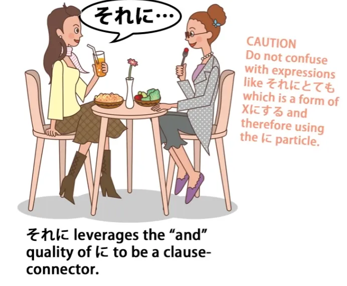
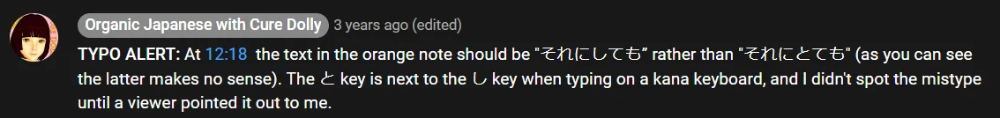

# **40. 3 pitfalls in Japanese and how to avoid them**

[**3 PITFALLS in Japanese and how to avoid them 【Japanese Structure Lesson 40】**](https://www.youtube.com/watch?v=Qf7IGkrnnjY&list=PLg9uYxuZf8x_A-vcqqyOFZu06WlhnypWj&index=42&pp=iAQB)

こんにちは。

Today we're going to discuss some pitfalls in Japanese structure. These are very small elements, single kana elements of the language, but very vital ones that can, if you don't know about them, be very confusing because one element can be easily confused with another one that looks identical.

And the textbooks, in many cases, don't tell you about this at all. They leave you completely floundering.

## で (connective/て-form of the copula)

The first one we're going to look at is <code>で</code>. Now, <code>で</code>, as you know, is a logical particle.

It has a very clearly defined use which we introduced in Lesson 8b. Like all logical particles, it marks a noun, and it tells us that that noun is the place where an action took place or the means by which an action was done.

However, there is another <code>で</code>, which is not a particle, which is also used very frequently in Japanese, and the textbooks make no attempt to distinguish these two completely different but identical-looking elements. The first time most of us will meet the second of these <code>で</code>s is in the use of adjectival nouns, which are very confusingly and misleadingly called <code>な-adjectives</code> by the textbooks.

So if we say <code>さくらがきれいで優しい</code>, what we're saying is that Sakura is pretty and kind. <code>綺麗/きれいだ</code> is an adjectival noun.

If we want to say <code>The flower is pretty</code>, we say <code>花がきれいだ</code>. And if we want to say <code>the pretty flower</code>, we have to put <code>きれいだ</code> on the other side of the flower, so we say <code>きれいな花</code>.

And that <code>な</code>, as we know, is the connective form of <code>だ</code>. But if we want to say <code>Sakura is pretty and kind</code>, we can't use <code>だ</code> and we can't use <code>な</code>, but we do have to use the copula.

What we use now is the connective form of the copula, that is to say, its て-form. And the て-form of <code>だ</code> is <code>で</code>.

::: info
to avoid confusion of Dolly using the words ‘the connective form of the copula’ for both な and subsequently で.

:::

So if you say <code>Sakura is beautiful and kind</code>, this is a true adjective, an <code>い-adjective</code>, and we use the て-form to connect it: we say <code>さくらが美しくて優しい.</code> If it's an adjectival noun, we still have to have the copula, so we say <code>さくらがきれいで...</code>

That's the て-form of the copula. Now, I've already explained that in our lessons on adjectivals, but we also find this <code>で</code>, the て-form of <code>だ</code>, in lots of other cases in Japanese.

So let's take a couple of cases and see if you can tell which of the two <code>で</code>s is being used. A very common thing to say to someone when you're leaving them, perhaps for a while, is <code>お元気で</code>.

Now, <code>元気</code>, as you know, means <code>well</code> or <code>healthy</code> or <code>lively</code> and the <code>お</code> is just an honorific or prettifier. What is the <code>で</code> here?

Is it the logical particle or is it the て-form of the copula? This is the て-form of the copula, not the particle.

The particle doesn't make any sense here, does it? What's the て-form of the copula doing?

Well, we know, don't we, that the て-form is often used to make an imperative, to tell someone or ask someone to do something. So, if we say <code>待って</code> -- <code>wait</code> -- this is kind of short for <code>待ってください</code> and we're asking someone to wait (<code>待って!</code> -- <code>Wait!</code>).

Now, it's exactly the same with <code>で</code>, which is the て-form of the copula. So, <code>元気だ</code> means <code>is 元気</code>, someone is genki, someone is healthy or lively.

<code>元気で</code> is telling them to \*be\* genki or lively. <code>お元気で</code> -- <code>be healthy / be lively / keep up the good spirits</code>.

### 無事/ぶじで

Right. So here's another one: <code>無事でよかった</code> is another very common expression and it means <code>I'm glad that you're all right / it's good that you weren't harmed / it's good that you're safe</code> -- <code>無事でよかった</code>.

What do we have here?

Once again, we have the て-form of the copula. <code>無事</code>, which means literally <code>no incident</code> and therefore it means <code>nothing happened / nothing bad happened / you weren't harmed / you're safe.</code>

So, <code>無事だ</code> means <code>you're safe / you weren't harmed / nothing happened</code>. <code>無事で</code> is turning that <code>だ</code>, that copula, into the connective form.

We use the て-form to connect things, don't we? So, just as we might say, <code>遅くなってすみません</code> -- <code>That I came late, I'm sorry</code>-- we also say <code>無事でよかった</code> -- <code>That you weren't hurt, that was good.</code>

And this connective て-form is also used in longer compound sentences. So, for example, we might say <code>さくらはいい子で毎日学校に行く</code> -- <code>Sakura is a good child and she goes to school every day.</code>

We have two complete clauses and, just as with the て-form of any verb, we can use it to connect that verb-ending clause to a second clause, so we can do exactly the same thing with the copula. So, <code>さくらがいい子だ</code> -- <code>Sakura's a good girl</code> -- is a complete sentence in itself.

If we want to connect it to a second clause to make it the first half of a compound sentence, we turn that <code>だ</code> into its て-form, <code>で</code>. So, <code>Sakura is a good girl and she goes to school every day.</code>

And as is usual with the て-form connector, it tends to imply a positive relation between the two. It has this implication of <code>Because Sakura's a good girl, she goes to school every day,</code> but it's not stating it as strongly as if we'd used <code>から</code>.

---

Now, another confusion, which is not kept such a deep, dark secret by the textbooks, but they don't always stress it clearly enough, and it's very important because it concerns the very center of the Japanese language, and that is the が-particle.

## が clause connector

The が-particle, as we know, is the one particle that no sentence or clause in Japanese can ever be without, whether we can see it or whether we can't. <code>が</code> marks the A-car of every sentence, the do-er of an A-does-B clause and the be-er of an A-is-B clause.

But there is also another <code>が</code>. It's not easy to confuse the two, provided you're clearly aware of them.

The other <code>が</code> is also a clause connector. And usually it's a contrastive clause connector.

So, if we say, <code>お店に行ったがパンがなかった,</code> we're saying <code>I went to the shops, but there wasn't any bread.</code>

::: info
The second が is the particle version of が for its logical clause, marking パン.
:::

So, this is a contrastive conjunction. We went to the shops hoping that there would be bread, but there wasn't any.

It's not possible to confuse this with the other <code>が</code>, the <code>が</code> that marks the subject of the sentence, the A-car, because that <code>が</code>, the particle <code>が</code>, can only ever mark a noun.

And the clause-connector <code>が</code> can only ever mark a complete sentence. The particle <code>が</code> can't mark a complete sentence, because a complete sentence can't end with a noun.

It has to end with a verb, an adjective, or a copula, as we learned in our very first lesson. So it's not possible to confuse these two so long as you're clearly aware of them.

One more thing that we should note is that <code>が</code> doesn't have to be contrastive. Most of the time it is, but it can be used as a regular, non-contrastive conjunction.

It's worth knowing that, because if you see it connecting two clauses and there doesn't seem to be any contrast there, you don't have to rack your brains to find the contrast -- occasionally it is used in a non-contrastive manner. And the other thing you need to know is that you will sometimes find this contrastive <code>が</code> at the end of a sentence.

And I have talked before about sentences that end in a conjunction. Strictly, they're not complete, because what they're doing is implying a following clause.

<code>が</code> at the end of a sentence is often a politeness, because <code>が</code> is in fact more polite than <code>けど</code> or <code>でも</code>, the other ways of saying <code>but</code>. So if we said something like <code>*(私は)* コーヒーがほしいが</code> -- <code>coffee is want-making (to me)</code> and then we've added <code>が</code>.

And what that <code>が</code> is doing is saying <code>but...</code> and it's implying a second clause but not stating it, so <code>コーヒーがほしいが</code> means something like "I would like coffee, but... if it's any trouble please don't try to get me any coffee" or something along those lines.

## に that works as <code>と</code>

The last one we're going to consider is less common, but if you're reading any amount of Japanese you're going to come across it pretty soon, and that is <code>に</code>. Now, we know <code>に</code>.

It's again a logical particle. It's the targeting particle, and I've done a whole video on this because it's an important and complex particle.

But there is also another <code>に</code>. And this other <code>に</code>, which is a slightly old usage -- it comes from older Japanese -- it means the same as <code>と</code>.

It can be used to and-together two nouns or a list of nouns.

So in the folk tale Beauty and the Beast, when the father asks one of the less good sisters what she would like him to bring back for her, she says <code>靴に指輪に帽子</code>. She's saying she would like shoes and a ring and a hat.

So this <code>に</code> can be used to and-together two things or a list of things, and it's completely different from the particle <code>に</code>. It's a little bit literary, so you're more often going to see it in written Japanese.

But if you don't know that it's there, you can spend a long time puzzling over what <code>に</code> means in these contexts. It's also more commonly used in the expression <code>それに</code>, which means <code>furthermore</code> or <code>in addition to that</code>.

::: info
There is a typo in the picture’s orange note. それにとても should be それにしても.

:::

And, as you can see, this is made up of <code>それ</code>, which means <code>that</code>, plus <code>に</code> -- not the particle <code>に</code> but the <code>に</code> that means <code>and</code>.
