# **41. 5 key facts about the basic structure of Japanese**

[**5 key facts they never tell you about the basic structure of Japanese. Lesson 41**](https://www.youtube.com/watch?v=8AXyP5GeJFg&list=PLg9uYxuZf8x_A-vcqqyOFZu06WlhnypWj&index=43&pp=iAQB)

こんにちは。

Today we're going to talk about something very important that affects the whole structure of Japanese. And, surprise, surprise, the textbooks never explain this properly. What we're going to talk about is Japanese words. Not vocabulary, but the actual nature of the words themselves and how they structurally work inside the language. This isn't difficult. In fact, it's very simple. But if you don't know it, it's very confusing because you actually see a sentence and you don't know what the words are really doing inside that sentence. And this is the position that the textbooks leave you in.

Now, the fact is that Japanese is much simpler than English and much simpler than most languages in the types of words that it has. However, the English textbooks and dictionaries try to assimilate Japanese words to the various English types and this doesn't work well at all and leads to endless confusion. So I'm going to present five facts that will clarify the whole situation.

## Fact 1

Fact 1: Nearly all Japanese words fall into one of three categories. Just three. And those three categories are: Nouns, Verbs, and Adjectives. Now, there are also, as we know, particles – they're not words, but they are the nuts and bolts that hold the language together. And there are a few -- a very few -- specialized words that don't fall into those three categories.

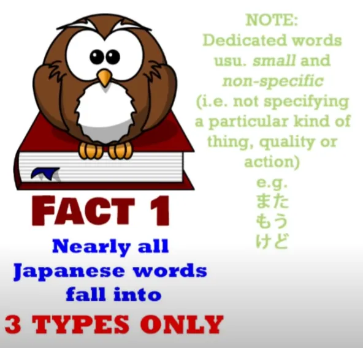

For example, there are conjunction words that join together two logical clauses to make a compound sentence. Most conjunctions aren't done with words anyway -- they're done with the て-form, the い-stem, or groups of particles like <code>でも</code> and <code>のに</code>. But there are a few dedicated conjunctions like <code>けど</code> and the other <code>が</code>, the <code>が</code> that isn't a particle but a conjunction, which we discussed in a recent video. Now, apart from these, everything you see is going to be a noun, a verb, or an adjective.

## Fact 2

Fact 2: Verbs and adjectives are very easily recognized and distinguished.

Every verb ends in an -う row kana -- and it has to be a kana, it can't be included in kanji. And every adjective has to end in the kana い. Again, it has to be the kana, can't be part of a kanji. Now, as we know, there are certain completely regular transformations that this -う row kana and that this い can make.

They can go into て-form or た-form, and the final -う row kana of a verb can change into the equivalent kana in the same row in order to attach a helper word such as the negative helper adjective <code>ない</code> or the causative helper verb <code>せる/させる</code>.

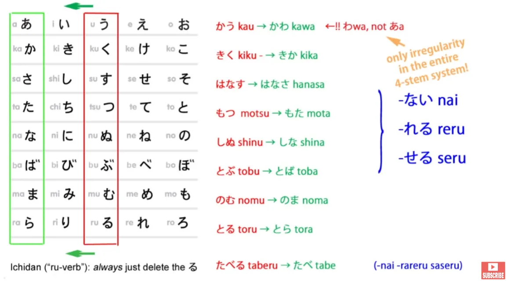

Now, once you know the basic permutations of verbs and adjectives, which you should do very early on, you know that if a word doesn't have one of those possible verb endings or one of those possible adjective endings, it is a noun. You know that if a word is written in kanji only or can be written in kanji only, it is in 99 cases out of 100 a noun. So Japanese, as I've said before, is a very noun-centered language.

## Fact 3

Fact 3: There is a legion of super-nouns. What I mean by this is that there are certain special categories of noun, each of which has one superpower and one only. That's to say that the nouns in each of these groups of special or super-nouns differ from ordinary nouns in one respect only. Now, two of those groups we already know, so as Fact 4 I'm just going to go over those quickly.

## Fact 4

### Adjectival nouns

The first group is adjectival nouns, which are horribly misnamed by the textbooks <code>な adjectives</code>. They're not adjectives. They are nouns that can under certain circumstances be used adjectivally.

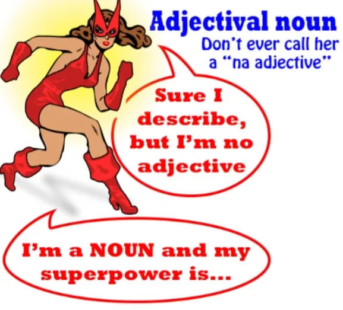

The superpower of adjectival nouns, the one thing they can do that makes them different from any other noun, is that they can use the soft or connective form of the copula <code>だ</code>. So, we can say <code>屋敷が不思議だ</code> -- <code>mansion mysterious is</code>. When we do this we're just doing what we can do with any noun. We can say <code>さくらが日本人だ</code> -- <code>Sakura Japanese person is</code>.

But we can also use that soft form of <code>だ</code>, which is <code>な</code>, and we can say <code>不思議な屋敷</code> - <code>mysterious-is mansion</code>.

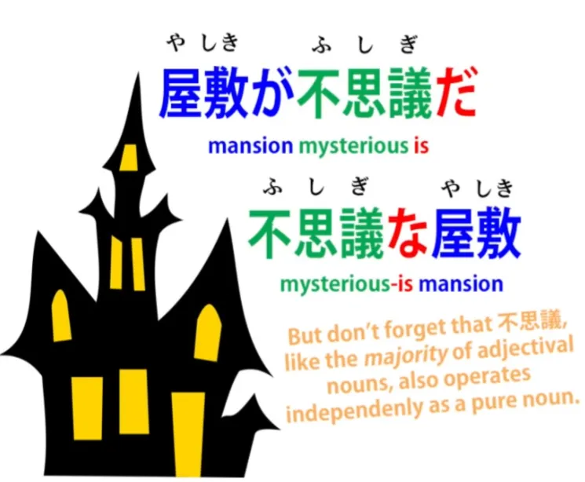

You can't do that with a regular noun. And that's the only difference between a regular noun and an adjectival noun.

### する nouns

The second group is する nouns, which the dictionaries somewhat confusingly call <code>する verbs</code>. **What they are is nouns.**

**And their superpower is that they are allowed to drop the direct object marker, <code>を</code>.** So, **if we take the noun <code>勉強</code>, which means <code>study</code>, we can say <code>勉強をする</code>**, which means <code>do study</code> but we can also say <code>勉強する</code>, which means <code>*to* study</code> (**the verb**).

::: info
It’s just a very nuanced difference, basically.* *
The を is the Direct Object (noun) + verb (勉強を + する) & the 勉強する is a する verb.
:::

**We can use the を to mark a direct object of any verb, but we can only drop that を in the case of する nouns.** That is their superpower. So when we do that, **we fuse together <code>勉強</code> with <code>する</code>** **and make what we really can call a <code>する verb</code>.**

**But the important point to remember is that when <code>する</code> is not attached to it, it's not a する verb. It's not any kind of a verb. It's a noun.**

::: info
Do note that <code>WHEN する is NOT attached to it</code> e.g. 勉強をする, where 勉強 is a noun. But with 勉強する, the する should be the Head of the phrase 勉強する, so it should be a verb.
:::

So we can say <code>勉強が好きだ</code>. That means <code>study *(noun)* is pleasing to me</code>. We don't say <code>勉強するのが好きだ</code>, because what we'd be doing if we said that would be taking a noun, turning it into a verb with <code>する</code>, and then turning it back into a noun again with <code>の</code> *(the nominaliser for the verb 勉強する)*. We don't need to do that because it's a noun in the first place.

## Fact 5

### Adverbial nouns

Now, the third group, which we haven't yet introduced, is adverbial nouns. Now, there are a lot of these and an awful lot of them end in the kana <code>り</code>, but not all of them by any means.

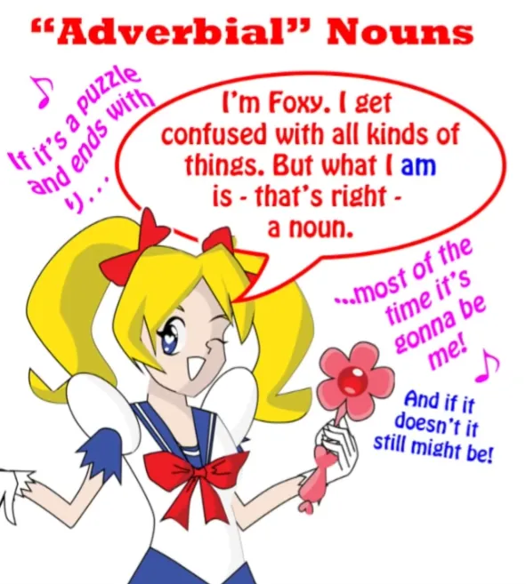

So, we're going to look at two that do and one that doesn't, and we're going to look at their superpower. Their superpower is very similar to the superpower of the する noun, which is to say that they can drop the relevant particle under certain circumstances. As we know, **any noun that's appropriate for the use can be turned into an adverb by adding に.**

So, <code>静か</code>, which is the *(Adjectival)* **noun** <code>quiet</code>, **can be used adverbially with に.** We can say <code>**静かに**する</code> -- <code>do **quietly** / act **quietly**</code>. We can say <code>**静かに**歩く</code> -- <code>walk **quietly**</code>.

---

*(But)* **With adverbial nouns, we can drop that に.**

::: info
I think Dolly here does NOT mean that we can drop に with 静か because it is NOT an adverb(ial noun) like ゆっくり, but Adj. Noun. At least I can’t find anything about 静かする etc.
Dolly also seems to allude at multiple points (Lesson 8) to that adverbs like ゆっくり could be classed as a kind of noun, although stuff like Jisho/Yomichan lists them as Adverbs and their name 副詞 (ふくし) is different of course, means Adverb, so it would be just a special sub-class.
:::

*I think that the term <code>Adverbial Noun</code> might be what that 副詞 refers to for Dolly, where usually they are called Adverbs, but they might be this very special class of nouns in Japanese, so why Dolly calls them that. As to why we can drop the に, since ゆっくり is already 副詞 on default.*
So, we'll take one that ends in the typical <code>り</code>: <code>ゆっくり</code> -- that means ****slow**** or ****leisurely**** and we can say <code>**ゆっくりに**する</code> -- <code>act **in a leisurely manner**</code>, <code>**ゆっくりに**歩く</code> -- <code>walk **slowly**</code>. But we can also say <code>ゆっくりする</code>, <code>ゆっくり歩く</code>. **We can drop that に**.

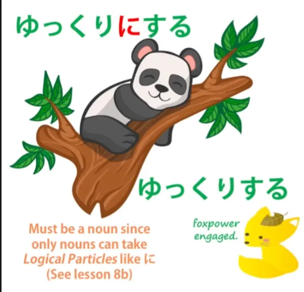

So, **that's the one and only superpower of the adverbial noun.** And it's important to understand this because when you start trying to explain them without recognizing this fundamental fact, you can get into all kinds of difficulty.

Let's take another one: <code>余り/あまり</code>.

#### あまり

Now, this noun is usually explained in a way that's completely confusing. **<code>あまり</code> is a noun**, and what it means is <code>excess</code>.

You can use it in a completely literal sense. You can say <code>ご飯のあまり</code> -- which means <code>the excess rice / the leftover cooked rice</code>.

It's very often used in more abstract ways. So, we can say <code>悲しみのあまり泣いた</code>.

Now, this means <code>from an excess of sadness, I cried.</code>

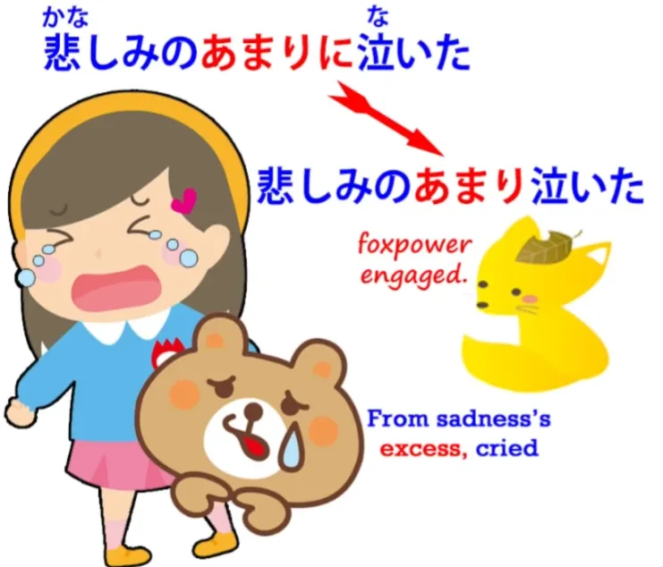

And, as you see, we can leave out the particle. **We usually do leave out the particle with <code>あまり</code>.** **So it's now being used adverbially and it still means <code>excess</code>.**

Now, the textbooks generally introduce it in a different context, which makes it very confusing when we see it in other contexts and especially when we don't understand that it's actually a noun. They show it being used adverbially in expressions like <code>あまり勉強しない</code>.

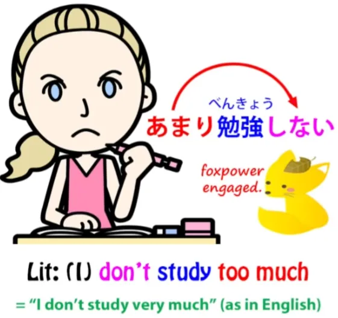

What does that literally mean? It literally means <code>I don't study too much / I don't do an excess of study.</code> But of course, as we know, what it means in practice is that <code>I don't study very much</code>.

**And this is what we call litotes.** We've talked about hyperbole in language and how it's a very common phenomenon.

Litotes is the opposite of hyperbole. Hyperbole is saying more than we really mean; litotes is saying less than we really mean.

The word <code>litotes</code> isn't as well known as <code>hyperbole</code>. That's perhaps because current Western speech is much more prone to hyperbole than to litotes.

But we still have litotes in set expressions. So, if we are going on a picnic and we look at the dark clouds in the sky and say <code>It doesn't look too good!</code> what we're literally saying is <code>It doesn't look excessively good</code> but what we actually mean is <code>It doesn't look very good!</code>

And it's just the same with <code>あまり</code>. If we say <code>あまり勉強しない</code>, we're saying <code>I don't study too much / I don't study excessively</code> but what we actually mean is <code>I don't study very much at all.</code>

#### 随分

So, let's just take one more that doesn't end in <code>り</code>, and that's <code>随分/ずいぶん</code>. What it really means is <code>sufficiently</code>.

And you may say, <code>Well, **sufficiently** isn't a noun</code>. And that's true -- in English it isn't a noun.

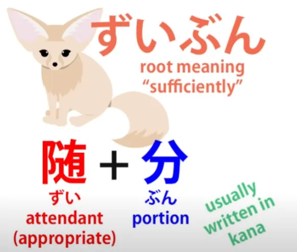

In Japanese it is, and if we look at the kanji <code>随分</code>, what it actually means is something like <code>appropriate portion</code> or <code>appropriate amount</code> -- in other words, <code>sufficient</code> or <code>sufficiently</code>. And this is another litotes which is common to both English and Japanese and many other languages.

When you say to someone <code>ずいぶん上手だね</code>, what you're literally saying is <code>you're skilful enough / you're sufficiently skilful</code>. What you actually mean is that the person is very skilful.

And this is just the same in English. You might say <code>You're pretty good</code>.

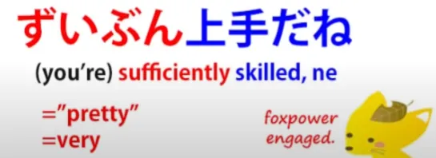

And <code>ずいぶん</code>, like <code>pretty</code> or <code>fairly</code> in English can run the full range from its original meaning of <code>sufficiently</code> or <code>fairly</code> to its more usual litotes meaning of <code>very / considerably</code>. So the thing to remember is that there are a very limited number of word-types in Japanese.

Nearly all words are either verbs, nouns or adjectives. **And the ones that aren't verbs or adjectives, whatever the dictionaries tell you they are,** **are practically all the time nouns.** *(This seems to support that 副詞 theory of mine above)*

When you understand that, you have a much clearer understanding of what's going on in a sentence.

::: info
Check this:

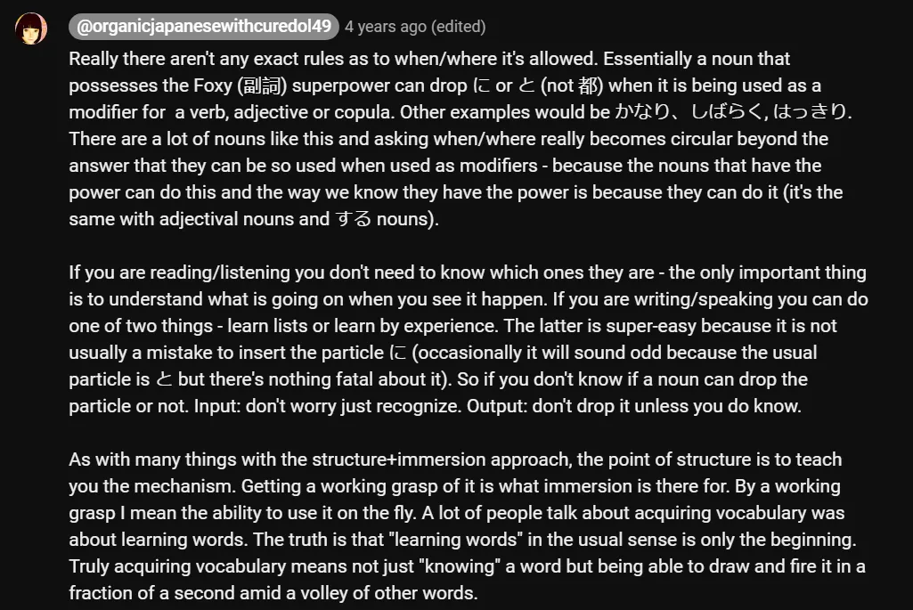
:::
