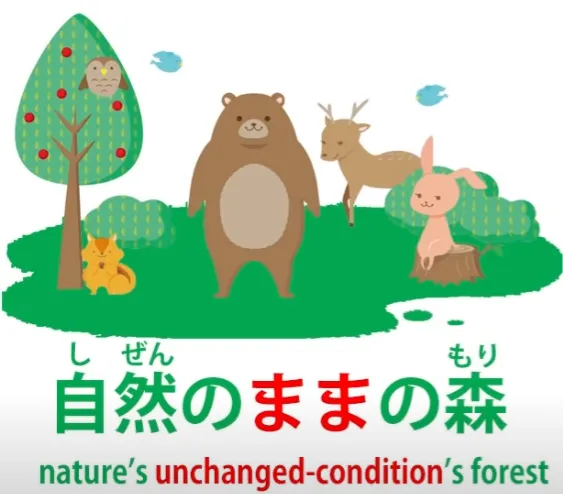
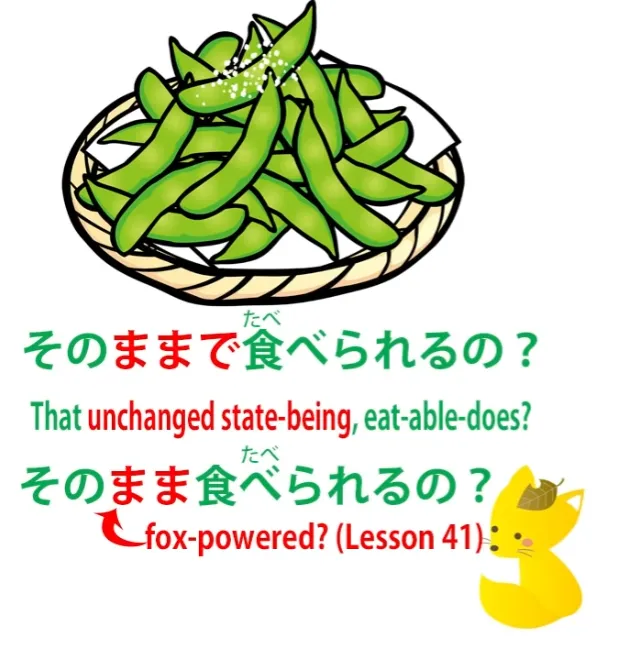
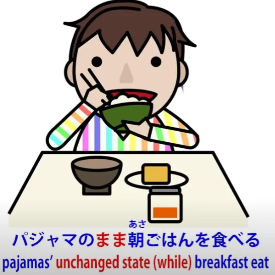
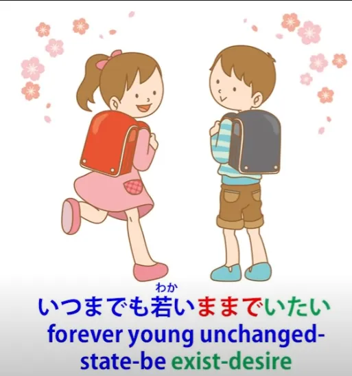
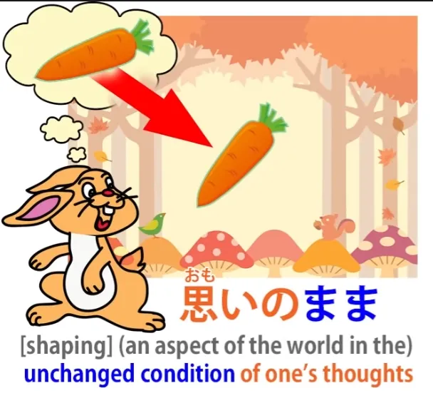
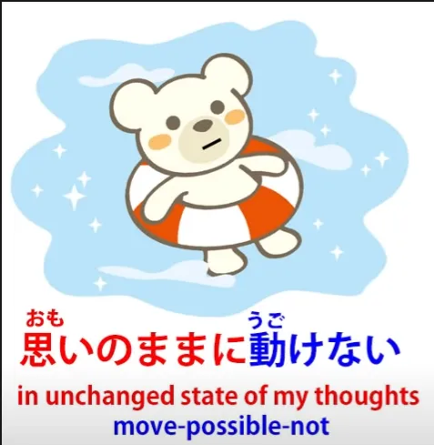
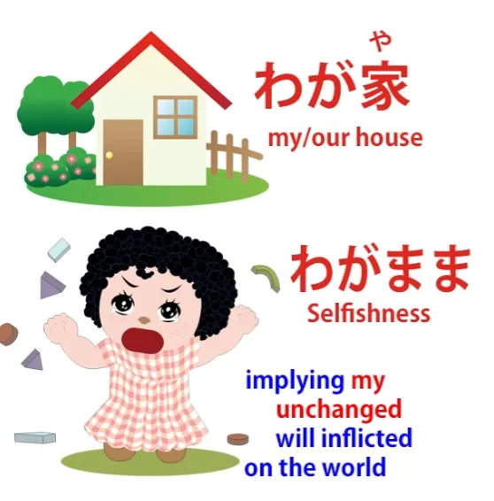

# **42. Basic word-confusion | まま**

[**Why textbook <code>grammar points</code> are so misleading. Basic word-confusion | まま mama | Lesson 42**](https://www.youtube.com/watch?v=rCdhDCmhMZc&list=PLg9uYxuZf8x_A-vcqqyOFZu06WlhnypWj&index=44&pp=iAQB)

こんにちは。

Today we're going to talk about some of the ways in which the standard conventional explanations of Japanese lead you out into the desert and then fly away in a helicopter, laughing. We talked in the earlier lessons in this series about how that happens in relation to the fundamental structure of the language. But this also happens at a later stage with the explanation of all kinds of what they call <code>grammar points</code>. And one of the main causes of this is the fact that they fail to recognize what words actually are and what they actually do.

So, we're going to take, as an example, <code>まま</code>, the word <code>ママ</code>. Now, this can mean a mother or the mistress of a bar or a cafe, but we're talking about it in the other sense, the more abstract sense, which, if we look at traditional explanations, they seem to have various opinions on what part of speech it is.

::: info
to avoid confusion, ママ in katakana means <code>mom</code> or <code>mistress of a bar</code>. Whereas まま is what Dolly is going to be talking about. It also has a Kanji form 儘 or 侭, but that is not really used.
So まま ≠ ママ, different things. まま marks unchanged state, ママ means <code>mom/bar mistress</code>...
:::

I've even seen it described as a particle, which it certainly isn't. And they tell you that it means <code>as it is / as we wish it to be / as we would like it to be</code>, that it means a state or a condition. Now, all those things are things that we might say in English in relation to certain uses of the word. But none of them express what the word actually means.

In any case, if it meant <code>as it is</code> or <code>as we wish it to be</code>, what kind of a word would it be? So the first thing to ask ourselves is <code>What kind of a word is it?</code> And, as I explained in our last lesson, nearly all Japanese words fall into one of three categories: nouns, verbs, and adjectives. Now, <code>まま</code> is not a verb: it doesn't end in -う or any う-row kana.

It's not an adjective: doesn't end in -い. So the chances are it's a noun, and that's exactly what it is. It's a noun.

So, what kind of a noun is it? What does it mean? What is a <code>まま</code>? A <code>まま</code> is a thing; it's a noun. What kind of a thing is it? Well, it's a very simple thing, a very straightforward thing, and once we know what it is we can understand it in all circumstances.

A <code>まま</code> is an unchanged condition. Wherever you see <code>まま</code>, you can read <code>unchanged condition</code>. There's one circumstance in which it has a slightly extended meaning and apart from that -- which is very simple and we'll come to that shortly -- we have the definition, the understanding of <code>まま</code>: <code>unchanged condition</code>.

So, let's look at some of the ways in which it's used. We can say <code>自然のままの森</code> -- that's <code>a forest in its natural *(unchanged)* state</code>.

<code>自然</code> is nature<code> and </code>まま<code> is </code>unchanged state<code> or </code>unchanged condition". So, <code>自然のまま</code> is the <code>unchanged condition of nature</code>. <code>自然のままの森</code> is <code>the forest in the unchanged condition of nature</code>.

Now, when you're in Japan somebody may offer you 枝豆/えだまめ, which are beans which grow from the branches of trees, which is why they're called 枝豆 (which means <code>branch bean</code>). And you might look at them, they're not cooked or anything, you might say <code>そのままで食べられるの?</code> -- <code>Can you eat them just as they are / can you eat them in their unchanged condition?</code>

Now, that <code>で</code> is in fact the copula, so we're saying <code>being their unchanged condition, can we eat them?</code> Now, there's one thing we can do with <code>まま</code> that we can't do with all nouns and that is that we can drop that <code>で</code>. So we can say <code>そのまま食べられる?</code>

Now, we can say that this is because <code>まま</code> is something like an adverbial noun that we discussed last week, where you are allowed to drop the particle in certain cases, but I don't think we necessarily even have to go that far. <code>An unchanged condition</code> is by definition a condition that could change but hasn't changed.

So, I think in cases like this if we say <code>そのまま食べられる</code>, we're saying <code>そのまま食べられる</code> without the <code>で</code>, I would say, is treating that <code>そのまま</code> like a relative time expression. We're saying <code>while they're in their unchanged condition</code>, so we're essentially talking about a time period, the time period during which they are in their unchanged condition. So this is actually how I would tend to look at it.

<code>During the period when they're in their unchanged condition, can we eat them?</code> In any case, there's no doubt what the word means. It means <code>unchanged condition</code>.

We can say <code>パジャマのまま朝ごはんを食べる</code>. That means <code>Eat breakfast while we're still in our pyjamas</code>. In other words, <code>in the unchanged condition of being still in our pyjamas, eat breakfast</code>.

And as we can see, once again the implication here is that the condition could change but hasn't changed. <code>いつまでも若いままでいたい</code> -- <code>I'd like to stay young forever.</code> <code>I'd like to stay in the unchanged condition of being young forever.</code>

And notice here that we're saying <code>若いまま</code>, so you see <code>若い</code>, the adjective, is doing what adjectives always do, qualifying a noun. And the noun it's qualifying is <code>まま</code>: <code>the unchanged condition of being young</code>.

---

Now, there's a use of <code>まま</code> that you'll probably come across quite often, and that is <code>思いのまま</code> or <code>心のまま</code>. And what this means is <code>in the unchanged condition that's in our thoughts</code> or <code>...in our hearts</code>.

So what does this actually mean? Well, it's always applied to something that is outside ourselves, so we're talking about something outside ourselves being in the unchanged condition, the exact same condition, as what is inside ourselves. So this essentially means making the outside world conform to our thoughts, our desires, our will.

And this can under certain circumstances imply selfishness, but it doesn't need to. I think the first time I heard it was in an anime where the characters were underwater.

They were able to breathe but they found that they couldn't move the way that they wanted to, just as one can't in water. And they said <code>思いのままに動けない</code> -- <code>we are unable to move in the unchanged condition of our thoughts</code> or <code>...the unchanged condition of our will or desire</code>.

Now, we should understand here that <code>思い</code> sometimes does imply desire. For example, when we say <code>片思い</code>, which is literally <code>one-sided thought</code> or <code>one-side thought</code>, what that actually means is <code>unrequited love</code>.

It means having a desire for someone but it's only one side of the desire. The other person doesn't reciprocate that desire. So it's <code>片思い</code> -- <code>one-sided thought</code> or <code>one-sided desire</code>.

So <code>思いのまま</code> is <code>in the unchanged condition of one's thought or desire</code>. And it's really from this use of <code>まま</code> that we get <code>わがまま</code>, which I'm sure you've heard, which means <code>selfish</code> or <code>selfishness</code>.

Why does it mean that? Well, <code>我が/わが</code> means <code>I</code> or <code>we</code> and it can be put next to a noun to denote possession of it. So we can say <code>わが家</code>, which means <code>my house</code> or <code>our house</code>.

<code>わがまま</code> means <code>my unchanged condition</code>, but this clearly is influenced by expressions like <code>思いのまま</code> or <code>心のまま</code>. So this <code>わがまま</code> means <code>my unchanged condition</code> implying <code>my will</code>, <code>wanting the world to go in accordance with my will,</code> wanting the world to be <code>思いのまま</code>, <code>心のまま</code>.

So as we see the whole of <code>まま</code>, we don't have to have all these different definitions of it. We can see that every time we use it it means the same thing. It means <code>unchanged condition</code>...
