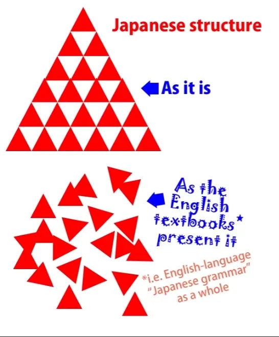

# **43. PARADIGM SHIFT: Cut through the confusion**

[**Japanese learning PARADIGM SHIFT: Cut through the confusion. Lesson 43**](https://www.youtube.com/watch?v=X_HlngOAvX8&list=PLg9uYxuZf8x_A-vcqqyOFZu06WlhnypWj&index=45&pp=iAQB)

こんにちは。

Today we're going to talk about what I rather over-dramatically refer to as <code>The Final Problem</code>. What I mean by that is that we're going to unlock a new area of Japanese and we're going to do it by the same method that we started with, that is, by looking at Japanese as Japanese and not as English written in some secret code. The reason I call it <code>the final problem</code> is because this is the one problem that some of my most astute and analytical pupils find with my Japanese-structure models.

For the most part, if somebody understands my models, they become self-evident. And that's what I base my work on. I don't ask anyone to trust me. See if they work. If they don't work, throw them away. If they do work, use them. There's no act of faith involved anywhere. Now, I take this one problem as a tribute to my work. Partly because, of course, there only is one problem, which out of a whole and very radical model of Japanese is pretty interesting. But the second reason is this: people have this problem because I've spoiled them.

I say that somewhat humorously, but the truth is that people come out of this world of English <code>Japanese grammar explanations</code> in Genki and the various Japanese grammar (so-called) websites and they're leaving a world of an entangled mass of strange things that just happen to mean what they mean for no particular reason and with a whole range of exceptions and random rules into a world of crystalline logic where everything makes sense, where everything is what it is for a good reason.

And so when they come across something that looks like an exception or a random rule, they want to get rid of it. They won't tolerate even one of these things any more and I can't blame them. However, this is not a random rule. This is something that's very understandable if we can make the same kind of paradigm shift that we made in the first place and see it as it really is in Japanese, not look at it through English eyes. So what is this? Let's take an example.

If we say <code>クレープが好きだ</code>, we've learned that this does not mean <code>I like crepes</code>. If you think it means <code>I like crepes</code>, then you've really given up all hope of ever understanding Japanese structure. Because, as we know, every Japanese sentence has two core elements. It can have any one of three engines, which can be a verb, an adjective, or a noun plus copula. And the second part of the core sentence is always the same: it's a noun marked with が. We can't always see it, but it's always there.

And those two elements, the engine and the が-marked subject (or main carriage), are the core of any sentence. They're the only things we need in a sentence. We've got to have those two, and everything else in a logical clause is telling us more about either the engine or the が-marked carriage. It can't do anything else.

The core of the sentence is the sentence and everything else is an appendage to one of those two core elements. So, with <code>*(私は)* クレープが食べたい</code>, the が-marked carriage is not <code>I</code>, so it can't be <code>I want to eat crepes</code>.

Because <code>I</code> am not doing something here, the crepes are the が-marked main carriage. And the head of the sentence, the engine, is not a verb, it's an adjective. It's the helper adjective <code>-たい</code>. It's attached to a verb, but the actual engine of the sentence isn't a verb, it's the adjective <code>-たい</code>. It can't mean <code>want</code>, because <code>want</code> is a verb.

So what this is actually saying is that the quality of crepes is such that it induces want in me. This is a wordy way of putting it, but it avoids any kind of English-based misreading of the sentence. That's what it actually means. It's describing the crepes adjectivally, and what it's saying about them is that they have the quality of making me want to eat them. And what we learned right from the beginning is that English is a very ego-centric language.

If there is an action, a subjectivity, it always wants to put an ego-actor at the center. Japanese doesn't have that strong imperative.

Now, if we look at it in terms of subjectivities -- because a lot of this is to do with subjective feelings, as a lot of language is -- we can look at subjectivities in two ways. We can either look at them with the thing that induces the subjectivity as the focus, the fulcrum, of the subjectivity, so <code>crepes which induce desire in me</code> are the fulcrum of this sentence. *(Japanese)* <code>Crepes are inducing eat desire in me.</code> Or we can look at the subjectivity as an activity -- wanting -- and then we put <code>me</code> at the center. We put the ego at the center and we say <code>I desire to eat crepes</code>. *(English)*

Now, both of these are fairly natural. A subjectivity is in fact something that we passively experience and that is induced in us by something on the outside of us. That is a perfectly valid way of looking at things, and perhaps more valid than the English ego-centric way. Certainly no less valid. Japanese happens to prefer this way of looking at it; English prefers the other. And this spills over into all kinds of areas.

So, for example, Japanese is very happy to say <code>水が犬に飲まれた</code> which means <code>The water drink-received from the dog</code>. The key actor of this sentence is the water, not the dog. The water is receiving the act of drinking from the dog. English is so biased against this that it's almost impossible to translate this into English without turning it passive. It's not passive in Japanese.

And this bias goes so deep that the entire <code>-れる/-</code>られる<code></code> helper verb, which is the verb of receiving an action, is called <code>the passive</code> by this pseudo-Japanese grammar that gets taught in English. It's not passive -- it's just that the only way to translate it into English is to turn it passive. Now, let's get back to our crepes.

If we say <code>クレープが食べたい</code>, the center of the action is the crepes. They are inducing desire in me. If we say <code>お腹が空いた、 *(zeroが)* 早く食べたい</code>, we're saying <code>I'm hungry; I want to eat soon.</code> Now, <code>早く食べたい</code> doesn't have a visible actor, but the actor of this - the zero - is <code>me</code>, so it's <code>(zeroが) 早く食べたい</code> -- <code>I want to eat soon.</code>

Now, this is the final problem. This is the thing that some of my most astute students have reacted against. They don't like the fact that the <code>-たい</code> helper adjective switches polarity, that it can both describe something inducing the desire to eat and the person feeling the desire to eat if the inducer is not explicitly present. *(If confusing, check Lesson 9c about たい)* They actually have suggested -- and several people have suggested this to me independently -- have suggested the work-around of saying <code>Well, can't we say that the が-marked actor is in fact food? Just food in general perhaps: 'Food is making me want to eat it.'</code>

And I see why they're trying to do this. They're trying to get rid of what looks like the one anomaly in an otherwise perfectly logical system. But actually this isn't an anomaly, and we'll come to that in a moment. The work-around doesn't work, firstly because if you know much about Japanese you understand that this is not what's happening.

Someone is not saying they're wanting to eat anything or food in general, they're *just saying that they want to eat.* That's something I think you'll intuitively come to understand, but I also understand that intuition is not an argument. Even Genki could probably use the intuition card to support some of their rather outlandish interpretations of Japanese.

But we don't have to rely on that. We can produce proof. Let's take the sentence <code> *(zeroが)* 東京に行きたい.</code> This means <code>I want to go to Tokyo.</code>

Now, there is no possible other <code>zeroが</code> in this sentence than <code>I</code>. It can't be Tokyo, because that's already the に-marked destination. It can't be <code>go</code> because that's a verb and we can never mark anything but a noun with が or any other logical particle.

So we know for certain that it is in fact possible for <code>-たい</code> to flip its polarity, to point not to the object inducing desire to do but also to the person or animal experiencing the desire to do. And this goes on to extend to other areas of Japanese.

---

For example, the potential. When we say <code>本が読める</code>, we're saying <code>The book does readable.</code>

We can't translate this directly into English because it's a verb and <code>readable</code> isn't a verb in English, but in Japanese we're saying <code>The book does readable.</code> Now this is the subjectivity in a certain sense because it's not talking about the fact that it's in general possible to read the book. That would be <code>可能性/かのうせい</code>.

It's talking about the fact that the book is readable to a person or people in particular. But again, the が-marked subject is the book. So saying <code>I can read the book</code> or <code>We can read the book</code> is simply false.

That's not what the sentence is doing and if we think it is, we're going to end up with this completely destructive idea that が can sometimes mark the object of a sentence. It never can. It can only ever mark the subject, the A-car of a sentence.

And this is so crucial to Japanese because it's what every single sentence you ever see, ever in your whole life, consists of: a が-marked A-\[car] and a B-engine. Disrupt that and you've disrupted everything. So, the actor of <code>本が読める</code> is the book: <code>The book does readable.</code>

But if we say <code>私が読める</code> or <code>さくらが読める</code>, what we're saying is <code>I can read</code>/ <code>Sakura can read.</code> Not can read a particular book, not can read a newspaper, not can read a manga, but can read, is literate. So, once again, the potential can flip its polarity.

If there's a specific readable thing, then it's that that <code>does readable</code>, but if there isn't, if it's just referring to literacy in general, then it flips polarity and points to the person or people who are able to read. Now why is this?

We've talked about the fact that the non-egocentricity of Japanese is fundamentally rooted in a more animist way of seeing the world. I'm not saying anything here about what Japanese people as individuals believe nowadays. I'm talking about how the language looks at the world.

English requires an ego at the center; Japanese doesn't. It's much more happy to have non-ego actors as the center of even a subjective-based sentence. But it doesn't stop there.

And once you realize that, we've done away with the final problem. It's not just that it doesn't find having a non-ego actor at the center and that in many cases it has a preference for that, it's also that it sees the two, the inducer of the subjectivity and the receiver, the experiencer, of the subjectivity, as not fundamentally separate.

The action of subjectively desiring or fearing or wanting etc. is something that goes on between the two, between the inducer and the experiencer. And we can look at it from either perspective and it doesn't really matter.

The bias, as it were, the default condition, is to attribute it to the inducer, but there's no difficulty at all in moving it to the experiencer. Because the two aren't regarded as completely separate. They are two halves of the same action.

And if we understand this, we're looking at it much more through Japanese eyes. We're not having to re-route it through strange English intermediaries.

And this affects all kinds of things, not just the grammatical areas we've talked about, but all kinds of things. For example, let's take the word <code>不思議</code>. <code>不思議</code> means <code>mystery</code>. It's a noun, it means <code>mystery</code>.

And it can be used as an adjectival noun, in which case it means something like <code>mysterious</code>. So if we say <code>不思議な屋敷</code>, we're saying <code>mysterious mansion</code>.

But we can also attach <code>そう</code> to <code>不思議</code>, which, as we've discussed before, means <code>seems</code> or <code>like</code>. So <code>不思議そう</code> would seem to mean <code>seems mysterious</code> or <code>mysterious-like</code>.

Now, this in itself is meaningless, because <code>mysterious</code> is a subjectivity. If we say something is mysterious, this isn't an objective quality like being red or being three feet high. It's a subjectivity. It's mysterious because we find it mysterious.

If we don't find it mysterious, then it's not mysterious. So saying it's mysterious-like or seems mysterious is meaningless because saying it's mysterious in the first place is really only saying that.

But that isn't what <code>不思議そう</code> means. <code>不思議そう</code> is used in sentences like <code>「これはなーに？」とさくらは不思議そうに言った</code> -- <code>**What**s this?' asked Sakura in a mystified manner.</code>

<code>不思議そう</code>, you see, again flips polarity. It doesn't apply to the thing which is inducing the sense of mystery, it applies to the person feeling the sense of mystery. So <code>不思議そう</code> means something like <code>mystified</code>, sometimes perhaps <code>puzzled</code>, but in any case it means <code>perceiving quality of **不思議** in something else</code>.

So you see this whole flipping of polarity, which is based in a more unified view of the world, not just more <code>animist</code>, to use that term, but unified. More in a sense that the inside and the outside are not wholly separate but are two sides of the same perception.

And if we can grasp that, the final problem is solved and a whole area of Japanese is unlocked and released from the necessity of routing it through English.

::: info
As usual, if this lesson feels confusing or complex, I recommend looking into the comments of* [**the video**](https://www.youtube.com/watch?v=X_HlngOAvX8&list=PLg9uYxuZf8x_A-vcqqyOFZu06WlhnypWj&index=47&ab_channel=OrganicJapanesewithCureDolly) *where Dolly discusses some stuff in more depth.
:::
