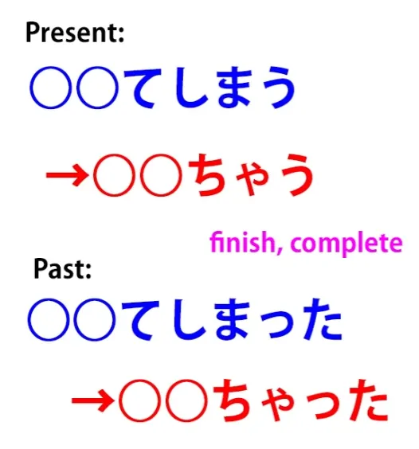
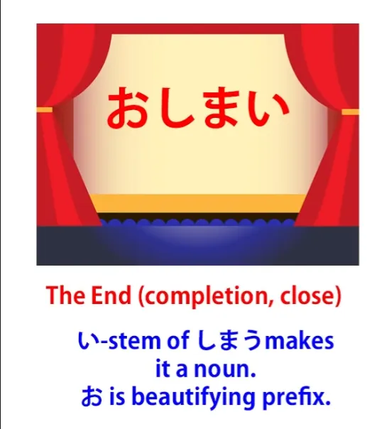
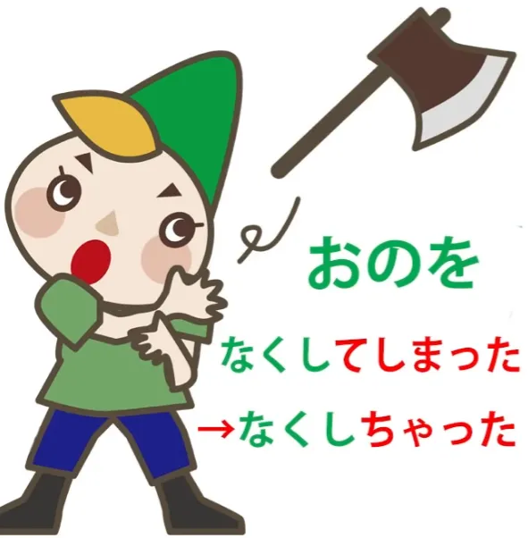
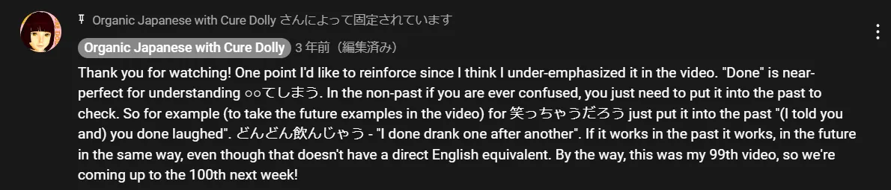

# **44. How to use natural Japanese: ちゃう, ちゃった**

[**How to use natural Japanese: chau, chatta, how they really work ちゃう、ちゃった | Lesson 44**](https://www.youtube.com/watch?v=VyZWoJCSQ5Q&list=PLg9uYxuZf8x_A-vcqqyOFZu06WlhnypWj&index=46&pp=iAQB)

こんにちは。

Today we're going to talk about something that you encounter all the time in anime, manga, everyday conversation, light novels, and anywhere that you encounter real, so-called casual -- that's to say, non-formal -- Japanese. Now, we're going to have to use a little trick to understand from an English point of view how this works. And of course the standard explanations wouldn't give you a trick like this because they don't even explain the basics of the underlying principles of Japanese structure. So we get the effect of the three blind men and the elephant.

I'm sure you've heard the story. The first one feels one of the elephant's legs and says an elephant's like a tree, the second one feels its trunk and says it's like a snake, the third one feels its tail and says that it's like a rope. And of course none of these are exactly incorrect. The elephant does manifest all these qualities, but if you present them as isolated facts without explaining that there's an elephant underlying the whole thing, which makes sense of it, you're making everything a great deal more difficult than it needs to be.

And the standard English so-called Japanese grammar does this from the very beginning with the structure of the language, which is disastrous, and then it does it again, and again, and again with what it calls <code>grammar points</code>. And the very fact that it calls them <code>grammar points</code> is part of the problem, because for the most part these aren't in fact points, they are logical structures, and if we understand the structure we don't have to memorize them as separate meaningless <code>points</code>.

So, what we're going to discuss today are the expressions <code>-ちゃった</code> or <code>-じゃった</code>, which are attached to the end of verbs. Now if we look at the conventional explanations, we will read that it indicates an action that's been finished or completed, or an action that we regret or did by accident, or something that just happened unexpectedly. They don't usually add to this that it can also indicate something that happened that was very good, or that it can in fact be used in the future tense as <code>-ちゃう</code> or <code>-じゃう</code>, which would seem to contradict everything that we've just learned, wouldn't it?

So, instead of looking at the tail and the legs and the trunk, let's start by taking a look at the actual elephant. First of all, <code>-ちゃう</code> or <code>-ちゃった</code> is in fact a contraction of the past tense of the word <code>しまう</code>, which means to finish or complete.

So, if you ever listen to Japanese fairy tales, you'll find that they often end with the formula <code>おしまい</code>. And <code>しまい</code> is the い-stem, which makes it a noun of <code>しまう</code>, so it means <code>the finish / the ending / the end</code>.

Now, if you put that into the past tense, it's <code>しまった</code>, and <code>しまった</code> can be used all on its own as an expression, and it usually means <code>Something's gone very wrong / This is not at all satisfactory</code> : <code>しまった!</code> Perhaps the best way to put that in English would be to say something like <code>That's done it</code> or <code>That's the end!</code> or something like that.

Now, we can then use this <code>しまった</code> as a helper verb that we put onto the て-form of another verb. And the way we do that is, we put the other word into て-form and then we add <code>しまった</code>. And <code>-てしまった</code> gets contracted down to <code>-ちゃった</code>.

Now, if the て-form is <code>で</code> (as we know that it is in some words and if you don't understand that, I've explained it in a previous video *- Lesson 5 & 40*), if the て-form is <code>で</code> then instead of becoming <code>-ちゃった</code>, it becomes <code>-じゃった</code>, just in the way that <code>では</code> becomes <code>じゃ</code>. Now, this has a much wider range of meanings than just <code>しまった</code> on its own.

It can be used for things that we did by accident or that we wish we hadn't done. For example, we often say <code>忘れちゃった</code>, which is <code>忘れる</code> -- <code>forget</code> -- plus <code>-ちゃった</code>. There's a famous song <code>ネコ踏んじゃった</code>, which is great fun, and I'll put a [**link**](https://www.youtube.com/watch?v=GpqGiKJt3cQ&ab_channel=ichigoclub15) in the information section below.

And what that means is <code>I trod on the cat</code>: <code>踏む</code> -- to <code>tread (on something)</code>. So we can see that it has a negative sense here, but it can also be something very good.

We might say <code>スーパーヒーローになっちゃった</code> -- <code>I became a superhero.</code> So what do these things have in common? Accidental things, things we regret, things we're very pleased about.

The way I would put this, the way I would translate this into English, because this is the English expression that I think covers practically all cases of <code>-ちゃった</code>, is the word <code>done</code>. <code>忘れちゃった</code> -- <code>I done forgot</code>; <code>猫踏んじゃった</code> -- <code>I done trod on the cat</code>; <code>スーパーヒーローになっちゃった</code> -- <code>I done became a superhero.</code>

In all these cases , the idea is very similar. We're saying that it happened, it's done, it's completed, it's a fact, and the implication generally speaking is that we didn't expect it to be a fact or it wasn't what most people would normally have expected to be a fact, but it is. It <code>done happened</code>. And if we understand that, it's very easy to understand all the different kinds of circumstances under which <code>-ちゃった</code> gets used.

The only real difference between this and <code>done</code> in English is that we don't only use it about past things. We also use it about future things. So we can say, <code>夏休みが終わってしまう</code> and that means <code>the summer vacation will done end</code>. Now, of course you can't say that in English but that essentially is what you're saying.

It will just be and go and end. That's what'll happen and it'll be done and there's nothing we'll be able to do about it. If you're about to tell somebody something embarrassing, you might say <code>君のは笑っちゃうだろう</code> -- <code>You'll probably laugh</code> or <code>You'll probably done laugh / You'll probably just up and laugh.</code>

Again, it's the same idea but in Japanese we can project that idea into the future as well. We can say <code>今日はどんどん飲んじゃう</code>, and that's <code>Today, I'm going to drink like crazy</code>.

<code>どんどん</code> is <code>one after another in rapid succession</code>; <code>飲んじゃう</code> is <code>done drink</code>. Again, we can't put that in the future in English, but we can put it in the future in Japanese.

So if we understand how these work, we don't have to have a lot of complicated explanations of all their different cases. They work in the same way all the time if we only think about what is the way they work rather than what their end result is if you translate it into English.

