# **45. First-Step Guide into Self Immersion Technique**

[**Japanese Immersion. First-Step Guide into Self Immersion Technique | Lesson 45**](https://www.youtube.com/watch?v=g5uyGx5OnuE&list=PLg9uYxuZf8x_A-vcqqyOFZu06WlhnypWj&index=47&pp=iAQB)

こんにちは。

Today, we're going to take the plunge from abstract theoretical Japanese -- grammar and structure and vocabulary – into actual direct immersion in real Japanese material for Japanese people. As you know, I recommend doing this at the earliest stage possible, but it's pretty difficult, because once you're in real Japanese material you're going to encounter vocabulary that you didn't know before even in very simple material, because small Japanese children have a huge vocabulary compared even to foreigners who've taken quite high-level Japanese exams. This is why I don't recommend core vocabulary decks and things like that. The way to pick up core vocabulary beyond a small base is to pick it up as you proceed through real Japanese material. That way you get the kind of vocabulary you're actually going to be encountering and using.

So what I'm going to do is take a simple Japanese story that's not in any way doctored for foreigners. It's just the way it is. And it also has audio and I'll link you to that in the Comments below. So once we've gone through the story and you've got it clear in your mind, you can put the audio onto your phone or your mp3 player and hear it over and over again. That's going to consolidate any new vocabulary; it's going to consolidate the rhythm and spoken form of Japanese and the structure, because we need to move structure and vocabulary from the abstract area, where you know them but you have to think about them very carefully to do anything, into the area where it starts to become instinctive.

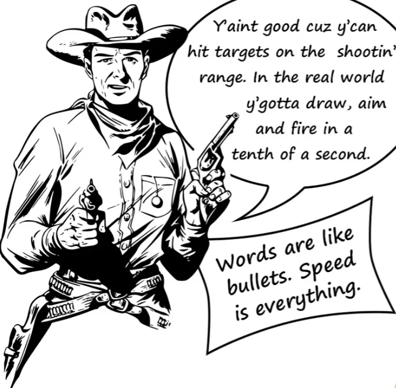

So please, use [**that audio**](https://www.youtube.com/watch?v=jjmWN2rI8e4&ab_channel=hukumusume) once we've been through the story. It's very short, and I'm going to make a page, which I'll [**link**](http://learnjapaneseonline.info/taking-the-plunge-japanese-self-immersion-links-to-all-structure-points/) below, where I give the links to the various videos where I talk about the grammar points that we encounter. You're going to see that even in a short and simple story like this, we use a lot of the structure that we encounter in my various lessons. All right, so let's get started.

This is a short and simple fable about a greedy dog. And the first sentence is: <code>肉をくわえた犬がはしをわたっていました.</code>

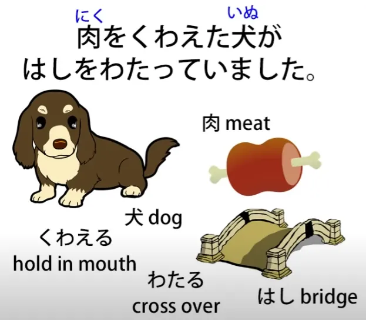

So you see this is in です/ます-style Japanese, so if you're a little bit uncertain about that please refer to my です/ます video. <code>肉をくわえた犬が.</code> Now, <code>肉</code> means <code>meat</code> and <code>くわえる</code> means <code>hold in one's mouth</code>. It's one of those words that you could do a huge core deck and still not know. And what's happening here is that very common technique of inverting a simple logical clause　to turn it into a descriptive clause.

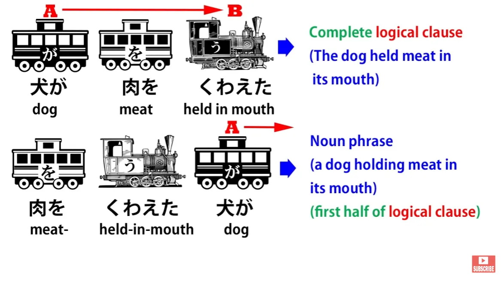

So, <code>犬が肉をくわえた</code> is <code>a dog held meat in its mouth</code>, but <code>肉をくわえた犬</code> is <code>a dog that was holding meat in its mouth</code>. So, that dog is the subject of our sentence, marked with が. <code>肉をくわえた犬がはしをわたっていました.</code> <code>橋/はし</code> is <code>bridge</code> and <code>わたる</code> is <code>cross</code>. So, the dog was in the process (<code>-ている</code>) of crossing the bridge. <code>肉をくわえた犬がはしをわたっていました.</code> So that set the scene. We know what's happening.

<code>ふと下を見ると、川の中にも肉をくわえた犬がいます.</code>

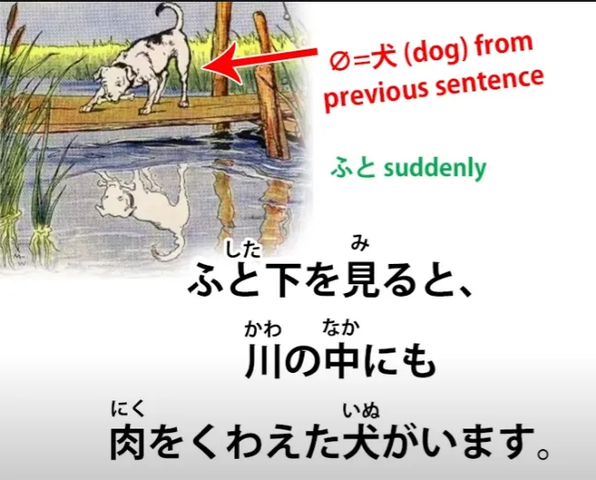

Now, the first thing to notice here is that this second sentence is in the non-past tense, isn't it? So this is a difference between Japanese narrative convention and English. In English narrative, if the narrative is in the past tense it stays in the past tense and every sentence is in the past tense. In Japanese narrative this isn't the case.

We can set a narrative in the past tense but sometimes when we want to give more immediacy to something, we just move into the present tense. This is not allowable in English narrative, but it's perfectly allowable in Japanese narrative, so we need to be aware of that and not let it confuse us. So, what's going on here?

<code>ふと</code> means <code>suddenly</code> -- I'm not going to explain the simplest vocabulary here because I'll assume that you've got very basic vocabulary in order to start making the plunge into Japanese narrative. So, <code>ふと</code> means <code>suddenly</code>. <code>ふと下を見ると</code> -- <code>(the dog) suddenly looked down</code>.

The zero-pronoun here is <code>it</code>, the dog. So, the dog suddenly looked down, and that <code>と</code> is the conditional connective, <code>if</code> or <code>when</code>, and I'll link to that *(Lesson 30)*. So it's saying <code>When the dog suddenly looked down...</code> or <code>The dog suddenly looked down, and...</code> <code>When the dog suddenly looked down... 川の中にも</code>.

<code>川の中に</code> is <code>in the river</code> and the <code>も</code> here is telling us <code>also</code>: <code>also in the river</code>. <code>川の中にも肉をくわえた犬がいます.</code> So, <code>also in the river there's a dog carrying meat in its mouth</code>. Not just on the bridge but also in the river, there's a dog carrying meat in its mouth.

<code>犬はそれを見て思いました.</code> Now, the dog is now being referred to with は rather than が, and that's because we've now had the dog introduced, so it's no longer <code>a dog</code>, it's <code>the dog</code>. And I'll [**link**](https://www.youtube.com/watch?v=9l_ZlQQU4ZE&ab_channel=OrganicJapanesewithCureDolly) to the video where I explained this.

<code>犬はそれを見て</code>; <code>それ</code> is <code>that</code> and so this is the first part of a compound sentence: <code>The dog saw that and..</code> -- the て-form is giving us the <code>and</code> there.

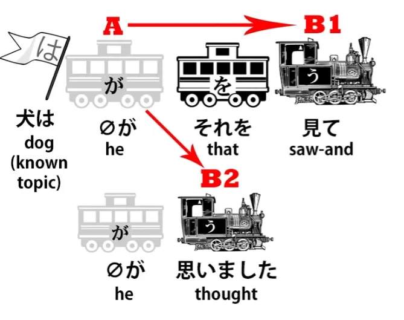

And I'll link to compound sentences *(Lesson 4)*. I'm going to stop telling you now what I'm linking to, but if you look at the special page that I've made -- which I'll [**link**](http://learnjapaneseonline.info/taking-the-plunge-japanese-self-immersion-links-to-all-structure-points/) below -- I'll give all the links to the different parts of this story. You probably don't need to follow them all up, but if there are any bits that confuse you, you can go to the videos where I've explained those specific points. Right.

So, <code>犬はそれを見て</code> -- that's a logical clause in itself: <code>The dog saw that and... 思いました.</code> <code>The dog saw that and thought (or felt).</code> <code>あいつの肉のほうが大きそうだ.</code>

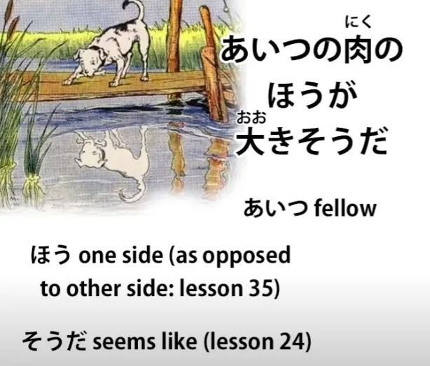

<code>あいつ</code> is <code>that fellow/ that type/ that character</code>. <code>あいつの肉のほうが</code>, that's to say <code>the side of that character's meat...</code> (that character's meat as opposed to my meat) <code>...大きそうだ.</code> So that's the connecting of <code>そう</code> to the adjective <code>大き</code> -- <code>looks</code> -- meaning it looks or appears bigger. <code>The side of that character's meat appears bigger than mine.</code>

How do we know it's a comparative? Because of the <code>ほう</code>, which is telling us that we're talking about the side of that character's meat as opposed to some other side, which in this case is going to be <code>my meat</code>.

---

<code>犬は悔しくてたまりません.</code> <code>悔しい</code> is an adjective and it means that something is <code>irritating</code> or <code>annoying</code>. But like all adjectives of subjective emotion, when it's applied directly to the individual, it can refer not to the annoyingness of the object but to the annoyance of the individual. So that's what it's doing here.

<code>犬は悔しい</code> means <code>the dog was annoyed</code>. It could mean <code>the dog was annoying</code>, but in this case it means <code>the dog was annoyed</code>. And then, <code>たまりません</code>. <code>たまる</code> is to <code>bear</code> or <code>endure</code>, so <code>たまりません</code> means <code>not bear</code>. Now, when you add <code>-てたまりません</code> to something, we're saying that it was <code>to an unbearable degree</code>. The dog was annoyed to an unbearable degree at seeing this other dog with what he believed to be a larger piece of meat than his own.

---

And then we have a quotation from the dog: <code>そうだ、あいつを脅かしてあの肉を取ってやろう.</code>

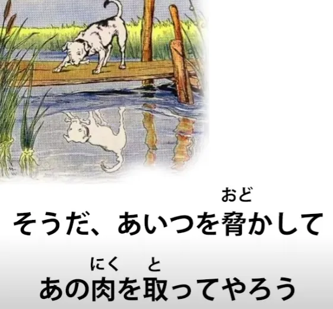

<code>そうだ</code> -- <code>Okay then/that's the case</code>; <code>あいつを脅かして</code> -- <code>脅かす</code> is to ****intimidate**** or to <code>scare (someone)</code>, so: <code>I'm going to scare that fellow and... あの肉を取ってやろう.</code>

<code>あの肉</code>, of course, is <code>that meat</code>; <code>取る</code> is <code>take</code>. <code>取ってやろう</code> is related to <code>-てあげる</code>, to <code>do an action up to someone / to give someone the benefit of your action</code>.

<code>-てやろう</code> is like <code>-てあげる</code> in that it means do it for someone else, but instead of being honorific, it's the reverse of that. It's doing down to someone else, doing to someone that you consider inferior. So, for example, it would be appropriate to use <code>-てやろう</code> for feeding the dog, because the dog really is legitimately considered as inferior.

In a case like this, it's just a rather rude way of speaking. And, of course, what he's going to do is not a favor to the dog: he's going to steal something from this poor dog in the river. And so it's rather like when someone might say in English, <code>I'm going to punch your head for you,</code> which is phrasing it as if you were doing someone a favor when actually you're doing someone something that isn't a favor. <code>I'll take that meat for him.</code>

<code>そこで、犬は川の中の犬に向かって思いっきり吠えました.</code>

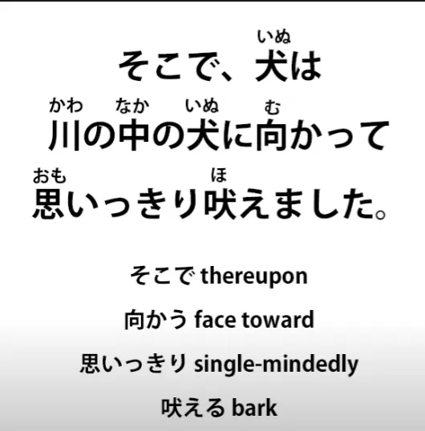

<code>犬は川の中の犬に向かって.</code> <code>向かう</code> is to <code>face toward</code>, so the dog faced toward / directed its action toward the dog in the river. <code>思いっきり吠えました.</code> <code>吠える</code> is to <code>bark</code> and <code>思いっきり</code> is... <code>思い</code> is <code>thought</code> or <code>feeling</code>, and when we add this <code>-っきり</code>, which is actually the <code>切り</code> of <code>cut</code>, it means to do something completely, to do it to the cutting point, we might say.

So, <code>思いっきり</code> means <code>putting one's whole thought into it, one's whole heart into it</code>. So, the dog faced towards the dog in the water *(river)* and put its whole effort into barking at it in order to scare it.

ワンワンワンワン. As we all know, <code>ワンワン</code> is <code>woof woof</code> in Japanese.

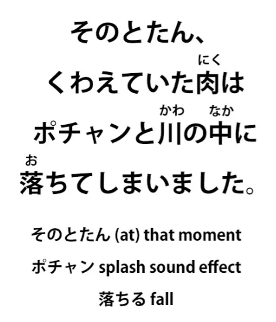

<code>そのとたん...</code> <code>そのとたん</code> means <code>at that moment</code>. <code>とたん</code> is <code>just as something happens or just after it happens</code>. So, <code>そのとたん</code> -- <code>at that juncture / at that point / at that moment</code>.

<code>くわえていた肉はポチャンと川の中に落ちてしまいました</code> So, at that point, the meat that was being held in the mouth --<code>くわえていた肉は</code> -- <code>ポチャン</code>, which is a splash-type sound effect, <code>ポチャンと</code> -- and -と, of course, marks sound effects -- <code>川の中に</code> -- <code>into the river</code> -- <code>落ちて</code> -- <code>落ちる</code>, to <code>fall</code> -- <code>しまいました</code>. And that <code>しまいました</code> is saying <code>it done fell into the river</code>, and I'll link to the video on that <code>しまいました / ちゃった</code>, which means <code>it done happened</code>. *(Lesson 44)*

Ahh! <code>川の中には、がっかりした犬の顔が映っています</code>

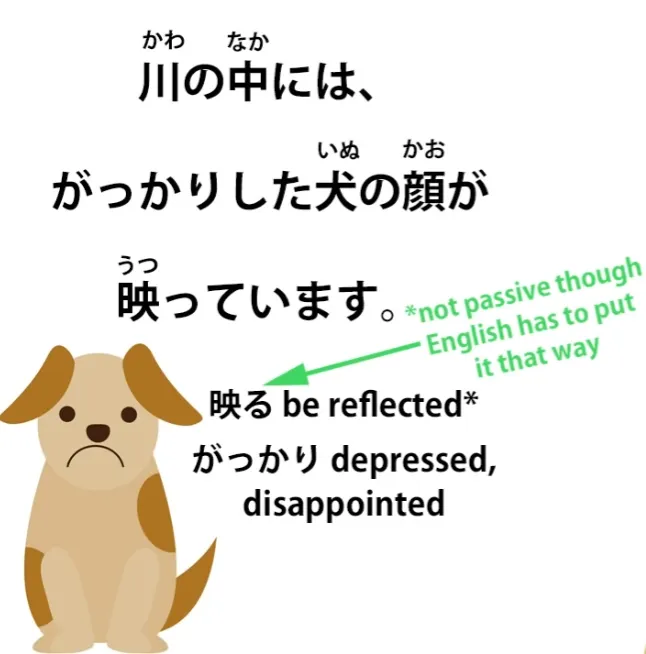

And again we've switched into the present tense to give more immediacy to this. <code>Inside the river... がっかりした</code> -- <code>がっかり</code> is <code>upset / depressed / disappointed / dejected</code>, <code>映る</code> is <code>reflect</code>, <code>顔</code> is <code>face</code>. So, inside the river, the face of a disappointed, miserable dog was reflected.

<code>さっきの川の中の犬は水に映った自分の顔だったのです</code> <code>のです</code> -- <code>The fact is that it was...</code> The fact is that it was what?

The fact is that... さっきの川の中の犬は" -- <code>さっき</code> in this case means <code>just before</code> or <code>previous</code>. So <code>さっきの川の中の犬</code> is <code>the dog in the river from just before</code>; <code>水に映った自分の顔だった</code> -- <code>自分</code> is <code>oneself</code>, so it's <code>one's own face reflected in the water</code>: <code>水に映った自分の顔だったのです.</code>

The fact is that it was... the fact is that the previous dog in the river was one's own face reflected in the water. And now there are two morals that follow this story. And they're put into one long compound sentence, which looks a bit difficult, so let's just break it into two parts.

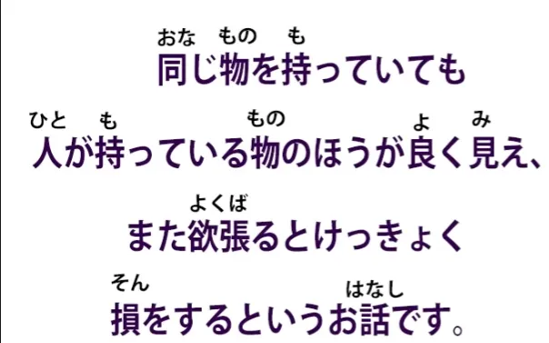

<code>同じ物を持っていても人が持っている物のほうが良く見え、</code> Now, first of all, that <code>見え</code> is the <code>連用形/れんようけい</code>, the い-stem of <code>見える</code>, to <code>be visible or look like</code>. It doesn't look like an い-stem because it's an ichidan verb and, as we know, all the stems of the ichidan verb look the same. But the い-stem of a verb can be used, especially in literary contexts, like the て-form, to connect two logical clauses within a compound sentence. So, that <code>見え</code> is completing a logical clause and then leading onto the second logical clause which is the other moral of the story.

So, let's look at the first moral first. <code>同じ物を持っていても</code> -- now, the <code>-ても</code> ending, as we know, means <code>even though</code>, so we're saying <code>同じ物</code> -- <code>the same thing</code> -- <code>を持っていても</code> -- <code>is in a state of carrying</code> (or holding or possessing). So, even though they possess the same thing (<code>同じ物</code>) <code>人が持っている物</code> -- <code>the thing that people have</code> -- and <code>人</code> here means <code>other people</code>.

You'll often see this in Japanese: <code>人</code> in general can mean <code>other people</code>; it means <code>people in general</code>, but it means <code>people other than oneself</code>. <code>人が持っている物</code> -- <code>what other people have... のほうが良く見える</code> -- <code>のほう</code>, once again, is that comparative, <code>the side (of what other people have)</code>; <code>良く</code> is of course <code>いい</code>, so <code>良く見える</code> is <code>appear good</code>. So, the side of the things other people have appears good; in other words, in comparison to one's own things, their things appear good. So the first moral is: Even though it's the same thing, something that other people have can appear better.

And that's the first moral. In English, we'd probably put that the other way around and say, <code>Other people's things appear better than ours, but in fact they're the same.</code>

---

<code>また</code> -- <code>また</code> means <code>again</code> or in cases like this it means <code>also</code>. So, also the second moral is: <code>欲張るとけっきょく損をするというお話です.</code> <code>欲張る</code> is to <code>be selfish / to be full of glittery, to be full of desires and wants</code> --<code>欲張る</code>.

<code>欲張ると</code> is again this connective if-or-when <code>と</code>; in this case, <code>if one **欲張る**s</code>, if one is full of selfish desire -- <code>けっきょく</code>, which means <code>in the end</code>, <code>けっきょく損をする</code> -- <code>損</code> means <code>loss</code>, <code>損をする</code> means literally <code>do a loss</code>, but in fact means <code>have a loss</code> or <code>suffer a loss</code>. So it's saying, if you're full of selfish desires, in the end, you'll have a loss.

<code>というお話です</code> -- <code>という</code>, so this is quoting that saying <code>If you're full of selfish desires you'll have a loss</code> -- <code>というお話です</code> -- <code>お話</code> is a story, a <code>物語</code> -- <code>お話</code>. So, <code>this is a story that says 'if you're full of selfish desires you'll have a loss'.</code>

So there we are. It's a very short story, as you see, there's a lot in there. Even in a short and very simple story like this we come across all kinds of the things that we've learned in the course of the Structure series. And if we use what we've learned, we can understand everything in the story.

So now, you'll go over that carefully, at your leisure, using this video. Make sure you understand everything in it and then put it on your phone or your mp3 player or whatever it is you use, and listen, listen, listen. Get the new vocabulary into your mind, but more importantly than that even, get the structure, the feel of it into your mind so it stops being abstract work, the kind we've done right here, explaining everything, and starts to become intuitive grasp of language...
