# **46. Word Order MATTERS 2 Simple rules to crack tough sentences**

[**Japanese Word Order MATTERS (more than you think) 2 Simple rules crack tough sentences | Lesson 46**](https://www.youtube.com/watch?v=T5PD1lORiwk&list=PLg9uYxuZf8x_A-vcqqyOFZu06WlhnypWj&index=48&pp=iAQB)

こんにちは。

Today we're going to talk about Japanese word order, because this is something really fundamental. As sentences become more complex, word order becomes more and more necessary in order to understand exactly what's going on in any given sentence. And, as is often the case, English-language so-called Japanese grammar doesn't give us very much help with this. If you look up <code>Japanese word order</code> on the Internet, you'll find that there are broadly two different opinions being promulgated.

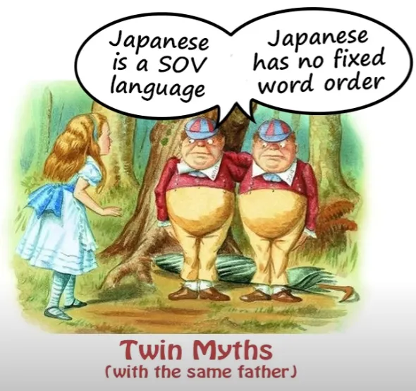

The first is that Japanese is an SOV language, that's a Subject-Object-Verb language. And the second is that word order in Japanese really doesn't matter and isn't very important, because you can put words in pretty much any order and continue to mean the same thing. And both of these opinions are completely false. And interestingly enough although they're diametrically opposed to each other, they both stem from the same fallacy.

They both come from giving different answers to the same question which was the wrong question to ask in the first place. In other words, what they come from is our old friend, treating Japanese as if it were not Japanese but a European language and asking questions and giving answers that are relevant to European languages and not to Japanese. So, let's look into this and see how it works and understand how word order really works in Japanese.

First of all, let's look at this question of Japanese being a Subject-Object-Verb language. Now, this would be contrasting it to English, which is a Subject-Verb-Object language. So, to give you an example of that, if we say <code>Mary hit Susan</code>, this is a standard English Subject-Verb-Object sentence.

Mary is the Subject -- she did the hitting. Susan is the Object -- she received the hitting. If we change the order around and say <code>Susan hit Mary</code>, we're now saying something different, aren't we?

Now, the way in Japanese we would say <code>Mary hit Susan</code> is <code>メアリーがスーザンをなぐった</code>. And this is of course Subject-Object-Verb.

Mary's the Subject, Susan's the Object, and the Verb comes at the end. So, isn't Wikipedia right? Isn't Japanese really a Subject-Object-Verb language?

No, it isn't. Because although <code>メアリーがスーザンをなぐった</code> is the most common way of putting it, it isn't the only way of putting it. We could just as easily say <code>スーザンをメアリーがなぐった</code> *and we're still saying <code>Mary hit Susan</code>*, even though we've changed the order.

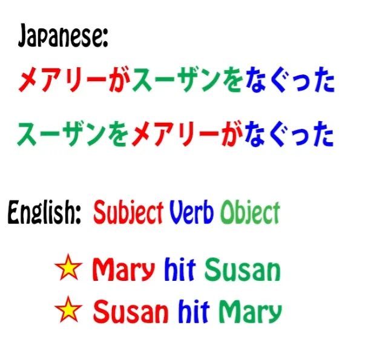

Because in Japanese the question of who did what to whom and most other logical questions like where it was done, what it was done with, and all those things are handled by logical particles. So the important thing in this sentence is not which order we have Mary and Susan but which one is marked by が and which one is marked by を.

So this talk of a Subject-Object-Verb language is nonsense. It doesn't actually matter which order you put them in. And this of course is the basis of these people who say Japanese word order doesn't matter. So aren't they right?

No, they're not right. **Because Japanese word order does matter.** **It just doesn't matter in the same ways and the same places that European word order matters.**

If we start thinking about Japanese as Japanese and not trying to interpret it as a European language, then we can make some progress on actually understanding Japanese.

## Japanese word order rules

So what is Japanese word order and why does it matter so much? Japanese word order goes according to two simple rules. They're both very simple. It's just that they don't work in the same way that European languages work.

So if we can throw our European concepts out of the window and start looking at Japanese as Japanese, there's nothing difficult about this. It's very simple and straightforward to understand. So, what are the two rules of Japanese word order?

The first one you probably already know. It's very simple, and I expect you use it all the time if you're actually using Japanese at all even at a very basic level.

### Rule 1

The first rule of Japanese word order is: The Engine always goes at the end of the sentence.

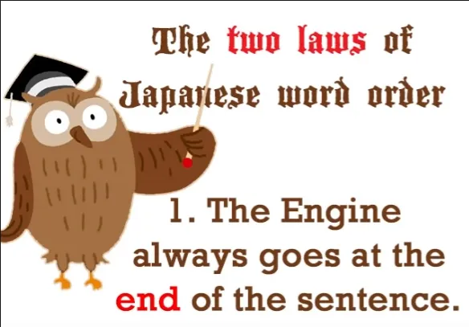

Now, if I were talking in this very verb-centered English way, I would say <code>The Verb always goes at the end of the sentence</code>, and that's perfectly true. The Verb always does go at the end of the sentence. But not all sentences are verb-sentences, <code>A does B</code> sentences.

We also have <code>A is B</code> sentences. And whatever kind of sentence we have, the Engine always goes at the end of the sentence.

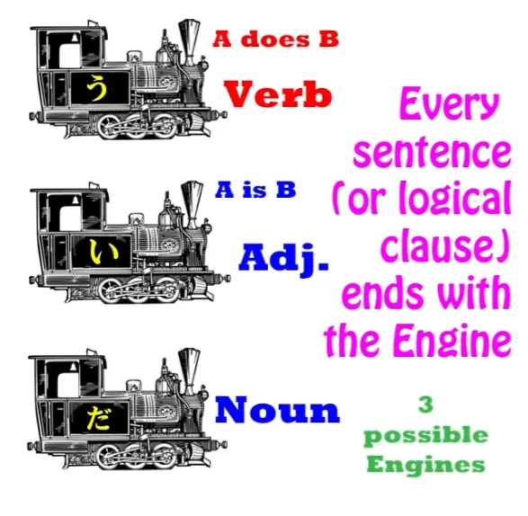

There are three possible kinds of Engine. There is the Verb Engine, which is an <code>A does B</code> sentence. And then with <code>A is B</code> sentences we either have an Adjective Engine, an engine made from an adjective which always ends in -い (this is what the textbooks call an <code>い-adjective</code> and is in fact the only adjective there is in Japanese) or with a Noun plus the Copula, which is <code>だ</code> or <code>です</code>.

So every sentence is going to end in one of those three. And whatever Engine we're using, a Verb, a Noun with the Copula, or an Adjective, it has to go at the end.

We may have a couple of sentence-ender particles after it (and I've done [**a video**](https://www.youtube.com/watch?v=IWEok4Ivfyc&ab_channel=OrganicJapanesewithCureDolly) on sentence-ender particles) but the actual end of the logical sentence has to be its Engine. So that's the first rule, and it's very easy, and I imagine you're accustomed to it already.

### Rule 2

The second rule is this, and this is the one that can cause confusion if you don't understand it: Anything that modifies any-THING must go before it.

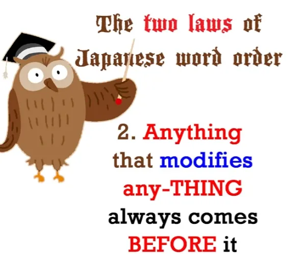

Now what do I mean by <code>anything</code> and <code>any-THING</code> and what do I mean by <code>modify</code>? Let's break it down.

By <code>any-THING</code> I mean literally a thing, a noun. We're talking about nouns at the moment. And by <code>anything</code>, I really mean anything.

It could be a logical clause, it could be part of a logical clause, it could be another noun -- it's anything that modifies any noun. So what do I mean by <code>modify</code>?

Well, I mean literally changing something or, we could say, describing it. So if we have a dress and then we put a modifier before it and say it's a <code>blue dress</code>, then we've modified it -- we've made it blue.

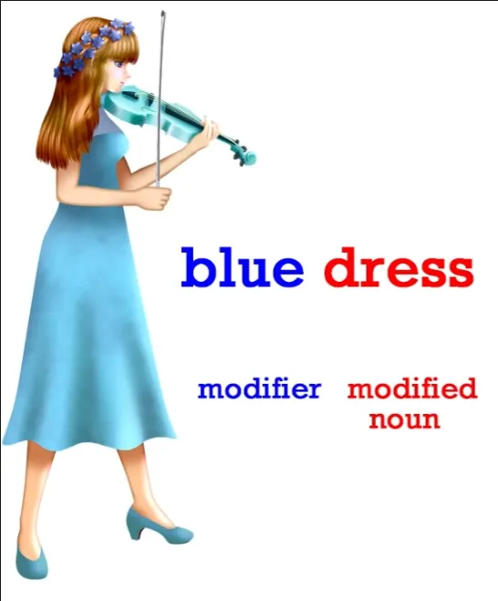

If we say it's a <code>big dress</code> then we've modified it and made it big. If we say it's a <code>hot dress</code> then we've modified it and made it hot.

And of course modifiers can become more complex than that and we'll talk about that in just a moment. But a modifier is something that tells us more about a noun. It modifies it from just being the simple noun to being a more particular version of that noun.

So what do I mean by saying that <code>Anything that modifies any-thing must come before it</code>? Well, if we speak English we should be used to this idea already, because *in English* simple modifiers always come before the noun they modify. So, as we've just seen, if we say <code>a blue dress</code>, <code>blue</code> comes before the modified noun <code>dress</code>, the noun that we've just turned blue.

We say <code>a warm day</code>. <code>Warm</code> comes before the noun <code>day</code>. And it can become more complex.

We might say <code>a pale blue dress</code>, <code>a nice warm day</code>, and the modifier still comes before the noun it's modifying. And it can get more complicated still.

We might say <code>an interesting-looking pale blue dress</code>, and all of it still comes before the noun <code>dress</code>, doesn't it?

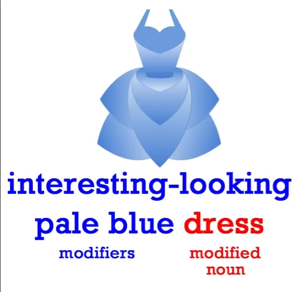

However, when modifiers become more complex *in English* we start throwing them on the other side of the noun. So if we want to say <code>the dress I bought at the market on Saturday</code>, now <code>dress</code> comes first and the modifier comes afterward.

And sometimes we're throwing modifiers onto both sides of the noun. So we might say, <code>the pale blue dress I bought at the market yesterday</code>. So we've got <code>dress</code> sandwiched in the middle and clauses modifying that dress on both sides of it.

That's not the way Japanese works. Japanese always keeps modifiers before the thing they modify. So it's very predictable and we always know what's going on.

A way of looking at Japanese word order is to see it as a stage scene. To see every sentence or every logical clause as a little scene on a stage. And the way Japanese works is that first of all it dresses the little dolls that go into the scene.

So before each doll comes whatever it's dressed in, whatever modifies it, whatever tells us more about it, its clothes, its setting. Then we put it on the stage. We mark it with whatever part it plays in the sentence, and then we put the next noun if there is another noun, and finally we put on the action button, the verb.

And we always press the action button last.

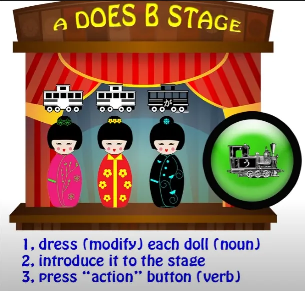

So this is the order of Japanese sentences. First of all, the information about the actors. Then the actors themselves. And if there's more than one actor, we put its information first and then the actor, and the next one we put its information first and then the actor. And then finally, if it's an action scene, if it's an <code>A does B</code> scene, then we put on the action button and we watch the actors going through their parts.

And from the word order we can always tell what's happening. If we have a clause that ends in one of the Engines, a Verb, an Adjective or a Noun plus Copula, we know that that is a logical clause.

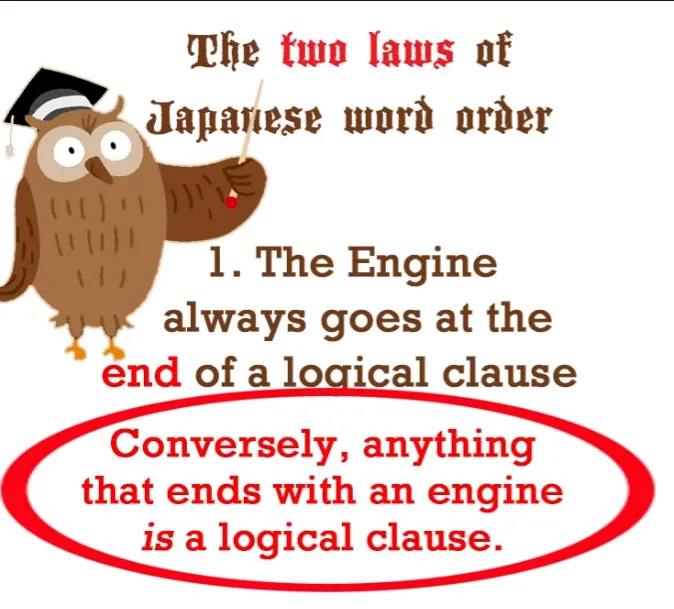

But if it's turned around in any way, if it's ending in a noun and not in an Engine, then we know that the noun at the head of that clause is a modified noun and the clause is *not* functioning as a logical clause.

Let's take the example we've been looking at. If we say <code>いちばで *(zeroが)* 青いドレスを買った</code>, we're saying <code>I bought a blue dress at the market.</code>

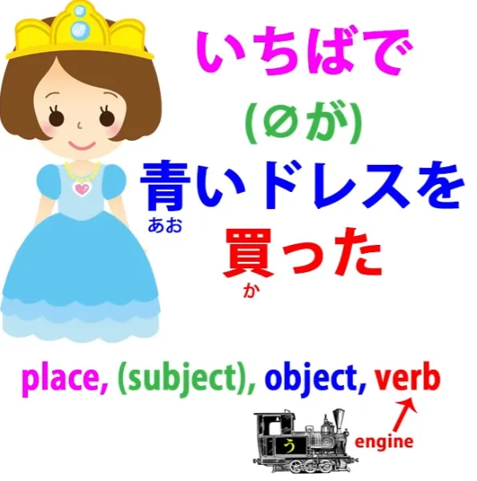

And we know that that's a logical clause because of Rule One. So this is a logical clause ending with an Engine. It's an <code>A does B</code> clause: <code>I bought a blue dress at the market.</code>

Now, we can move almost any element from a logical clause to the front of the clause, that's to say, to the position nearest the Engine, furthest right in horizontal text, furthest down in vertical text. We can move it to the head of the clause and if we do that, if we move any non-Engine element to the head of the clause, then it's no longer functioning as a logical clause, but it's functioning as a modifier for that element that we've moved to the head.

So, if we say, <code>いちばで *(zeroが)* 買ったドレス</code>, we're saying <code>the dress I bought at the market</code>.

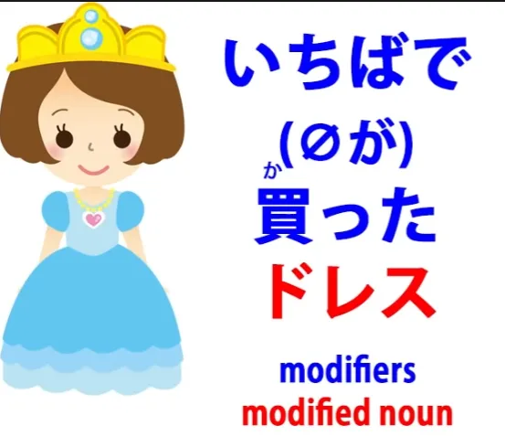

This is no longer a logical clause. It's a modified noun, and the noun is the dress. Now, we can just as easily bring the market to the head of the clause.

We can say, <code> *(zeroが)* ドレスを買ったいちば</code>, and now we're saying <code>the market at which I bought the dress</code>.

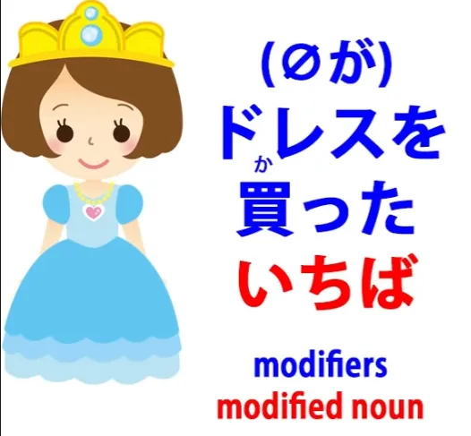

And again, we know this isn't a logical clause because it doesn't have an Engine at the head. At the head it has a noun, and so that noun must be modified by what is going before it.

And since it's not a logical clause, in order to make a logical clause we have to have something else after it. And that again could contain modifications.

Because Japanese does things with these modifications that in other languages are done in other ways. So almost any complex Japanese sentence is going to be heavily dependent on these premodifiers.

And knowing what is modifying, what is being modified, knowing whether something is a modified noun or whether we're looking at a logical clause -- all this is dependent on word order. So, the full clause here might be: <code> *(zeroが)* いちばで買ったドレスをメガネをかけている少女にあげた.</code>

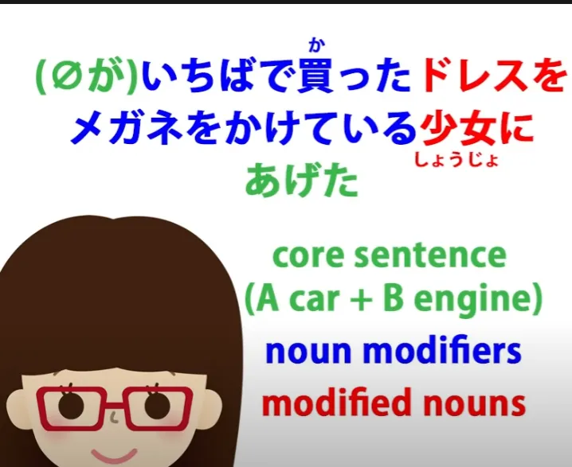

So then we're saying, <code>I gave the dress that I bought at the market to a girl wearing glasses.</code> And once again, we have what could be a logical clause -- <code>少女はメガネをかけている</code>, <code>The girl is wearing glasses</code> -- but we've taken the noun <code>少女</code> -- <code>girl</code> -- to the front, so now it's not a logical clause, it's a noun with a modifier, the girl *(少女)* modified by the phrase <code>メガネをかけている</code> -- <code>girl wearing glasses</code>.

<code>I gave the dress I bought at the market to a girl wearing glasses.</code> And this is very typical. You're going to see this kind of construction all the time.

The way Japanese does an awful lot of the work of conveying things is by using these modifying clauses, which always come before whatever it is they're modifying. First of all we dress the doll, then we put the doll on the stage, then we press the action button. 

So, word order is crucial to understanding Japanese…
