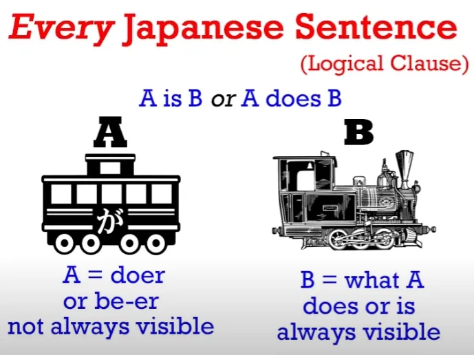
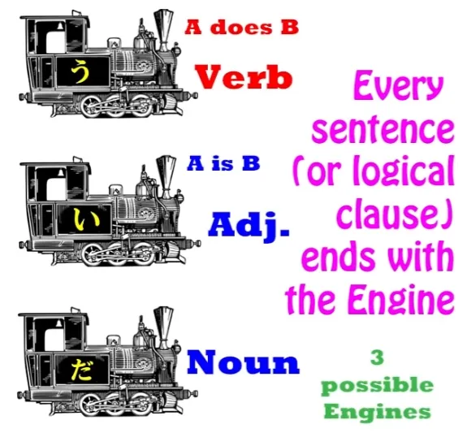
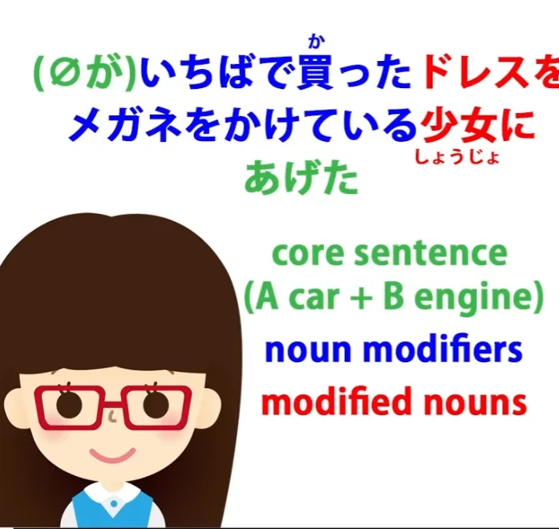
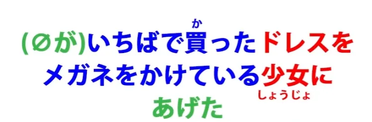
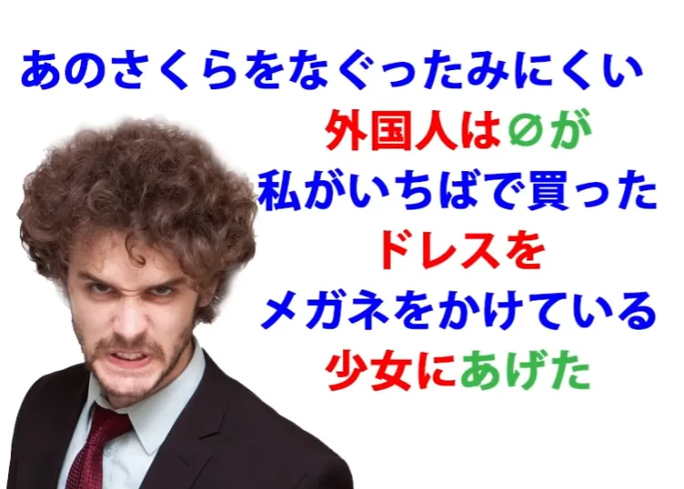
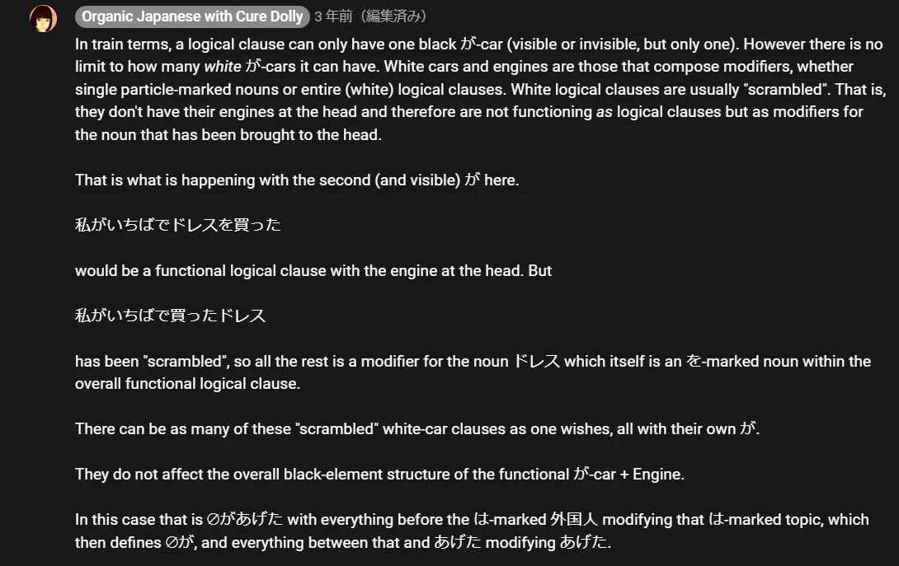
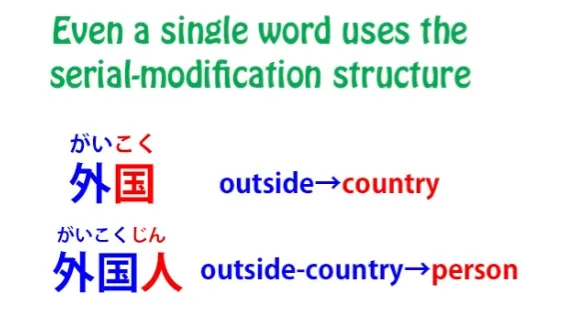
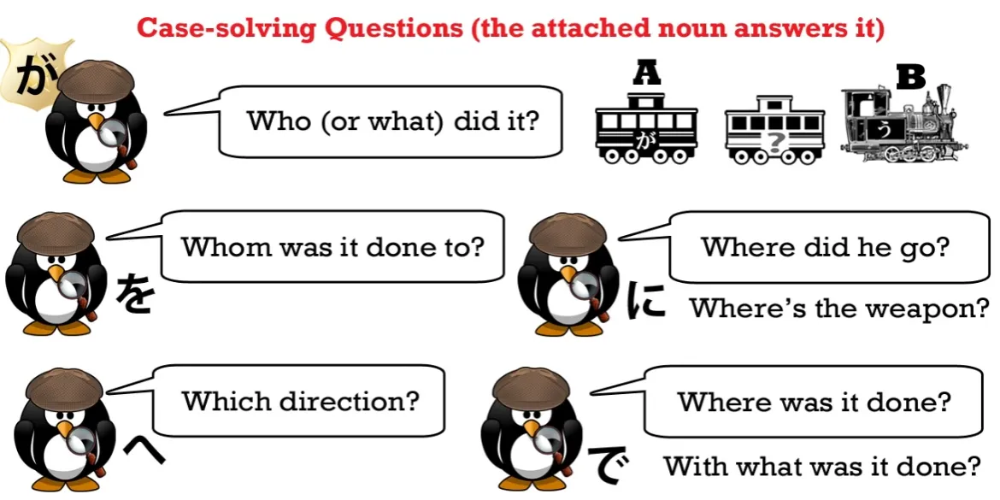
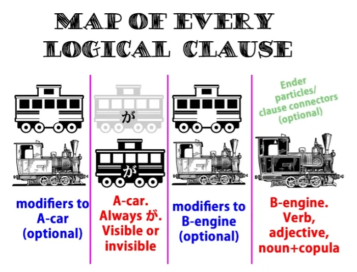

# **47. How to Understand Japanese: Your Secret Weapon for breaking down sentences**

[**How to Understand Japanese: Your Secret Weapon for breaking down sentences | Lesson 47**](https://www.youtube.com/watch?v=z9S2J8tlnUE&list=PLg9uYxuZf8x_A-vcqqyOFZu06WlhnypWj&index=49&pp=iAQB)

こんにちは。

Today we're going to talk about the secret weapon that will allow you to grasp any Japanese sentence regardless of how complex it may appear to be. A lot of Japanese sentences in fact appear much more complicated than they really are because of what I call the modular or modification structure of the language. But once we understand how it really works this structure stops being our enemy and becomes our friend, because it allows us to break down any complicated Japanese sentence into something that's really laughably simple.

I told you right from the beginning of this course that every Japanese sentence consists of two elements, and they are the A-car (the subject) and the B-engine.

The A-car is always marked by が. We can't always see it, but whether we can see it or not, it's always logically there and it's always marked by が. The B-engine can be one of only three things.

It can be a verb, an adjective, or a noun-plus-copula <code>だ</code> or <code>です</code>. There are only two kinds of sentences: <code>A is B</code> and <code>A does B</code> sentences.

In an <code>A does B</code> sentence, A is the thing that does B, which is the engine, which has to be a verb. In an <code>A is B</code> sentence, A is the thing which is B, which has to be an adjective or a noun-plus-copula. Now, we've seen much more complicated sentences since then and we've seen how every one of them has this same A and B as its fundamental core.

But the important thing we are going to look at today is the fact that A and B are not just the core of the sentence: they are *the sentence*. Everything else is doing nothing other than telling us something more about A or something more about B. Now, the only other thing that can complicate this at times is the fact that when we say <code>a sentence</code> what we actually mean is a logical clause.

Now, we sometimes use those two terms interchangeably and we very often can use them interchangeably, but the difference is this: a logical clause is by definition a complete sentence, that's to say, we could put a <code>○ / まる</code> or a period at the end of it and then it's a sentence. It can stand on its own; it's grammatical; it doesn't need anything else. It is a sentence. But the reason we call it <code>a logical clause</code> is because *a sentence can contain more than one logical clause.*

That's to say, it can contain within itself two elements that could each be a complete sentence. Now, a very simple example of this is if we say <code> *(zeroが)* お店に行って *(zeroが)* パンを買った</code>, which in English is <code>I went to the shops and bought bread.</code>

Now, in both English and Japanese, this is two logical clauses made into one compound sentence. And I've talked about compound sentences in another video. So what we have here is the logical clause <code> *(zeroが)* お店に行った</code> -- <code>I went to the shops</code> -- and <code> *(zeroが)* パンを買った</code> -- <code>I bought bread</code>.

In English this is <code>I went to the shops and I bought bread</code>. Now, in Japanese we don't need to have the <code>I</code> visible but it has to be logically there and it logically carries the particle が. We sometimes say that English requires the subject to be visibly present in every clause, but this isn't actually true, although it's close to being true.

And this is an example of how it isn't always true. English actually does use the zero pronoun just as Japanese does. It just doesn't do it nearly so often. So with this sentence in English we don't normally say <code>I went to the shops and I bought some bread</code>.

We usually say <code>I went to the shops and bought some bread</code>. So you see here that English is actually using the zero pronoun. We don't have to say <code>I</code> twice.

We're allowed to carry it over from context to the second clause of the sentence just the way Japanese much more freely allows us to do that. But in all cases the subject is there. Bread isn't buying itself. I'm buying it, whether I am visibly there as the subject or not.

So one skill that we need for understanding a complex sentence is the ability to see where logical clauses end, to see when something is in fact a complete logical clause with its own A-car and B-engine. And I've done a whole video explaining how to do that, so you may want to watch that video after you see this one. *(Lesson 34)*

Today we're going to concentrate on the logical clause and the ways in which it can apparently become complicated. Last week we were talking about the concept of modifiers and we were talking about it in its perhaps simplest and most approachable form, which is noun modifiers. And to understand modifiers you have to understand word order in Japanese because Japanese word order is extremely important. As sentences become more complex, you have to understand word order to understand what they're doing.

So these people who tell you that Japanese has no set word order or that Japanese is an SOV language are really leading you up the garden path because neither of those statements is true, as we discussed last week. *(Lesson 46)* So the first law of Japanese word order is that the engine of the sentence, which can be a verb, an adjective or a noun-plus-copula, always has to come at the end of the sentence.

And the second law, and this is the most important one for our present purposes, is that anything that modifies anything has to come before it. Now, last week, the form I put this in was <code>Anything that modifies any \*THING\* has to come before it</code>, that's to say, anything that modifies a noun has to come before that noun.

But we can take this further, and that's what we're going to do this week. And we can simply say <code>Anything that *modifies* ANYTHING always comes BEFORE it</code>. It doesn't have to be a noun.

What else could it be? Well, it could be the head verb of the sentence.

So, let's go back to a somewhat complex sentence that we analyzed last week. <code> *(zeroが)* いちばで買ったドレスをメガネをかけている少女にあげた.</code> -- <code>I gave the dress I bought at the market to a girl wearing glasses.</code>

Now, I colored this in order to show the process of noun modification. In this sentence we have the A-car, which is invisible (it's "I****, zeroが), and we have the engine, which is <code>あげた</code>. And that is the sentence core: <code>I gave</code>.

Now, inside the sentence we have two nouns and they're both modified by more information. And in both cases that information is given by taking a logical clause and pulling out one element and putting it at the head of the sentence, at the engine end of the sentence.

So we could say <code>いちばで *(zeroが)* ドレスを買った</code> and then we have the engine at the end and we're saying <code>I bought a dress at the market</code>, but we can also pull out any element from that sentence and put it at the end and that becomes a modified noun. So we can say, as we're saying here, <code>いちばで *(zeroが)* 買ったドレス</code>, which means <code>the dress I bought at the market</code>.

We could also do the same thing with the market: <code> *(zeroが)* ドレスを買ったいちば</code> -- <code>the market at which I bought the dress</code>. And neither of these is a logical clause, because it couldn't stand on its own as a sentence, could it? It's now a noun which has to play some role in a larger sentence.

So, the blue elements here are the modifiers, the red elements are nouns that are marked with logical particles. *(the last picture still)* And here is this fundamental radical fact that you need to take a moment to ingest. **In an <code>A does B</code> sentence, the nouns marked by the main logical particles other than が,** **that is, by を, に, で, and へ, are all modifiers for the verb.**

The logical particle が tells us what the subject of the sentence is, what the A-car is. The logical particle の is an exception here because what it does is couple two nouns. But the main verb-sentence logical particles, を, に, で, and へ, do one thing and one thing only.

**They modify the verb; they tell us more about it.**

So in this sentence, the sentence itself is <code>(zeroが)あげた</code> and everything else is telling us more about <code>あげた</code>.

::: info
- I’ll give the direct Japanese sentence examples here, but take them with a grain of salt.
(zeroが)あげた
:::

<code>I gave.</code> What did I give? The を-marked *(direct)* object tells us this: <code>I gave a dress</code>. *(zeroが)ドレスをあげた*

The modifier tells us more about the dress: <code>the dress I bought at the market</code>. *いちばで(zeroが)買ったドレス (if unclear about zeroが here, check L.46 Rule 2 section)*

To whom did I give it? The に-marked **indirect object** tells us that: <code>I gave it to a girl</code>. *(zeroが)少女にあげた*

What kind of a girl? Well, the modifier tells us more about the girl: <code>the girl wearing glasses</code>. *メガネをかけている少女。。。*

So, the sentence itself is <code>(zeroが)あげた</code> and everything else is telling us more about <code>あげた</code>. And however long and complicated it gets, that structure always stays the same.

We have to identify the engine of the sentence and that's very easy because the engine of the sentence is invariably at the end of the sentence. It may have a couple of sentence-ender particles after it (and I've done a video on that) but the logical end of the sentence is the verb, the adjective or the noun-plus-copula that is the last one in the sentence.

So we always know where to find the engine: it's at the end of the sentence. And the A-car is whoever is doing that verb or being that adjective or noun-plus-copula. Now the other useful thing to remember is that it's usually easy enough to find even an invisible actor because it's not going to have anything behind it.

In this sentence, as we see, there's a lot of modifying going on but it's all modifying the verb.

We can't have anything modifying the A-car, the が-marked actor, because the が-marked actor isn't visible and we can only modify something that we can actually see within a sentence.

::: info
I may not be fully getting what Dolly means here by zeroが not having anything behind it, since she does give examples (in L.46) where invisible が actors have something before them - even in logical clauses, such as the place - いちばで(zeroが)青いドレスを買った in L46.
I think what she means is simply that this would not work without the mentioned 私が because the dress is being modified by the entire pre-modifier <code>私がいちばで買った</code> which is a pre-modifier for dress, instead of its own full clause forming a sentence on its own as it would be if it were - 私がいちばでドレスを買った。Where the verb is the last as the head of the clause.
:::

Here instead it is just a pre-modifier, and the head verb of the clause is あげた at the end.
*So if we wanted to modify both elements of the sentence we'd need to make the first one visible.

Let's try doing that. <code>あのさくらをなぐったみにくい外国人は *(zeroが)* 私がいちばでかったドレスをメガネをかけている少女にあげた.</code> -- <code>That ugly foreigner who hit Sakura gave the dress I bought at the market to a girl wearing glasses.</code>

Now we're starting the sentence out with a non-logical topic marked by は. But what that topic is doing is defining for us the zero pronoun, the が-marked A-car of the sentence, which is zeroが.

Now, we could say, <code>みにくい外国人がさくらをなぐった</code> --<code>An ugly foreigner hit Sakura</code> -- but what we're doing here once again is we're pulling out one of the elements, in this case <code>外国人</code>, and putting it at the end of the clause, **so it isn't a functional logical clause***,* **it's a modified noun:** <code>the ugly 外国人 who hit Sakura</code>. So it's telling us more about that 外国人: <code>As for that ugly 外国人 who hit Sakura, he did...</code>

What did he do? <code>He did..</code> -- that's <code>zeroが</code> -- <code>he did...</code> and then we say what he did.

::: info
I am going to put this comment here.
*
:::

And let's notice that everything, everything in this sentence apart from the core consists of what we might call <code>serial modification</code>. Even the word <code>外国人</code>, which is so often seen together that we tend to regard it as a word in itself, and it is a word in itself, is in fact an example of *serial modification*, one thing modifying the thing that comes after it.

So, <code>コク/国</code> is the on-reading of <code>くに/国</code> -- <code>country</code>. <code>外国</code> -- in <code>外国</code>, <code>外</code> modifies <code>国</code>. What kind of a country was it? An <code>outside</code> country, a <code>foreign</code> country. And then, <code>ジン/人</code>, which is the on-reading of <code>ひと/人</code> -- <code>person</code> -- is modified by these two together.

What kind of a person was it? An <code>outside-country</code> person, a person <code>from a foreign country</code> -- <code>外国人</code>.

---

So, everything in this sentence is modifying whatever comes after it, until we get to the A-car, and then we have the first fundamental element of the sentence, and then everything after that is then modifying the engine. And that's all that can ever happen.

This is how every Japanese sentence is structured. We have the A-car, we have the B-engine. If there's anything modifying the A-car it comes directly before it.

If there's anything modifying the B-engine, it comes directly before that. Every noun marked with a main logical particle, the detectives of our logical particle video *(Lesson 8b)*:

を, に, で and -へ, are in fact **modifying the verb.** They're telling us more about the verb, and I said in that video that these logical particles -- other than が, which gives us the subject of any sentence, and の, which links together two nouns -- these four fundamental logical particles only work in verb-sentences, <code>A does B</code> sentences.

Or, in detective terms, they only work on cases. And that's because their function is to tell us more about the verb, to modify the verb.

So, every sentence has this same structure: the A-car, the B-engine, the things that are modifying the A-car, and the things that are modifying the B-engine.

And there's nothing else that can be in a sentence except for things like sentence-ender particles. **But there may be more than one logical clause operating in a sentence** and, as I say, identifying logical clauses is not complicated…
