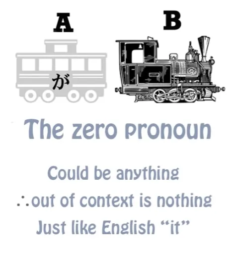
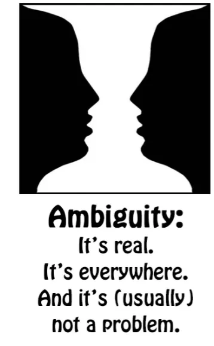
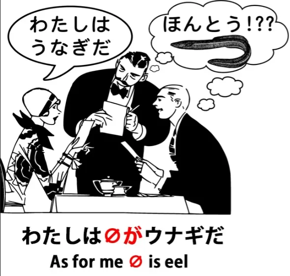
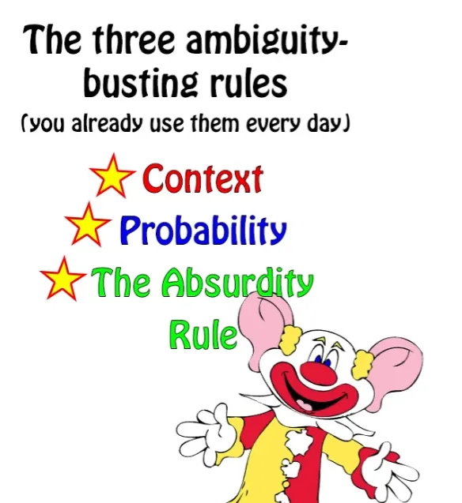
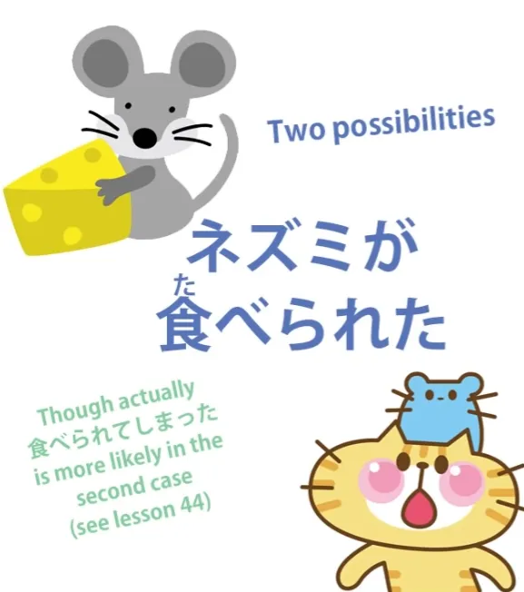
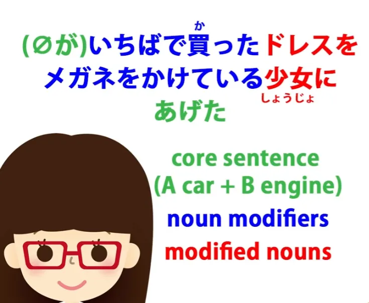
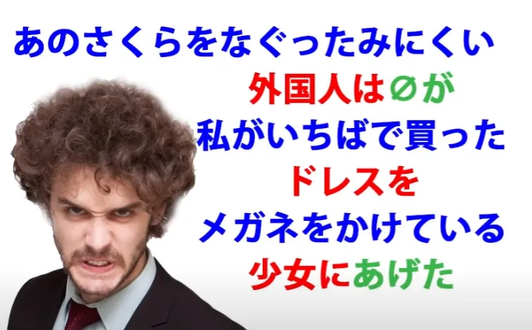

# **48. Dealing with ambiguity in Japanese**

[**Dealing with ambiguity in Japanese 3 Laws that Make Everything Clear! Lesson 48**](https://www.youtube.com/watch?v=gcbbSW-KuTQ&list=PLg9uYxuZf8x_A-vcqqyOFZu06WlhnypWj&index=50&pp=iAQB)

こんにちは。

Today we're going to talk about ambiguity in Japanese, because this is something that makes the language much harder to understand for many non-Japanese learners. Now, Japanese has a reputation for being an ambiguous language. And whether this is true or not, the perception of ambiguity makes sentences harder to understand. So, I want to look at real and perceived ambiguity in Japanese and how to deal with it.

Japanese people don't have any difficulty in understanding each other, and there's no reason for you to have any difficulty either. A lot of the perceived difficulty comes from the fact that it's taught in such a way as not to explain the real structure of the language. So let's look at some different aspects of real and perceived Japanese ambiguity.

Probably the first thing that makes Japanese feel ambiguous and difficult to foreigners is the zero pronoun.

It's so confusing to many people that there are intelligent and respectable teachers of Japanese on the Web who even go so far as to claim that Japanese has no grammatical subject. It certainly has a grammatical subject and it's present in every sentence. The thing is that you can't always see it. Now, I've explained before that this is really that the Japanese invisible pronoun (or zero pronoun) is no more confusing than English <code>it</code>.

The word <code>it</code> could mean the Andromeda galaxy, it could mean a tree, it could mean my kneecap (I do have kneecaps), it could mean a chimpanzee's tail, assuming chimpanzees do have tails, and even if they don't it could be an imaginary chimpanzee's tail. The point is that because <code>it</code> can mean just about everything, it actually means nothing except in context. And that's exactly how the zero pronoun works. And one is no more ambiguous than the other.

But some people are going to say, <code>But the fact that you can't see it means that we don't even know whether it's there or not.</code> And the answer to that is that yes, we can know. So long as we understand the structure of the language, we know it's there because it has to be there. It's logically there.

So there's no difficulty at all about pinpointing the zero pronoun provided we understand the structure of the language. And one of the difficulties of course is that conventional Japanese grammar textbooks and websites don't teach the real structure of the language and so they leave us in doubt on this as on many other subjects.

But that's what my course is for, so if you follow my course or have followed my course you should be clear enough about the structure of the language. So, can the zero pronoun ever cause ambiguity?

Yes, it can. Just as <code>it</code> can in English.

For example, if I say, <code>My right antenna was so broken that it fell off</code> (you haven't seen my antennae, have you? Well, they're a bit of a secret, so let's pass on) <code>My right antenna was so broken that it fell off</code>, you know from context that <code>it</code> refers to my right antenna. But suppose I say, <code>I was trying to fix the door handle, but my right antenna was so broken that it fell off.</code> Then you may not know whether I mean that my right antenna fell off or that the door handle fell off.

And this kind of ambiguity can occur in any language, and really no more in Japanese than any other language. What do we do about it when it does occur?

## The Context Rule

Well, fundamentally it's up to the speaker to make herself clear or the listener to ask her to clarify if she hasn't made herself clear. If you're watching anime, reading books or playing games or in general dealing with any kind of professional writing or speaking, people will make things clear unless they actually want to play games with ambiguity.

So this is just the same as English or any other language. There's nothing special about Japanese in this context. If we go back to the example we used right back in our first lesson about the non-logical は topic marker, <code>私はうなぎです</code>. <code>私は *(zeroが)* アメリカ人です</code> means <code>I am an American.</code> / *As for me, (I) American-am* <code>私は *(zeroが)* うなぎです</code> does not usually mean <code>I am an eel.</code> *As for me, (food?) eel-is*

If it's spoken in a restaurant and the topic of conversation is what we're going to eat, then it'll be understood that the zero pronoun of that sentence is not <code>私</code> but the thing we're talking about: what we're going to have to eat.

---

Could it ever mean <code>I am an eel</code>? Yes, it could.

For example, if I go up to a stranger in the street and point to my nose (which is the way in Japan you indicate yourself) and say, <code>私はうなぎです</code>, they would know that I'm saying that I'm an eel and they'd probably think I was a little strange, because I don't look like an eel. I look a bit like a human but I hope not very much like an eel. Now, if in a restaurant we weren't talking about food at all, maybe about the weather, and I suddenly say <code>私はうなぎだ</code>, people would probably still understand me to mean that I have decided I want to eat eel.

So, how does this work? Well, in Japanese -- and it's just the same in English or any other language -- we have three rules that we apply to interpreting sentences that can be in any way ambiguous. And they are: **context, probability, and the absurdity rule.**

Context is the obvious one that we've already discussed. If I say <code>My left antenna was so broken that it fell off</code>, you know from context that <code>it</code> means my left antenna.

## The Probability Rule

Probability is the fact that when two possibilities are both possible and context hasn't actually told us which, we'll go for the one that's most probable. And this isn't just an accident. This is something everybody knows about language. So listeners do it, speakers expect listeners to do it, and language is tailored to work with those rules -- in Japanese or in English.

So there's nothing mysterious about it. So, for example, if I say <code>I saw a man on a hill with a telescope</code>, probably you would interpret this as meaning I used the telescope in order to see the man on the hill. So that's probability, I haven't actually said anything to indicate that interpretation, but it's the most likely default interpretation.

However, if you said to me, <code>Do you think we're being watched?</code> and I said, "I think we are. I saw a man on a hill with a telescope", then you would probably interpret me as saying that I saw, with my naked eye, a man on a hill who had a telescope and therefore was probably watching us. Now, there are other interpretations too.

I could have meant I saw a man on a hill that had one of these public pay-telescopes on it, so <code>a hill with a telescope</code> would be where I saw the man. And one could even mean that I use a telescope as a saw to cut a man on a hill. Now, the last one, like <code>I am an eel</code>, is somewhat absurd and so that comes very low down the scale of anybody's making that interpretation. *Context also helps here*

## The Absurdity Rule

And the absurdity rule is that the burden of expression lies with absurdity. And this is similar to the legal dictum that the burden of proof lies with the prosecution. In other words, we assume the defendant to be innocent unless we can prove that they were guilty.

Similarly, we assume a statement not to be absurd unless there is clear evidence that absurdity is intended. So, for example, <code>I ate dinner with Sakura last night</code> is not generally considered to be an ambiguous sentence. <code>I ate dinner with chopsticks last night</code> is also not considered to be an ambiguous sentence. But you can see that they are structured identically but they work differently.

Now, if I wanted to say <code>I ate dinner with Sakura last night</code> meaning I used Sakura as an eating implement or if I wanted to say <code>I ate dinner with chopsticks last night</code> meaning a friendly animated pair of chopsticks was my dining companion, it would be incumbent upon me to make that clear. I cannot convey to you the idea that I used Sakura as an eating implement by saying <code>I ate dinner with Sakura last night</code>.

You will always put the more probable and less absurd interpretation on it.

---

Language reserves the right, and must reserve the right, to express the improbable and the absurd. Otherwise language would have whole areas that it would be unable to express. But the further you go from the norm, the higher is the incumbency upon the speaker to make what she is saying clear.

So if I really want to say that I used Sakura as an eating implement, I would have to say <code>I had dinner last night and I used Sakura as a pair of chopsticks.</code> Anything with any ambiguity at all is going to have the absurd possibility ruled out. Now, this isn't logic, it isn't grammar, but it is the way human languages work -- English, Japanese, any other language.

To take a specific example in Japanese, something that sometimes troubles people is the fact that the ICHIDAN potential helper verb <code>-られる</code> and the Ichidan receptive helper verb <code>-られる</code> are identical.

::: info
For Potential, check Lesson 10, Godan potential is え-stem + -る. For Receptive L13.
*
:::

::: info
There is also a mistake in the video’s picture where it says that both attach to the あ-stem (Godan verbs), but Potential attaches to the え-stem, whereas Receptive goes to the あ-stem.
:::

And people often think, <code>Well, this is really worrying. The two are the same. How am I ever going to know which is which?</code> And part of the problem here comes from the whole textbook approach to Japanese, which has to do with learning things in the abstract and dealing with these cut-off, isolated, out-of-context sentences.

Although we need to learn structure, **the way we learn Japanese is from immersion in Japanese, using real in-context Japanese language.** So, let's look at this <code>-られる</code> problem.

For example, <code>食べられる</code>: <code>食べられた</code>, if it's the potential, can mean either <code>I was able to eat</code> or <code>I was able to eat (something) / I was able to eat (this particular thing)</code>. On the other hand, if it's the receptive, it means <code>I received the action of eating</code>.

In English we would say <code>I was eaten</code> or <code>I got eaten</code>, which is closer to the Japanese. It tends to get translated as a passive sentence -- <code>I was eaten</code> -- in English. What it actually means is literally <code>I got eaten / I received the act of being eaten</code>. And if we think of it as passive, we're going to get very messed-up with the structure of those sentences.

But that's not really the subject of this video and you can watch my video on the Japanese receptive to clarify all this. *Lesson 13* The ambiguity here is that if I say <code>食べられた</code> I could mean <code>I was able to eat</code> or I could mean <code>I got eaten</code>. Now, in this case the absurdity rule comes into play: I could be saying that I was eaten but considering that I'm standing here telling you that, it's not very probable.

So I would have to say something more than that in order to get you to register the possibility that I could say that I had been eaten. So this is a simple case where the absurdity rule and the likelihood rule will determine what's being said and from probabilities of the particular case we're talking about. There can be cases where there's real ambiguity.

For example in the case of a pet mouse. If we say <code>ネズミが食べられた</code>, we could mean that the mouse was able to eat something we gave her or able to eat in general or it could unfortunately mean that the mouse got eaten, perhaps by a cat.

How do we resolve this ambiguity? Well, we can't do it structurally. Just as in the telescope case in English, there are some cases where linguistic structural ambiguities are only resolvable by external considerations, the probabilities of the particular case. Now, people tend to act as if there were something special and strange about this happening in Japanese that would freeze us and make us unable to understand, but that's no more the case in Japanese than it is in English.

Japanese is not some magical language ruled by strange, impenetrable rules. It's just a language, and it's a far more logical language than English, but like all languages there are many potential ambiguities, all of which are resolved by the speaker, the listener and the situation. Every now and again there is some genuine ambiguity where somebody can misunderstand, but no more than in English.

Most of the time people communicate what they want to communicate without any difficulty, using both the structure of the language and external probabilities -- and also a knowledge of how the language works. And to give an example of that, in our last lesson we examined the sentence <code> *(zeroが)* いちばで買ったドレスをメガネをかけている少女にあげた</code> -- <code>I gave the dress I bought at the market to a girl wearing glasses.</code>

And then we elaborated a more complex sentence: <code>あのさくらをなぐったみにくい外国人は *(zeroが)* 私がいちばで買ったドレスをメガネをかけている少女にあげた</code> And this means: <code>That ugly foreigner who hit Sakura gave the dress I bought at the market to a girl wearing glasses.</code>

Now, somebody asked me, "How do we know that the first part of this, after 'the ugly foreigner', isn't working just like the original sentence? How do we know that that **私が** isn't the subject of the sentence? Because after all a は-statement is a non-logical statement.

It doesn't have to be defining the subject of the sentence. It may be just standing on its own. So how do we know that this second part of the sentence doesn't just still mean 'I gave the dress I bought at the market to a girl wearing glasses'?"

And the answer to that is a knowledge of how Japanese works. Although は-statements are not logical, they are in fact grammatical. They're part of Japanese grammar. When we make a は-statement it has to be related directly to the rest of what we're saying.

Even in English, for example, if we were to say, <code>Speaking of the Andromeda galaxy, Sakura's got a pimple on her nose</code>, you'd be taken aback, wouldn't you? What has Sakura's pimple got to do with the Andromeda galaxy? But in Japanese it's even more so, because the は-statement isn't just saying <code>speaking of</code>. It's actually **a grammatical connection***.*

So if I were to say, "Speaking of that ugly foreigner who hit Sakura, I gave the dress I bought at the market to a girl wearing glasses", that makes no sense. Why are we saying <code>speaking of the ugly foreigner who hit Sakura</code>? Now, it's possible, just as it's possible for <code>私はうなぎだ</code> to mean <code>I am an eel</code> under certain circumstances, it's just possible, given surrounding circumstances, given something the listener knows that connects the two things together, that it could actually be working this way.

If, for example, it was because of the ugly foreigner being there that we ended up giving the dress to the girl wearing spectacles. But, once again the burden of proof lies with the unlikely possibility. Unless we have good reason to think that there's some connection between the ugly foreigner who hit Sakura and the fact that I gave the dress to a girl wearing glasses, that's not the interpretation we're going to put on it.

So again like the telescope sentence in English, we interpret sentences not only according to their strict structure but also according to the circumstances and the likelihoods of the situation. Because Japanese is a very logical language, I think sometimes people expect that everything should be determined by the structural logic of the language.

But that isn't the case in Japanese. It isn't the case in English. It isn't the case in any language.

So in order to interpret sentences with possible ambiguity, we can do this 99% of the time. We do it in English; we can do it in Japanese. Japanese people do it in Japanese; we can do it in Japanese.

It's not a magical language with strange, inscrutable connections. It's a language just like English in this respect, that it works by structure but it also works by the everyday common sense criteria of language, which look at context, probability, and always rule out absurdity unless it's made very clear that absurdity is intended…

::: info
You should have key grammar basics by now. If you have not started yet with input, I HIGHLY recommend starting out now. Refer to introductory links in [**my document**](https://docs.google.com/document/d/1kxYa53a2UjnpMZyHdU-YNuctkq6wHT3cJ00Z5poj2hY/edit#) or read all [**MoeWay**](https://learnjapanese.moe/). [**Consuming & using Japanese**](https://learnjapaneseonline.info/2015/07/01/japanese-immersion-why-massive-input-is-necessary/) is crucial for acquisition, so don’t be afraid to plunge in!
:::
