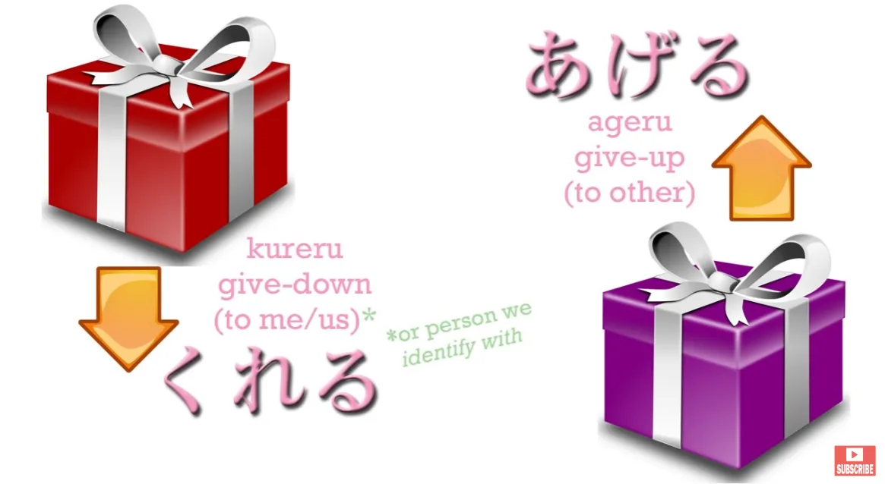
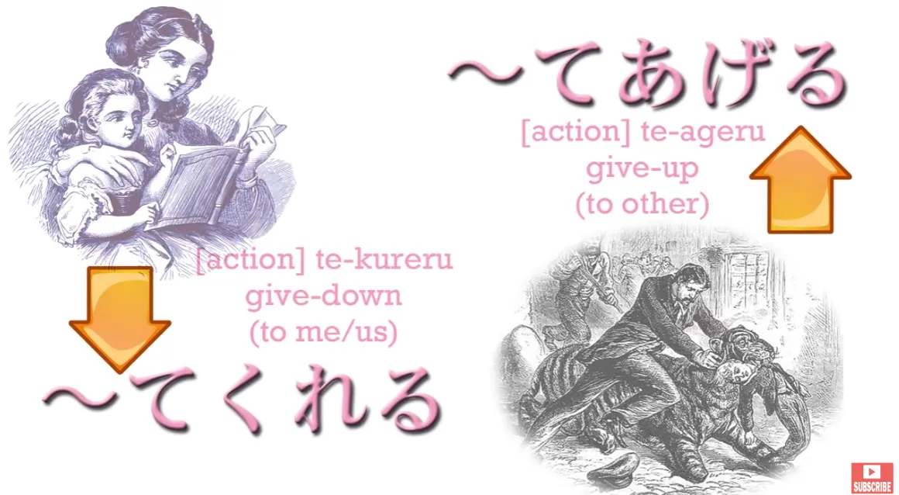
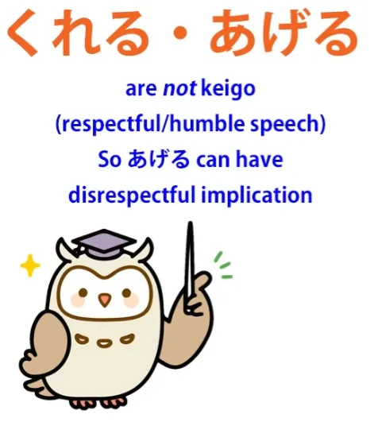
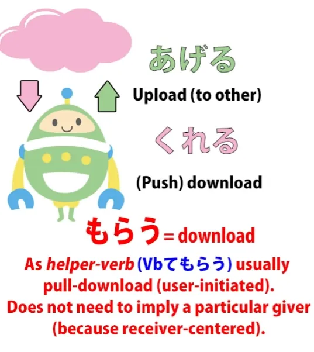
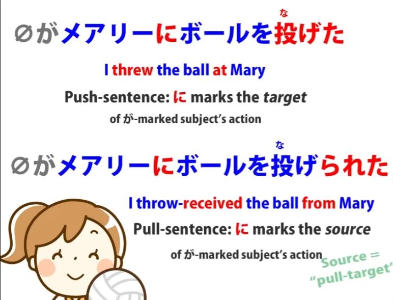
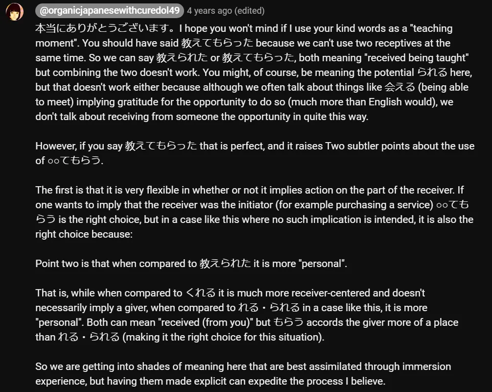
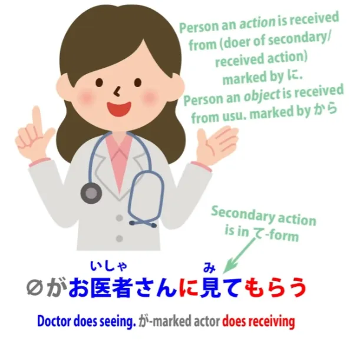
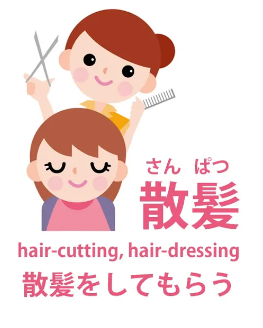

# **49. Japanese Point-of-View Deconfused! -もらう・てもらう**

[**Japanese Point-of-View Deconfused! -もらう・てもらう morau, te-morau | Lesson 49**](https://www.youtube.com/watch?v=CESFJaFp8FI&list=PLg9uYxuZf8x_A-vcqqyOFZu06WlhnypWj&index=51&pp=iAQB)

こんにちは。

Today we are going to talk about something that arises quite frequently and in a variety of different ways in Japanese and causes quite a lot of confusion because of the rather strange way it's taught in conventional えいほんご / English-language Japanese grammar. And this is the word <code>もらう</code>, which is used in all kinds of different contexts and can be very confusing and difficult for learners to grasp what's actually going on in these sentences.

Now, part of the reason this is so confusing is that <code>もらう</code> is customarily grouped together with <code>くれる</code> and <code>あげる</code> as if the three belonged together and worked in the same kind of way. And up to a point this is true. But dealing with them in this way is actually more confusing than it is helpful.

Quite a while ago I dealt with <code>くれる</code> and <code>あげる</code> *(Lesson 11)* and at the time I quite specifically didn't include <code>もらう</code> because I believe teaching them together in the way that is common causes a great deal of unnecessary confusion. I'm going to just run quickly over <code>くれる</code> and <code>あげる</code> now, and we'll talk about the ways in which they are similar to <code>もらう</code>, the much more important ways in which they aren't similar to <code>もらう</code>, and what we should really be comparing <code>もらう</code> to, which will make it much easier to understand a whole range of Japanese expressions and sentences.

So, as we know, <code>あげる</code> and <code>くれる</code> mean respectively <code>give up</code> to someone else or someone else <code>giving down</code> to oneself or to one's in-group or someone one identifies with.

It can refer to giving an actual object, a present or something, or it can refer to giving an action, doing an action for the benefit of another person or another person doing an action for one's own benefit.

And before we move on from there, I just want to make a little point that people sometimes misunderstand and that is that while giving up and giving down are originally honorific, regarding the other person as higher than oneself, as it were, this origin is so old that it's almost lost. So, in a way, despite its honorific origin, we could regard it in a more neutral way, rather like uploading and downloading, downloading meaning towards oneself, uploading being towards someone else.

And the reason for that is that <code>あげる</code> is not in fact honorific and **it's generally considered rude if you use it to a superior when you're talking about an action**, because <code>してあげる</code> means <code>doing for the benefit of (someone else)</code>, doing someone a favor, essentially.

**So if you talk to a superior in such a way as to imply that you're doing them a favor,** **this is going to cause offence**, so we should not regard <code>あげる</code> and <code>くれる</code> as being actually honorific or humble. **They're not けいご/敬語.**

**<code>くれる</code> can imply gratitude but it doesn't imply humility.** **And <code>あげる</code> doesn't imply honoring the person to whom it's applied.** All right. So now let's move on to <code>もらう</code>.
::: info
Kanji is <code>貰う</code>. Some texts use it.
:::

## もらう・てもらう

Its similarity to the others is simply that it does represent <code>downloading</code>. And while <code>くれる</code> is, as it were, a <code>push</code> download -- someone else taking the initiative to download to you, <code>もらう</code> is more like a <code>pull</code> download.

And that really is about where the similarities end, because <code>もらう</code> works in many ways very differently from <code>くれる</code> and <code>あげる</code> and much closer to something else, which we'll come to in a moment. When you use <code>もらう' with a noun -- </code>receiving something" -- **it doesn't necessarily imply a particular giver at all.**

If we say <code> *(zeroが)* 一万円をもらった</code>, we're saying <code>I got ten thousand yen</code>. The implication is it came from somewhere, it was given perhaps by someone, or at least it came very easily. **But we're not saying anything about who gave it to us or where it came from or how it all came about,** **unlike <code>くれる</code> and <code>あげる</code>, which are bound to a particular giver and receiver.**

---

Now, when we're using it with a *verb*, <code>もらう</code> contrasts strongly with <code>くれる</code> in that <code>くれる</code> implies that the giver took the initiative, whereas <code>もらう</code>, because the emphasis is on the receiver, implies that *the receiver* took the initiative. It's sometimes translated as <code>I got (someone) to do (something)</code>, and that isn't a bad translation in some cases.

It can also refer to getting a service, which of course you take the initiative, you pay for it, that kind of thing. And I'll come to that in just a moment. Let's notice that if no giver is mentioned, then no giver is necessarily implied.

When a giver is mentioned, the giver is marked by に. Now, this is exactly the same as the receptive helper verb <code>-れる/-られる</code> because <code>もらう</code>, like <code>-れる/-られる</code> (the receptive, the so-called passive form, which is not passive at all), both of them are in fact about receiving, aren't they? So they're what we might call pull-sentences rather than push-sentences.

In a push-sentence, the に marks the indirect object, the ultimate receiver of the action. So, if we say <code>メアリーにボールを投げた</code>, we're saying <code>I threw the ball at Mary</code>. The ball is the **direct** object (what I threw). Mary is the **indirect** object (the ultimate receiver of the action).

In a pull-sentence, where the receiver is the が-marked actor, then the に-marked person is the ultimate giver, the ultimate source of the action. So it's actually much more useful to compare <code>もらう</code> to <code>-れる/-られる</code>, the receptive helper, because it does almost exactly the same thing.

It takes a verb, adds another, helper verb to it which tells us that the action is being received and the actor of the sentence is doing the action of receiving the action from somebody else. And this similarity, this likeness, between <code>もらう</code> and <code>-れる/-</code>られる<code></code> is not pointed out by conventional Japanese grammar, although it's really by far the best way of understanding it, because of course they confuse the whole issue by calling the receptive <code>-れる/-られる</code> helper <code>passive</code>.

It's not passive, **it's receptive, just like *<code>もらう</code>****.*

::: info
Btw. you can’t use both of these receptives at once. Dolly explains in the* [**comments**](https://www.youtube.com/watch?v=CESFJaFp8FI&lc=UgwTi3XYA1fzqe30n-14AaABAg.8x4VnfQdsss8x57oxMYR66&ab_channel=OrganicJapanesewithCureDolly).

:::

And they work very similarly. The difference between them is that <code>-れる/-</code>られる<code></code> implies that the action just happened to us. We may or may not have wanted it, but it wasn't really our doing.

<code>もらう</code> implies that we took the action, that we actively brought the action upon ourself from somebody else; we got them to do it for us. So let's talk about receiving a service.

A very, very common expression is <code>(zeroが)お医者さんに見てもらう</code> which is translated in dictionaries and English grammars as <code>see a doctor</code>. And this is a terrible, terrible, terrible, irresponsible translation.

I don't know why they do this exactly. I think it's because they feel that the likeness to a common English expression makes it easier. It doesn't make it easier, it makes it much harder, because it confuses your entire perception of what's going on here.

<code>お医者さんに見てもらう</code> doesn't mean <code>I will see a doctor</code>; it means <code>I will have a doctor see me / I will get examined by a doctor</code>. Now, we can see this much more clearly if we're talking about hairdressing or a haircut.

<code>さんぱつ/散髪</code> means <code>hairdressing</code> or <code>haircut</code>. And if we say <code>散髪をしてもらう</code>, we're saying <code>have someone cut my hair</code>.

<code>お医者さんに見てもらう</code> -- <code>have a doctor look at me / examine me</code>. So you see the two work in exactly the same way.

And we can also see that while with <code>お医者さん</code> we're specifying a giver, with <code>散髪をしてもらう</code> -- <code>get one's hair cut</code> -- we're not specifying a particular actor. Someone might say <code>散髪をしてもらったほうがいい</code> -- <code>you should get your hair cut</code> -- but it's not saying anything about by whom. It's not saying whether they want you to go to the hairdresser or whether you get your big sister to do it, it doesn't matter.

Just <code>get someone to cut your hair</code>. And this leads to another very important point, which is that the actor of <code>もらう</code>, the person <code>もらう</code>-ing, does not have to be the speaker.

And by comparing it to <code>くれる</code> a lot of people get very confused by this and they get extremely muddled when they see someone referring to someone else other than themselves <code>もらう</code>-ing. But there's no rule against this at all.

You can't use <code>くれる</code> for someone who isn't either yourself or a member of your in-group or, for example in a novel, it could be a character because the writer is allowed to be inside the head of the character. So <code>くれる</code> is tied to a person or an in-group, but <code>もらう</code> is not.

We can freely talk about other people <code>もらう</code>-ing, receiving something. Now, another important area that confuses people terribly, but we're ready to deal with this now, is <code>させてもらう</code>, which is a combination of the causative helper verb with <code>もらう</code>, and we now know enough about the logic of <code>もらう</code> to deal with this, but we're going to need to learn a little bit more about the logic of the causative helper verb <code>-せる/-させる</code>...
