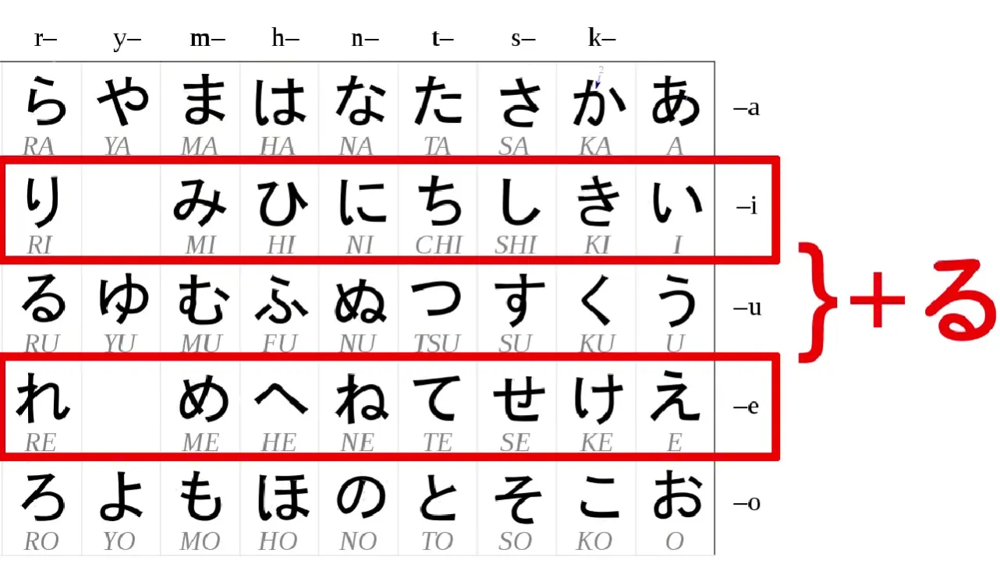
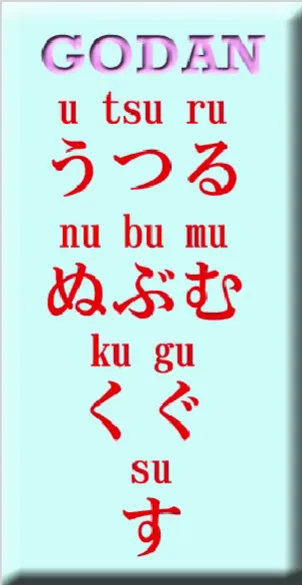
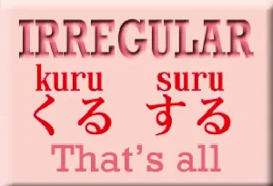
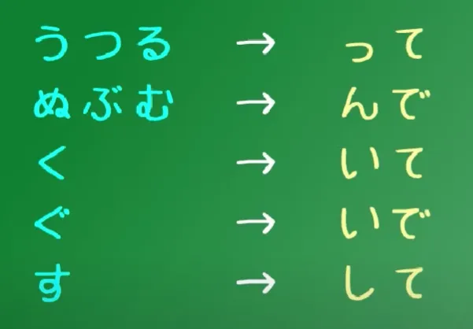
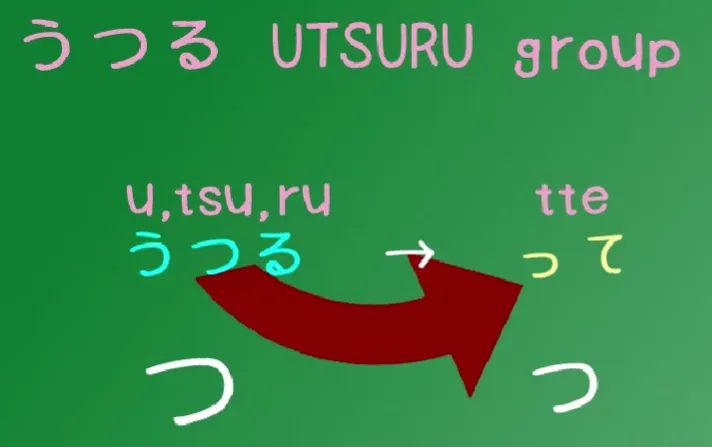
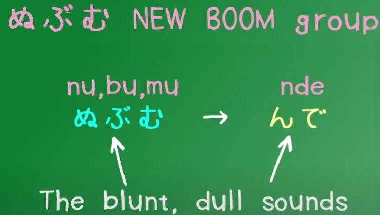
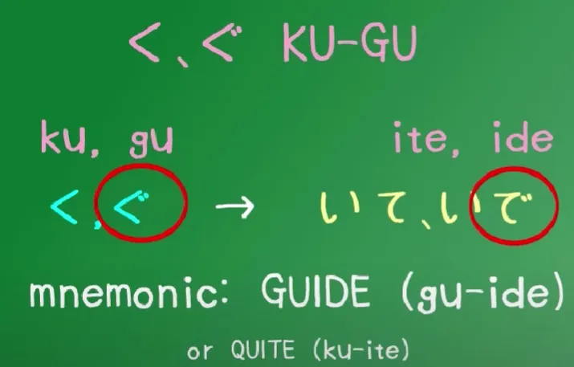
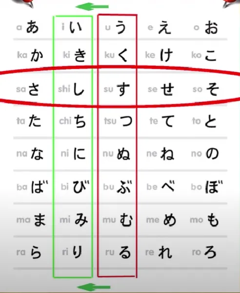
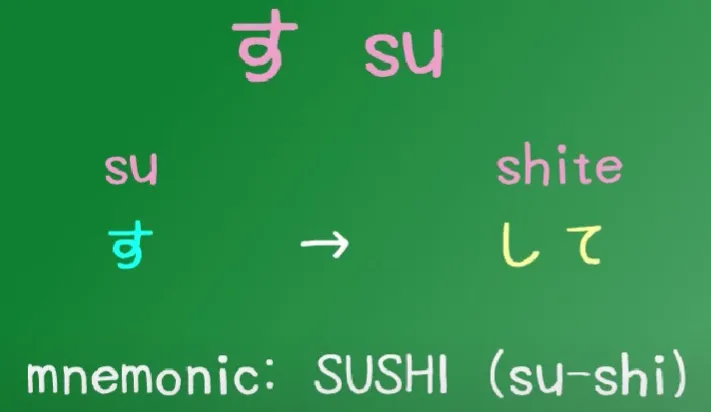
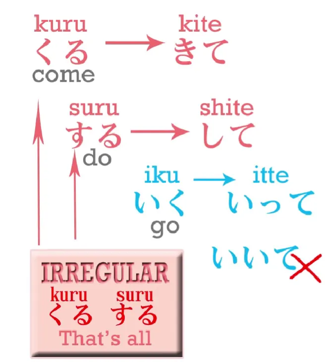

# **5. Verb Groups and the て-form**

[**Lesson 5: Japanese verb groups and the te-form. Verb groups 1, 2, 3 made easy. Organic Japanese**](https://www.youtube.com/watch?v=GzEVLMDC8nw&list=PLg9uYxuZf8x_A-vcqqyOFZu06WlhnypWj&index=5)

こんにちは。

Today we're going to talk about Japanese verb groups. Japanese verbs fall into three groups, and these don't matter except when we're going to make some change in the form of the verb. But because we do that pretty often, it's important to understand the three groups.

## Ichidan verbs

The first group of Japanese verbs is called ichidan verbs or <code>one-level</code> verbs. Some people call them <code>る-verbs</code>, which is a very silly name. If you're going to call them anything like that, we should probably call them <code>いる/える verbs</code>. They are the simplest and most basic kind of verb.

When we want to make any change, we always do it the same way. **All we do is take the -る off the end and put on whatever we want to put on.** Ichidan verbs can only end with either -いる or -える, that's to say, with one of the kana from the い-row or one of the kana from the え-row plus -る.

## Godan verbs

The second group of verbs is by far the largest and **any ending that a verb can have, verbs in this group can have.**

Verbs always end with the う-sound, but not all う-kana can make the end of a verb, but a lot of them can and all of them can make godan verbs. They are called godan verbs, or <code>five-level</code> verbs, for reasons that we'll see shortly, and as I say **they can end in any う-sound, including -いる or -える.** Unlike ichidan verbs, **they can also end in -おる, -ある or -うる.**

So the only time we have any ambiguity is when we have a verb ending in -いる or -える. Most of those verbs are ichidan verbs, but there is a substantial minority of いる/える-ending godan verbs. It's not as difficult to differentiate them as you might think, and I've made [**a video**](https://www.youtube.com/watch?v=VDmaSJ4s6Qo) on that, although it's a little bit more advanced than this lesson.

## Irregular verbs

The third group of verbs is irregular verbs, and the good news here is that there are only two of them.

You know those pages and pages of irregular verbs in your Spanish or French textbook? Well, Japanese has just two. There are a couple of other verbs that are irregular in just one small respect, but very few. **The irregular verbs are くる (come) and する (do).**

## The -て Form

So now that we know the three groups, we're going to take a look at how you make them into the -て and -た form. As I explained last week *(Lesson 4)*, we need those two forms for making the Japanese present and past tenses. And they have a number of other uses too, which we'll learn as we go along with this course.

And as I demonstrated last week, ichidan verbs are always very easy. **You never do anything except take off the -る and put on whatever you're going to put on, in this case a て or a た.**

As for the godan verbs, they fall into five groups, as you would expect (五段/ごだん, five-level verbs), and I made a video about this a while ago. So what I'm going to do is run that video right now, because it explains things pretty clearly.

All right, roll the video.

Godan verbs have five kinds of possible ending – that's why they're called godan verbs: five-level verbs.

And although that seems a little bit difficult, it really isn't. We can combine two of the levels anyway, because they are so close that we only need to learn them once. And I'm going to go through the main groups.

### The First Godan Group

The first group is what I call the UTSURU/うつる verbs. Those are the verbs ending in -う, -つ and -る. The word うつる in Japanese – if you don't know it, now is a good time to learn it – うつる means to move from one thing to another, and that's exactly what we're doing here – moving our verbs from one type to another.

So the verbs which end in -う, -つ and -る all transform in the same way to the て-form. **We take off the -う, the -つ or the -る, and we replace it with a small -っplus て (or た in the た-form).**

So わらう - laugh, becomes わらって (Waratte);  
もつ - hold, becomes もって (Motte);  
and とる - take, becomes とって (Totte).

Now, you'll notice that うつる has つ in the middle.

And the て-form of the うつる verbs is formed by using a small っ plus that て. **It's the only group that has つ in it, and it's the only group that has a つ in the て-form ending.**  

So it's really easy to remember.

::: tip
You can type the small っ by typing t before a T-kana った (tta), or by X key + tsu. This also applies to <code>あ, い, う, え, お</code> kana - ぁ (X + a), ぃ (X + i)... Note also づ (typed - Du) and ぢ (Di) - irregular ず and じ kana forms. In case you ever need to type them, can happen. And ん is <code>nn</code>.
:::

### The Second Godan Group

The second group is what I call the NEW BOOM group. In Japanese when something is really taking off, when it's becoming popular, we call it a ブーム (BUUMU). That's an English word, isn't it? Buumu, a New Buumu!

So, this group I call the New Boom group because there isn't a Japanese word that you can make out of ぬ, ぶ and む that I know of, and what I want you to notice about this group of verbs is that **they all end in what I would call a dull sound – ぬ, ぶ, む.**

It's not a sharp sound like す, つ, く, and it's not a neutral sound like る or う. It's a dull sound – ぬ, ぶ, む (Nu, Bu, Mu). And this is important because the ending is also a dull sound. **The て-form ending is -んで, the た-form is -んだ.**

So しぬ, **the only -ぬ ending verb**, becomes しんで / しんだ;  
のむ - drink, becomes のんで / のんだ; あそぶ - play, becomes あそんで / あそんだ.

So that's the New Boom group, the dull-ending verbs. And because only a limited number of the possible kana can be used as a verb ending, they include all the dull sounds **except for ぐ (Gu).** We'll come to that right now.

### The Third & Fourth Godan Group

I told you that two of the groups could be combined - and that is the く and ぐ group. **To make the て form of a -く ending verb, we cut off the -く and add -いて, or -いた in the た form.**

So あるく - walk, becomes あるいて / あるいた.

Now, if we have a〃(ten-ten) on that -く, to make it into a -ぐ, it's exactly the same, except that there is also a ten-ten on the て-ending.

So あるく becomes あるいて, but およぐ - to swim, becomes およいで.

But, as you see, the two are more or less identical. It's just that if there's a ten-ten on the original verb, there's a ten-ten on the て-form too. あるく, あるいて; およぐ, およいで.

### The Fifth Godan Group

And now we just have one left, and that is す. **And verbs ending in -す drop the -す and add -して.** As you will notice, if you have followed our last lesson *(Not sure which, but will be discussed),* we are just doing that regular thing of shifting the す kana to its い-row equivalent, し.

So はなす - talk, becomes はなして; the ます helper verb, which turns verbs into formal *(polite)* verbs, in the past tense becomes ました.

::: info
Whenever Dolly uses the term <code>formal</code> for です or ます, it should be POLITE instead, there is a difference between the two terms in Japanese, not sure why she did not bring this one up, but it is quite important to distinguish, if you look into their definitions, dictionaries mark them as polite. **They are part of the 丁寧語 (polite language). So it is more accurate to call them polite instead.**
:::

So now we have all the godan verbs. Didn't I look young in that old video?

### The Exceptions 

Now, we are just going to look at the exceptions. **There are only three altogether: our two irregular verbs and one other small one.**

And these are very simple. くる (come) becomes きて; する (do) becomes して.

And いく – the verb いく (to go) – because it ends in -く, you would expect it to become いいて, but it doesn't, it becomes **いって**.

And those are the only exceptions. So if you go over the video / *this lesson* a couple of times, I think you'll find it pretty easy to know exactly how to make the -て and -た forms in all cases.