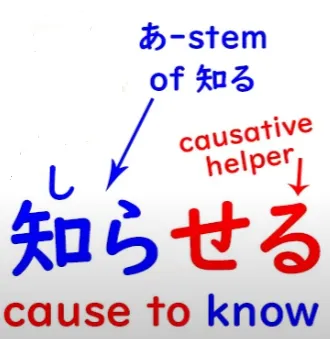
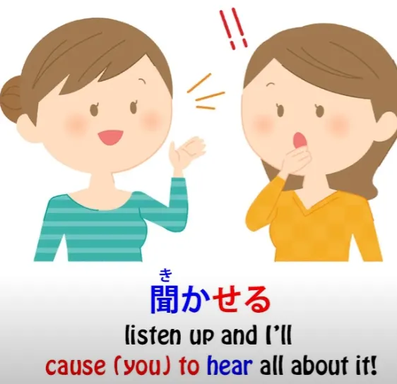
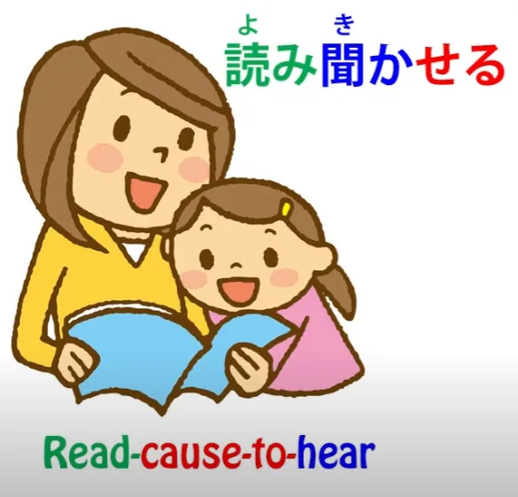
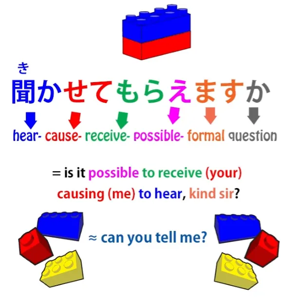
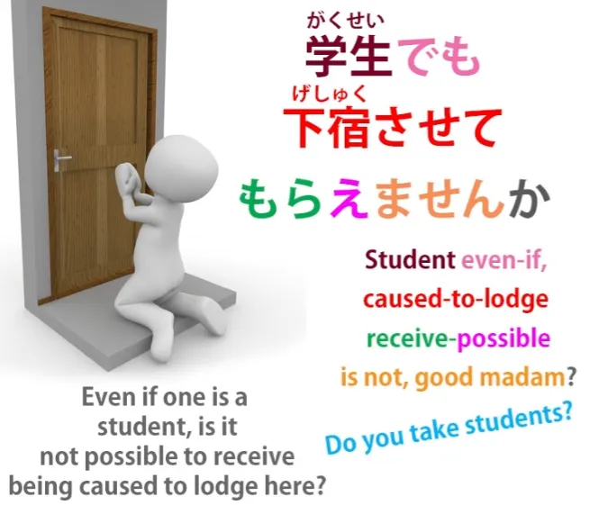
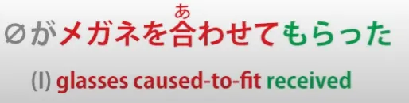

# **50. 2 Aspects of Japanese that Foreigners Can't Fathom: させてもらう Last Secret of the Potential**

[**2 Aspects of Japanese that Foreigners Can't Fathom: させてもらう Last Secret of the Potential | Lesson 50**](https://www.youtube.com/watch?v=r2j1o9wj2oA&list=PLg9uYxuZf8x_A-vcqqyOFZu06WlhnypWj&index=52&pp=iAQB)

こんにちは。

Today we're going to talk about a whole range of expressions in Japanese that cause a lot of difficulty and confusion to foreign learners. Last week we talked about the use of <code>もらう</code> with the て-form, so <code>〇〇てもらう</code>, which also causes a lot of confusion and seems very unintuitive to the foreign speaker of Japanese though once we understand how it's really structured, it's actually highly intuitive. So, building on that, we then find a lot of expressions which combine the て-form + <code>もらう</code> with the causative helper verb <code>-せる/-させる</code>, so we get <code>させてもらう</code>.

And this is really a bridge too far for a lot of foreign learners because it seems very convoluted. But once we've understood how <code>もらう</code> works with the て-form, it's really all quite logical except for the fact that we also have to assimilate an important fact about the causative helper <code>-せる/-させる</code>. Now, I've done a whole lesson on this *(Lesson 19)* and we've talked about most of the aspects of it which cause trouble to foreigners. However, there's one part that I didn't go into because it wasn't really relevant at that time, so we're going to look at that now.

As I said at the time, the causative helper verb is, for a change, very well named in English-language Japanese grammar because that's exactly what it is -- it's the causative form. So when we attach it to another verb what we're saying is <code>cause someone to do that verb</code>. Now, one thing that confuses English speakers is that it can mean either <code>allow someone to do it</code> or <code>make or compel someone to do it</code>, and the causative verb in itself doesn't draw the distinction between those two.

That confuses English speakers because English does draw the distinction. We say <code>make someone do something</code> or <code>let someone do something</code>; we don't say <code>cause someone to do something</code>. The thing we now have to understand is that the Japanese causative can mean <code>make</code>, it can mean <code>allow</code>, but it doesn't have to mean either.

It means exactly what it says on the packet. It means <code>*cause -- by any means*</code>, doesn't specify what means we're using to cause someone to do something. And this confuses English speakers because they don't have a way of saying this.

You can't really say <code>cause someone to do something</code>, at least not in modern English. And actually English sometimes feels the loss of this and has to make up for it by cheating with what it has. So, an example of that is when we say <code>Would you let me know tomorrow?</code> or <code>I'll let you know tomorrow</code>.

We don't actually mean <code>let you know</code> or <code>let me know</code>. We mean <code>cause me to know</code>. We don't mean <code>allow me to know</code>; we don't mean <code>force me to know</code>. We mean <code>cause me to know</code>.

But because we don't have this <code>cause someone to do something</code> expression in modern English, we actually have to cheat and say <code>let me know</code>, which isn't what we really mean. In Japanese, of course, we use the causative for this.

So, <code>知る</code> is <code>know</code> and <code>知らせる</code> is <code>cause someone to know</code>.

So this is essentially doing what English <code>let me know</code> is doing, without having to bend the grammar to do it the way English does. And this causative can be used in many other ways that don't mean either <code>make</code> or <code>allow</code>. So <code>聞く</code>, for example, is <code>hear</code>; so <code>聞かせる</code> means <code>cause to hear</code>.

And we might say <code>後で聞かせよう</code>, which means "I'll tell you tomorrow *(later on)* / tomorrow I'll cause you to hear / tomorrow I'll give you all the information".

And we can lego this together with other words, so we can have something like <code>読み聞かせる</code>, which means <code>read and cause to hear</code>/*read-cause-to-hear*.

And this is what we say if we're reading someone a story, reading a letter to someone, or something like that: <code>読み聞かせる</code> And once we understand this way in which the causative helper works, we can see how it gets て-formed to have <code>もらう</code> attached to it. For example, we might say <code>聞かせてもらえますか</code>, which means <code>Can you tell me?</code>

<code>聞かせて</code> -- <code>cause me to hear</code>; <code>もらえる</code>, which is the potential form of <code>もらう</code>, in other words <code>possible to receive</code>.

<code>Is it possible to receive you causing me to hear?</code> which in English, we'd probably say <code>Can you tell me?</code> So, this <code>聞かせてもらえますか</code> might seem very confusing to a foreign speaker because it isn't how we put it in English, but, as you can see, structurally it's very straightforward. It's built out of elements that we already know and understand and it makes perfect sense.

We could take the sentence <code>学生でも下宿させてもらえませんか</code>. And this would tend to get translated as meaning <code>Do you take in students?</code> But literally what it's saying is <code>Even if one is a student ...</code> -- <code>学生でも</code> -- <code>...is it not possible to receive being caused to lodge here?</code>

That's the structure of this, so when you see this <code>学生でも下宿させてもらえませんか</code> and you get told that it means <code>Do you take in students?</code>, you can look at it backwards, forwards and upside down and wonder how those words come to mean that. And of course they don't really come to mean that at all.

That's just what we would say in English. In Japanese we're saying <code>Even if one is a student, is it not possible to receive being caused to lodge here?</code> And it doesn't necessarily have to be oneself that's being caused to do something in these sentences.

For example, if we say <code> *(zeroが)* メガネを合わせてもらった</code>, this gets translated as <code>I was fitted for glasses</code>, but what it literally means is <code>to receive the glasses being caused to fit</code>.

So it's the glasses that are being caused. They're the ones that are being <code>させる</code>-ed, but I am the one receiving their being caused to fit. So it doesn't have to be me personally receiving being caused.

I could be receiving something else being caused as well. So, we have to look at the sentence and see what it means and, of course, apply the rules we talked about in the lesson about busting ambiguity **(Lesson 48)** -- we look at what's most probable, knowing that if something improbable is being said the speaker will have to make that clear, just as they do in English.

Now, sometimes of course it can actually mean <code>allow</code>, so for example if we say <code>帰らせてもらいます</code>, what we're really literally saying is <code>I will receive your allowing me to go home</code>. That's the literal meaning.

It's rather like saying in English <code>With your permission, I'll leave now</code>, which could very well mean <code>I'll leave now, with or without your permission</code>, but it puts a veneer of politeness over the matter. And whether it's genuinely polite or whether it's just informing someone that you're going with a thin veneer of politeness, this is something you'll obviously grasp from context and tone of voice etc., just as you would in English.

There's a considerable difference between saying "With your permission I'll go home now**** \[softly\] and saying "With your permission I'll go home now**** \[harshly\] -- and that's just the same in Japanese as in English. So, as you see, there are many ways in which these elements can be combined, but if we understand each of them and we understand how they fit together, we have the tools necessary to assimilate from immersion how these things are used.

Remember, *structure doesn't teach us how to understand Japanese.* **It gives us the basic tools we need in order to pick it up from the only place you can** **really learn how a language works** -- and that is **direct immersion**.

---

And I'll just add before we go... I'm not teaching 敬語/けいご at this point. 敬語 is hyper-polite Japanese, which is almost a little sub-language of its own. It's not that difficult, but it will take a few lessons to go into it.

But I want to mention here that there is a 敬語 word for <code>もらう</code>. And that is <code>頂く/いただく</code>. Because it's hyper-polite, it's usually used in ます-form, so it's usually <code>いただきます</code>. And undoubtedly you'll be familiar with that as being the thing people say before they eat: <code>いただきます!</code>

But what it literally means is something like <code>I humbly receive</code>. It obviously means <code>I receive</code>, because <code>いただく</code> means <code>もらう</code>, but it is a form of 敬語 called <code>謙譲語/けんじょうご</code>or <code>humble language</code>, so you're saying <code>I humbly receive</code>. And I'm mentioning this at this point because you will probably see some of these <code>させてもらう</code>-type forms used with <code>いただく</code>: <code>させていただきます</code> etc.

And this piece of 敬語 can get used a little more often than regular 敬語 because it adds politeness to the concept of <code>もらう</code>.

So sometimes if there seems to be a danger of being a bit demanding or grabby by saying what you're going to receive or what you want to receive, you might use <code>いただく</code> to take the edge off that and show that you're actually being humble and polite. So if you see <code>いただく / いただきます</code> used in any of these places, it means exactly the same thing as <code>もらう</code>. It's just putting a more polite edge on it. So you needn't be confused by that when you see it.
