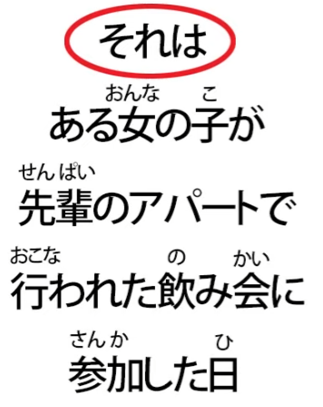
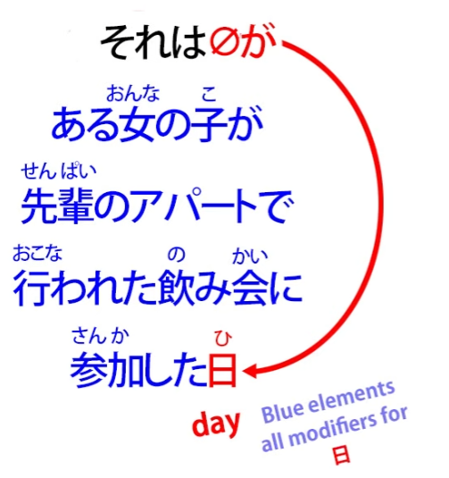
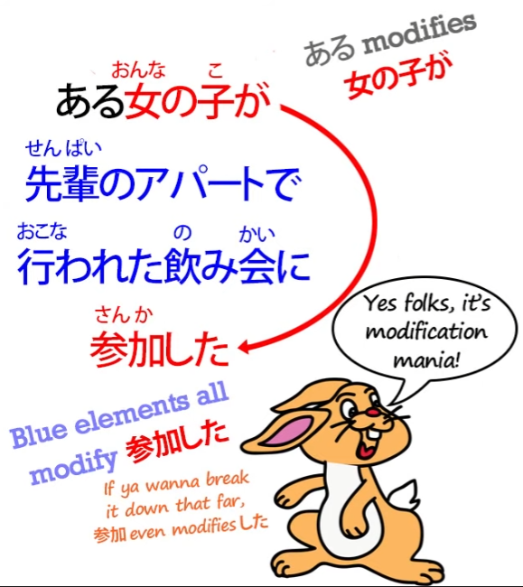
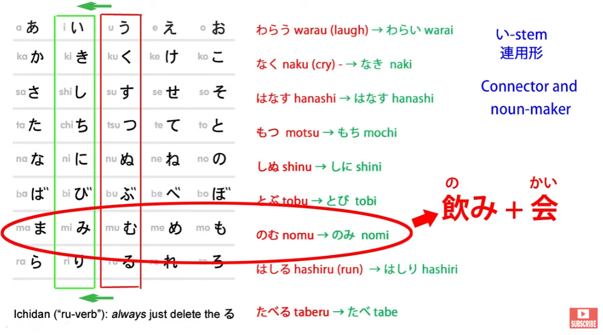
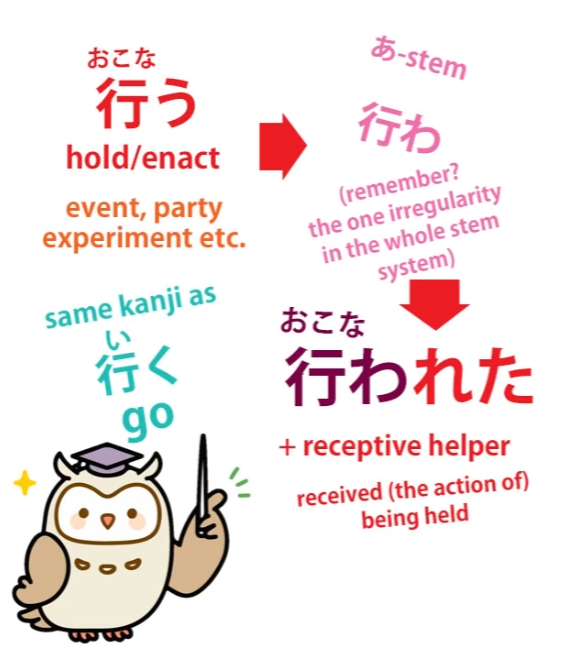
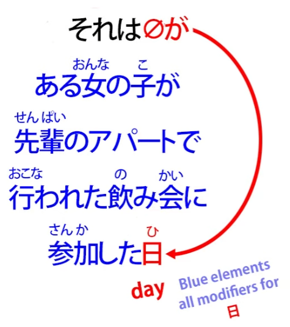

# **51. How to read a Japanese 怪談 / かいだん (ghost story)**

[**Hands-on Japanese: How to read a Japanese Kaidan (ghost story) | Lesson 51**](https://www.youtube.com/watch?v=uO1rHcwjADA&list=PLg9uYxuZf8x_A-vcqqyOFZu06WlhnypWj&index=53&pp=iAQB)

こんにちは。

Today we're going to flex our muscles by tackling some real live Japanese.

And I'm happy to announce that we're partnering here with another YouTube channel called \*Akasic Tails\*.

And they specialize in narrative, and I really like their work, so I'm very happy

that we're able to work together with this Japanese channel to bring you some real Japanese material that we can break down and apply the principles that we've learned up to now to real situations.

So what we're going to listen to today is a <code>怪談</code> -- a scary story --

and it'll take us a couple of lessons to get through it because I want to break down every sentence and look at the various problems as we come to them to put you in a position to be able to do this sort of thing for yourself when you're really listening to real Japanese material.

Right. So let's start by hearing the portion of the story that we're going to listen to today,

and then we'll tackle it bit by bit.

All right. So, the first word here is <code>それは</code>, and it's rather like saying in English <code>It was</code>.

And we often begin a story, especially a ghost story, with this kind of expression, don't we?

<code>It was a dark and stormy night...</code>

So, you might start by asking, "Why is this **それは**,

which means 'that is' or 'that was' rather than 'it was'?"

Well, it's a very simple reason.

There is no visible word for <code>it</code> in Japanese.

The function of what is <code>it</code> in English is always in Japanese performed by the zero pronoun.

And it's very important to understand this because it's one of the fundamental keys to understanding Japanese.

We do have pronouns in Japanese for <code>me</code> and <code>you</code> and <code>they</code> and <code>she</code> and <code>he</code>,

and the zero pronoun is used in the places these would be used in English more often than not, but there is no word at all in Japanese for the simple neutral pronoun <code>it</code>.

So, in the cases like this where we actually want to make a topic of what would be <code>it</code> in English, we use the slightly more definite pronoun <code>that</code>.

So we say <code>that was</code>. Here we're saying <code>it was</code>.

Now, we don't know at this stage that it's <code>it was</code>, and in fact we never learn that directly.

Now, if you want to make sense of this sentence, we can run through it piece by piece

and if we're listening to it without having the words in front of us, we have to do that.

And it's not that difficult to do. But I'm going to use a shortcut here because when you have the text in front of you you can do that.

I don't think we should work backward the way Rubin-先生 suggests,

even though I'm a great fan of Rubin-先生 in some ways.

But what we can do is take a glimpse at the end because it's going to tell us where

this whole rather complicated-looking sentence is actually going.

So, the end of the sentence -- and we know that the engine of a sentence always comes at the end and then it may be followed by a couple of sentence-ender particles,

but the engine comes at the end apart from that.

And what comes at the end of this sentence is <code>日</code> -- <code>day</code>.

Now, when we see a noun ending a sentence like this, we know that this is going to be an  
<code>A is B</code> sentence and that the copula <code>だ</code> or <code>です</code>, which belongs there to turn it into a sentence, has been dropped.

Now, this happens relatively often in casual speech.

And this is casual speech -- <code>casual speech</code> is a bit of a catch-all term, but

this is the kind of language we'll be using perhaps in a sleepover or something

where we're telling <code>怪談</code>, where we're telling creepy tales to each other.

And so we're using that level of language where sometimes the copula will get dropped.

And we'll see a few other things being dropped in the course of this story.

So, we have the structure of the sentence here.

<code>それは</code> sets the topic, and that's also going to be the subject, so it's <code>それはzeroが</code>.

And then <code>日</code>, that's all. <code>It was... day.</code>

And we don't even know that it <code>was</code>, because we need the copula on the end to give us the tense.

So if the copula was <code>だ</code>, it would end <code>だった</code>; if it were <code>です</code>, it would end <code>でした</code>.

As it is, we have no tense marker.

But because we know this is setting the scene for a story, we can tell from that fact that

this is an <code>It was</code>-type statement, a scene-setting statement.

So what about the rest of this sentence?

<code>ある女の子が先輩のアパートで行われた飲み会に参加した</code>

Now, as you see, between the <code>それは</code> and the <code>日</code> comes a complete logical sentence in itself.

And we can see that each clause in this logical sentence, just as we've seen in our videos

on word order *(Lesson 46)* and sentence structure, works by successively modifying each element.

So, <code>ある女の子が先輩のアパートで行われた飲み会に参加した</code>

\*\*\* It's modification mania! \*\*\*

So this sentence, again, we can break down into its A-car, which is obviously <code>女の子が</code>,

and its engine, which is <code>した</code> -- <code>did</code>.

And then <code>参加した</code> -- <code>'参加 did**** -- </code>took part".

And then all the rest of this sentence is successively modifying elements which modify <code>参加した</code>: <code>先輩のアパートで行われた飲み会</code>.

So, <code>飲み会</code> is <code>a drinking party / a drinking meeting</code>.

<code>飲み</code> is the い-stem, the noun form of <code>飲む</code> - to drink -

which is put together with <code>会</code> - a meeting or party - to give us <code>drinking party</code>.

And then everything before that modifies <code>drinking party</code>.

<code>先輩のアパートで行われた飲み会</code> -- <code>a drinking party held in senpai's apartment</code>.

So we have <code>ある女の子が</code> -- <code>a certain girl</code> --

<code>先輩のアパートで行われた飲み会に</code> – and this gives us the place where she went to take part. It was a drinking party held in senpai's apartment.

So we have that whole logical clause:

<code>a certain girl -- took part in -- a drinking party -- held at -- senpai's apartment</code>

and all of that is a modifier for <code>day</code>.

So, <code>それは...</code> -- <code>It was a day when a certain girl attended a drinking party held in senpai's apartment.</code>

So you see this isn't constructed the way we generally expect English to be constructed,

but that's fine because we have some experience now about how Japanese is constructed.

And I think you'll agree this all makes good sense.

So that is setting the scene. It's telling us the day when this happened and it's filling in details about that day which are going to be relevant as we move into the story.

Well, that took rather longer than I expected for a single sentence,

but I think it's worth going into it in detail, don't you?

So I'm afraid we'll have to leave this on a bit of a shorter cliffhanger than I had originally anticipated, but the next few sentences I think will contain less questions,

so we should be able to proceed through the text a little bit more quickly next time.
