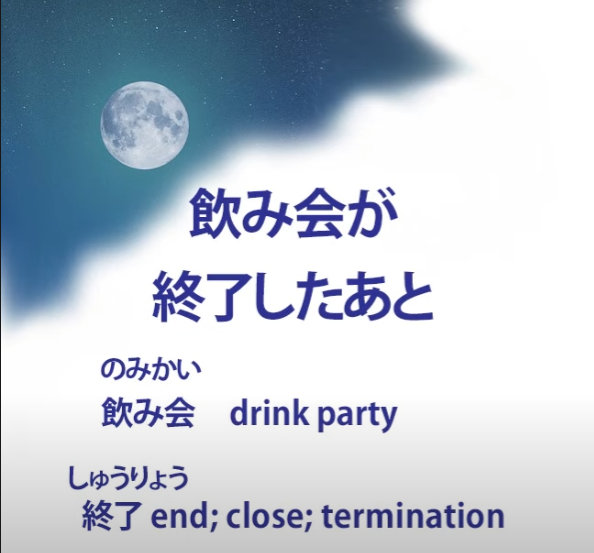
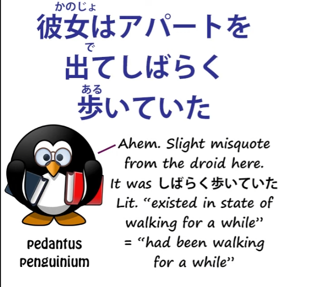
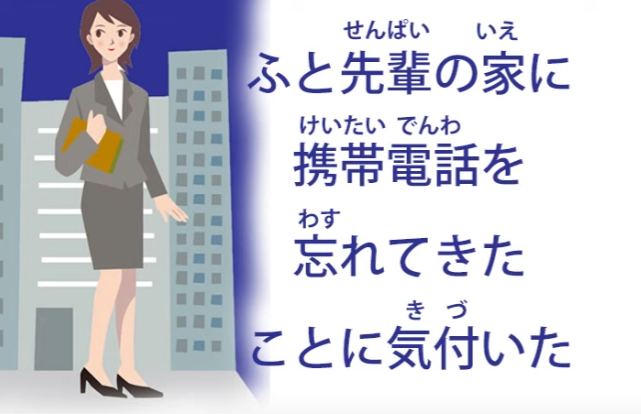
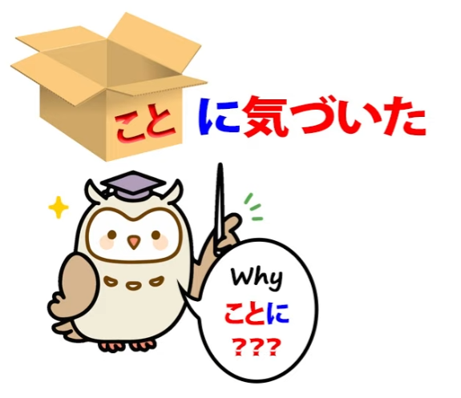
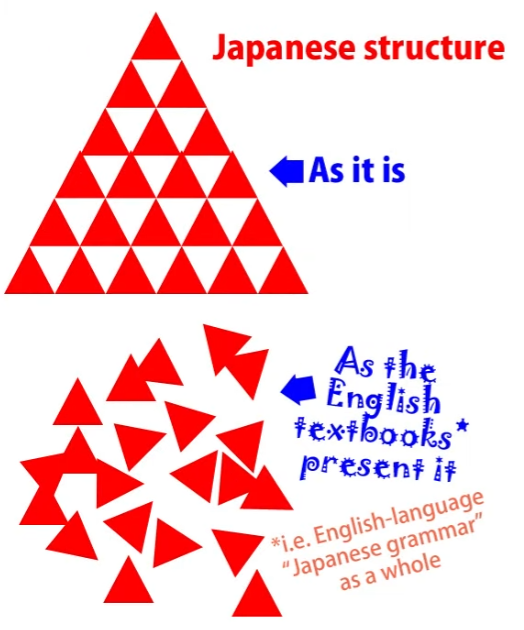
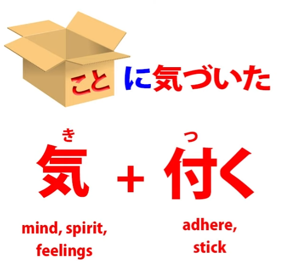
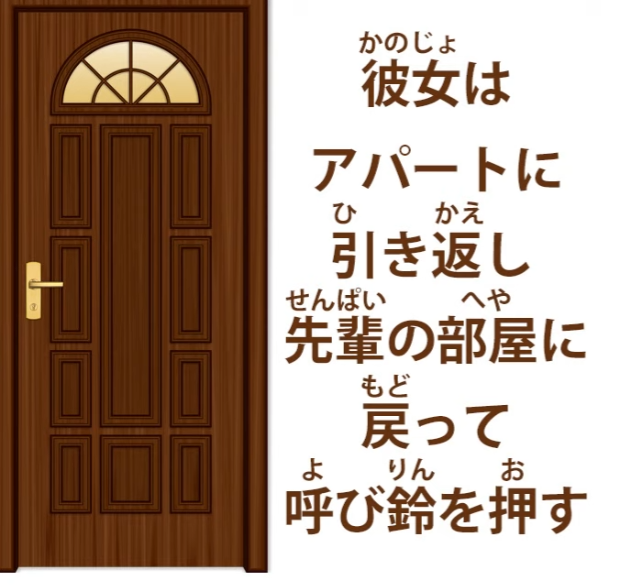
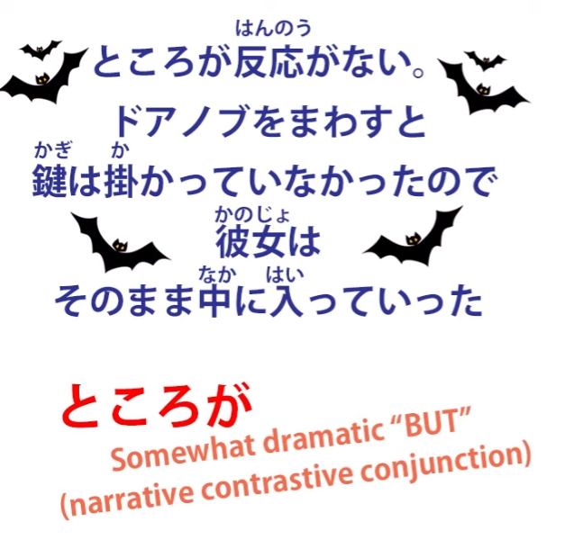
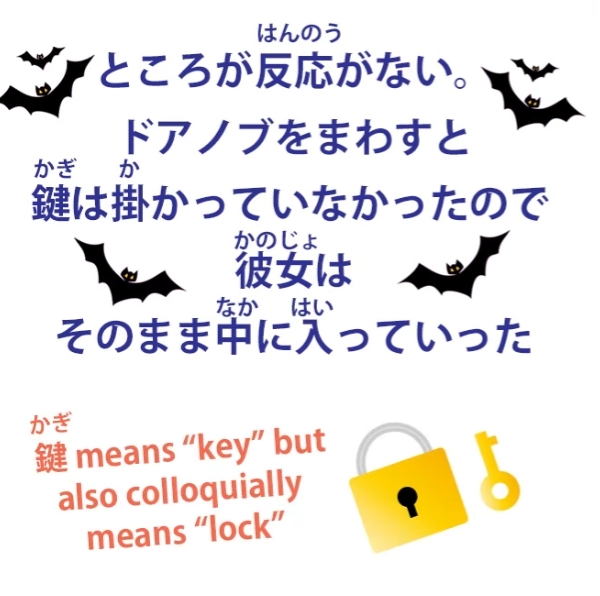
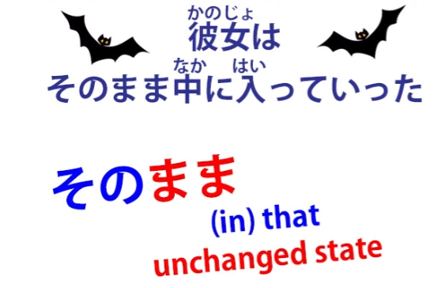

# **52. In-depth Japanese Sentence Analysis in Real Native Context**

[**In-DEPTH Japanese Sentence Analysis in Real Native Context | Lesson 52**](https://www.youtube.com/watch?v=I38yhYh4Lfg&list=PLg9uYxuZf8x_A-vcqqyOFZu06WlhnypWj&index=54&pp=iAQB)

こんにちは。

Today we're going to get our hands dirty by digging into some real-life Japanese

by courtesy of our Japanese partner channel, Akasic Tails.

And we're going to look at some of the real Japanese structures

that we'll encounter in real life and we'll learn how to analyze them,

and once we've got that clear in our heads we'll be able to understand them on the fly.

Last week we looked at a Japanese <code>怪談</code> – a scary story – and there was so much

important material to analyze in the first sentence that we didn't get beyond the first sentence.

So, this week I think we can progress a little further and a little faster into the story.

So, I'm going to play you the portion I want to analyze today and then we'll start analyzing.

Of course, we'll start from the second sentence because we've analyzed the first one rather thoroughly already.

So, the next part is <code>飲み会が終了した後</code> and this is a time statement.

It's setting the time of the action we're now going to describe.

Now, strictly speaking, we should say <code>後に</code> rather than simply <code>後</code>,

but again we can drop that because we're talking relatively informally.

So having set the time, we then say what happened:

<code>彼女はアパートを出てしばらく歩いていた</code>.

So, she left the apartment and walked for a while.

So then we have <code>ふと先輩の家に携帯電話を忘れてきたことに気づいた</code>.

<code>ふと</code> -- suddenly -- <code>先輩の家に</code> -- in senpai's house -- <code>携帯電話</code> -- portable telephone --

<code>を忘れてきたことに気づいた</code> -- 忘れてきた is 忘れる, forget, joined to <code>来る</code>.

<code>忘れてくる</code> is literally <code>forgetting-coming</code> -- or what it means is really <code>leaving behind</code>:

<code>忘れてきた</code>, coming while having forgotten her portable telephone in senpai's apartment.

<code>ことに気づいた</code> -- she realized that that's what she'd done.

<code>こと</code> makes a noun, or bundles everything before it into that noun.

So forgetting her phone in senpai's apartment was the <code>こと</code> that she now realized.

So why is it <code>ことに気づく</code> and not <code>ことを気づく</code>?

The English-language Japanese dictionaries and textbooks will tell you

that <code>気づく</code> is a verb that means the same as English <code>realize</code>.

And in practice it means much the same, but structurally it's different.

It's made up of an amalgam of two words that we already know well.

One is <code>気</code> which means <code>spirit</code> or <code>mind</code> or <code>feelings</code>

and the other is <code>付く</code> which means <code>stick</code> or <code>adhere</code>.

So what this literally means is <code>spirit stick</code> and what we're doing is sticking our spirit to something, that is, our attention, our mind, our feelings become adhered to a particular thing.

And in English we express that differently by saying that we <code>realize</code> -- make real -- a fact.

In Japanese, our spirit adheres to a fact.

In Japanese, a very common expression is <code>気を付けてください</code>,

which is translated as <code>take care</code>, but what it literally means is <code>stick your spirit</code>.

Stick it to what? Well, stick it to your surroundings, stick it to what you're doing.

In other words, pay attention. Now, the translation <code>take care</code> is actually better culturally than <code>pay attention</code>, because <code>pay attention</code> sounds like an order, doesn't it?

And that's not the atmosphere of saying <code>気を付けて</code>.

::: info
Dolly-先生 says <code>気をつくて</code>, but I think she meant to say 気を付けて instead as the first one does not really seem to make sense, and I failed to find anything about it, especially pointing to said <code>take care</code> or the like...my theory is that she misspoke, but nobody noticed.
:::
In practice, culturally it means something more like <code>take care</code>,

so the translation isn't wrong but the structure isn't the same.

So now we get an idea why we say <code>ことに気づく</code> rather than <code>ことを気づく</code>.

If we stick a poster to a wall, the wall, the thing it's stuck to, is not the direct object, is it?

The direct object is the poster; the wall is the ultimate target of that action.

And ultimate targets, in Japanese, are always marked by に.

As we know, the indirect object, the ultimate target, is marked by に.

Now, even if we take the human actor out of this and just say <code>The poster sticks to the wall</code>, we're still saying <code>to the wall</code>, aren't we?

We're not saying <code>The poster sticks the wall</code>, which is what we would say if the wall were the direct object.

We're saying <code>The poster sticks to the wall</code>. The wall is the target of the poster's sticking.

So by the same token, if we stick our spirit to something or if our spirit sticks to something, the something to which it sticks is the target, not the direct object of that sticking.

Now, this is important to know, because it's another small example of the way that

<code>えいほんご</code> -- so-called English-language Japanese grammar,

the stuff you find in the textbooks and the websites everywhere –

it's another way in which it simply messes up our understanding

of the logic and structure of a very, very logical language.

Because what they'll tell you is <code>気づく</code> is a verb that means **realize**, but it takes に".

Now, leaving aside the fact that no verb can take に or any other logical particle

(only a noun can ever take a logical particle), we know what they mean.

They mean that this word, that means <code>realize</code>,

which in English treats the thing realized as the direct object,

actually treats the thing realized as a target and therefore marks it with に

and "this is one of those weird quirks of Japanese that you have to learn in every individual case

because it's so random and irrational". It's not random and irrational at all.

While <code>気づく</code> is broadly equivalent to <code>realize</code> in English, it's not the same structure.

We're not real-izing, making something real, we are sticking our spirit to something

and that something is a target and therefore it's marked by に,

just as targets are always marked by に.  
::: info
obviously that something に-marked is a noun, like こと. Not the verb 気づく that <code>takes に</code>, like some textbooks say. Just in case mentioning this again, as it can be a tad bit confusing.
:::
Japanese doesn't go in for random irrationalities.

You need to go to European languages if you want that.

And if I can just pop in a little footnote here.

This talk of verbs taking particles is hugely, hugely misleading.

It's not just a quibble to say that logical particles can only ever belong to nouns, never to verbs.

I said I knew what they were talking about when they spoke of verbs taking particles,

but what they're talking about is horribly wrong on every occasion.

It's based on the fallacy that logical particles can perform different functions in relation to different verbs.

And they never, ever can.

The only reason for ever thinking so is, as in this case, misunderstanding what the verb is actually doing, usually because they assume that it works exactly like its nearest English equivalent, which is very often not the case.

And as we've seen in the case of the potential helper verb and adjectives of subjectivity,

this fallacy covers a huge area of Japanese and makes a very large contribution

to the inability of many students to understand Japanese.

Because it seems so illogical and random when in fact it's completely logical.

That's why we call them <code>logical particles</code>.

They never change their function regardless of what adjective or verb is involved in the sentence.

They always, always do the same thing.

And if you're at all confused about what I'm saying here, please see the ninth lesson in this course. And I'll put a card up for that right now.

<code>彼女はアパートで引き返し先輩の部屋に戻って呼び鈴を押す</code>

So she returned to senpai's apartment. <code>引き返し</code>, that means <code>return</code>,

and as we've seen before, the い-stem of a verb -- the verb is <code>引き返す</code>, which is <code>return</code> --

and particularly in narrative we can use the い-stem of a verb in much the same way

as we use the て-form of a verb to make it the first clause of a compound sentence.

So, she returned to senpai's apartment --

<code>先輩の部屋に戻って呼び鈴を押す</code>. She returned to senpai's room and pushed the bell.

<code>呼び鈴</code>: <code>呼ぶ</code> is <code>call</code>, <code>鈴/りん</code> is the on-reading of <code>鈴/すず</code>, <code>a small bell</code>,

so <code>呼び鈴</code> is a <code>call-bell / a bell for calling</code>.

<code>押す</code>: she presses the bell. And as we've seen before,

in Japanese narrative it is allowable to use present-tense sentences

within a past-tense narrative to add immediacy.

And the sense here is that we've come to a point here, to a point almost like a landing on the stairs where we rest for a moment and make this our present.

She pressed the bell.

<code>ところが反応がない</code>

<code>ところが</code> is an expression that we'll often find in narrative, again.

<code>が</code>: This <code>が</code> is obviously not the particle が.

It's the other <code>が</code>, which is a contrastive conjunction and essentially means <code>but</code>.

Why do we add <code>ところ</code> to it?

Well, as we discussed in a previous lesson, <code>ところ</code>,

which means <code>place</code>, can also mean a place in time.

It's almost like a resting place in time. It gives us a temporary <code>now</code>, as it were.

So when we say <code>ところが</code>, we're saying <code>at that point / at that time, but</code>.

So we're using this as a narrative conjunction to mark the fact that

something is happening that's contrary to our expectations or wishes.

So, <code>ところが反応がない</code>. So although she pressed the bell,

there was, unexpectedly or contrary to our hopes, our wishes, there was no answer.

And when she turned the doorknob... <code>回す</code>

As we know, <code>回る</code> is to <code>go around</code>,

<code>回す</code> is the other-move version of <code>回る</code>, so it's to <code>cause to go around</code>.

When she caused the doorknob to turn, when she turned the doorknob,

<code>鍵は掛かっていなかった</code> The lock existed in a state of not being locked, of not being hooked or hung or fixed.

A slightly confusing-seeming expression because it comes from the fact that

Japanese people often lump together the concept of a key and the concept of a lock into one. Strictly speaking, this could be called incorrect.

Really we're saying <code>錠前が掛かった</code> -- the lock was fixed or hooked,

but it's common in Japanese to say the key was fixed or hooked (<code>鍵が掛かった</code>)

and it would seem even a little unnatural to say it correctly.

---

And because the door was unlocked, <code>彼女はそのまま中に入っていた</code> -- she went in.

<code>そのまま</code> we discussed in another video *(Lesson 42)* and, as we know, a <code>まま</code> is an unchanged condition.

<code>そのまま</code> means <code>in that unchanged condition / just as it is</code>.

And we can see here how that concept is being extended a little in a way that we'll find often.

So, for example, if we're talking about edamame, and we say <code>そのまま食べる</code>,

we mean "eat them just as it is, eat them without changing their condition,

eat them without doing anything further to prepare for eating them<code> and this is what </code>そのまま" means here.

Because the door was unlocked, she went in just like that, just in her present condition.

She didn't press the bell again, she didn't wait to be invited, but <code>そのまま</code>

-- in the unchanged condition of that moment -- she went in…
