# **53. Enjoy Japanese Horror in Japanese**

[**Enjoy Japanese Horror in Japanese | Lesson 53**](https://www.youtube.com/watch?v=8DHRS4B5SQA&list=PLg9uYxuZf8x_A-vcqqyOFZu06WlhnypWj&index=55&pp=iAQB)

こんにちは。

Today we're going to encounter a lot of the structural points in Japanese

that we've covered in this course of lessons in action, in real situations.

And we're going to do that by continuing with the <code>怪談</code>, the Japanese story,

that we've been reading over the last few lessons

by courtesy of our Japanese partner channel, Akasic Tails.

And we're going to be covering such a lot of points this time that I'll put up cards

for some of the main ones but I've also made a supporting [**page**](http://learnjapaneseonline.info/2019/08/10/groping-in-the-darkness-links-to-structure-points-covered/) on Kawajapa where you can

go and look up any of these points and follow them up if you need to do so.

And I think it would be a very good idea to follow up anything that

you're not absolutely clear about after we go through this story.

Now, to remind you where we got to at the end of last week's lesson,

our heroine had gone to a drinking party at her senpai's apartment.

After she left the party and was walking home at night, she became aware that

she'd left her <code>携帯電話</code>, her portable telephone, in senpai's apartment.

So she went back, pressed the bell, but there was no answer,

turned the handle of the door and found that it wasn't locked.

So she walked right in.

So, let's see what happened next.

<code>部屋の中は電気がついておらず</code>

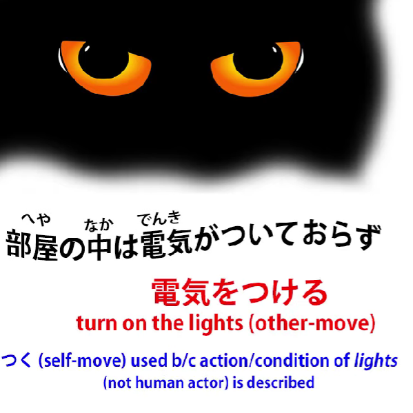

Now, so long as we understand that <code>電気をつける</code> means <code>turn on the lights</code>

(literally it means <code>turn on the electricity</code>, but it in fact refers to the lights),

the only problem with this clause is <code>おらず</code>.

What does that mean?

Well, <code>おる</code> means the same as <code>いる</code>, which is to <code>be</code>.

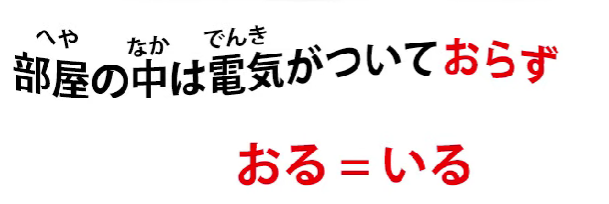

Generally we're told that it means to <code>be</code> of animate beings, like animals and people.

It's not quite as simple as that and I've explained that in another lesson, which I'll [**link**](https://www.youtube.com/watch?v=PsTsliRe2Cg&ab_channel=OrganicJapanesewithCureDolly).  
<code>おる</code> is a rather older form of <code>いる</code>, but we encounter it in a variety of circumstances.

For example, it is used in keigo as a humble form, <code>謙譲語/けんじょうご</code> form, of <code>いる</code>

which we use to humble our own actions and possessions,

but it's also used in dialect, in Kansai-ben for example,

and it's used in literary contexts to give a literary narrative feel.

And that's how it's being used here.

So, <code>おる</code> means <code>いる</code>, but what does <code>おらず</code> mean?

Well, you also have to understand that <code>-ず</code> is also a piece of older Japanese which gives

a literary feeling to a narrative and it's simply a negative helper like <code>-ない</code>.

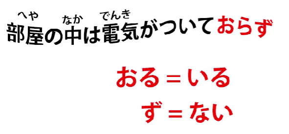

So why is it <code>おらず</code>?

Well, that's because while <code>いる</code>, as we know, is an ichidan verb,

<code>おる</code>, as it happens, is a godan verb.

So, as with all godan verbs, the negative helper is attached to the あ-stem.

So that's what's happening here.

<code>おらず</code> means the same as <code>いない</code>.

So, <code>電気がついておらず</code> means <code>the electricity existed in a state of not having been switched on</code> or, in plain English, the lights were off.

<code>真っ暗で</code>: <code>真っ暗</code> is <code>pitch-dark</code>, literally <code>true dark / complete dark</code>.

<code>暗</code>, of course, we know as <code>暗い</code>, the adjective <code>dark</code>,

and we know that when we see an adjective without its -い on the end,

if it makes a word at all, it will be a noun.

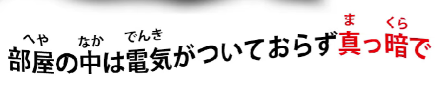

We also know that if we see a word that is all kanji, it's almost certainly going to be a noun.

So <code>真っ暗</code> is <code>pitch darkness</code>.

<code>真っ暗で</code> -- the <code>で</code> here is the て-form of <code>だ</code> or <code>です</code>.

So, <code>部屋の中は電気がついておらず真っ暗で</code> --

<code>As for the inside of the room, the lights were off, it was pitch dark</code>.

---

<code>どうやら先輩はもう寝てしまったらしい</code>

<code>どうやら</code>: in this case means <code>it seems, it appears to be the case</code>

and this is actually working in tandem with the <code>-らしい</code> at the end,

which also means <code>seems like, appears to be</code>.

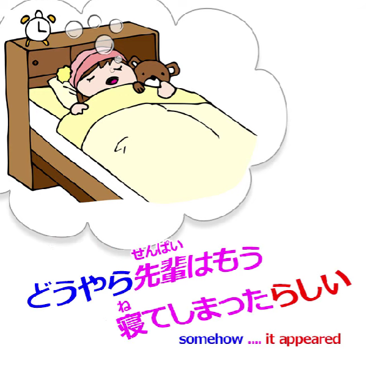

And we've covered this in a previous lesson as well. *(Lesson 25)*

So in between this sandwich that gives us the <code>it appears to be the case</code> meaning,

it says <code>先輩はもう寝てしまった</code> --

<code>senpai has already done gone to sleep / done gone to bed</code>.

As we know, that <code>しまう, しまった</code> gives that <code>done</code> meaning.

And that's really the best way to put it in English.

It sounds a bit rustic in English, but there's nothing else in English which I think gives

that sense of <code>しまう, しまった, ちゃった</code> quite as well as <code>done</code>.

She'd already done gone to bed, it seemed.

<code>無用心だな</code>: <code>無用心</code> means literally <code>not using one's heart</code>,

but <code>heart</code> here means mind or spirit.

<code>用心</code> is <code>care</code> or <code>cautiousness</code>; <code>無用心</code> is <code>lack of care</code> or <code>lack of cautiousness</code>.

::: info
An alternative writing is 不用心. They should mean the same thing.
:::
But this particular word <code>無用心</code> tends to mean

lack of cautiousness in relation to criminal or other hostile activity.

So we might say that walking alone in a dangerous place is <code>無用心</code>

or leaving valuables on display in our car is <code>無用心</code>.

And here, leaving her door unlocked at night so anybody could just walk in is <code>無用心</code>.

<code>無用心だな</code>: <code>な</code>, as we know, is the particle used for directing a comment at ourself,

so she's thinking to herself <code>無用心だ</code> -- it's reckless, dangerous behavior.

<code>無用心だな、と思った彼女は</code>: so, she, who was thinking this,

<code>電気をつけて先輩を起こそうかと思ったが</code>.

All right, so this looks a little bit complicated and we still haven't finished the sentence,

but let's just take it bit by bit.

First of all she thought <code>無用心</code> -- <code>unsafe, dangerous behavior</code>; <code>she thought</code> --

<code>と思った彼女</code> -- she who thought that, then thought something else; <code>電気をつけて</code> --

<code>点ける/つける</code>, of course, is the other-move version of <code>点く/つく</code>,

so she thought of switching on the lights;

<code>先輩を起こそう</code> -- now, as we know, that <code>そう</code> ending is a volitional ending;

<code>起こそうか</code> -- she thought about taking the action of awakening senpai.

<code>起こす</code> --to <code>wake someone up</code>; <code>起きる</code>, you wake up yourself;

<code>起こす</code> -- -す endings, as we know, mean other-move verbs,

so <code>起こす</code> is to wake someone else up.

<code>起こそうか</code> -- so, she's thinking about this action.

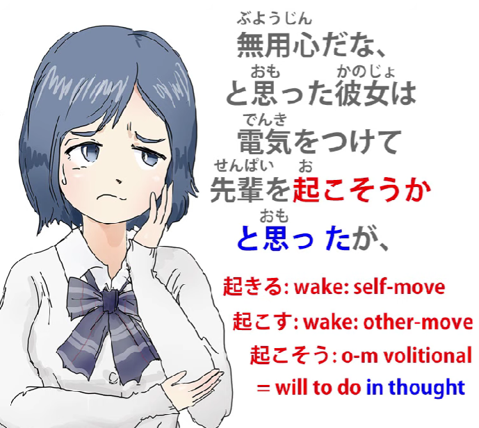

The <code>か</code>, as we know from another lesson *(Lesson 39)*, marks a question, that's to say, a proposition.

So the proposition was taking the action of waking up senpai.

This is what she thought, but... (<code>が</code> -- <code>but</code>) <code>先輩がかなり酔っていたのをおもいだし、</code>.

So, <code>かなり</code> is another one of those adverbial nouns that can modify a verb or an adjective

without the に or -と that's usually needed for a noun to modify a verb or an adjective,

so <code>かなり酔っていた</code> -- <code>酔う</code> is to <code>be sick or to be drunk</code>, in this case <code>drunk</code>.

<code>かなり</code> means <code>sufficiently</code> or <code>pretty much</code> or <code>very</code>.

So she was pretty drunk, she was in the state of being pretty drunk: <code>かなり酔っていたの</code> -- the <code>の</code> of course bundles that statement into a noun box -- <code>のを思い出し</code> --

<code>思い出し</code> is <code>remember</code>, so she remembered the fact -- the <code>の</code> --

that senpai had been pretty drunk.

<code>思い出す</code> is <code>remember</code>; <code>思い出し</code>, once again, as we discussed last week *(Lesson 7.5)*,

is the い-stem of <code>思い出す</code> -- <code>remember</code> --

and the い-stem here *(the し)* is being used like the て-form to make this clause a part of a compound sentence.

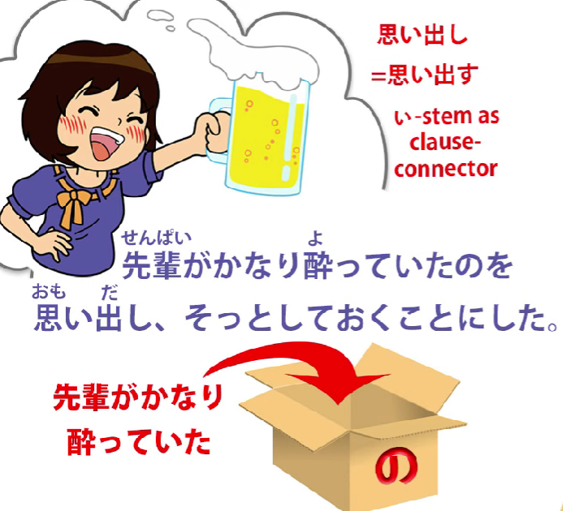

So we have a three-fold compound sentence now.

First of all, we use <code>が</code> -- <code>but</code> -- as the connector for the first part,

and the second part we're using -し like the て-form as the connector for the third part,

and the third part is <code>そっとしておくことにした</code>.

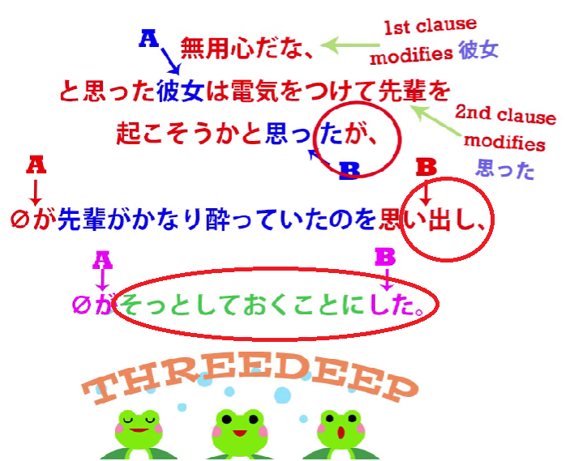

<code>そっと</code> is another one of these adverbial nouns, meaning <code>softly, gently or quietly</code>.

<code>そっとする</code> means to <code>do softly, gently or quietly</code>.

It's like <code>静かにする</code>, which means to <code>do quietly</code>.

<code>そっとする</code> means also to <code>do quietly</code>, but <code>静か</code> means more <code>keep quiet</code>.

You might say this to a class: <code>静かに!</code> -- <code>Keep quiet!</code>

<code>そっとする</code> is more to <code>do (something) in a quiet manner</code>.

Now, <code>静か</code> can be used in that way too, but <code>そっとする</code> means to do something quietly;

it can even mean secretly.

<code>静か</code> can't mean secretly; <code>そっと</code> can mean secretly.

Here it doesn't mean secretly, but it does mean doing something quietly so that

someone else won't be aware of you doing it,

which is the kind of implication that <code>そっと</code> often tends to have.

<code>そっとしておく</code> -- <code>しておく</code>, as we know, is to <code>put in place an action</code>.

<code>置く/おく</code> means to <code>place (something)</code>.

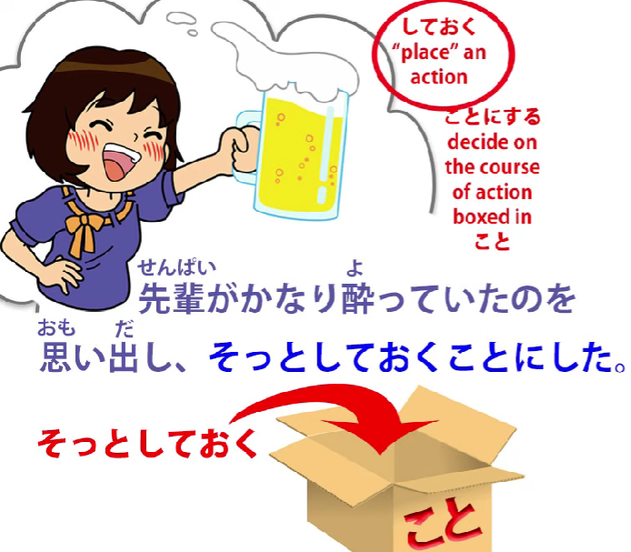

Attaching <code>おけ</code> to the て-form of a verb means putting that action in place.

And, as we know, the textbooks often say it means <code>doing it in advance</code> or

<code>doing it in preparation</code>, but actually it means <code>putting the action in place</code>.

So she's essentially saying here, <code>do what she has to do, put her action in place, quietly</code>.

<code>そっとしておくことにした</code>: now, <code>ことにする</code>,

as we've also covered in a previous lesson, means <code>decide to do</code>.

So this last bit means she decided to put her action quietly into place, literally.

So we've got this whole sentence here:

<code>無用心だな、と思った彼女は電気をつけて先輩を起こそうかと思ったが、 *(zeroが)*  先輩がかなり酔っていたのを思い出し、 *(zeroが)*  そっとしておくことにした</code>

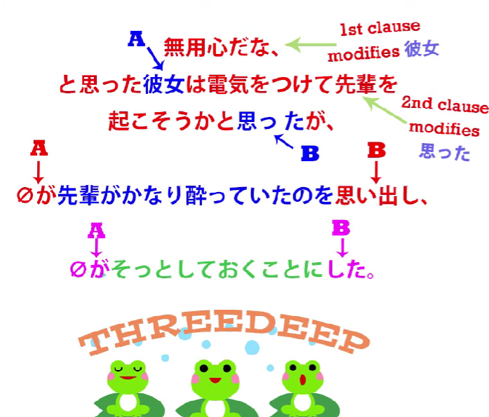

So, "**That**s dangerous, isn't it, leaving the door open,' she thought;

she considered switching the lights on and awakening senpai,

but she remembered that senpai had been pretty drunk

and so she decided to do what she had to do quietly."

<code>真っ暗の中で自分の携帯電話を探し出すと</code> –

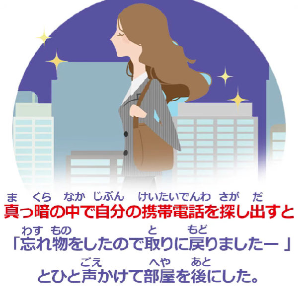

"In the pitch darkness -- 真っ暗の中で --

自分の携帯電話 -- her own telephone -- 探し出す".

<code>探し出す</code>: <code>探す</code> as we know, is <code>search</code>; <code>探し出す</code> is literally <code>search out</code>,

so she sought it out, she found it -- <code>と</code>.

****「忘れ物をしたので取りに戻りましたー」とひと声かけて部屋を後にした"

So she said something aloud here, but presumably quite quietly so that she wouldn't wake senpai.

She said: <code>忘れ物</code> -- <code>forgotten thing</code> -- <code>をしたので</code> -- "I did a forgotten thing /

I forgot a thing / I left a thing behind<code> -- </code>忘れ物をしたので" --

because of that -- <code>取りに戻りました</code> --

<code>I came back to take it / in order to take it, I returned</code> --

<code>とひと声かけて</code> -- <code>声 (を) かける</code> is to say something to someone,

to engage them in conversation, here <code>ひと声</code> -- she just said that single word,

she just said that single voice, literally, she just said that --

<code>部屋を後にした</code> -- so she just said that,

presumably quietly so that senpai wouldn't even hear her,

but she felt she ought to say something --

<code>部屋を後にした</code> -- <code>後にする</code> literally means to <code>turn it into behind</code>,

in other words, put it behind you, in other words, leave -- she left the room --

<code>部屋を後にした</code> -- she made the room the thing behind her by leaving it.

And that was that for the evening.

Well, she got out of that all right, didn't she?

It was a bit scary, but we didn't hear what happened the next day.

That's what we're going to talk about next week..
