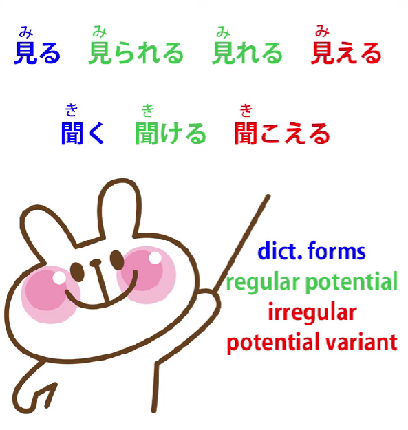
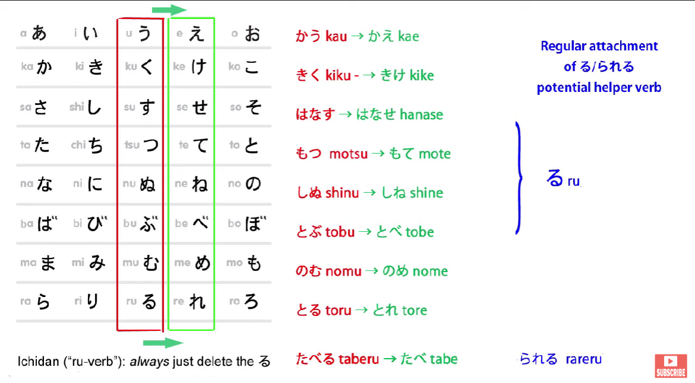
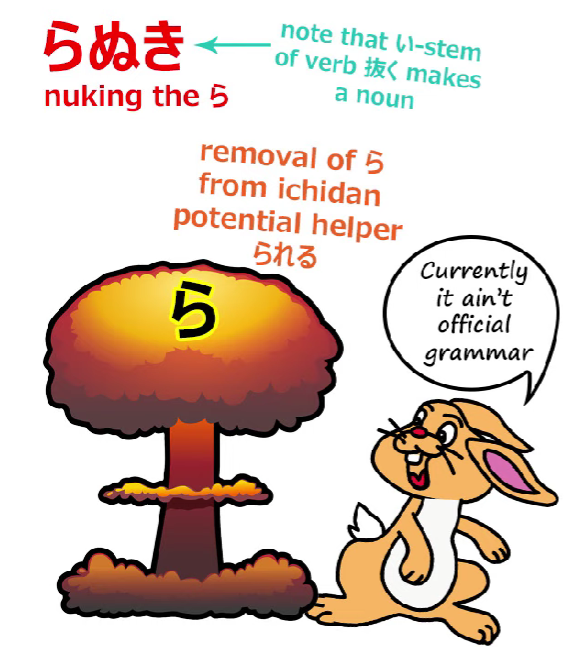
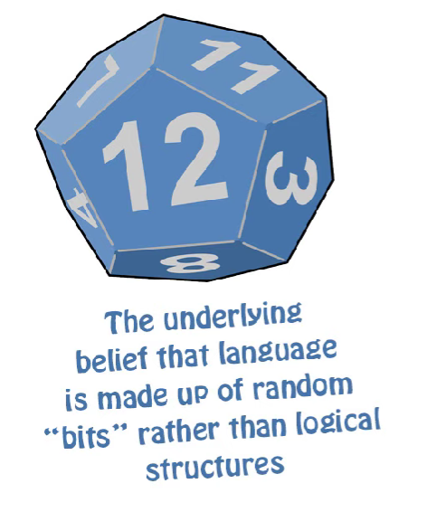
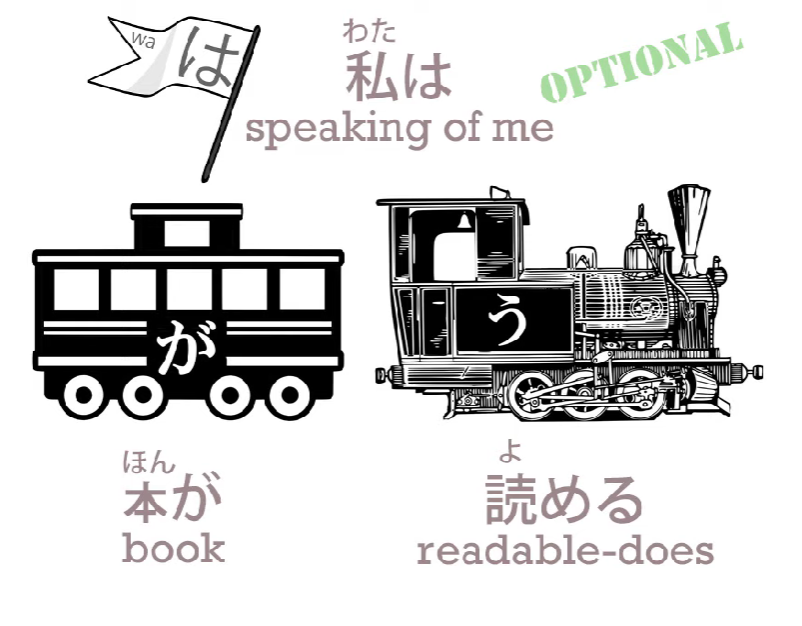
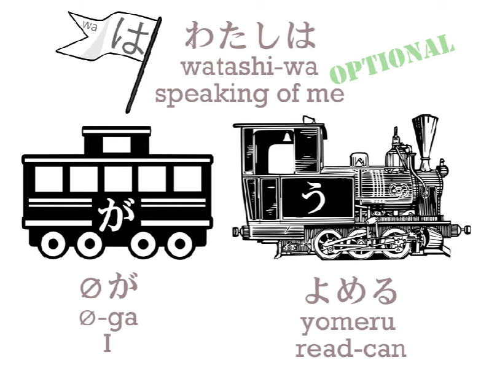

# **54. IRREGULARITIES & how they work | 見る, 見られる, 見れる, 見える, 聞く, 聞ける, 聞こえる**

[**IRREGULARITIES in Japanese and how they work | 見る、見られる、見れる、見える、聞く、聞ける、聞こえる | Lesson 54**](https://www.youtube.com/watch?v=WuMCOHisAvY&list=PLg9uYxuZf8x_A-vcqqyOFZu06WlhnypWj&index=56&pp=iAQB)

こんにちは。

Today we're going to talk about some exceptions in Japanese,

how they work, and why they're there.

And in doing that, I think we're going to gain some insight into

how Japanese holds together and how we can understand it.

So what we're going to talk about today is

見る, 見られる, 見れる, 見える, 聞く, 聞ける, 聞こえる.

Now, that seems like quite a confusing lot of things, doesn't it?

But in fact all we have there is the basic dictionary forms

of <code>見る</code> and <code>聞く</code> -- <code>see</code> and <code>hear</code> -- and the potential form of each

and one alternative or exceptional potential form.

Now, it looks like two in the case of <code>見る</code>, but it's actually one,

and we'll come to that in just a moment.

I always say that Japanese is a very, very regular and logical language,

and the conventional wisdom is that it only has two irregular verbs, <code>来る</code> and <code>する</code>.

Now, as I've mentioned before, it does in fact have a few other minor irregularities,

and by minor irregularities what I mean is verbs that aren't really irregular verbs but

they do become irregular in one particular area, in one single place only.

And there aren't many of these, but there are a few and these are two of them.

And we want to look at what they are and, more importantly,

why they are what they are and what they mean,

how we can understand them.

So to start with, we understand how the regular potential form,

the <code>able to do</code> form, of verbs work, don't we?

We form it simply by turning the verb into its え-stem and

adding the very simple potential helper verb <code>る</code>, which is just one character: る.

That's the godan form.

And the ichidan form: in the ichidan we do what we always do,

we simply remove the -る and put on whatever it is we're going to put on.

In this case, the ichidan potential helper is <code></code>られる<code></code>.

So, as we can see, <code>見られる</code> is the regular potential form of <code>見る</code>,

which is an ichidan verb, and

<code>聞ける</code> is the regular potential form of <code>聞く</code>, which is of course a godan verb.

So why am I saying that there's only one variant of <code>見る</code> and not two?

Well, that's because the variant is <code>見える</code>, and we'll come back to that in a moment.

<code>見れる</code> is in fact the ichidan form being affected by a phenomenon which we call <code>ら抜き</code>. <code>ら抜き</code> means literally <code>taking out the ら</code>.

And this is something that happens quite widely in Japanese.

You're going to encounter it pretty often once you're actually using Japanese,

so that may be right now.

It simply consists of taking out the <code>ら</code>, dropping the <code>ら</code>,

in the ichidan potential form of verbs.

This is considered to be incorrect grammar, not only by the English Japanese textbooks

but also by native Japanese grammar textbooks.

It's considered to be incorrect grammar, but it's very, very widespread,

much more widespread than most of the popular bits of incorrect grammar

that you'll hear from time to time.

And I would suggest that this is probably going to be an evolution of the language.

Now, Western people often tend to say, "Well, if a number of people

are using an incorrect usage then how can you say it's incorrect?

Surely it's a new correct usage, because **correct** is just what people use."

And I think this is a mistake and a rather dangerous and irresponsible mistake,

because while it's true that language evolves, the evolution of language is pretty much the same as the theorized evolution of species.

That's to say, species evolve from mutations.

Mutations happen relatively often and most of them die out.

Only a few of them, and usually in cases where they have some special advantage,

actually persist and become part of the evolution of the species.

And the same is true of languages.

Most incorrect usages that get taken up by largish numbers of people die out.

Only a very few of them ever become parts of the real evolution of the language.

So if you do what is currently being done in the West, which is put in misuses of language into dictionaries, what you're doing is actually short-circuiting the self-correcting function of language.

Language over a generation or so, over maybe a couple of decades,

will reject most uses that go against its basic logic.

A very few of them will end up making minor changes in the basic logic.

And that's why it's a mistake to put into dictionaries at an early stage

misuses of language, because we have no way of knowing at that early stage

whether they're really going to be genuine evolutions of language

or whether they're going to die out within a generation.

What we do know is that in most cases, in the vast majority of cases,

they would die out within a generation, and by putting them into a dictionary we're interfering with that self-correcting process of language.

And this, I would say, is important, because it's this way of thinking

that makes Japanese teaching so very poor in the West.

It's the way of thinking that assumes that language is a completely irrational thing

that just happens to evolve in any way it chooses to evolve.

And it's not. Language is governed by logic.

And Japanese is governed by logic more than most languages.

But if you reject that notion, if you think that language is simply irrational

and chance and accidental and anything anybody happens to use is as correct as anything else,

then you end up teaching language as if it were just a hodgepodge of things

that you have to learn because they just happen to be there

and don't have any underlying logic.

And that really is the fallacy that underlies modern Western Japanese teaching.

So, that's a digression.

Let's get back to <code>見られる</code>.

<code>見られる</code> is what they'll use, because that is currently the correct usage.

So we have <code>見る</code>, we have <code>見られる</code><code>, and </code>見える".

We have <code>聞く</code>, we have <code>聞ける</code> and we have <code>聞こえる</code>.

## Regular and irregular potential form

So what is the difference between the two potential forms,

the regular and the irregular potential form?

Now, in each case here, the irregular potential form is what I'm going to call a forced self-move form.

Now, as we know from our lesson on the potential *(Lesson 10)*, potential is usually self-move -- and if you don't know what <code>self-move</code> is,

you should look at the lesson on self-move and other-move verbs too *(Lesson 15)*.

They sometimes get called, not exactly accurately, transitive and intransitive.

So, for example, if we want to say <code>I can read the book</code>,

in Japanese we actually say <code>the book does readable to me</code>.

So we say <code>*(私は)*本が読める</code>. This is self-move.

The book is the actor and it's acting upon itself.

It's making itself readable, it's <code>doing readable</code> literally.

::: info
The furigana of 私 should be わたし.
:::
There's no exact English translation for this,

because we're not saying the book IS readable;

it's not an adjectival phrase.

We're saying the book DOES readable.

So we just have to get used to the fact that Japanese is much more happy than English

to treat states of being as verbal actions.

So if we want to say <code>I can read the book/*As for me, the book does readable*</code>,  
we say <code>*(私は)*本が読める</code>,

but if we just want to say <code>I can read*/I do readable*</code>,  
we might say <code>読める</code> or <code>(私は)私が読める</code>,

and again we have a self-move verb.

In one case we're saying <code>I do readable (I am able to read)</code>,

in the other we say <code>the book does readable (the book does being able to be read)</code>

and that's how it works.

However, it is also possible to use the potential in other-move contexts.

Usually this happens in modifying clauses.

These are sometimes called by Western textbooks <code>subordinate clauses</code>,

which they are, but I think it's better and clearer to call them <code>modifying clauses</code>,

and I've done quite a lot of work on modifying clauses,

so I'd recommend this video if you want to know exactly what I mean.

So, in modifying clauses particularly

we can use the potential as an other-move verb.

For example, we might say <code>さくらを見られる日を楽しみにしている</code>

This means <code>I'm looking forward to the day when I can see Sakura.</code>

And as you see, here we're saying <code>さくらを見られる</code>, using <code>見られる</code>, the potential,

<code>being able to see Sakura</code>, as an other-move verb with an object, which is Sakura.

Now, we can do that with <code>見られる</code>, we can do that with <code>聞ける</code>,

but we can't do it with <code>見える</code> or <code>聞こえる</code>.

They are forced to be used as self-move verbs only.

And on the whole, because potential verbs mostly are self-move in Japanese,

whether we're talking about something else or whether we're talking about ourselves,

we use them in a self-move manner, those two are the most commonly used.

Actually we can use the other forms, the regular forms,

<code>見られる</code> and <code>聞ける</code>, as self-move verbs too,

but they can also be used as other-move verbs.

---

With <code>見える</code> and <code>見られる</code>, there is a difference in nuance, which is that

<code>見える</code> usually means being able, actually physically able, to see something,

and <code>見られる</code> more implies having the opportunity to see something.

So if we were to say <code>芝居/しばいが見られる</code>,

we're saying I have the opportunity to see the play.

If we say <code>芝居が見える</code>, we might mean

the lady in front of me has taken off her big hat so I'm able to see the play.

However, this alone wouldn't be, I think, sufficient reason

for these two variants of the words surviving into modern Japanese.

The important reason, which is based in the very nature of seeing and hearing

and expressions we use in connection with seeing and hearing, is this:

they are both used in places where in English we would say

that something <code>looks like</code> something or something <code>sounds like</code> something.

You can't use the standard versions <code>聞ける</code> and <code>見られる</code>" for this.

You have to use these variants.

So if you say <code>さくらはカエルに見える</code>, you're saying <code>Sakura looks like a frog</code>.

So when we say <code>looks like</code>, we use the targeting particle に with a noun,

or with an adjective we use the く-stem of the adjective.

So we say <code>カエルに見える</code> -- <code>looks like a frog</code> --

or we can say of someone <code>若く見える</code> -- <code>she looks young</code>.

---

And we can also use it not just for literally how something sounds to our ears

or for how something looks to our eyes, but what its appearance is.

So we can say <code>奇妙/きみょうに聞こえる</code> -- <code>it sounds strange / sounds peculiar</code>.

So, we're not talking here necessarily about the actual sound.

It might not be a noise that sounds strange.

It may be something somebody said that sounds strange.

---

So we're using either the adverbial form of an adjective or the adjective-making targeting particle に to describe how something appears to us, how something sounds to us, literally or figuratively.

And this is the real reason for the survival of these alternative forms of the potential.

They have this specific meaning, which the other form, the regular form, can't have.

And it's not a coincidence that it's this forced, must-be self-move version

that takes on that meaning, because the way something else looks,

the way something else sounds, always has to be self-move.

We're not talking about anything we do to the look or anything we do to the sound,

but about how it looks and sounds in itself.

So this extremely self-move version *(見える/聞こえる)*, which can't be used in other-move contexts, is what is used in the case of both seeing and hearing to describe

how something sounds to us and how something looks to us.

::: info
in the comments, Dolly-先生 mentions some important point that did not make it into the video, given on her Patreon. Unfortunately, her Patreon is no longer available, possibly due to her passing, except for some comments she had left elsewhere. I guess we may never know.
:::