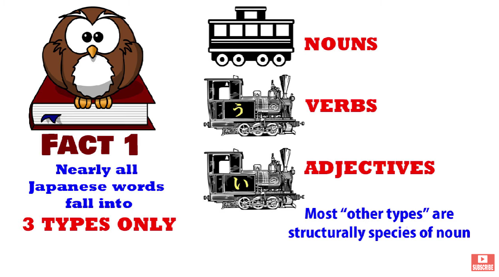
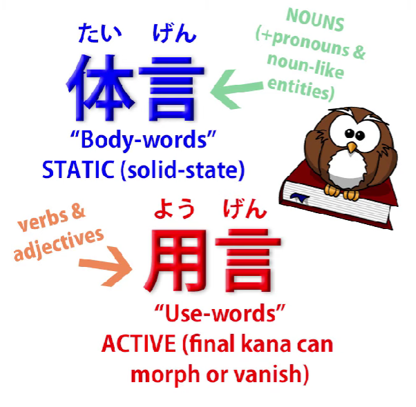
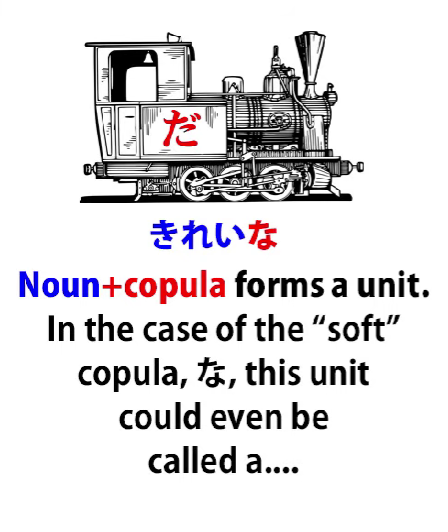
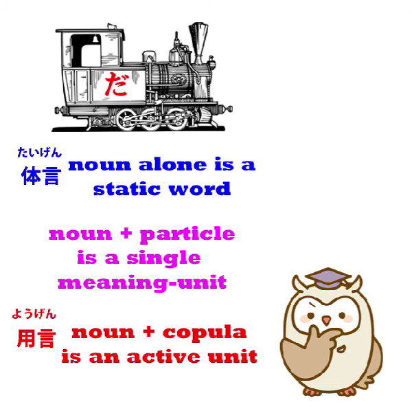
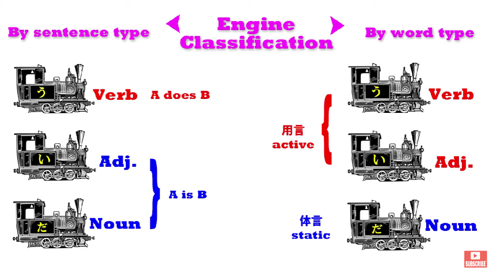
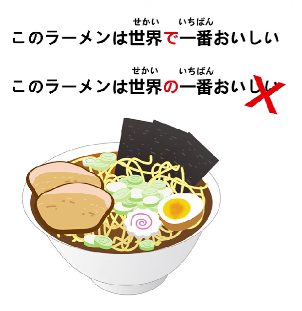

# **55. Secrets of the で particle. Why do we say みんなで行く? and 世界で一番?**

[**Secrets of the で particle. Why do we say みんなで行く? and 世界で一番? | Lesson 55**](https://www.youtube.com/watch?v=OiKgudW9xB8&list=PLg9uYxuZf8x_A-vcqqyOFZu06WlhnypWj&index=57&pp=iAQB)

こんにちは。

Today we're going to drill a bit deeper into some areas of Japanese structure.

I'm going to look at some aspects of the で particle that we haven't looked at so far

and, in order to do that, we're going to have to look at some new structural concepts

that we haven't considered up to this point.

We haven't considered them partly because you can get quite a long way

in elementary Japanese without knowing them,

but as we get into more complex areas it's a good idea to have these tools in our tool box.

So, let's get started.

As I've said before, almost all Japanese words divide into three kinds,

that is, nouns, verbs and adjectives.

There are a few words that are outside these three but not a great number.

Most of the things that aren't verbs and adjectives in fact turn out to be nouns.

## 体言 & 用言

However, there's another way of dividing Japanese words which is used in Japanese grammar and that is into <code>体言</code> and <code>用言</code>, which literally means <code>body words</code> and <code>use words</code>, but the terms I'm going to employ is <code>static words</code> or <code>static elements</code>

and <code>active words</code> or <code>active elements</code>.

Now, static or body words essentially boil down to nouns,

so in a way this underlines the noun-centered structure of Japanese,

because we divide them into nouns and the rest, the other two.

And it's very easy to see how this works.

By <code>active words</code> what we mean is those words that can transform, that can modify.

And that applies to both adjectives and verbs.

And in fact they transform in very much the same way.

In both cases the thing that transforms is always the last kana of the word.

And we know that both verbs and adjectives must always end in a kana.

They can't be all kanji, otherwise they'd be nouns.

All verbs end in an う-row kana; all adjectives end in the kana い.

And that is the part, and the only part, that changes.

With godan verbs, the う-row kana changes to its equivalent in one of the other rows.

So, -す can become -さ, -し, -せ or -そ.

And ichidan verbs simply drop the -る.

Verbs can also modify into the て-form, and again this is essentially a question of either

changing or dropping the final kana and adding -て or で.

And the same of course with た-form.

Adjectives can change the -い to -く, -か or -け,

so we can have <code>美味しく</code>, <code>美味しかった</code> or <code>美味しければ</code>.

Or we can drop the -い altogether and add something else, as for example in <code>美味しそう</code>.

---

Nouns, on the other hand, can't modify at all.

You can't do anything with the last kana of a noun or any other part of a noun

in terms of grammatical modification.

But you can add logical particles to a noun

and you can also add the copula <code>だ</code> or <code>です</code> to a noun.

So, we have two sets of words:

the <code>用言</code>, the active words which you can modify by changing the final kana and adding something but you can't add logical particles or the copula to these,

---

and nouns and also pronouns and other noun-like entities, <code>体言</code> or static words,

which you can't modify but you can add logical particles or the copula.

And it's important to understand that when we add the logical particle or the copula

to a noun we regard those two things joined together as a unit.

---

So for example when we add the soft copula <code>な</code> to an adjectival noun like <code>綺麗/きれい</code>

we have <code>綺麗な</code>, and <code>綺麗な</code> is regarded as a unit in itself.

And actually that unit *could* be called a <code>な-adjective</code>, because <code>綺麗</code> plus <code>な</code> or <code>だ</code> becomes an adjectival unit.

So although I very much object to the term <code>な-adjective</code> in the way it's used by Western textbooks, which is to say they will tell you that <code>綺麗</code> is a <code>な-adjective</code>, and it's not

-- it's a noun, it's not any kind of an adjective --

we could say that <code>綺麗な</code> or <code>綺麗だ</code> is a な-adjective.

I would not recommend it, simply because the term is so abused

in Western so-called Japanese grammar that it's best left alone.

It has a name in Japanese but since it would take rather a while to explain it,

I won't go into that here. But it's not anything like <code>な-adjective</code>.

---

Now, the other thing to understand is that when we attach the copula to a noun,

that combination is in fact a <code>用言</code> or active unit.

And that's obvious, because once you've attached the copula to it,

we can in fact modify it.

The copula has a て-form, which is <code>で</code>, so <code>綺麗な</code> can become <code>綺麗で</code> in order to conjoin it to something else.

We can also modify <code>綺麗だ</code> into, say, <code>綺麗だった</code>.

So, once we attach the copula to a noun, we have a <code>用言</code>, an active unit,

and as I'm sure you have already worked out by now,

this means that the three engines, the three possible ways of ending a sentence,

are all <code>用言</code>, or active units. That's to say, verb, adjective and noun-plus-copula.

These are the three possible engines of a sentence

and they are also the three possible <code>用言</code>.

We tend to call them <code>用言</code> when they're modifying something else,

when they're inside a sentence.

So, armed with this information, we can now take a deeper look at the particle で.

## A deeper look into the particle で

When I introduced it in the video on logical particles *(Lesson 8b)*,

I said that it, like the other logical particles other than が (which, of course, is in every sentence) and の (which is a logical particle, but it doesn't tell us what its noun is doing in relation to the action of the sentence; it tells us about the noun in relation to another noun)

but the other particles, including で, I said,

were only active in A-does-B sentences, that's verb-sentences.

Now, that is something of an oversimplification.

There is another way in which they can act.

It doesn't become too much of a problem not knowing that at the beginning,

but as we progress we need to understand this.

And in order to understand it we need to know what we've just learned.

We need to know about <code>体言</code> and <code>用言</code>, static and active elements.

Because the **truth is not** that で is absolutely restricted to verb-sentences,

A-does-B sentences, although most of the time it is.

What it's restricted to is clauses that modify <code>用言</code>.

And the <code>用言</code>, as we know, can be a verb, but it can also be an adjective

or even an adjectival noun-plus-copula.

And there are some cases where this happens.

So what is で actually doing?

Well, as we know, there are three positional logical particles,

and they are the targeting particle に (which tells us where something goes to or where it is, where it stays once it's got there), there is へ, which is the directional particle, and there is で.

And what で really does is tells us the boundary or limit within which something happens.

Usually that's a physical boundary, a physical area, though it doesn't always have to be.

So, に tells where a noun (person, animal, thing) is headed to or where it's located;

へ tells us direction in which it's going;

で tells us the boundary within which an action or a state of being takes place.

It's usually an action, so that's how we introduce it, but it can be a state of being.

In other words, **it can be an adjectival.**

So for example let's take the phrase <code>世界で一番美味しいラーメン</code>.

Now, people will ask, <code>Why で? Why are we using で in this case?</code>

And the answer is that <code>世界で</code> -- and remember that

we always treat a logical particle plus the noun it's attached to as a unit --

<code>世界で</code> is defining the limit within which something is happening,

but in this case it's defining the limit within which a state of being applies.

So we're talking about <code>the most delicious ramen in the world</code>.

<code>The world/**世界**</code> is the limit we're applying.

And in this case, of course, with <code>the world</code> we're trying to give as big a limit as possible.

But we might say, <code>この町で一番美味しいラーメン</code>

and then we're saying <code>the most delicious ramen in this town</code>.

So we've drawn a boundary around it.

We're not saying it's the most delicious ramen possible, but we are saying within certain limits, within the limits of this town, it's the most delicious ramen.

So **that's what で is doing**.

Just as with an action it tells us where the action takes place, the locality, the boundary within which it takes place, with the other kind of <code>用言</code>, an adjectival,

it's telling us the boundary within which that adjectival quality prevails.

---

Now, we can also say <code>世界の一番美味しいラーメン</code>.

That's less commonly said, but it could be said.

And what that means is <code>the most delicious ramen of the world</code>,

but the point to understand here is that で is drawing the boundaries of the <code>用言</code>, the active element, the verb or in this case the adjective; **の is doing something different.**

We know what の does: it links one noun to another.

So it's not modifying the quality of <code>美味しい</code>, as で is.

It's modifying <code>ラーメン</code>.

---

And because of this **we can also say** <code>このラーメンは世界で一番美味しい</code>

-- we're saying <code>This ramen is the most delicious in the world.</code>

But we **can't** say <code>このラーメンは世界の一番美味しい</code>

Why can't we?

Because, as we know from the lesson on word order *(Lesson 46)*,

in Japanese words only modify words that come after them.

They can't modify words that come before them.

And because の can't modify <code>美味しい</code>, it can only modify <code>ラーメン</code>, which is another noun, and because <code>ラーメン</code> is on the wrong side of it, we can't actually use that.

So we have to say <code>このラーメンは世界で一番美味しい</code>,

because で sets the boundary within which <code>美味しい</code> prevails.

---

Now, since we know that a noun-plus-copula also functions as a <code>用言</code>, an active element,

we can also say <code>世界で一番有名なアンドロイド</code>.

And in this case, <code>世界で</code> is modifying <code>有名な</code>.

It couldn't modify <code>有名</code> on its own, because <code>有名</code> is a noun, but it can modify <code>有名な</code>.

So it's telling us the boundaries within which this fame operates.

<code>She's the most famous android in the world</code>.

She may not be the most famous android in the Solar System,

but she is the most famous android in the world.

Now the same happens when we say something like <code>みんなで踊る</code> -- <code>we all dance</code>.

Why do we say <code>みんなで</code>?

Well, if we say <code>二人で踊る</code>, we're saying <code>two of us dance</code>.

If we say <code>一人で踊る</code>, we're saying <code>dance alone</code>.

The quantitative sentence plus で is describing the limits of the people who do it.

So, as I said before, the boundary or area or demarcation that で draws for us

is usually a physical one, a place.

If we say <code>部屋で踊る</code>, we're saying <code>I dance in the room.</code>

**But** if we say <code>一人で踊る</code>, we're saying <code>I dance alone.</code>

In both cases we're drawing a boundary to say what are the limits.

The physical limits are the room,

and the numerical or quantitative limits are <code>一人</code>, <code>二人</code>, <code>みんな</code> etc.
