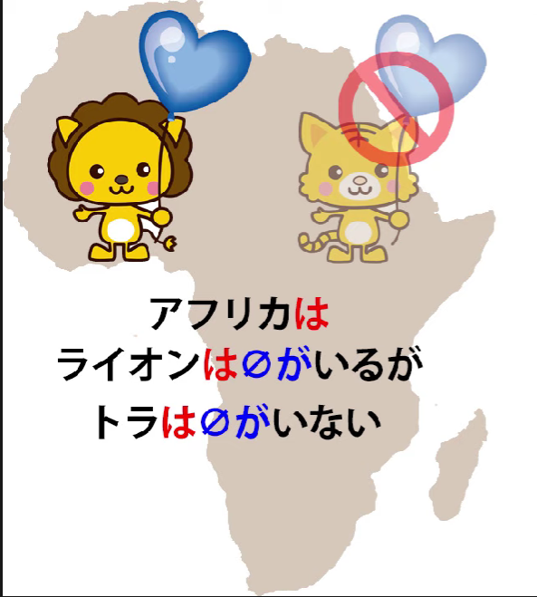
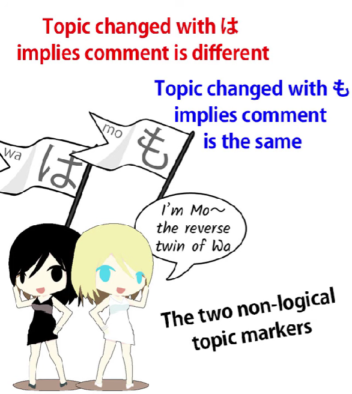
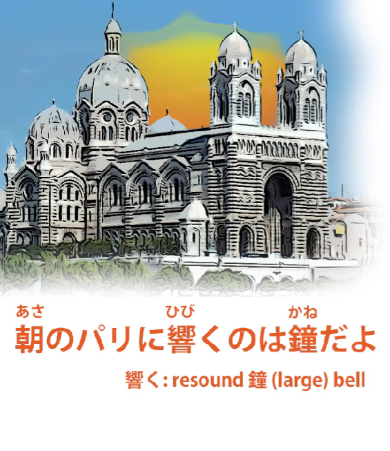
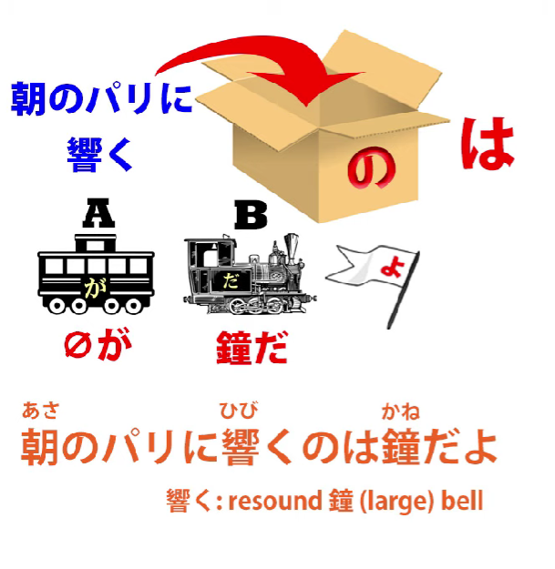
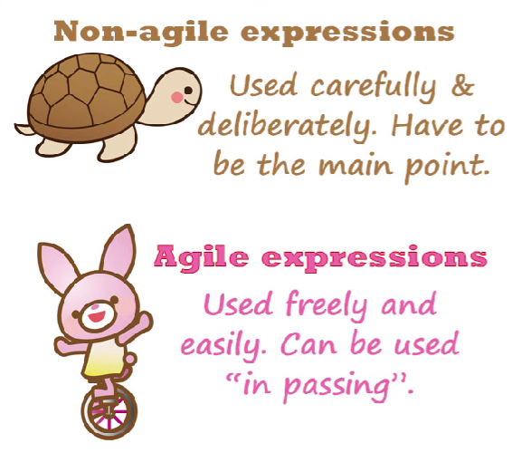

# **56. <code>Agility</code>: Deeper secrets of は and の particles**

[**<code>Agility</code>: The Vital Language Factor No One Mentions. Deeper secrets of は and の particles| Lesson 56**](https://www.youtube.com/watch?v=FdMeXqweBJ0&list=PLg9uYxuZf8x_A-vcqqyOFZu06WlhnypWj&index=58&pp=iAQB)

こんにちは。

Today we're going to talk about a topic that isn't often referred to,

which is agility in language.

And I'm not talking about my ability or your ability in language.

I'm talking about the agility of language itself,

the ability of languages to express certain things

in economical, swift-footed ways that other languages find more difficult.

And this is important because when languages have greater agility

in particular forms of expression they use them in ways that seem quite unfamiliar and strange to people whose languages can't handle those forms of expression in the same agile manner.

And this often leaves learners quite puzzled as to what's going on in a lot of sentences.

So, I'm going to start off with one of the most fundamental

and structural causes of this problem, and that is the topic-marking particle は.

## Particle は

Once people get the idea that は is a topic-marker and is always a topic-marker,

they often then start to say, "Well, why are we using a topic-marker?

Why are we saying 'as for this apple' in places where it seems really not

something we would do in English or in many other languages?"

Now, the reason for this has to do of course with the fact that Japanese is what linguists call <code>a topic-prominent language</code>.

Topic-comment structure is very fundamental to Japanese in a way that it isn't to English,

and I'm going to talk about that at greater length in a future video.

But currently what I want to talk about is how this affects the matter of agility,

how it makes the formation of a topic a very lightweight, a very agile, a very quick-footed operation, which in other languages, like English, it isn't.

So, I'm going to reintroduce a sentence I used

in my first advanced lesson on the use of the は-particle,

and that is: <code>アフリカはライオンはいるがトラはいない</code>

Now, as you see, we have three はs in the space of a very short sentence

and they are indeed all topic-markers, because は **always** is a topic-marker.

And I have explained what's going on, but we're going to look at this in terms of agility.

What's going on, of course, is that the first は is the overall topic-marker.

It's saying <code>アフリカは...</code> -- <code>Speaking of Africa...</code>

and everything that follows is going to be a comment on the topic of Africa.

What follows a は-marked topic has to be a logical clause.

It doesn't matter how small it is, but it must be a logical clause.

And it must contain both the necessary elements of a logical clause just like any other.

What we have here in fact is a logical sentence consisting of two logical clauses

and each of them contains what we might call a subtopic.

That's to say, each logical clause in itself also has a topic statement preceding it.

So if we write it out in full, it would be

<code>アフリカはライオンは**zeroが**いるがトラは**zeroが**いない</code>

So the two logical clauses are <code>zeroがいる</code> and <code>zeroがいない</code>,

but both of them state their own subtopics.

So, why are they doing that?

Well, we know this already.

It's because は is used to distinguish things.

So what we're saying here is "Speaking of Africa, speaking of lions, they exist,

but speaking of tigers, they don't exist."

Now, I think we can see how this works in English and

how it uses topic-marking to distinguish two different states of affairs.

But this isn't something we would ever say in English. Why not?

Because this <code>speaking of</code> in English is not agile at all.

It's setting up a rather dramatic and heavy, cumbersome way of introducing a subject.

We can't just keep saying <code>speaking of</code> in a sentence,

because <code>speaking of</code> and the various other ways

that we introduce topics in English are not agile.

Japanese は is very, very agile.

We can freely throw it in wherever we want to create a distinction like this,

because は distinguishes things.

When we change a topic using は, we are implicitly saying that

the comment on the new topic is different from the comment on the old topic.

If we want to say that the comment is the same,

then we have to use the other topic-marker, も.

And this sentence actually doubles down on that

by giving a は to both the compounded logical clauses.

So we're saying <code>speaking of lions...</code> this topic has a comment

which is different from another topic that may be nearby.

But <code>speaking of lions, they exist</code>,

and then <code>speaking of tigers...</code> this topic also has a comment

that will differ from the comment on any nearby topic: <code>they don't exist</code>.

Now, as you see, this is a very cumbersome process if we think about it in English.

But if we understand it in Japanese, if we know how the は-particle is used lightly and

easily and agilely in this kind of circumstance, it ceases to be a problem.

## Particle の

Now, another area where we often get confusion because of the agility of a Japanese element

in comparison to any way we would imitate it in English is the の-particle,

the so-called nominalizing の,

which acts as a pronoun and bundles everything coming before it,

everything modifying it, into a noun-box, into a single noun-like entity.

And one of my patrons asked me this question, and it's a short sentence and it ought to be fairly simple, but my patron found it quite difficult, and I think a lot of people find this sort of thing quite difficult.

Not because it is difficult, not because the structure is actually hard to parse,

but because it's very unlike what we would do in English or many other languages, under the same circumstances.

So, this comes from a Disney song, <code>The Bells of Notre Dame</code>,

and the first line is <code>朝のパリに響くのは鐘だよ</code>.

So, as you see, this is quite a short and simple-looking sentence.

But can you see where the A and the B of this sentence are?

My patron suggested that this meant <code>A bell resounds in morning Paris</code>

and that's more the sort of thing we would be saying in English.

But we can see that this is in fact an A-is-B sentence and we can see also that it has a は-marked topic and that the は-marked topic comes quite near the end.

So the A-is-B, the logical structure, has to come after the は-marked topic.

So what's the は-marked topic?

**The は-marked topic is <code>朝のパリに響くの</code>.**

So の is bundling the rest of it, <code>in morning-Paris-resoundsの</code>,

in other words <code>that which resounds in morning Paris</code>.

And then of course we must have a logical が-marked subject

which has been defined for us by that の.

So, <code>that which resounds in morning Paris, it is (or they are) bells, よ.</code>

So why is it being put in this way?

You might say, because it can be.

In English, this is difficult.

In English, <code>that which resounds in morning Paris, that's bells</code> doesn't sound natural at all.

And the reason is because setting up a topic like

<code>that which resounds in morning Paris</code> is not straightforward in English.

It's not agile; it's cumbersome; it's large; it's slow-footed.

But in Japanese we do this all the time.

We say things like <code>That which she saw when she went into the room was...</code>

Now, in English we're much more likely to say

<code>When she went into the room she saw...</code>

or <code>In Paris in the morning bells resound throughout the city.</code>

If we want to use this <code>that which...</code> kind of structure,

we have to have built up to it.

If we, for example, have spent some time establishing

the fact that she's nervous about what she's going to see

when she opens the door and looks into the room, then we can say

<code>What she saw when she looked in the room was...</code>

But we need to have set that up.

We need to have made some kind of preparation to use that form,

because it's not agile.

It's not a lightweight thing that we can just slip in anywhere.

On the other hand, Japanese can use this as a narrative technique,

setting up anticipation of what she saw and resolving it very quickly over the course of a short sentence and without making any fuss about it,  
because it's a light, agile verbal formula.

And because of that, you're going to see it all over the place in Japanese,

so you need to get used to it.

But really the important point of this lesson

is the concept of agility itself,

because we're going to come across in Japanese as we go forward

various cases where Japanese uses expression strategies  
which may seem very unnatural and strange when you try to translate them into English,

because the English equivalents are not agile

and the Japanese equivalents are very agile and lightweight.

And one of the things about being agile and lightweight

is not so much that it's easy to say in itself

but that it's easy to shoehorn into the middle of saying something else.

In other words, it doesn't have to be the main point of the statement.

In English you can't say things like <code>speaking of...</code> or <code>as for...</code>

unless that's going to be the main point of the statement.

But in Japanese you can because it's lighter, it's more agile…
